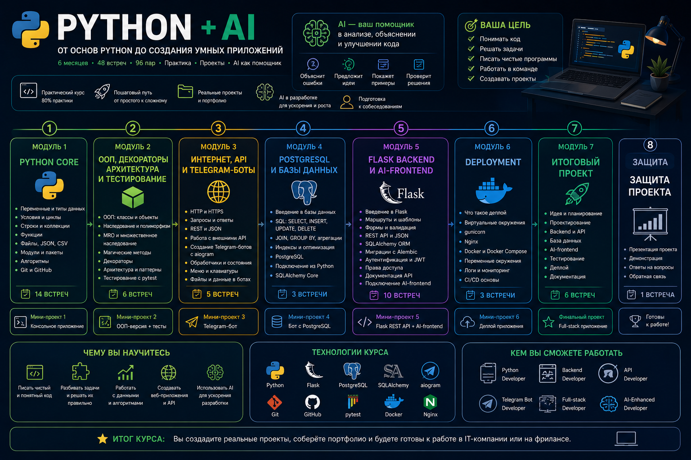

# Python + AI



Курс по Python, построенный от самых основ языка до полноценной разработки приложений.

Главная цель курса - не просто познакомиться с синтаксисом Python, а научиться самостоятельно решать задачи, разбивать большие проблемы на небольшие части, организовывать код и постепенно переходить от простых программ к полноценным проектам.

Искусственный интеллект в курсе используется как дополнительный инструмент разработчика: для анализа ошибок, поиска вариантов решения, проверки идей и работы с кодом. При этом основная задача студента - понимать написанный код и уметь объяснить собственное решение.

---

## О чём этот репозиторий?

Этот репозиторий содержит материалы курса по Python и сопутствующим инструментам разработки.

Материал выстроен последовательно: от первых переменных, условий и циклов до функций, модулей, файлов, алгоритмов, Git, GitHub и создания первого структурированного приложения.

Каждая следующая тема опирается на предыдущие, поэтому лекции рекомендуется проходить по порядку.

В первом модуле мы постепенно разбираем:

- базовый синтаксис Python;
- переменные и типы данных;
- логические выражения и условия;
- безопасную обработку пользовательского ввода;
- циклы;
- списки и строки;
- кортежи, множества и словари;
- функции и типизацию;
- работу с файлами;
- JSON и CSV;
- модули и пакеты;
- рекурсию;
- поиск, сортировку и Big O;
- Git и GitHub;
- структуру небольшого Python-приложения;
- типичные алгоритмические задачи с собеседований.

Главная идея первого модуля - сформировать крепкую базу Python, на которой дальше можно строить более сложные приложения.

---

## Что находится внутри?

На данный момент в репозитории находится первый модуль курса:

- `14` лекций в формате Markdown;
- практические задания внутри лекций;
- домашние задания;
- отдельные практические занятия;
- модульный проект: [Module1.md](Module1.md);
- изображения и схемы для объяснения материала;
- примеры кода;
- задания для подготовки к техническим собеседованиям.

Курс продолжает разрабатываться, поэтому этот README будет дополняться вместе с появлением следующих модулей.

---

# Программа курса

## Модуль 1. Основы Python и Git

---

### Лекция 1. Python: первые программы, переменные и типы данных

Файл: [lesson01.md](lesson01.md)

Первая лекция знакомит с программированием, алгоритмами и структурами данных. Разбирается, что такое Python, где он используется, чем интерпретатор отличается от компилятора и как запускается Python-код.

Дальше переходим к первым программам: `print()`, `input()`, переменным, основным типам данных, преобразованию типов и базовым арифметическим операциям.

---

### Лекция 2. Логика, условия и безопасный ввод

Файл: [lesson02.md](lesson02.md)

Лекция посвящена тому, как программа принимает решения.

Разбираются `bool`, значения `True` и `False`, операторы сравнения, логические операторы `and`, `or`, `not`, а также `in` и `is`.

После этого переходим к `if`, `elif`, `else`, `match-case` и обработке ошибок через `try`, `except`, `else`, `finally` и `raise`.

Отдельное внимание уделяется безопасной работе с пользовательским вводом и ситуациям, когда неправильные данные не должны приводить к падению программы.

---

### Лекция 3. Циклы: while, for и повторение действий

Файл: [lesson03.md](lesson03.md)

В этой лекции разбираются циклы и повторяющиеся действия.

Изучаем `while`, `for`, `range()`, управление циклом через `break` и `continue`, а также вложенные циклы.

Основная задача - научиться видеть ситуации, когда повторяющийся код необходимо заменить циклом, и понимать, какой цикл лучше подходит для конкретной задачи.

---

### Лекция 4. Списки: индексы, методы, срезы и list comprehension

Файл: [lesson04.md](lesson04.md)

Лекция посвящена одной из самых часто используемых структур данных Python - спискам.

Разбираются создание списков, индексы, изменение элементов, перебор, основные методы списков, срезы, копирование и сортировка.

Отдельный блок посвящён `list comprehension` - компактному способу создавать новые списки на основе существующих данных.

---

### Лекция 5. Строки: методы, форматирование и обработка текста

Файл: [lesson05.md](lesson05.md)

В этой лекции подробно разбирается работа со строками.

Изучаем индексы и срезы строк, методы для поиска, изменения и очистки текста, разделение через `split()`, объединение через `join()` и форматирование строк.

Основная задача лекции - научиться уверенно обрабатывать текстовые данные и комбинировать строки с условиями, циклами и другими уже изученными инструментами.

---

### Лекция 6. Кортежи, хеширование, хеш-таблицы, множества и словари

Файл: [lesson06.md](lesson06.md)

Лекция расширяет набор структур данных, с которыми мы умеем работать.

Разбираются кортежи `tuple`, множества `set` и словари `dict`.

Перед словарями рассматривается принцип хеширования и устройство хеш-таблиц, чтобы понимать, почему словари и множества позволяют быстро находить данные.

После этого изучаем основные операции, методы, перебор и практические сценарии использования этих структур.

---

### Лекция 7. Функции, типизация и рефакторинг

Файл: [lesson07.md](lesson07.md)

Одна из ключевых лекций первого модуля.

Разбираются функции, параметры, аргументы, `return`, область видимости, значения параметров по умолчанию, `*args`, `**kwargs` и аннотации типов.

Также рассматриваются `lambda`, `map()` и `filter()`.

Отдельное внимание уделяется рефакторингу: как разбивать большую программу на небольшие функции с понятной ответственностью.

---

### Лекция 8. Работа с файлами, JSON и CSV

Файл: [lesson08.md](lesson08.md)

В этой лекции программа впервые начинает сохранять данные между запусками.

Разбирается `open()`, режимы открытия файлов, чтение и запись, конструкция `with`, кодировка и работа с текстовыми файлами.

После этого переходим к форматам `JSON` и `CSV`: чтению, записи, преобразованию Python-структур и практическому хранению данных приложения.

---

### Лекция 9. Модули и пакеты в Python

Файл: [lesson09.md](lesson09.md)

Лекция посвящена разделению программы на несколько файлов.

Разбираются `import`, `from ... import`, псевдонимы через `as`, создание собственных модулей и пакетов, файл `__init__.py`, абсолютные и относительные импорты.

Отдельно рассматриваются `__name__`, конструкция:

```python
if __name__ == "__main__":
    ...
```

и проблемы циклических импортов.

Главная цель - перейти от отдельных Python-файлов к более организованной структуре проекта.

---

### Лекция 10. Рекурсия, алгоритмы, поиск и сортировки

Файл: [lesson10.md](lesson10.md)

В этой лекции начинаем смотреть на код не только с точки зрения правильного результата, но и с точки зрения эффективности решения.

Разбирается рекурсия, базовый случай и рекурсивный шаг.

После этого рассматриваются линейный и бинарный поиск, сортировка данных, `sorted()` с параметром `key` и понятие временной сложности алгоритмов - Big O.

На практических примерах сравниваем разные способы решения одной задачи и учимся понимать, почему один алгоритм может быть эффективнее другого.

---

### Лекция 11. Введение в Git. Локальный репозиторий. Базовые команды

Файл: [lesson11.md](lesson11.md)

Лекция знакомит с системой контроля версий Git.

Разбираются состояния файлов `Untracked`, `Modified`, `Staged`, `Committed` и основные команды:

```bash
git init
git status
git add
git commit
git log
git diff
```

После этого переходим к веткам, `git switch`, объединению через `merge`, конфликтам и способам отмены изменений.

Также рассматриваются `restore`, `HEAD`, `reset`, `revert`, а также базовые сценарии использования `rebase` и `cherry-pick`.

---

### Лекция 12. Git. Удалённый репозиторий

Файл: [lesson12.md](lesson12.md)

Продолжаем работу с Git и переходим к удалённым репозиториям и GitHub.

Разбираются способы подключения через HTTPS и SSH, удалённые репозитории, `origin`, `clone`, `push`, `pull`, `fetch` и связь локальной ветки с удалённой.

Отдельно рассматривается разница между `clone` и `fork`, работа с Pull Request и базовый командный процесс разработки через GitHub.

---

### Лекция 13. Практика Python. Структура приложения

Файл: [lesson13.md](lesson13.md)

Практическая лекция, в которой знания первого модуля объединяются внутри одного приложения.

На примере консольного **Movie Manager** разбирается путь от технического задания до структуры проекта.

Проект разделяется на отдельные части для работы с пользовательским интерфейсом, фильмами, статистикой и JSON-хранилищем.

В процессе разработки повторяем функции, модули, списки, словари, JSON, исключения, поиск, фильтрацию, сортировку и Git.

Главная цель - понять, как из нескольких отдельных Python-тем собрать читаемое и расширяемое приложение.

---

### Лекция 14. Типичные задачи на собеседовании

Файл: [lesson14.md](lesson14.md)

Финальная лекция первого модуля посвящена практическим алгоритмическим задачам.

В лекции собрано `25` задач разного уровня сложности: работа с числами, строками, списками и словарями, FizzBuzz, поиск уникальных элементов, анаграммы, задачи со звёздочками, пирамида и ромб, бинарный поиск, Two Sum, проверка последовательности скобок и слияние двух отсортированных списков.

Основная задача - научиться не просто писать решение, а понимать условие, проверять крайние случаи, объяснять выбранный подход и оценивать его сложность.

---

# Модульное задание

После завершения первого модуля необходимо выполнить:

[Module1.md - Personal Finance Manager](Module1.md)

На выполнение задания даётся **1 неделя**.

Необходимо разработать консольное приложение для учёта личных доходов и расходов.

Каждая финансовая операция содержит:

```python
{
    "id": 1,
    "type": "expense",
    "category": "Food",
    "title": "Groceries",
    "amount": 850.50,
    "date": "2026-08-12"
}
```

В приложении необходимо реализовать:

- добавление операций;
- просмотр всех операций;
- поиск;
- изменение;
- удаление;
- фильтрацию;
- сортировку;
- расчёт доходов;
- расчёт расходов;
- текущий баланс;
- хранение данных в JSON.

Проект необходимо разделить на логические модули и вести через Git с самого начала разработки.

Готовый проект загружается на GitHub и сдаётся в виде Pull Request.

Модульное задание проверяет не отдельную тему, а умение использовать знания первого модуля вместе внутри одного проекта.

---

## Как работать с курсом?

Рекомендуемый порядок работы:

```text
Лекция
   ↓
Примеры
   ↓
Практика
   ↓
Домашняя работа
   ↓
Следующая тема
```

Не стоит просто копировать готовый код.

После каждого примера важно попробовать:

- изменить исходные данные;
- добавить новое условие;
- сломать программу неправильным вводом;
- самостоятельно найти причину ошибки;
- написать похожее решение без подсказки;
- объяснить, почему код работает именно так.

После завершения первого модуля переходите к модульному заданию.

---

## Продолжение курса

Сейчас README описывает только **первый модуль**.

По мере подготовки следующих частей курса сюда будут добавляться новые лекции, практические занятия и модульные проекты.