# Лекция 1. Python: первые программы, переменные и типы данных

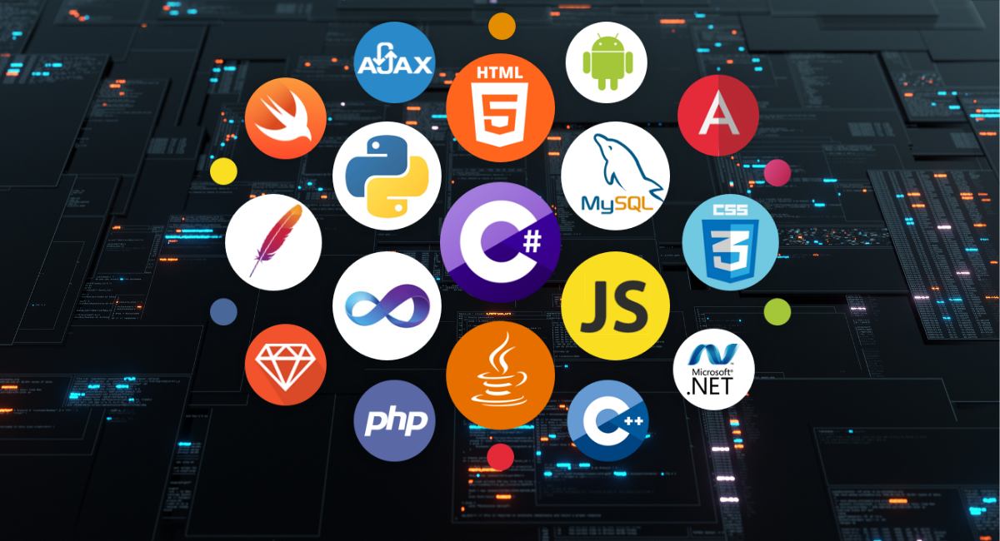

## Вступление

Перед тем как начать изучение любого языка программирования, важно понять, что такое программирование и зачем оно нужно.

**Программирование** - это процесс создания наборов инструкций (программ), которые управляют работой компьютера. Оно позволяет давать компьютеру точные команды для выполнения различных задач, начиная от простых вычислений и заканчивая сложными системами искусственного интеллекта.

По сути программирование состоит из двух частей: алгоритмы и структуры данных.

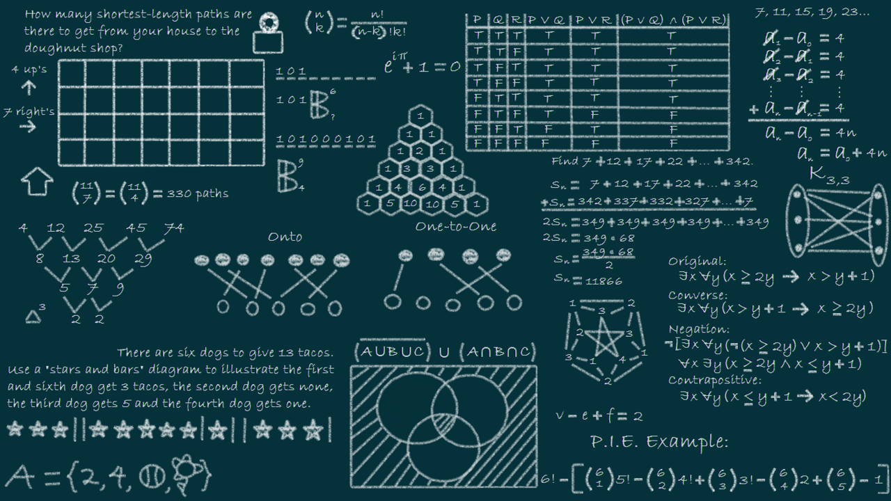

**Алгоритмы** - это последовательность шагов, которые необходимо выполнить для решения конкретной задачи. Они описывают, как именно нужно действовать, чтобы достичь желаемого результата.

Пример хорошего алгоритма - это рецепт приготовления блюда. В рецепте указаны все необходимые ингредиенты и пошаговые инструкции, которые нужно выполнить, чтобы приготовить блюдо.

**Структуры данных** - это способы организации и хранения данных, чтобы с ними было удобно работать. Они позволяют эффективно управлять информацией и выполнять различные операции над данными.

Пример структуры данных - это библиотека, где книги организованы по полкам и категориям, что позволяет легко находить нужную книгу.

От того, насколько хорошо вы понимаете алгоритмы и структуры данных, зависит эффективность ваших программ и способность решать сложные задачи. Хороший программист перед тем как писать код, сначала продумывает алгоритм решения задачи и выбирает подходящую структуру данных для хранения информации.

**Язык программирования** - это набор формальных правил, по которым пишут программы. Обычный язык нужен для общения людей, а язык программирования - для общения с компьютером. Как и в любом естественном языке, тут есть лексика - слова, функции и операторы, из которых по правилам синтаксиса составляются выражения. Они имеют чёткий, вполне определённый смысл, понятный компьютеру.

Языков программирования существует огромное множество, и каждый из них разработан для определённых целей. Например:

- **Python** - универсальный язык, который подходит для веб-разработки, анализа данных, искусственного интеллекта и многих других областей.
- **JavaScript** - язык, который используется в основном для создания интерактивных веб-страниц и веб-приложений.
- **Java** - язык, который широко используется в корпоративной разработке, мобильных приложениях и больших системах.
- **C++** - язык, который применяется в системном программировании, разработке игр и высокопроизводительных приложениях.
- **Ruby** - язык, который известен своей простотой и удобством для веб-разработки, особенно с использованием фреймворка Ruby on Rails.
- **Go** - язык, который разработан компанией Google и используется для создания высокопроизводительных серверных приложений и микросервисов.

Мы будем изучать язык программирования Python, который является одним из самых популярных и удобных языков для начинающих программистов. Python отличается простым синтаксисом, что делает его легким для изучения и понимания.

## Python

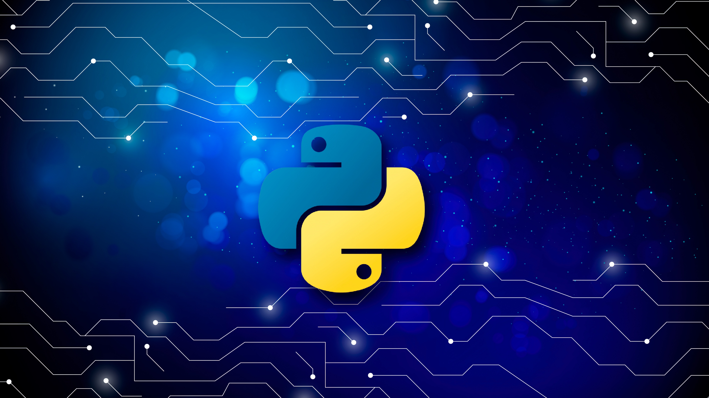

**Python** - это высокоуровневый язык программирования, отличающийся эффективностью, простотой и универсальностью использования. Он широко применяется в разработке веб-приложений и прикладного программного обеспечения, а также в машинном обучении и обработке больших данных. За счет простого и интуитивно понятного синтаксиса является одним из распространенных языков для обучения программированию.

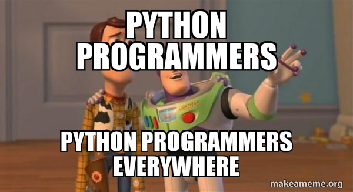

Python избавляет разработчика от сложностей, связанных с управлением памятью и компиляцией, что позволяет сосредоточиться на решении задач, а не на технических деталях реализации. Благодаря этому его часто рекомендуют как первый язык для знакомства с программированием.

### Что такое компилятор и интерпретатор?

Компьютер не понимает код, написанный на языке программирования, в том виде, в котором его пишет программист. Ему нужен машинный код (набор инструкций в бинарном формате). Чтобы превратить код из удобочитаемого для человека языка в исполняемый машинный код, используются два основных подхода:

**Компилятор** - это программа, которая сразу переводит весь исходный код в машинный код перед выполнением.

- Примеры языков: C, C++
- Как это работает:
  - Компилятор анализирует весь код, проверяет ошибки и создаёт исполняемый файл.
  - Этот файл можно запускать без компилятора.
  - Из-за этого программа запускается быстрее, но изменения требуют перекомпиляции.

**Интерпретатор** - это программа, которая читает код построчно и сразу выполняет его.

- Примеры языков: Python, JavaScript, PHP
- Как это работает:
  - Код исполняется построчно, без предварительного перевода всего кода в машинный.
  - Ошибка в одной строке приведёт к остановке выполнения.
  - Такой подход упрощает тестирование и разработку, но может замедлить работу программы.

### Как это связано с Python?

Python использует интерпретатор, поэтому вам не нужно вручную компилировать код. Это одно из преимуществ Python - возможность быстро запускать и тестировать программы без дополнительной подготовки.

**Дополнительно:**

- Иногда говорят, что Python является компилируемо-интерпретируемым языком, потому что перед исполнением код преобразуется в байт-код (`.pyc` файлы), который выполняется внутри виртуальной машины Python (PVM - Python Virtual Machine).
- Это делает Python гибким и кроссплатформенным, так как этот байт-код может выполняться на разных системах без изменений.

Кроме того, Python поддерживает несколько парадигм программирования:

- Процедурное - позволяет писать код в виде последовательности команд.
- Объектно-ориентированное - помогает организовывать код в виде объектов и классов.
- Функциональное - дает возможность работать с функциями высшего порядка и выражать идеи в декларативном стиле.

Все это делает Python мощным инструментом для самых разных сфер разработки: от веб-программирования и анализа данных до искусственного интеллекта и автоматизации задач.

Язык программирования Python был создан в 1989-1991 годах голландским программистом Гвидо ван Россумом. Изначально это был любительский проект: разработчик начал работу над ним, просто, чтобы занять себя на рождественских каникулах. Хотя сама идея создания нового языка появилась у него двумя годами ранее. Имя ему Гвидо взял из своей любимой развлекательной передачи «Летающий цирк Монти Пайтона». Язык программирования он и выбрал - Python, что означало название комик-группы. Это шоу было весьма популярным среди программистов, которые находили в нем параллели с миром компьютерных технологий.


История развития Python включает несколько этапов, каждый из которых заканчивался выходом новой версии:

- В 1991 году Гвидо опубликовал первую версию (0.9.0) языка, включающую базовые возможности - в частности, работу с данными различных типов и корректировку ошибок.
- Через три года вышла версия 1.0, в которой функционал был дополнен обработкой списков данных: систематизацией, фильтрацией, сокращением, сопоставлением.
- Версия 2.0 была опубликована в 2000 году и отличалась исправленными недочетами прежних версий, а также новыми полезными функциями для программистов - в частности, поддержкой Unicode и облегченной методикой циклического просмотра списка.
- В 2008 году представлена версия Python 3, включившая возможность печати, поддержку деления чисел и расширенное исправление ошибок.

Python активно развивается и поддерживается сообществом разработчиков по всему миру. Последние версии языка включают
множество улучшений и новых возможностей, что делает его мощным инструментом для решения самых разнообразных задач.

В современном мире активно используется python 3+, но на некоторых старых проектах можно встретить и версии 2+

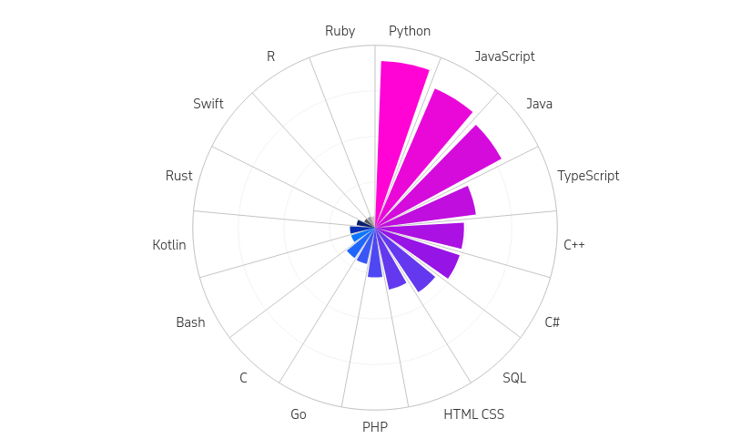

Python - универсальный язык программирования, который применяется в самых разных сферах. Вот основные области, где он активно используется:

1. **Анализ данных и наука о данных (Data Science):**Python популярен среди аналитиков данных и исследователей, так как позволяет быстро обрабатывать и анализировать большие массивы данных.
   Библиотеки: Pandas, NumPy, SciPy, Matplotlib, Seaborn.
   Используется в финансах, маркетинге, биоинформатике, экономике и других сферах.
2. **Машинное обучение и искусственный интеллект:**Python - один из главных языков для работы с искусственным интеллектом.
   Библиотеки: TensorFlow, PyTorch, Scikit-learn, Keras.
   Применяется в чат-ботах, системах рекомендаций (например, Netflix, YouTube), компьютерном зрении и обработке естественного языка.
3. **Веб-разработка:**Python позволяет создавать сайты и веб-приложения.
   Фреймворки: **Django**, Flask, FastAPI.
   Используется в бэкенде сайтов, API-сервисах, CMS (например, Reddit написан на Python).
4. **Автоматизация и DevOps:**Python помогает автоматизировать рутинные задачи: обработку файлов, сбор данных, развертывание серверов.
   Используется в администрировании серверов, управлении облачными сервисами (AWS, Google Cloud), CI/CD (Jenkins, GitHub Actions).
   Библиотеки: Fabric, Ansible, Selenium.
5. **Разработка игр:**Хотя Python не является основным языком для игр, его можно использовать для создания прототипов и небольших игр.
   Библиотеки: Pygame, Panda3D, Godot.
6. **Кибербезопасность и тестирование:**Python широко применяется в кибербезопасности для анализа уязвимостей, написания автоматизированного тестирования.
   Библиотеки: Requests, Selenium.
7. **Встраиваемые системы:**Python используется в Raspberry Pi и микроконтроллерах (MicroPython) для управления роботами и автоматизированными устройствами.
8. **Образование и обучение программированию:**
   Python часто становится первым языком для новичков из-за простого и понятного синтаксиса.
   Программы: Scratch, Jupyter Notebook, Pygame.

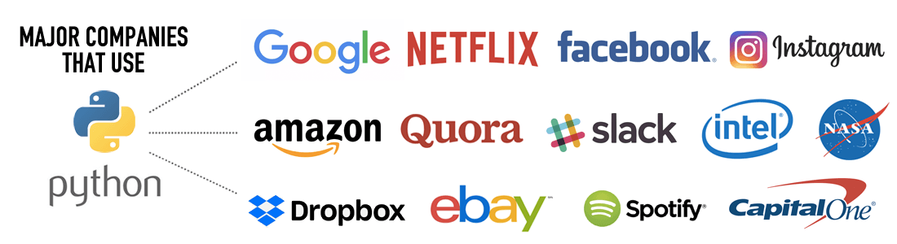

В этом курсе мы познакомимся с веб-разработкой на Python и научимся создавать динамические веб-приложения. Мы будем использовать Flask - легкий веб-фреймворк, который позволяет быстро создавать веб-приложения и API. Flask прост в освоении и предоставляет гибкость для разработки как небольших проектов, так и крупных систем.

## Установка Python

Python поддерживается на всех популярных операционных системах: Windows, macOS, Linux. В этом руководстве мы разберем установку Python на каждую из них.

1. **Установка Python на Windows:**

- **Шаг 1**: Загрузка установочного файла:

  - Перейдите на официальный [сайт](https://www.python.org/downloads/) Python:
  - На главной странице автоматически предложена последняя версия Python для вашей системы.
  - Нажмите кнопку Download Python (версия).
- **Шаг 2**: Запуск установщика:

  - Откройте загруженный файл python **installer.exe**.
  - Обязательно поставьте галочку **"Add Python to PATH"** - это позволит запускать Python из командной строки.
  - Нажмите "Install Now" (рекомендуется) или "Customize installation", если хотите изменить путь установки.
- **Шаг 3**: Проверка установки

  - Откройте Командную строку (Win + R → введите `cmd → Enter`).

Введите команду:

```sh
python
```

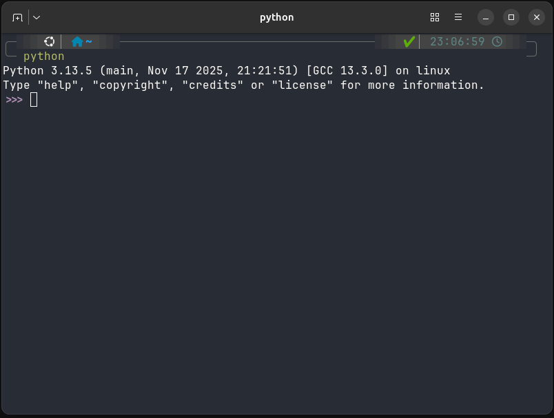

Если вы увидите вот такой текст, значит вы сделали все правильно:)
Чтобы выйти, введите команду:

```sh
exit()
```

2. **Установка Python на macOS**

- **Шаг 1**: Проверка предустановленного Python:

  - На macOS Python уже может быть установлен. Чтобы проверить, откройте Терминал (⌘ + Пробел → Terminal) и введите:

    ```sh
    python3 --version
    ```

Если Python установлен, отобразится его версия.

- **Шаг 2**: Установка через официальный установщик (если после выполнения шага 1 он отсутствует):

  - Перейдите на [сайт](https://www.python.org/downloads/).
  - Скачайте последнюю версию Python для macOS.
  - Откройте загруженный .pkg-файл и следуйте инструкциям установки.
  - После установки снова откройте Терминал (⌘ + Пробел → Terminal) и введите:

    ```sh
    python3 --version
    ```
- **Шаг 3**: Установка Python через Homebrew (альтернативный способ):

  - Если у вас установлен Homebrew, можно установить Python одной командой:

    ```sh
    brew install python
    ```

После завершения установки проверьте:

```sh
   python3 --version
```

3. **Установка Python на Linux**

- **Шаг 1**: Проверка установленной версии:

  - Откройте Терминал (Ctrl + Alt + T) и введите:

    ```sh
    python3 --version
    ```

Если Python установлен, отобразится его версия.

- **Шаг 2**: Установка через пакетный менеджер (если после выполнения шага 1 он отсутствует):

  - Для Ubuntu, Debian:

    ```sh
    sudo apt update
    sudo apt install python3 python3-pip -y
    ```
- **Шаг 3**: Проверка установки:

  - После установки снова введите:

    ```sh
    python3 --version
    ```


Теперь Python установлен, и можно начинать программировать!

## Какую среду разработки выбрать?

Программирование на Python можно выполнять в разных средах. Для удобства и повышения продуктивности мы рассмотрим несколько популярных инструментов для написания и отладки кода:

### 1.PyCharm - профессиональная среда разработки (IDE) для Python.


**PyCharm** - это интегрированная среда разработки (IDE) для Python, разработанная JetBrains. PyCharm доступен в двух
версиях: Community (бесплатная) и Professional (платная с дополнительными функциями).

- **Умное автодополнение кода:** PyCharm предлагает мощное автодополнение кода и анализ кода в реальном времени.
- **Отладка и тестирование:** Встроенные инструменты для отладки и тестирования кода.
- **Поддержка веб-разработки:** Версия Professional поддерживает разработку веб-приложений с использованием Django,
  Flask и других фреймворков.
- **Интеграция с VCS:** Поддержка различных систем контроля версий, включая Git, Mercurial и другие.

### 2.VS Code - лёгкий и мощный текстовый редактор с расширениями для Python.

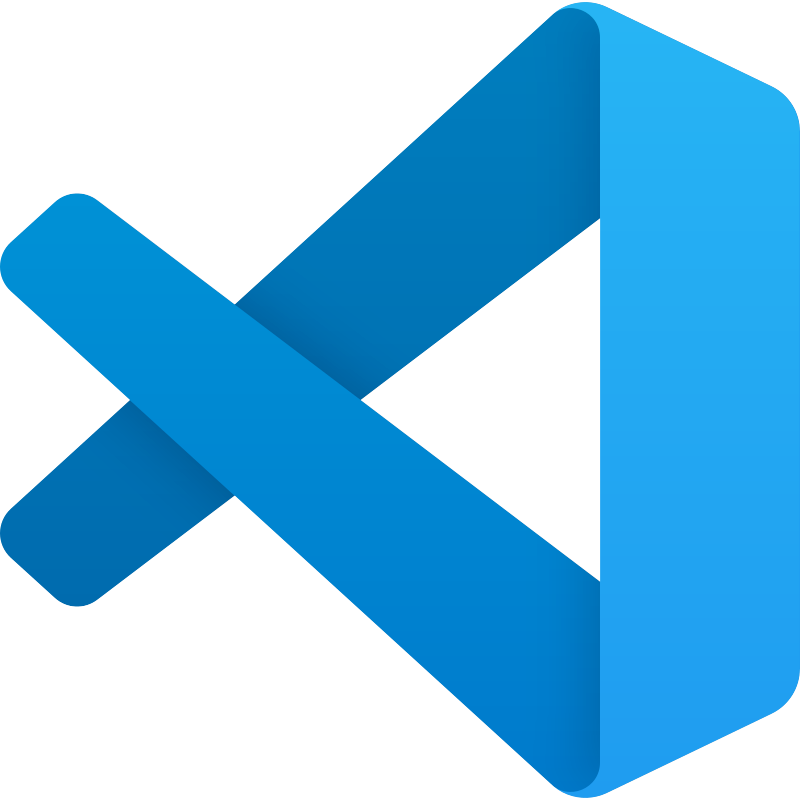

**Visual Studio Code** - это бесплатный, открытый и кроссплатформенный редактор кода, разработанный Microsoft. Он
поддерживает множество языков программирования, включая Python, и предлагает богатый набор функций:

- **Подсветка синтаксиса и автодополнение:** VS Code поддерживает подсветку синтаксиса и автодополнение для Python.
- **Отладка:** Встроенная отладка позволяет легко находить и исправлять ошибки.
- **Расширения:** Существует множество расширений, которые можно установить для улучшения функциональности редактора.
- **Интеграция с Git:** Удобные инструменты для работы с системой контроля версий Git.

### 3. Jupyter Notebook - интерактивная среда для написания кода и работы с данными.


**Jupyter Notebook** - это веб-приложение, которое позволяет создавать и делиться документами, содержащими живой код,
уравнения, визуализации и текстовые пояснения. Оно широко используется в науке о данных, исследовательской и
образовательной деятельности.

- **Интерактивные блокноты:** Возможность выполнения кода по ячейкам, что упрощает тестирование и отладку.
- **Визуализация данных:** Поддержка встроенных библиотек для визуализации данных, таких как Matplotlib и Seaborn.
- **Поддержка нескольких языков:** Помимо Python, Jupyter Notebook поддерживает другие языки программирования через
  ядра (kernels).

## Какой редактор выбрать?

Подводя черту:

- Если вам нужна мощная и профессиональная IDE - используйте PyCharm.
- Если предпочитаете лёгкий редактор - выбирайте VS Code.
- Для работы с данными и экспериментов с кодом - Jupyter Notebook лучший вариант.

Я лично использую VS Code (он полностью бесплатный), так как для нормального изучения второй половины курса понадобится **платная** версия PyCharm.

## Рекомендуемые расширения для Python в VS Code

При работе с Python в VS Code рекомендуется установить несколько расширений, которые упростят разработку, улучшат автодополнение кода, отладку и форматирование:

- 1️. **Python** (Microsoft) - основное расширение для работы с Python, поддержка отладки, автодополнения и виртуальных окружений.
- 2️. **Pylance** - расширение, улучшающее автодополнение, проверку типов и скорость работы.

Как установить?
Шаги:

- Открываем VS Code
- Переходим во вкладку Extensions (Ctrl + Shift + X)
- Вводим в поисковой строке Python и Pylance
- Устанавливаем оба расширения
- После установки перезапустите VS Code (Ctrl + Shift + P → Reload Window).

## Приступим к коду. Что такое переменная?

**Переменная** - это именованное хранилище данных в памяти компьютера. Она позволяет сохранять значения и использовать их в дальнейшем коде.

Когда мы объявляем переменную, мы даём ей имя и присваиваем значение.

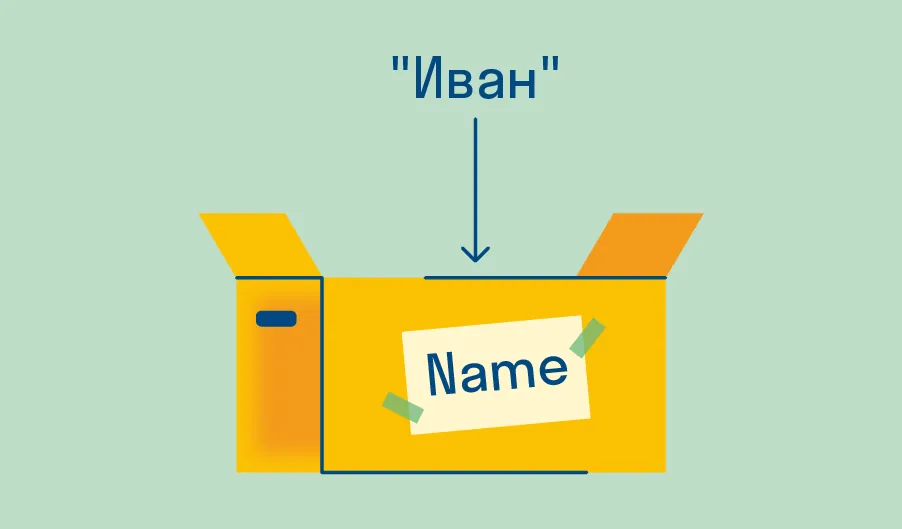

```python
name = "Иван"
age = 25
```

В этих примерах `name` и `age` это имена переменных, а *"Иван"* и *"25"* это их значения.

### Правила именования переменных в Python:

1. Имя переменной должно начинаться с буквы (a-z, A-Z) или символа подчеркивания (_).

```python
_valid_variable = 10
invalid-variable = 20  # Ошибка: дефис не разрешен
```

2. Остальные символы имени переменной могут быть буквами, цифрами или символом подчеркивания.

```python
valid_variable1 = 30
invalid variable = 40  # Ошибка: пробел не разрешен
1invalid_variable = 50  # Ошибка: имя не может начинаться с цифры
```

3. Имена переменных чувствительны к регистру (например, `age` и `Age` - это разные переменные).

```python
age = 25
Age = 30 # Это разные переменные
```

4. Не используйте зарезервированные слова Python в качестве имен переменных (например, `class`, `def`, `if` и т.д.).

```python
class = "MyClass"  # Ошибка: 'class' является зарезервированным словом
```

> Резервированных слов в Python большое количество, мы с ними познакомимся в следующих лекциях, а пока просто запомните, что их нельзя использовать в качестве имен переменных.

5. Используйте стиль именования переменных, который улучшает читаемость кода. В Python принято использовать **snake_case** (слова разделяются нижним подчеркиванием).

```python
user_name = "Alice"
user_age = 30
is_active = True
```

6. Используйте понятные и описательные имена переменных, чтобы код был читаемым.

```python
product_price = 19.99
user_email = "user@example.com"
age = 50

# Плохой пример:
x = 19.99
e = "user@example.com"
a = 50
```

Старайтесь давать переменным имена, которые отражают их назначение и содержимое. Это поможет вам и другим разработчикам лучше понимать ваш код. Это особенно важно в больших проектах, где код может быть сложным и многослойным.

## Функция print

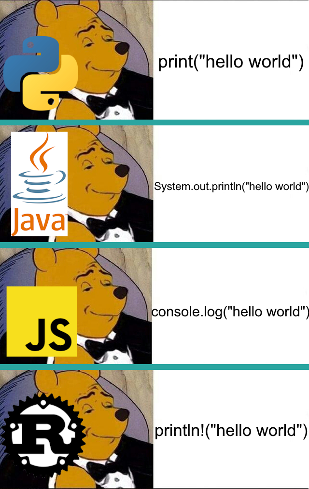

Функция `print()` - встроенная в Python функция, с помощью которой можно вывести текст в консоль. Также с её помощью можно контролировать форматирование вывода, управлять разделителями между элементами, изменять символы окончания строк и перенаправлять вывод данных в файл.

Рассмотрим, как работает функция `print()` в Python и выведем в консоль классическую для программистских гайдов фразу *«Hello, world!»*. Синтаксис вызова функции выглядит следующим образом:

```python
print("Hello, world!")
```

Тут `print` - это имя функции, а `"Hello, world!"` - это строка, которую мы хотим вывести в консоль.

> P.S. Без этой фразы не обходится ни один учебник по программированию. Она стала традиционным примером для демонстрации базового синтаксиса языка.

С помощью функции `print()` можно выводить не только строки, но и значения переменных, числа, результаты вычислений и многое другое. Например:

```python
name = "Иван"
age = 25
print("Имя:", name)
print("Возраст:", age)
print("Сумма:", 10 + 5)
print(name, age, 13 * 15)
```

### Параметры `sep` и `end`

Параметр sep позволяет изменить разделитель между значениями, которые передаются в функцию `print()`.

```python
print("Python", "AI", sep=" + ")
```

Результат:

```sh
Python + AI
```

Параметр `end` позволяет изменить символ, который будет добавлен после вывода. По умолчанию после каждого вызова `print()` выполняется переход на новую строку.

```python
print("Загрузка", end="...")
print("готово!")
```

Результат:

```sh
Загрузка...готово!
```

## Как запустить Python код?

Python-код можно запускать несколькими способами в зависимости от ваших нужд и удобства работы. Рассмотрим три основных способа.

### **1️. Запуск через командную строку (интерактивный режим)**

Этот способ удобен для тестирования небольших фрагментов кода или работы с интерпретатором Python в режиме реального времени.

Как запустить?

1. Откройте командную строку (Windows: cmd, Linux/Mac: Terminal).
2. Введите команду:

```sh
python3
```

После этого появится приглашение >>>, означающее, что можно вводить команды.

```sh
Python 3.13.5 (main, Nov 17 2025, 21:21:51) [GCC 13.3.0] on linux
Type "help", "copyright", "credits" or "license" for more information.
>>>
```

3. Введите любой код Python, например:

```python
print("Hello, World!")
```

4. Нажмите Enter, и вы увидите результат выполнения команды.
5. Для выхода из интерактивного режима введите команду:

```python
exit()
```

**Плюсы:**

- Быстрый способ проверить отдельные команды.
- Удобно для экспериментов и обучения.

**Минусы:**

- Не подходит для написания больших программ.
- Код не сохраняется после закрытия интерпретатора.

### **2️. Запуск Python-скрипта из файла**

Если у вас есть готовый скрипт с кодом, его можно запустить через терминал или командную строку.

Как запустить?

1. Создайте файл с кодом, например, script.py.
2. Напишите в нём Python-код:

```python
print("Этот код выполняется из файла!")
```

3. Сохраните файл и откройте терминал/командную строку.
4. Перейдите в папку с файлом (используйте команду `cd`)

```sh
cd путь_к_папке
```

5. Запустите скрипт командой:

```sh
python script.py
```

**Плюсы:** Код сохраняется и может выполняться много раз.

**Минусы:** Нужно открывать редактор для изменения кода.

Гораздо чаще мы будем сохранять код в файлах с расширением `.py` и запускать файл целиком (Такие файлы называются скриптами)

### **3️. Запуск через среду разработки (IDE)**

Среда разработки (например, PyCharm, VS Code, Jupyter Notebook) позволяет удобно писать, редактировать и запускать код в одном месте.

Как запустить?

1. Установите и откройте IDE (например, PyCharm, VS Code).
2. Создайте новый Python-файл (script.py) и напишите в нём код:

```python
print("Запуск кода через IDE!")
```

3. Нажмите кнопку "Запустить" (Run / ▶).
4. Внизу появится результат выполнения.

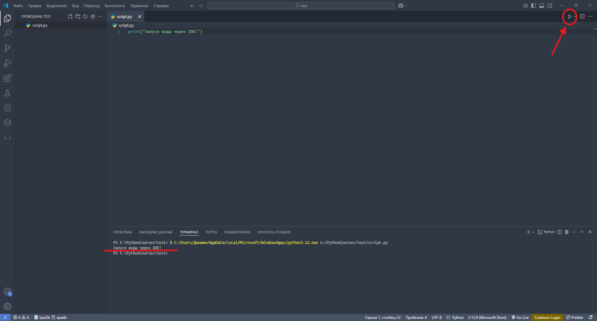

**Плюсы:** Удобная работа с кодом, подсветка синтаксиса, автодополнение, отладка.

**Минусы:** Их нет!

## Типизация в программировании

### 1️. Что такое типизация?

**Типизация** - это система, которая определяет, какие типы данных можно использовать в языке программирования и как они взаимодействуют между собой.

Любая переменная в программе имеет определённый тип данных, который определяет, какие операции с ней допустимы.

### 2️. Виды типизации

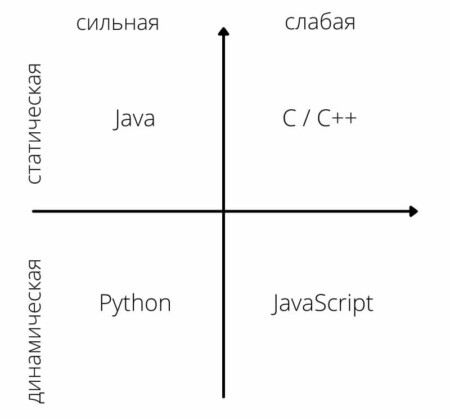

Существует несколько классификаций типизации:

#### Слабая (не строгая) / Сильная (строгая) типизации

- Слабая (не строгая) типизация: Язык слабо типизирован, если он позволяет выполнять операции между различными типами
  данных без явного приведения типов. Пример: JavaScript.

```JavaScript
console.log("5" + 10);  // Выведет "510" (автоматическое преобразование)
console.log("5" - 2);   // Выведет 3 (строка "5" автоматически преобразуется в число)
```

- Сильная (строгая) типизация: Язык сильно типизирован, если он требует явного приведения типов для выполнения операций
  между различными типами данных. Пример: Python.

```python
x = "5"
y = 10
print(x + y)  #  TypeError: can only concatenate str (not "int") to str
```

При слабой типизации сложить число и строку можно, при сильной нельзя.

#### Статическая / Динамическая типизации

Статическая типизация: В статически типизированных языках типы переменных определяются во время компиляции и не могут изменяться. Пример: Java, C++.

Динамическая типизация: В динамически типизированных языках типы переменных могут изменяться во время выполнения программы. Пример: Python, JavaScript.

При статической типизации нужно четко указывать тип данных переменной, при динамической будет использована утиная
типизация, и переменная может изменить свой тип во врем исполнения.

**Python является языком с сильной, динамической типизацией.**

### Утиная типизация (Duck Typing) в программировании

Утиная типизация - это концепция, применяемая в динамически типизированных языках программирования. Она основывается на поведении объекта, а не на его явном типе.

Принцип утиных типов можно описать так:

*"Если что-то выглядит как утка, плавает как утка и крякает как утка, то, вероятно, это утка."*


### Типы данных в Python

Для определения типов переменных в Python используются встроенные типы данных:

- `int` - целые числа (например, `1`, `-5`, `42`)
- `float` - числа с плавающей точкой (например, `3.14`, `-0.001`, `2.0`)
- `str` - строки (например, `"Hello"`, `'Python'`, `"123"`)
- `bool` - логические значения (`True`, `False`)
- `list` - списки (например, `[1, 2, 3]`, `["apple", "banana"]`)
- `tuple` - кортежи (например, `(1, 2)`, `("a", "b")`)
- `dict` - словари (например, `{"key": "value", "name": "Alice"}`)
- `set` - множества (например, `{1, 2, 3}`, `{"apple", "banana"}`)
- `None` - специальный тип, обозначающий отсутствие значения (например, `None`)

Сегодня мы разберем только базовые типы данных: `int`, `float`, `str` Остальные типы мы изучим в следующих лекциях.

### Строка (String)

Строка (String) - это последовательность символов, заключенная в кавычки. В Python строки можно записывать в одинарных (`'`), двойных (`"`) или тройных (`''' '''` или `""" """`) кавычках.

```python
# Примеры строк
single_quote = 'Это строка в одинарных кавычках'
double_quote = "Это строка в двойных кавычках"
# Тройные кавычки позволяют создавать многострочные строки
multi_line = '''Это многострочная строка, которая может занимать несколько
строк в коде.'''
```

Строки поддерживают множество операций, таких как конкатенация (сложение), извлечение подстрок и методы для работы с
текстом:

Пока что нас будет интересовать всего одна вещь, конкатенация строк:

```python
# Конкатенация строк
first_name = "Иван"
last_name = "Иванов"
full_name = first_name + " " + last_name  # Склеиваем строки с пробелом между ними
print(full_name)  # Выведет: Иван Иванов
```

### Число (Number) в Python

В Python числа представляют собой числовые типы данных, которые используются для хранения и выполнения математических операций.

Основные числовые типы в Python:

- `int` – целые числа (Integer)
- `float` – числа с плавающей точкой (Float)

Целые числа (int)
int (integer) - это числа без дробной части. В Python они могут быть любого размера (ограничены лишь объемом памяти).

Примеры целых чисел:

```python
a = 10
b = -5
c = 1234567890123456789  # Python поддерживает большие числа
```

Числа с плавающей точкой (float)
`float` - это числа с дробной частью, записанные через точку.

Примеры float:

```python
pi = 3.14
negative = -0.75
scientific = 1.2e3  # 1.2 × 10³ = 1200.0
```

Python поддерживает стандартные арифметические операции, такие как сложение, вычитание, умножение и деление, деление
нацело, остаток от деления, возведение в степень:

```python
a = 10
b = 3

print(a + b)   # Вывод: 13
print(a - b)   # Вывод: 7
print(a * b)   # Вывод: 30
print(a / b)   # Вывод: 3.3333333333333335
print(a // b)  # Вывод: 3
print(a % b)   # Вывод: 1
print(a ** b)  # Вывод: 1000
```

## Порядок выполнения операций в Python

Как и в математике, Python выполняет операции в определённом порядке. Если при вычислениях в выражении используются разные операторы, они выполняются в соответствии с их приоритетом.

Правила порядка выполнения операций:

1️. Операции в скобках выполняются в первую очередь, независимо от приоритета других операторов.

2️. Операторы возведения в степень (**) имеют высокий приоритет, выполняются раньше, чем умножение или деление.

3️. Операторы умножения, деления, целочисленного деления и остатка от деления выполняются раньше сложения и вычитания.

Примеры:

```python
result = 10 + 3 * 2
print(result)  # 16 (Сначала умножение 3 * 2, затем сложение 10 + 6)
result = (10 + 3) * 2
print(result)  # 26 (Сначала сложение в скобках, затем умножение)
print(2 ** 3 * 4)  # 32 (Сначала 2 ** 3 = 8, затем 8 * 4 = 32)
print(2 ** (3 * 4))  # 4096 (Сначала 3 * 4 = 12, затем 2 ** 12)
```

### Аннотации типов

`Python` поддерживает аннотации типов, которые позволяют указывать ожидаемый тип данных для переменных, функций и их параметров. Это помогает улучшить читаемость кода и облегчает статический анализ.

```python
age : int = 25  # Переменная age ожидается как целое число
full_name : str = "Иван Иванов"  # Переменная full_name ожидается как строка
```

> Аннотации типов не влияют на выполнение программы и не накладывают строгих ограничений на типы данных. Они служат лишь для документации и помощи разработчикам.

## Операции между разными типами данных в Python

Python позволяет выполнять операции между разными типами данных, но не все типы могут быть объединены автоматически. Некоторые комбинации требуют явного преобразования типов, иначе возникнет ошибка.

### Операции между числами (int, float)

Python автоматически преобразует `int` в `float`, если одно из чисел во время вычислений является `float`.

```python
a = 5      # int
b = 2.5    # float
result = a + b  # float
print(result)   # 7.5
```

***При арифметических операциях с int и float результат всегда float!***

### Операции между числами и строками (int, float ↔ str)

Как мы выяснили выше, произойдет ошибка при сложении числа и строки!

```python
num = 5
text = " apples"
print(num + text)  # TypeError: unsupported operand type(s) for +: 'int' and 'str'
```

Решение: Использовать явное преобразование типов `str()`:

```python
print(str(num) + text)  # "5 apples"
```

#### Повторение строки через умножение

```python
print("Hello" * 3)  # "HelloHelloHello"
```

### Функция input() в Python

Функция `input()` используется для получения ввода от пользователя во время выполнения программы.
Она приостанавливает выполнение программы, ожидая ввода данных, и возвращает введенное значение в виде строки (str).

#### Синтаксис input()

```python
variable = input("Введите данные: ")
```

`"Введите данные: "` - это текстовое приглашение (опционально).
`variable` - переменная, в которую будет сохранен результат ввода.

#### Примеры использования input()

1️. Получение строки от пользователя

```python
name = input("Введите ваше имя: ")
print("Привет,", name)
```

2. Ввод числа и приведение к `int`

```python
number = int(input("Введите число для возведения его в квадрат: "))
print("Ваше число в квадрате:", number ** 2)
```

3. Явный разбор `TypeError`

Намеренно создадим ошибку:

```python
age = input("Введите возраст: ")
print(age + 1)
```

Даже если пользователь введёт число `18`, функция `input()` вернёт строку `"18"`.

Python попытается выполнить операцию:

```sh
str + int
```

В результате появится ошибка:

```sh
TypeError: can only concatenate str (not "int") to str
```

Разберём ошибку:

- `age` имеет тип `str`;
- число 1 имеет тип `int`;

Python не может автоматически сложить строку и число;
перед вычислением строку необходимо преобразовать в `int`.

Исправленный вариант:

```python
age = int(input("Введите возраст: "))
print(age + 1)
```

Тип введённого значения можно проверить через `type()`:

```python
age = input("Введите возраст: ")

print(type(age))
```

Результат:

```sh
<class 'str'>
```

## Функция `type()`

Для определения типа значения в `Python` используется встроенная функция `type()`.

```python
age = 26
print(type(age))

age = "26"
print(type(age))
```

Результат:

```sh
<class 'int'>
<class 'str'>
```

В первом случае переменная `age` содержит целое число, поэтому её тип - `int`.

Во втором случае `age` содержит строку, поэтому её тип - `str`.

Тип значения можно менять во время выполнения программы:

```python
value = 10
print(type(value))

value = "Hello"
print(type(value))
```

Функция `type()` особенно полезна при работе с пользовательским вводом:

```python
user_age = input("Введите возраст: ")
print(type(user_age))
```

Даже если пользователь введёт число, функция `input()` вернёт строку:

```sh
<class 'str'>
```

## Практические задания

1. Создайте две переменные `a` и `b` присвойте им произвольные значения. Выполните сложение, вычитание, умножение и деление этих переменных, сохраните их в переменные и выведите результаты.
2. Запросите у пользователя его имя и возраст, а затем выведите сообщение: `Привет, (имя) Через год вам будет (возраст + 1) лет`.
3. Вычисление площади прямоугольника. Запросите у пользователя ширину `w` и высоту `h` прямоугольника и посчитайте его площадь.
4. Запросите у пользователя слово и число. Выведите слово, повторённое указанное количество раз.
5. Запросите у пользователя три числа `a`, `b`, `c`. Вычислите и выведите результат выражения `(a + b) * c - (a % b)`
6. Запросите у пользователя радиус круга `r` и вычислите его площадь `s`. Результат вывести в консоль. (Напомню площадь круга равна `S=pi*r**2`)

## Домашнее задание

1. Создайте переменные `x` и `y`, присвойте им значения 10 и 5 соответственно. Выведите результат всех основных арифметических операций между этими переменными.
2. Запросите у пользователя его имя и выведите приветствие в формате: `Привет, (имя)! Добро пожаловать в мир Python!`
3. Среднее арифметическое. Запросите у пользователя три числа и вычислите их среднее арифметическое. Выведите результат.
4. Конвертер температур. Запросите у пользователя температуру в градусах Цельсия и конвертируйте её в градусы Фаренгейта. Формула для конвертации: `F = C * 9/5 + 32`. Выведите результат.
5. Конвертер времени. Запросите количество минут. Выведите, сколько это часов и минут.
   Например: `135 минут = 2 часа 15 минут`.
6. Длина окружности. Запросите у пользователя радиус круга и вычислите длину окружности по формуле `L = 2 * pi * r`. Выведите результат. (Напомню, что `pi` примерно равно 3.14)
7. Запросите у пользователя трехзначное число. Найдите сумму его цифр и выведите результат. Например, для числа 123 сумма будет 1 + 2 + 3 = 6.
