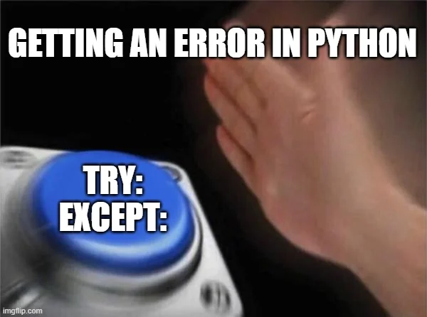
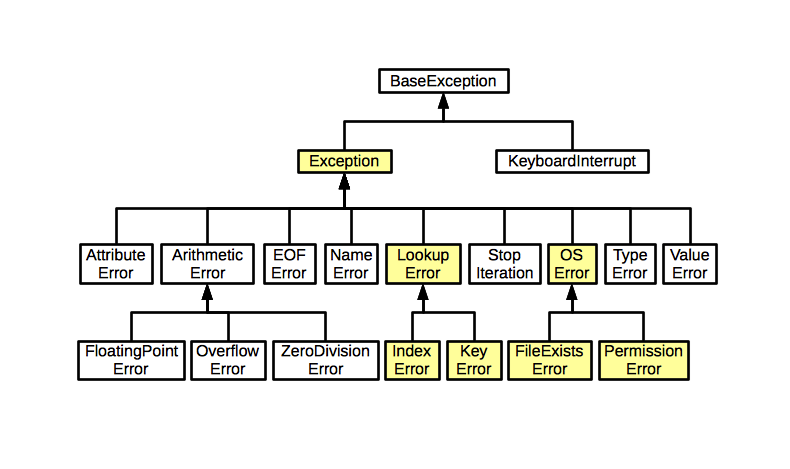

# Лекция 2. Логика, условия и безопасный ввод


## Вступление

На прошлой лекции мы познакомились с самыми базовыми вещами в Python: переменными, типами данных, функцией `print()`, пользовательским вводом через `input()`, преобразованием типов и первыми ошибками.

Мы уже увидели важную мысль: программа не просто хранит значения, а работает со значениями определённых типов. Если типы не подходят друг другу, Python не будет молча угадывать, что мы имели в виду. Он честно покажет ошибку.

Сегодня мы двигаемся дальше и начинаем учить программу **принимать решения**.

До этого наши программы чаще всего выполнялись сверху вниз:

```python
print("Начало программы")
print("Выполняем вычисления")
print("Конец программы")
```

Но в реальных программах почти никогда не бывает так, что все действия выполняются одинаково для всех пользователей.

Например:

- если пользователю есть 18 лет - доступ разрешён;
- если возраст меньше 18 - доступ запрещён;
- если пароль правильный - пользователь входит в систему;
- если пароль неправильный - показываем ошибку;
- если число делится на 2 - оно чётное;
- если пользователь ввёл не число - программа не должна падать;
- если при делении второе число равно 0 - нужно показать нормальное сообщение, а не страшную ошибку в консоли.

То есть сегодня у нас будет две большие темы, которые очень хорошо связаны между собой:

```text
логика и условия
        ↓
пользовательский ввод
        ↓
ошибки при вводе
        ↓
безопасная обработка ошибок
```

Мы разберём:

- булеву алгебру;
- тип данных `bool`;
- значения `True` и `False`;
- преобразование разных типов в `bool`;
- операторы сравнения;
- логические операторы `and`, `or`, `not`;
- операторы `in` и `is`;
- условные конструкции `if`, `elif`, `else`;
- конструкцию `match-case`;
- самые частые исключения в Python;
- обработку ошибок через `try-except`;
- безопасный пользовательский ввод;
- обработку `ValueError`;
- обработку `ZeroDivisionError`;
- блоки `else`, `finally` в `try-except`;
- оператор `raise`.

Главная цель лекции:

> Научить программу принимать решения и нормально реагировать на неправильные данные.

---

# Что такое булева алгебра?


## История булевой алгебры

Булева алгебра была разработана английским математиком Джорджем Булем в середине XIX века.

Он разработал систему алгебраических операций, которая позже стала основой для работы с логическими выражениями в программировании, цифровых схемах, процессорах и алгоритмах.

В обычной математике мы часто работаем с числами:

```text
1, 2, 3, 10, 100, 1000
```

А булева алгебра работает только с двумя значениями:

```python
True
False
```

То есть:

- `True` - истина;
- `False` - ложь.

На первый взгляд кажется, что это слишком просто. Всего два значения - что тут изучать?

Но именно на этих двух значениях построена большая часть логики в программах.

Например:

```text
Пользователь ввёл правильный пароль?
Возраст больше или равен 18?
Число делится на 2?
Товар есть на складе?
Пользователь заблокирован?
Файл существует?
Ответ от сервера успешный?
```

На каждый такой вопрос программа должна получить ответ:

```python
True
```

или:

```python
False
```

И уже на основе этого ответа программа решает, что делать дальше.

---

## Булева алгебра в программировании

Булева алгебра - это раздел математики, который работает только с двумя значениями:

- `True`;
- `False`.

Эти значения используются в логических выражениях, помогают принимать решения и управлять программой.

В Python `True` и `False` относятся к логическому типу данных `bool`.

```python
print(True)
print(False)
```

Результат:

```text
True
False
```

Проверим тип этих значений через функцию `type()`, которую мы уже видели на прошлой лекции:

```python
print(type(True))
print(type(False))
```

Результат:

```text
<class 'bool'>
<class 'bool'>
```

`bool` - это отдельный тип данных, такой же как `int`, `float` или `str`, только он хранит не число и не текст, а логическое значение.

Этот тип данных необходим для условных конструкций и логических операций.

---

# Как задать значение `bool` в Python?


## 1. Прямое присваивание `True` или `False`

Логическую переменную можно создать, просто присвоив ей значение `True` или `False`.

```python
is_active = True
is_deleted = False

print(is_active)
print(is_deleted)
```

Результат:

```text
True
False
```

Обратите внимание на имена переменных:

```python
is_active
is_deleted
```

В программировании булевые переменные часто называют так, чтобы имя читалось как вопрос.

Например:

```python
is_admin = True
has_ticket = False
can_edit = True
should_send_email = False
```

Такие имена хорошо читаются:

```text
is_admin          пользователь администратор?
has_ticket        есть билет?
can_edit          может редактировать?
should_send_email нужно отправить email?
```

Это не обязательное правило синтаксиса, но это хороший стиль.

Плохой пример:

```python
x = True
y = False
```

Такой код работает, но непонятно, что именно означают `x` и `y`.

Хороший пример:

```python
is_logged_in = True
is_banned = False
```

Такой код читается намного проще.

---

## 2. Преобразование других типов в `bool()`

В Python существует множество различных типов данных: числа, строки, списки, словари, множества, объекты и так далее.

Мы уже знаем, что Python - язык с динамической и строгой типизацией.

Это означает:

- нам не нужно явно указывать тип переменной при создании;
- Python сам понимает тип значения;
- но Python не позволяет выполнять странные операции между несовместимыми типами без явного преобразования.

Например, если у нас есть число и строка:

```python
num = 13
text = "20"
```

То вот так сложить их нельзя:

```python
result = num + text
```

Python не будет угадывать, хотим мы получить математическое сложение или склеивание строк.

Чтобы выполнить операцию, нужно привести значения к одному типу.

Например, преобразовать строку в число:

```python
num = 13
text = "20"

result = num + int(text)

print(result)
```

Результат:

```text
33
```

Или преобразовать число в строку:

```python
num = 13
text = "20"

result = str(num) + text

print(result)
```

Результат:

```text
1320
```

В первом случае мы выполнили математическое сложение.

Во втором случае мы выполнили конкатенацию строк.

Теперь разберёмся, как разные значения преобразуются в `bool`.

Для этого используется функция `bool()`.

```python
print(bool(10))
print(bool(0))
print(bool("Hello"))
print(bool(""))
```

Результат:

```text
True
False
True
False
```

Python использует понятия **truthy** и **falsy** значений.

- **truthy** - значение ведёт себя как `True`;
- **falsy** - значение ведёт себя как `False`.

---

## Числа и `bool()`

Для чисел правило простое:

- `0` превращается в `False`;
- любое ненулевое число превращается в `True`.

```python
print(bool(10))
print(bool(0))
print(bool(-3.5))
print(bool(0.0))
```

Результат:

```text
True
False
True
False
```

Даже отрицательное число считается `True`, потому что оно не равно нулю.

То есть Python не думает так:

```text
отрицательное число - плохо - значит False
```

Нет.

Правило проще:

```text
0     → False
не 0  → True
```

---

## Строки и `bool()`

Для строк правило тоже простое:

- пустая строка `""` превращается в `False`;
- любая непустая строка превращается в `True`.

```python
print(bool("Hello"))
print(bool(""))
print(bool(" "))
```

Результат:

```text
True
False
True
```

Очень важный момент:

```python
print(bool(" "))
```

Результат:

```text
True
```

Почему?

Потому что строка `" "` не пустая. Внутри неё есть пробел. А пробел - это тоже символ.

Это частая ошибка новичков. Студент думает: “Ну там же ничего нет”.

А Python думает иначе:

```text
Пробел есть? Есть.
Значит строка не пустая.
Значит True.
```

---

## Зачем это нужно?

Например, можно проверить, ввёл ли пользователь пароль:

```python
password = input("Введите пароль: ")

if password:
    print("Пароль введён")
else:
    print("Пароль пустой")
```

Если пользователь ничего не введёт и просто нажмёт Enter, переменная `password` будет содержать пустую строку:

```python
""
```

А пустая строка в логическом контексте - это `False`.

Если пользователь введёт хотя бы один символ, даже пробел, строка уже будет считаться `True`.

Позже, когда мы будем делать нормальную валидацию данных, мы научимся очищать строки от лишних пробелов через `.strip()`.

Но пока нам важно понять сам принцип.

---

## 3. Присвоение результата логического выражения

Переменной можно присвоить результат операции сравнения.

Например:

```python
x = 10
y = 5

result = x > y

print(result)
```

Результат:

```text
True
```

Почему?

Потому что выражение:

```python
x > y
```

превращается в:

```python
10 > 5
```

А это истина.

То есть переменная `result` будет хранить не текст `"10 > 5"`, а реальный результат сравнения:

```python
True
```

Ещё пример:

```python
age = 16
is_adult = age >= 18

print(is_adult)
```

Результат:

```text
False
```

Такой подход часто используется в реальных программах.

Например:

```python
age = 20
has_ticket = True
is_banned = False

can_enter = age >= 18 and has_ticket and not is_banned

print(can_enter)
```

Здесь переменная `can_enter` будет хранить итоговый ответ на вопрос:

```text
Можно ли пользователю войти?
```

---

# Операторы сравнения

Операторы сравнения позволяют сравнивать значения между собой. Результатом такого сравнения всегда будет `True` или `False`.  Сравнения - это основа условий. Без них программа не сможет принять решение.

---

## Оператор `>` - больше

```python
x = 10
y = 5

result_true = x > y
result_false = y > x

print(result_true)
print(result_false)
```

Результат:

```text
True
False
```

Как это работает:

```python
x > y
```

превращается в:

```python
10 > 5
```

Это правда, поэтому результат `True`.

А выражение:

```python
y > x
```

превращается в:

```python
5 > 10
```

Это неправда, поэтому результат `False`.

---

## Оператор `<` - меньше

```python
x = 2
y = 13

result_true = x < y
result_false = y < x

print(result_true)
print(result_false)
```

Результат:

```text
True
False
```

Тут всё работает по обычной математической логике.

---

## Оператор `>=` - больше или равно

```python
x = 5
y = 10

print(x >= 5)
print(y >= 18)
print(y >= x)
print(x >= 5 + 2)
```

Результат:

```text
True
False
True
False
```

Разберём:

```python
x >= 5
```

Это `True`, потому что `x` равен `5`.

```python
y >= 18
```

Это `False`, потому что `10` меньше `18`.

```python
y >= x
```

Это `True`, потому что `10` больше `5`.

```python
x >= 5 + 2
```

Сначала Python посчитает выражение `5 + 2`, получится `7`.

Потом сравнит:

```python
5 >= 7
```

Это `False`.

---

## Оператор `<=` - меньше или равно

```python
x = 5
y = 10

print(x <= 5)
print(y <= 8)
print(y <= x)
print(x <= 10 - 2)
```

Результат:

```text
True
False
False
True
```

---

## Оператор `==` - равно

```python
x = 5
y = 10

print(x == 2 + 3)
print(y == 10)
print(y == x)
```

Результат:

```text
True
True
False
```

Очень важно не путать:

```python
=
```

и:

```python
==
```

`=` - это присваивание.

```python
age = 18
```

Мы кладём значение `18` в переменную `age`.

`==` - это сравнение.

```python
age == 18
```

Мы спрашиваем Python:

```text
age равен 18?
```

Типичная ошибка новичка:

```python
age = 18

if age = 18:
    print("Доступ разрешён")
```

Так нельзя.

В условии нужно использовать сравнение:

```python
age = 18

if age == 18:
    print("Доступ разрешён")
```

Запомни:

```text
=   положить значение
==  сравнить значения
```

---

## Оператор `!=` - не равно

```python
x = 5
y = 10

print(x != y)
print(y != 10000)
print(y != 10)
```

Результат:

```text
True
True
False
```

Оператор `!=` проверяет, что значения не равны друг другу.

Например:

```python
password = input("Введите пароль: ")

if password != "PythonRocks":
    print("Неверный пароль")
```

---

# Ключевые слова булевой алгебры и их поведение в Python

В Python существуют логические операторы:

- `and`;
- `or`;
- `not`;
- `in`;
- `is`.

Они позволяют выполнять булевы операции и строить более сложные условия.

Однако в отличие от некоторых языков программирования, `and` и `or` в Python не всегда возвращают именно `True` или `False`. Иногда они возвращают одно из исходных значений. Это может показаться странным, но если понять правило, всё становится логично. Давайте разберём, как именно они работают.

---

## 1. `and` - логическое И

`and` используется, когда должны выполниться все условия.

Например:

```text
Пользователю есть 18 лет
И
у него есть билет
```

Только тогда можно войти.

```python
age = 20
has_ticket = True

if age >= 18 and has_ticket:
    print("Можно войти")
```

Результат:

```text
Можно войти
```

Почему?

- `age >= 18` → `True`;
- `has_ticket` → `True`;
- `True and True` → `True`.

---

## Примеры с булевыми значениями

```python
print(True and True)
print(False and True)
print(False and False)
print(True and False)
```

Результат:

```text
True
False
False
False
```

Логика такая:

```text
True  and True   → True
True  and False  → False
False and True   → False
False and False  → False
```

То есть для `and` нужно, чтобы всё было истинным.

Если хотя бы одно значение ложное, результат будет ложным.

---

## `and` с другими типами данных

В Python `and` возвращает первое ложное значение в выражении, а если все значения истинные - последнее.

```python
print(10 and 20)
```

Результат:

```text
20
```

Почему?

- `10` - истинное значение;
- `20` - тоже истинное значение;
- если оба значения истинны, `and` возвращает последнее.

Ещё пример:

```python
print(0 and 20)
```

Результат:

```text
0
```

Почему?

- `0` - ложное значение;
- `and` остановился на первом ложном значении и вернул его.

Ещё пример:

```python
print("Hello" and "")
```

Результат:

```text

```

На экране будет пустая строка.

Почему?

- `"Hello"` - истинное значение;
- `""` - ложное значение;
- `and` вернул первое ложное значение.

В обычных условиях мы чаще всего будем использовать `and` с выражениями, которые дают `True` или `False`.

Например:

```python
age = 19
has_ticket = True
is_banned = False

if age >= 18 and has_ticket and not is_banned:
    print("Вход разрешён")
```

---

## 2. `or` - логическое ИЛИ

`or` используется, когда достаточно, чтобы выполнилось хотя бы одно условие.

Например:

```text
Пользователь администратор
ИЛИ
пользователь модератор
```

Тогда доступ разрешён.

```python
is_admin = False
is_moderator = True

if is_admin or is_moderator:
    print("Доступ к панели разрешён")
```

Результат:

```text
Доступ к панели разрешён
```

Почему?

- `is_admin` → `False`;
- `is_moderator` → `True`;
- `False or True` → `True`.

Для `or` достаточно одного истинного значения.

---

## Примеры с булевыми значениями

```python
print(True or True)
print(False or True)
print(False or False)
print(True or False)
```

Результат:

```text
True
True
False
True
```

Логика такая:

```text
True  or True   → True
True  or False  → True
False or True   → True
False or False  → False
```

---

## `or` с другими типами данных

В Python `or` возвращает первое истинное значение, а если все значения ложные - последнее.

```python
print(0 or 20)
```

Результат:

```text
20
```

Почему?

- `0` - ложное значение;
- `20` - истинное значение;
- `or` вернул первое истинное значение.

Ещё пример:

```python
print("" or "Hello")
```

Результат:

```text
Hello
```

Почему?

- `""` - ложное значение;
- `"Hello"` - истинное значение.

Ещё пример:

```python
print(False or None)
```

Результат:

```text
None
```

Почему?

- `False` - ложное значение;
- `None` - тоже ложное значение;
- если все значения ложные, `or` возвращает последнее.

Такой механизм часто используют для значений по умолчанию.

Например:

```python
name = input("Введите имя: ")

display_name = name or "Гость"

print(display_name)
```

Если пользователь ничего не введёт, `name` будет пустой строкой, то есть `False` в логическом контексте.

Тогда `or` вернёт `"Гость"`.

---

## 3. `not` - логическое НЕ

`not` инвертирует логическое значение.

```python
print(not True)
print(not False)
```

Результат:

```text
False
True
```

Перед тем как выполнить операцию, `not` приводит значение к `bool`.

```python
print(not 0)
print(not 100)
print(not "")
print(not "Hello")
```

Результат:

```text
True
False
True
False
```

Почему?

- `0` - это `False`, значит `not 0` → `True`;
- `100` - это `True`, значит `not 100` → `False`;
- `""` - это `False`, значит `not ""` → `True`;
- `"Hello"` - это `True`, значит `not "Hello"` → `False`.

Пример из программы:

```python
is_banned = False

if not is_banned:
    print("Пользователь может войти")
```

Читается почти как обычное предложение:

```text
если пользователь не заблокирован - можно войти
```

---

## 4. `in` - проверка на вхождение

Оператор `in` проверяет, содержится ли один элемент в другом.

Например, можно проверить, есть ли символ в строке:

```python
print("a" in "apple")
print("x" in "apple")
```

Результат:

```text
True
False
```

Почему?

- буква `"a"` есть в строке `"apple"`;
- буквы `"x"` в строке `"apple"` нет.

Можно использовать это в условии:

```python
email = input("Введите email: ")

if "@" in email:
    print("Похоже на email")
else:
    print("Некорректный email")
```

Конечно, это очень простая проверка. Реальная проверка email сложнее.

Но для первой логики этого достаточно.

---

## 5. `is` - проверка идентичности объектов

Оператор `is` проверяет, ссылаются ли две переменные на один и тот же объект в памяти.

Важно не путать:

```python
==
```

и:

```python
is
```

`==` сравнивает значения.

`is` проверяет, являются ли переменные ссылками на один и тот же объект.

Пример:

```python
a = 600
b = 600

print(a == b)
print(a is b)
```

Результат может быть таким:

```text
True
False
```

Почему?

- `a == b` - значения одинаковые;
- `a is b` - объекты могут быть разными.

Ещё пример:

```python
a = 600
c = a

print(a is c)
```

Результат:

```text
True
```

Почему?

Потому что `c` ссылается на тот же объект, что и `a`.

---

## Интересный момент с числами от `-5` до `255`

Разработчики Python сделали оптимизацию для часто используемых маленьких чисел.

Числа от `-5` до `255` обычно заранее хранятся во внутренней памяти Python.

Поэтому:

```python
a = 200
b = 200

print(a is b)
```

может вернуть:

```text
True
```

А вот:

```python
a = 300
b = 300

print(a is b)
```

может вернуть:

```text
False
```

Но тут важно не запутаться.

Для сравнения значений почти всегда используем `==`, а не `is`.

```python
x = 300
y = 300

if x == y:
    print("Значения равны")
```

Оператор `is` чаще всего используется с `None`:

```python
value = None

if value is None:
    print("Значение отсутствует")
```

То есть:

```python
value == None
```

писать можно, но в Python принято:

```python
value is None
```

---

# Условные конструкции `if`, `elif`, `else` в Python


В программировании часто нужно выполнять определённые действия в зависимости от каких-то условий.

Например:

```text
Если возраст больше или равен 18 - разрешить доступ.
Иначе - запретить.
```

Или:

```text
Если пароль правильный - войти в систему.
Если пароль неправильный - показать ошибку.
```

Или:

```text
Если температура выше 20 - можно гулять.
Если ниже - лучше взять куртку.
```

В Python для этого используются условные конструкции:

- `if` - проверяет условие;
- `elif` - проверяет дополнительное условие, если первое не подошло;
- `else` - выполняется, если ничего выше не подошло.

---

## 1. Конструкция `if`

Конструкция `if` является основной в программировании, когда нужно принимать решения.

Она позволяет выполнить определённый блок кода только если заданное условие истинно (`True`).

### Синтаксис конструкции `if`

```python
if условие:
    # код выполняется, если условие истинно
```

Важные моменты:

- условие должно возвращать `True` или `False`;
- после условия ставится двоеточие `:`;
- код, который выполняется внутри `if`, пишется с отступом;
- обычно используется 4 пробела;
- если условие ложное, код внутри `if` не выполняется.

---

## Простой пример `if`

```python
temperature = 25

if temperature > 20:
    print("Погода хорошая, можно гулять!")
```

Результат:

```text
Погода хорошая, можно гулять!
```

Как это работает?

1. Python проверяет условие `temperature > 20`.
2. Значение `temperature` равно `25`.
3. Выражение `25 > 20` возвращает `True`.
4. Код внутри `if` выполняется.

Если условие не выполнится, вывода не будет.

```python
temperature = 10

if temperature > 20:
    print("Погода хорошая, можно гулять!")
```

В этом случае ничего не выведется, потому что `10 > 20` - это `False`.

---

## Отступы в Python

В Python отступ - это не просто красота. Это часть синтаксиса.

Неправильно:

```python
temperature = 25

if temperature > 20:
print("Погода хорошая")
```

Такой код вызовет ошибку.

Правильно:

```python
temperature = 25

if temperature > 20:
    print("Погода хорошая")
```

Запомните:

> Всё, что относится к блоку `if`, должно быть внутри отступа.

В других языках программирования блоки часто выделяются фигурными скобками.

Например, в JavaScript:

```javascript
if (temperature > 20) {
    console.log("Погода хорошая")
}
```

А в Python фигурных скобок нет. Вместо них используются отступы.

---

## Использование переменной типа `bool`

Условие `if` можно записывать проще, если у нас уже есть переменная с булевым значением.

```python
is_raining = False

if is_raining:
    print("Возьмите зонт!")
```

Как это работает?

1. Переменная `is_raining` содержит `False`.
2. Python проверяет `if is_raining`.
3. Так как там `False`, код внутри `if` не выполняется.

Ещё пример:

```python
is_logged_in = True

if is_logged_in:
    print("Добро пожаловать!")
```

Здесь код выполнится, потому что `is_logged_in` содержит `True`.

---

## `if` с вводом от пользователя

```python
age = int(input("Введите ваш возраст: "))

if age >= 18:
    print("Вам можно зарегистрироваться на сайте.")
```

Если пользователь введёт:

```text
20
```

Результат:

```text
Вам можно зарегистрироваться на сайте.
```

Как это работает:

1. `input()` получает строку от пользователя.
2. `int()` преобразует строку в число.
3. Результат сохраняется в переменную `age`.
4. Условие `age >= 18` проверяет возраст.
5. Если возраст 18 или больше, выводится сообщение.

Но тут уже появляется проблема.

Если пользователь введёт:

```text
hello
```

программа сломается.

Почему?

Потому что строку `"hello"` нельзя преобразовать в число через `int()`.

Мы специально вернёмся к этой проблеме в блоке про исключения.

---

## `if` с несколькими условиями

Можно объединять условия через `and` и `or`.

```python
temperature = 22
is_sunny = True

if temperature > 20 and is_sunny:
    print("Отличная погода для прогулки!")
```

Результат:

```text
Отличная погода для прогулки!
```

Почему?

- `temperature > 20` → `True`;
- `is_sunny` → `True`;
- `True and True` → `True`.

---

## 2. Конструкция `else`

Ключевое слово `else` используется вместе с `if`, чтобы выполнить альтернативный блок кода, если условие `if` не выполняется.

То есть:

```text
если условие истинно → выполняем первый блок
иначе → выполняем второй блок
```

### Синтаксис конструкции `if-else`

```python
if условие:
    # код выполняется, если условие истинно
else:
    # код выполняется, если условие ложно
```

---

## Простой пример использования `else`

```python
temperature = 15

if temperature > 20:
    print("На улице тепло!")
else:
    print("На улице холодно!")
```

Результат:

```text
На улице холодно!
```

Почему?

Условие:

```python
temperature > 20
```

превращается в:

```python
15 > 20
```

Это `False`, поэтому блок `if` пропускается, а блок `else` выполняется.

---

## Пример с возрастом

```python
age = int(input("Введите возраст: "))

if age >= 18:
    print("Доступ разрешён")
else:
    print("Доступ запрещён")
```

Тут программа выбирает один из двух сценариев:

- если возраст 18 или больше - доступ разрешён;
- иначе - доступ запрещён.

---

## 3. Конструкция `elif`


`elif` - это сокращение от `else if`.

Он используется, когда нужно проверить несколько условий.

Если первое условие `if` не выполняется, программа переходит к `elif` и проверяет следующее условие.

Если все условия `if` и `elif` ложны, выполняется код в `else`.

---

## Синтаксис `if-elif-else`

```python
if условие_1:
    # код выполняется, если условие_1 истинно
elif условие_2:
    # код выполняется, если условие_1 ложно, но условие_2 истинно
elif условие_3:
    # проверка продолжается
else:
    # код выполняется, если все условия выше ложны
```

---

## Простой пример `if-elif-else`

```python
temperature = int(input("Введите температуру: "))

if temperature >= 30:
    print("Очень жарко!")
elif 20 <= temperature < 30:
    print("Тепло.")
elif 10 <= temperature < 20:
    print("Прохладно.")
else:
    print("Холодно!")
```

`elif` можно применять неограниченное количество раз.

Но важно помнить: Python выполняет первый подходящий блок и дальше не проверяет остальные условия.

---

## Почему порядок условий важен?

Рассмотрим плохой пример:

```python
age = 10

if age < 65:
    print("Ты взрослый")
elif age < 18:
    print("Ты подросток")
```

Результат:

```text
Ты взрослый
```

Но человеку 10 лет. Почему так произошло?

Потому что первое условие:

```python
age < 65
```

для возраста `10` уже истинно.

Python выполняет первый подходящий блок и дальше не проверяет остальные условия.

Правильный вариант:

```python
age = 10

if age < 13:
    print("Ты ребёнок")
elif age < 18:
    print("Ты подросток")
elif age < 65:
    print("Ты взрослый")
else:
    print("Ты пенсионер")
```

Здесь проверки идут от более узкого диапазона к более широкому.

---

## `elif` как замена вложенному `if`

На самом деле `elif` - это удобная запись вот такой конструкции:

```python
a = 80

if a > 100:
    print("wont be printed")
else:
    if a > 50:
        print("will be printed")
    else:
        print("wont be printed")
```

Такой код работает, но читать его уже сложнее.

С `elif` код становится проще:

```python
a = 80

if a > 100:
    print("wont be printed")
elif a > 50:
    print("will be printed")
else:
    print("wont be printed")
```

Поэтому, когда у нас несколько альтернативных условий, обычно используют `elif`, а не глубокую вложенность.

---

# Конструкция `match-case` в Python

Только с версии Python 3.10 появилась конструкция `match-case`. Она похожа на `switch-case` в других языках программирования, например JavaScript, Java или C. `match-case` используется для сопоставления значения с несколькими вариантами. Эта конструкция может сделать код более читаемым, когда у нас есть одно значение и много возможных вариантов.

---

## Синтаксис `match-case`

```python
match значение:
    case шаблон_1:
        # код, если значение соответствует шаблону_1
    case шаблон_2:
        # код, если значение соответствует шаблону_2
    case _:
        # код по умолчанию
```

`case _` работает как `default` в других языках программирования.

Он выполняется, если ни один `case` не подошёл.

---

## Пример `match-case`

```python
day = int(input("Введите номер дня недели (1-7): "))

match day:
    case 1:
        print("Понедельник")
    case 2:
        print("Вторник")
    case 3:
        print("Среда")
    case 4:
        print("Четверг")
    case 5:
        print("Пятница")
    case 6 | 7:
        print("Выходной!")
    case _:
        print("Некорректный номер дня!")
```

Обрати внимание:

```python
case 6 | 7:
```

Так можно объединить несколько вариантов. То есть если пользователь введёт `6` или `7`, программа выведет:

```text
Выходной!
```

---

# Проблема пользовательского ввода

Теперь давайте свяжем условия с тем, что мы уже изучали на прошлой лекции.

Мы знаем, что `input()` всегда возвращает строку.

Например:

```python
age = input("Введите возраст: ")

print(type(age))
```

Даже если пользователь введёт:

```text
18
```

тип будет:

```text
<class 'str'>
```

Поэтому для чисел мы используем `int()`:

```python
age = int(input("Введите возраст: "))
```

И после этого можем использовать условия:

```python
age = int(input("Введите возраст: "))

if age >= 18:
    print("Доступ разрешён")
else:
    print("Доступ запрещён")
```

Но тут появляется новая проблема.

Если пользователь введёт:

```text
hello
```

Python не сможет преобразовать эту строку в число.

```python
age = int(input("Введите возраст: "))
```

Ошибка:

```text
ValueError
```

То есть наше условие может быть написано правильно, но программа всё равно сломается из-за неправильного ввода пользователя. И вот тут нам нужны исключения.

---

# Что такое исключение?



Исключения (`exceptions`) в Python - это механизм обработки ошибок во время выполнения программы.

Они позволяют программе продолжить работу после обнаружения ошибки, а не завершаться аварийно.

Важно понимать: исключения нужны не для того, чтобы скрывать все ошибки подряд.

Они нужны для ситуаций, которые мы ожидаем и можем обработать.

Например:

```python
number = int(input("Введите число: "))
```

Если пользователь введёт:

```text
abc
```

программа получит ошибку.

Но это ожидаемая ситуация. Пользователь может ошибиться. Он может случайно нажать не ту клавишу. Он может ввести текст вместо числа. Поэтому вместо того, чтобы программа падала, мы можем обработать эту ошибку и показать понятное сообщение.

---

## Иерархия исключений

В Python есть встроенные исключения для разных типов ошибок. Иерархия исключений выглядит вот так:



Не нужно запоминать всю схему прямо сейчас.

На этом этапе нам важно понимать самые частые ошибки:

- `SyntaxError`;
- `NameError`;
- `TypeError`;
- `ValueError`;
- `IndexError`;
- `KeyError`;
- `ZeroDivisionError`;
- `FileNotFoundError`.

Некоторые из них мы уже видели. Некоторые подробно разберём позже, когда появятся списки, словари и файлы.

---

# Основные исключения в Python

В Python существует множество встроенных исключений, которые возникают при различных ошибках во время выполнения программы.

Разберём наиболее распространённые типы исключений.

---

## 1. `SyntaxError` - ошибка синтаксиса

`SyntaxError` возникает, когда код написан с нарушением правил синтаксиса Python.

Это самая частая ошибка у новичков.

Например:

```python
if True
    print("Ошибка!")
```

Ошибка:

```text
SyntaxError: expected ':'
```

Почему?

Мы забыли двоеточие после `if`.

Правильно:

```python
if True:
    print("Теперь всё правильно")
```

`SyntaxError` обычно означает, что Python даже не смог нормально прочитать программу.

То есть программа ещё не начала выполняться, потому что синтаксис уже сломан.

---

## 2. `NameError` - ошибка имени

`NameError` возникает, если в коде используется переменная, которая не была объявлена.

```python
value1 = 1

print(value)
```

Ошибка:

```text
NameError: name 'value' is not defined
```

Почему?

Потому что мы создали переменную:

```python
value1
```

А вывести пытаемся:

```python
value
```

Для Python это разные имена.

Он не понимает, что мы “почти это имели в виду”.

Компьютер не угадывает. Он выполняет ровно то, что написано.

---

## 3. `TypeError` - ошибка типа

`TypeError` возникает, если операция выполняется между несовместимыми типами данных.

```python
print(5 + "5")
```

Ошибка:

```text
TypeError: unsupported operand type(s) for +: 'int' and 'str'
```

Почему?

- `5` - это `int`;
- `"5"` - это `str`;
- Python не складывает число и строку автоматически.

Правильно:

```python
print(5 + int("5"))
```

Результат:

```text
10
```

Или можно сделать так:

```python
print(str(5) + "5")
```

Результат:

```text
55
```

Но важно понимать, что это уже другая операция.

В первом случае:

```python
5 + int("5")
```

мы получаем математическое сложение.

Во втором случае:

```python
str(5) + "5"
```

мы получаем склеивание строк.

---

## 4. `ValueError` - ошибка значения

`ValueError` возникает, если тип вроде бы правильный, но значение неподходящее.

```python
num = int("Hello")
```

Ошибка:

```text
ValueError: invalid literal for int() with base 10: 'Hello'
```

Почему?

Функция `int()` умеет преобразовывать строки в числа:

```python
int("123")
```

Но строка:

```python
"Hello"
```

не похожа на число.

То есть тип аргумента правильный - это строка.

Но значение внутри строки неподходящее.

Именно поэтому это `ValueError`, а не `TypeError`.

---

## 5. `KeyError` - ошибка ключа

`KeyError` возникает при попытке получить значение по несуществующему ключу в словаре.

```python
my_dict = {"name": "Alice"}

print(my_dict["age"])
```

Ошибка:

```text
KeyError: 'age'
```

Словари мы подробно разберём позже, поэтому сейчас достаточно понимать:

> Такая ошибка возникает, когда мы обращаемся к ключу, которого нет.

---

## 6. `IndexError` - ошибка индекса

`IndexError` возникает, когда мы обращаемся к элементу по индексу, которого не существует.

```python
items = [10, 20, 30]

print(items[10])
```

Ошибка:

```text
IndexError: list index out of range
```

Списки мы подробно разберём позже.

Сейчас просто запомните: если индекс выходит за пределы коллекции, Python покажет `IndexError`.

---

## 7. `ZeroDivisionError` - деление на ноль

`ZeroDivisionError` возникает при попытке деления числа на `0`.

```python
result = 10 / 0
```

Ошибка:

```text
ZeroDivisionError: division by zero
```

Эта ошибка очень понятная: в математике нельзя делить на ноль.

То же самое и в Python.

---

## 8. `FileNotFoundError` - файл не найден

`FileNotFoundError` возникает, если мы пытаемся открыть файл, которого не существует.

```python
file = open("data.txt")
```

Ошибка:

```text
FileNotFoundError
```

Файлы мы подробно разберём позже.

---

# Обработка исключений с помощью `try-except`

Python позволяет перехватывать ошибки и продолжать выполнение программы. Для этого используется конструкция `try-except`.

Базовая структура выглядит так:

```python
try:
    # опасный код
except:
    # что делать, если произошла ошибка
```

В блоке `try` должен выполняться код, в котором мы ожидаем какое-либо исключение. Если исключение происходит, Python прекращает выполнять код внутри `try` и переходит к блоку `except`.

---

## Базовый `try-except`

```python
try:
    print(10 / 0)
except:
    print("Произошла ошибка!")
```

Результат:

```text
Произошла ошибка!
```

Программа не сломалась. Но такой вариант слишком общий. Мы не указали, какую именно ошибку хотим обработать. В маленьком примере это не страшно, но в реальных программах так можно случайно скрыть важную ошибку. Лучше обрабатывать конкретные исключения.

---

## Обработка конкретного исключения

Начнём с ошибки `TypeError`, которую мы уже видели на прошлых занятиях.

```python
try:
    print(5 + "5")
except TypeError:
    print("Ошибка: нельзя сложить число и строку!")
```

Результат:

```text
Ошибка: нельзя сложить число и строку!
```

Всё в порядке: программа не сломалась и продолжила свою работу благодаря блоку:

```python
except TypeError:
```

То есть мы сказали Python:

```text
Попробуй выполнить код.
Если возникнет TypeError - покажи понятное сообщение.
```

---

## Обработка `ValueError`

Самый частый пример - неправильный ввод числа.

```python
try:
    age = int(input("Введите возраст: "))
    print("Ваш возраст:", age)
except ValueError:
    print("Ошибка: возраст должен быть числом")
```

Если пользователь введёт:

```text
abc
```

программа выведет:

```text
Ошибка: возраст должен быть числом
```

И программа не упадёт.

Это уже намного лучше, чем просто дать пользователю страшный traceback.

---

## Обработка нескольких исключений

Можно обрабатывать разные ошибки в одном блоке `try-except`. Блоков `except` может быть любое количество.

```python
try:
    num = int(input("Введите число: "))
    result = 10 / num
    print(result)
except ValueError:
    print("Ошибка: введите корректное число!")
except ZeroDivisionError:
    print("Ошибка: деление на ноль невозможно!")
```

Как это работает?

- `ValueError` возникает, если пользователь вводит, например, `"abc"` вместо числа;
- `ZeroDivisionError` возникает, если пользователь вводит `0`.

То есть разные ошибки можно обрабатывать по-разному.

Это удобно, потому что для пользователя сообщения должны быть понятными.

Если он ввёл буквы, нужно сказать:

```text
Введите число
```

Если он ввёл ноль как делитель, нужно сказать:

```text
Делить на ноль нельзя
```

---

## Обработка множества ошибок в одном `except`

Можно перехватывать несколько исключений сразу:

```python
try:
    num = int(input("Введите число: "))
    result = 10 / num
    print(result)
except (ValueError, ZeroDivisionError):
    print("Ошибка: некорректный ввод или деление на ноль!")
```

Зачем это нужно?

Когда не требуется разное поведение для разных ошибок, можно объединить их.

Но если сообщения должны быть разными, лучше писать несколько `except`.

---

## Использование `Exception` для всех ошибок

Если мы не знаем, какие ошибки могут произойти, можно использовать `Exception`.

```python
try:
    x = int(input("Введите число: "))
    print(10 / x)
except Exception as e:
    print("Произошла ошибка:", e)
```

Если ввести `0`, программа не сломается:

```text
Введите число: 0
Произошла ошибка: division by zero
```

Но важно понимать:

> Не стоит использовать `except Exception` везде подряд.

Почему?

Потому что можно случайно скрыть ошибку, которую на самом деле нужно исправить.

Плохо:

```python
try:
    age = int(input("Введите возраст: "))
except Exception:
    print("Что-то пошло не так")
```

Лучше:

```python
try:
    age = int(input("Введите возраст: "))
except ValueError:
    print("Возраст должен быть числом")
```

Второй вариант лучше, потому что мы точно понимаем, какую ошибку ожидаем.

---

# Оператор `finally`

Оператор `finally` используется в блоке `try-except` для выполнения кода в любом случае:

- если ошибка была;
- если ошибки не было.

```python
try:
    print("Начинаем выполнение...")
    num = int(input("Введите число: "))
    result = 10 / num
    print("Результат:", result)
except ZeroDivisionError:
    print("Ошибка: деление на ноль!")
finally:
    print("Этот код выполнится в любом случае.")
```

При успешном выполнении, например если мы поделим на `2`, получим:

```text
Начинаем выполнение...
Введите число: 2
Результат: 5.0
Этот код выполнится в любом случае.
```

При делении на ноль:

```text
Начинаем выполнение...
Введите число: 0
Ошибка: деление на ноль!
Этот код выполнится в любом случае.
```

Зачем нужен `finally`?

Например:

- закрыть файл;
- закрыть соединение с базой данных;
- выполнить код, который должен выполниться всегда;
- записать лог завершения операции.

Пока просто запомните, что такая конструкция есть.

Подробно она пригодится позже, когда мы будем работать с файлами, базами данных и внешними ресурсами.

---

# Оператор `else` в `try-except`

Если внутри `try` не возникло ошибок, можно выполнить код в `else`.

```python
try:
    num = int(input("Введите число: "))
    result = 100 / num
except ValueError:
    print("Ошибка: введите число!")
except ZeroDivisionError:
    print("Ошибка: деление на 0 невозможно!")
else:
    print("Результат:", result)
```

В этом примере, если мы введём нормальное число и исключения не случится, мы попадём в `else`.

Например:

```text
Введите число: 5
Результат: 20.0
```

Если введём буквы:

```text
Введите число: abc
Ошибка: введите число!
```

Если введём ноль:

```text
Введите число: 0
Ошибка: деление на 0 невозможно!
```

---

## Конструкция `try-except-else-finally`

Иногда можно встретить полную конструкцию:

```python
try:
    num = int(input("Введите число: "))
    result = 10 / num
except ValueError:
    print("Ошибка: введено не число!")
except ZeroDivisionError:
    print("Ошибка: деление на ноль!")
else:
    print("Результат:", result)
finally:
    print("Программа завершила обработку.")
```

Как это работает:

- если введено нормальное число - выполнится `else` и `finally`;
- если введена буква - выполнится `except ValueError` и `finally`;
- если введён `0` - выполнится `except ZeroDivisionError` и `finally`.

Большую часть времени вы не будете часто использовать `else` внутри `try-except`.

Его полезно применять, когда нужно явно отделить код, который должен выполняться только при отсутствии ошибок.

---

# Оператор `raise`

В Python слово `raise` используется, когда нужно специально вызвать ошибку.

Например:

```python
number = int(input("Введите положительное число: "))

if number < 0:
    raise ValueError("Ошибка: число не может быть отрицательным!")

print("Число принято:", number)
```

Если пользователь введёт отрицательное число, программа вызовет ошибку вручную.

Эта конструкция нам особенно понадобится после того, как мы разберём функции.

Сейчас нужно запомнить:

> Ошибку можно не только получить, но и вызвать самостоятельно.

Иногда это нужно, если данные нарушают правила программы. Например, если по логике нашей программы возраст не может быть отрицательным, то отрицательный возраст - это ошибка данных. Технически всегда можно обработать исключение и вызвать его же ещё раз.

Зачем такое может быть нужно?

Например, когда нам не надо полностью предотвращать ошибку, а нужно только записать информацию о том, что ошибка случилась, и потом передать эту ошибку дальше. Так часто делают в больших проектах.

---

# Главная практика: фейсконтроль

Теперь объединим условия и безопасный ввод в одной программе.

Это хорошее упражнение, потому что здесь есть сразу несколько важных вещей:

- ввод от пользователя;
- преобразование типов;
- булевые значения;
- операторы сравнения;
- `and`, `or`, `not`;
- `if`, `elif`, `else`;
- обработка `ValueError`.

## Задача

Написать программу, которая спрашивает:

- возраст пользователя;
- есть ли билет;
- является ли пользователь VIP;
- заблокирован ли пользователь.

## Правила

- если возраст введён неправильно - вывести ошибку;
- если возраст меньше 18 - не пускать;
- если пользователь заблокирован - не пускать;
- если пользователь VIP - пустить без билета;
- если пользователь не VIP, но билет есть - пустить;
- иначе отказать.

---

## Первая версия

```python
age = int(input("Введите возраст: "))
has_ticket = input("Есть билет? yes/no: ") == "yes"
is_vip = input("VIP? yes/no: ") == "yes"
is_banned = input("Заблокирован? yes/no: ") == "yes"

if age < 18:
    print("Вход запрещён: вам меньше 18")
elif is_banned:
    print("Вход запрещён: пользователь заблокирован")
elif is_vip:
    print("Вход разрешён: VIP")
elif has_ticket:
    print("Вход разрешён: билет есть")
else:
    print("Вход запрещён: нужен билет")
```

Программа работает, если пользователь вводит данные правильно.

Но если в возраст ввести:

```text
hello
```

программа сломается.

Потому что строку `"hello"` нельзя преобразовать в число через `int()`.

---

## Улучшенная версия с `try-except`

```python
try:
    age = int(input("Введите возраст: "))
except ValueError:
    print("Ошибка: возраст должен быть числом")
else:
    has_ticket = input("Есть билет? yes/no: ") == "yes"
    is_vip = input("VIP? yes/no: ") == "yes"
    is_banned = input("Заблокирован? yes/no: ") == "yes"

    if age < 18:
        print("Вход запрещён: вам меньше 18")
    elif is_banned:
        print("Вход запрещён: пользователь заблокирован")
    elif is_vip:
        print("Вход разрешён: VIP")
    elif has_ticket:
        print("Вход разрешён: билет есть")
    else:
        print("Вход запрещён: нужен билет")
```

Теперь программа не ломается при неправильном возрасте.

Если пользователь введёт нормальный возраст, код пойдёт в `else` и продолжит проверять билет, VIP и блокировку.

Если пользователь введёт текст вместо возраста, сработает `except ValueError`.

---

## Что тут важно?

```python
has_ticket = input("Есть билет? yes/no: ") == "yes"
```

Здесь происходит сравнение.

Если пользователь ввёл:

```text
yes
```

то:

```python
has_ticket
```

будет `True`.

Если пользователь ввёл что-то другое, будет `False`.

Например:

```python
answer = input("Есть билет? yes/no: ")

print(answer == "yes")
```

Если ввести `yes`, получим:

```text
True
```

Если ввести `no`, получим:

```text
False
```

---

# AI-помощник: как проверять условия

ИИ можно использовать как помощника, но не как автора всей работы.

Плохой запрос:

```text
Напиши мне программу с условиями.
```

Так Вы просто получите готовый код и не поймёте логику.

Хороший запрос:

```text
Я изучаю Python.

Вот мой код с if/elif/else:
...

Проверь, есть ли в нём логическая ошибка. Не переписывай код полностью.
Объясни, какие входные данные нужно протестировать.
```

Ещё хороший запрос:

```text
Вот код с try/except:
...

Проверь, не слишком ли широкий except я использую.
Объясни, какую конкретную ошибку лучше обработать.
```

И ещё:

```text
Я написал условие для проверки возраста.

Вот код:
...

Придумай 5 тестовых значений, на которых нужно проверить программу.
Не решай задачу за меня.
```

Важно:

> Если ИИ написал код, который вы не можете объяснить, значит этот код пока не ваш.

Нужно не просто получить ответ, а понять, почему он работает.

---

# Практика

## 1. Проверка входа в систему

Напишите программу, которая запрашивает у пользователя логин и пароль.

Если логин `"admin"` и пароль `"12345"`, вывести:

```text
Доступ разрешён
```

Если логин правильный, но пароль неверный, вывести:

```text
Неверный пароль
```

Если логин неверный, вывести:

```text
Пользователь не найден
```

---

## 2. Проверка делимости числа

Попросите пользователя ввести число.

Программа должна вывести:

- `"Число делится на 3"`, если число кратно 3;
- `"Число делится на 5"`, если число кратно 5;
- `"Число делится на 3 и 5"`, если число кратно и 3, и 5;
- `"Число не делится ни на 3, ни на 5"` в остальных случаях.

Дополнительно:

- обработайте `ValueError`, если пользователь ввёл не число.

---

## 3. Времена года

Попросите пользователя ввести номер месяца от 1 до 12.

Программа должна вывести время года:

- `12`, `1`, `2` - зима;
- `3`, `4`, `5` - весна;
- `6`, `7`, `8` - лето;
- `9`, `10`, `11` - осень.

Если пользователь ввёл число не от 1 до 12, вывести:

```text
Некорректный номер месяца
```

Дополнительно:

- обработайте `ValueError`.

---

## 4. Проверка возраста

Запросите возраст пользователя.

Выведите сообщение:

- `"Ты ребёнок"` - от 0 до 12 лет;
- `"Ты подросток"` - от 13 до 17 лет;
- `"Ты взрослый"` - от 18 до 64 лет;
- `"Ты пенсионер"` - от 65 лет.

Если возраст отрицательный, вывести:

```text
Возраст не может быть отрицательным
```

Дополнительно:

- обработайте `ValueError`.

---

## 5. Чётное или нечётное число

Запросите число у пользователя и определите, чётное оно или нечётное.

Выведите:

```text
Чётное
```

или:

```text
Нечётное
```

Дополнительно:

- обработайте `ValueError`.

---

## 6. Проверка пароля

Запросите у пользователя пароль.

Если пароль:

```text
PythonRocks
```

выведите:

```text
Доступ разрешён
```

Иначе:

```text
Неверный пароль
```

---

## 7. День недели

Запросите у пользователя день недели числом от 1 до 7.

Если это `1–5`, выведите:

```text
Будний день
```

Если это `6–7`, выведите:

```text
Выходной!
```

Если число не входит в диапазон от 1 до 7, выведите:

```text
Некорректный день недели
```

---

## 8. Безопасное деление

Напишите программу, которая запрашивает у пользователя два числа и делит первое на второе.

Обработайте:

- `ValueError`, если пользователь ввёл не число;
- `ZeroDivisionError`, если второе число равно 0.

---

## 9. Простая проверка email

Запросите у пользователя email.

Если в строке есть символ `@`, вывести:

```text
Похоже на email
```

Иначе:

```text
Некорректный email
```

---

## 10. Мини-калькулятор

Напишите программу, которая:

- запрашивает два числа;
- запрашивает операцию:
  - `+`;
  - `-`;
  - `*`;
  - `/`;
- выполняет выбранную операцию;
- обрабатывает `ValueError`;
- обрабатывает `ZeroDivisionError`;
- выводит ошибку, если оператор неизвестен.

---

# Домашнее задание

## 1. Калькулятор скидки

Запросите у пользователя сумму покупки.

Если сумма:

- меньше `1000` - скидка не предоставляется;
- от `1000` до `5000` - скидка `5%`;
- от `5000` до `10000` - скидка `10%`;
- более `10000` - скидка `15%`.

Выведите итоговую сумму после скидки.

Дополнительно:

- обработайте `ValueError`;
- если сумма отрицательная, выведите ошибку.

---

## 2. Определение времени суток

Запросите у пользователя текущее время - целое число от `0` до `23`.

Выведите:

- `"Ночь"` - от `0` до `5`;
- `"Утро"` - от `6` до `11`;
- `"День"` - от `12` до `17`;
- `"Вечер"` - от `18` до `23`.

Если число вне диапазона, вывести:

```text
Некорректное время
```

Дополнительно:

- обработайте `ValueError`.

---

## 3. Проверка високосного года

Запросите у пользователя год.

Определите, является ли он високосным.

Год является високосным, если:

- делится на `4`, но не делится на `100`;
- или делится на `400`.

Дополнительно:

- обработайте `ValueError`.

---

## 4. Калькулятор площади фигур

Предложите пользователю выбрать фигуру:

```text
1 - круг
2 - прямоугольник
3 - треугольник
```

Затем запросите соответствующие параметры и вычислите площадь.

Обработайте:

- `ValueError`;
- некорректный выбор фигуры.

---

## 5. Проверка пароля с ограниченным числом попыток

Установите правильный пароль:

```text
Secret123
```

Дайте пользователю три попытки ввести правильный пароль.

Если он угадывает, вывести:

```text
Доступ разрешён
```

Если использовал все попытки:

```text
Доступ запрещён!
```

Эту задачу можно решить разными способами. Если вы ещё не уверены с циклами, можно оставить её как дополнительную задачу после следующей лекции.

---

## 6. Конвертер валют

Запросите у пользователя сумму в долларах и желаемую валюту:

- евро;
- кроны;
- фунты.

Переведите сумму по заданному курсу и выведите результат.

Обработайте:

- `ValueError`;
- некорректную валюту.

---

## 7. Определение количества дней в месяце

Запросите у пользователя номер месяца от `1` до `12`.

Выведите количество дней в этом месяце без учёта високосного года.

Дополнительно:

- обработайте `ValueError`;
- если месяц вне диапазона, выведите ошибку.

---

## 8. Калькулятор с обработкой ошибок

Напишите калькулятор, который:

- запрашивает два числа;
- запрашивает операцию:
  - `+`;
  - `-`;
  - `*`;
  - `/`;
- выполняет операцию;
- обрабатывает:
  - `ValueError`, если введено не число;
  - `ZeroDivisionError`, если деление на ноль;
  - некорректный оператор.

---

# Итоги

Сегодня мы научились:

- работать с типом `bool`;
- понимать `True` и `False`;
- преобразовывать значения через `bool()`;
- понимать truthy и falsy значения;
- сравнивать значения;
- использовать операторы `>`, `<`, `>=`, `<=`, `==`, `!=`;
- использовать `and`, `or`, `not`;
- понимать, что `and` и `or` могут возвращать не только `True` и `False`;
- использовать `in`;
- понимать разницу между `==` и `is`;
- писать условия через `if`, `elif`, `else`;
- понимать, почему порядок условий важен;
- использовать `match-case`;
- понимать основные исключения;
- обрабатывать ошибки через `try-except`;
- ловить `ValueError`;
- ловить `ZeroDivisionError`;
- использовать `else`, `finally`, `raise`;
- писать более безопасные программы.

Главная мысль:

> Хорошая программа не просто работает при правильных данных. Хорошая программа умеет нормально реагировать на неправильные данные.

Именно поэтому условия и исключения хорошо изучать вместе. Условия отвечают за логику программы. Исключения помогают программе не развалиться, когда пользователь вводит что-то не так.
