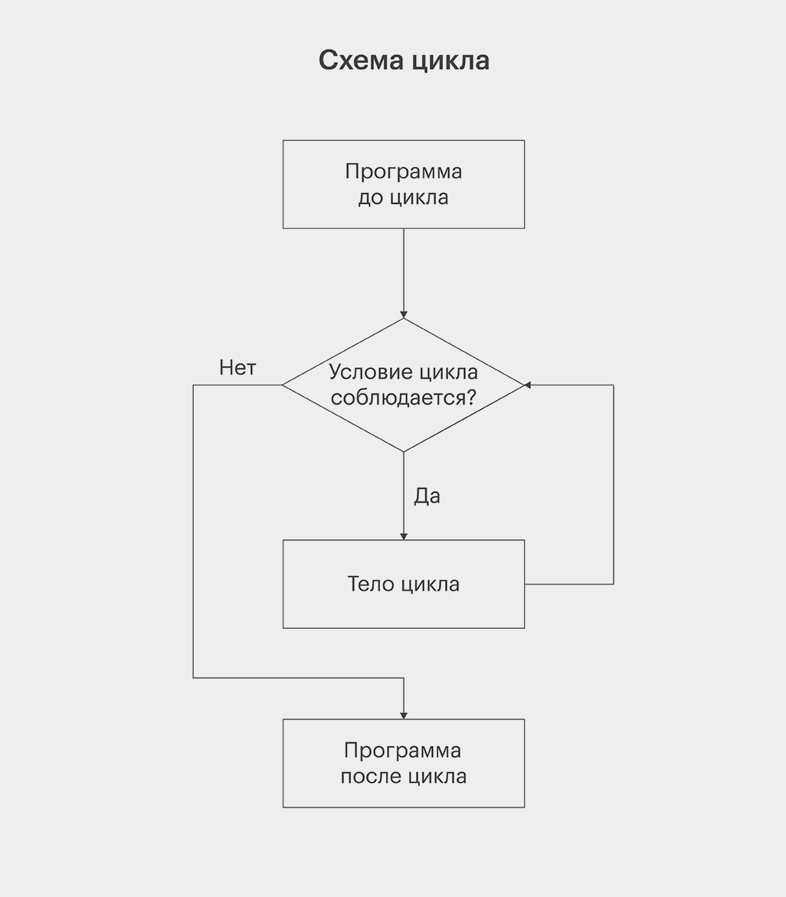

# Лекция 3. Циклы: `while`, `for` и повторение действий


## Что мы изучим сегодня?

На прошлой лекции мы разобрали логические значения, операторы сравнения, `and`, `or`, `not`, условия `if / elif / else` и базовую обработку ошибок через `try-except`. То есть программа уже умеет принимать решения.

Теперь добавим следующий важный механизм - повторение действий. В реальных программах часто нужно не просто выполнить код один раз, а повторять его: спрашивать данные у пользователя, выводить последовательность чисел, считать сумму, запускать раунды игры, показывать меню или обрабатывать набор значений.

Без циклов такой код пришлось бы писать вручную:

```python
print("Python")
print("Python")
print("Python")
print("Python")
print("Python")
```

Для пяти повторений это ещё терпимо. Но если повторений 100, 1000 или их количество зависит от пользователя, такой подход сразу становится плохим. Для повторяющихся действий в Python используются **циклы**.

---

## Понятие циклов и их необходимость


Обычно код выполняется последовательно: первая строка, затем вторая, затем третья.

```python
print("Шаг 1")
print("Шаг 2")
print("Шаг 3")
```

Результат:

```text
Шаг 1
Шаг 2
Шаг 3
```

Но многие задачи требуют вернуться к участку кода и выполнить его снова. Например, консольная программа с меню не должна завершаться после первого действия пользователя. Она должна выполнить выбранную команду и снова показать меню.

```text
1. Добавить задачу
2. Показать задачи
3. Удалить задачу
4. Выйти
```

Циклы позволяют программе работать не только “сверху вниз один раз”, а повторять нужный участок кода до определённого момента.

---

## Что такое цикл?

**Цикл** - это конструкция, которая повторяет блок кода. Причина повторения может быть разной: условие остаётся истинным, есть следующий элемент для обработки или программа ждёт определённого действия от пользователя.

Примеры задач, где нужны циклы:

- вывести числа от 1 до 100;
- посчитать сумму чисел;
- дать пользователю несколько попыток;
- повторять игру до победы или проигрыша;
- показывать меню до команды выхода;
- обработать каждый символ строки;
- в будущем - пройтись по списку товаров, задач или пользователей.

Главная идея простая: цикл убирает ручное дублирование кода и позволяет описать правило повторения один раз.

---

## Как устроен цикл?

Любой цикл можно рассматривать как повторяющийся процесс: программа проверяет, нужно ли продолжать, выполняет тело цикла и возвращается к началу. Если продолжать больше не нужно, цикл завершается.



**Тело цикла** - это код, который повторяется. В Python тело цикла, как и тело `if`, записывается с отступом.

У цикла обычно есть четыре важные части:

1. начальное состояние;
2. условие или источник значений;
3. тело цикла;
4. изменение состояния или переход к следующему значению.

Если цикл зависит от условия, нужно следить, чтобы это условие когда-нибудь стало ложным. Иначе программа может зациклиться.

---

## Итерация

**Итерация** - это один повтор цикла.

Если цикл выполнился 3 раза, значит было 3 итерации. Если 100 раз - 100 итераций.

Например, если программа три раза выводит `"Hello"`, можно описать это так:

```text
1-я итерация → вывести "Hello"
2-я итерация → вывести "Hello"
3-я итерация → вывести "Hello"
```

Результат:

```text
Hello
Hello
Hello
```

Это слово часто встречается в программировании, поэтому его лучше сразу связать с простой идеей: одна итерация - один проход цикла.

---

## Виды циклов в Python

В Python есть два основных вида циклов:

- `while`;
- `for`.

`while` используется, когда повторение зависит от условия. Такой цикл читается как “пока условие выполняется - повторяй код”.

`for` используется, когда нужно пройтись по значениям: числам в диапазоне, символам строки, элементам списка и другим объектам.

Коротко:

```text
while - повторяй, пока условие True
for   - повторяй для каждого значения
```

Сначала разберём `while`, потому что он ближе к уже знакомому `if`. После этого перейдём к `for` и `range()`.

---

## Цикл `while`

Цикл `while` выполняет блок кода, пока условие остаётся истинным.

```python
while условие:
    # тело цикла
```

По логике `while` похож на `if`, но `if` проверяет условие один раз, а `while` возвращается к проверке снова после каждой итерации.

```python
count = 1

while count <= 5:
    print(count)
    count += 1
```

Результат:

```text
1
2
3
4
5
```

Здесь `count` начинается с `1`. Пока `count <= 5`, программа выводит значение и увеличивает `count` на `1`. Когда `count` становится равен `6`, условие возвращает `False`, и цикл завершается.

---

## Как читать `while`

Разберём работу цикла по шагам:

```python
count = 1

while count <= 5:
    print(count)
    count += 1
```

Процесс выполнения:

```text
count = 1

1 <= 5 → True  → print(1) → count = 2
2 <= 5 → True  → print(2) → count = 3
3 <= 5 → True  → print(3) → count = 4
4 <= 5 → True  → print(4) → count = 5
5 <= 5 → True  → print(5) → count = 6
6 <= 5 → False → цикл завершается
```

Число `6` не выводится, потому что при `count = 6` условие уже ложное. Тело цикла не выполняется.

---

## Счётчик

В примере выше `count` - это **счётчик**.

Счётчик - это переменная, которая помогает управлять количеством повторений или двигаться от одного значения к другому.

```python
attempt = 1

while attempt <= 3:
    print("Попытка номер:", attempt)
    attempt += 1
```

Результат:

```text
Попытка номер: 1
Попытка номер: 2
Попытка номер: 3
```

Такой подход используется, когда нужно ограничить количество повторений: 3 попытки пароля, 5 раундов игры, 10 повторений действия.

---

## Оператор `+=`

В циклах часто используется запись:

```python
count += 1
```

Это сокращение от:

```python
count = count + 1
```

То есть мы берём текущее значение переменной, увеличиваем его на `1` и сохраняем обратно.

Похожие операторы:

```python
x -= 1   # x = x - 1
x *= 2   # x = x * 2
x /= 2   # x = x / 2
```

Для счётчиков чаще всего используется `+= 1`.

---

## Ошибка: переменная не меняется

Одна из частых ошибок при работе с `while` - забыть изменить переменную, от которой зависит условие.

```python
count = 1

while count <= 5:
    print(count)
```

Здесь `count` всегда остаётся равным `1`, поэтому условие `count <= 5` всегда истинное. Программа будет бесконечно выводить `1`.

Правильный вариант:

```python
count = 1

while count <= 5:
    print(count)
    count += 1
```

Если условие цикла зависит от переменной, эта переменная должна изменяться так, чтобы цикл мог завершиться.

---

## Пример: числа от 1 до 10

```python
number = 1

while number <= 10:
    print(number)
    number += 1
```

Результат:

```text
1
2
3
4
5
6
7
8
9
10
```

Здесь `number` увеличивается после каждой итерации. Когда значение становится `11`, условие `number <= 10` становится ложным.

---

## Пример: числа от 10 до 1

`while` можно использовать и для движения в обратную сторону.

```python
number = 10

while number >= 1:
    print(number)
    number -= 1
```

Результат:

```text
10
9
8
7
6
5
4
3
2
1
```

Здесь переменная уменьшается на `1` после каждой итерации.

---

## Накопитель

Циклы часто используют не только для вывода значений, но и для накопления результата.

```python
number = 1
total = 0

while number <= 5:
    total += number
    number += 1

print("Сумма:", total)
```

Результат:

```text
Сумма: 15
```

`number` отвечает за текущее число, а `total` - за накопленную сумму. На каждой итерации текущее число добавляется к `total`.

```text
1-я итерация: total = 0 + 1 → 1
2-я итерация: total = 1 + 2 → 3
3-я итерация: total = 3 + 3 → 6
4-я итерация: total = 6 + 4 → 10
5-я итерация: total = 10 + 5 → 15
```

**Накопитель** - это переменная, в которую постепенно собирается результат: сумма, количество очков, итоговая цена, количество правильных ответов и так далее.

---

## Пример: ввод пароля

`while` хорошо подходит для ситуаций, где количество повторений заранее неизвестно.

```python
password = ""

while password != "python123":
    password = input("Введите пароль: ")

print("Доступ разрешён!")
```

Цикл работает, пока `password != "python123"`. Как только пользователь вводит правильный пароль, условие становится ложным, и программа переходит к строке после цикла.

---

## Пример: пароль с ограничением попыток

Теперь добавим ограничение - только 3 попытки.

```python
correct_password = "python123"
attempts = 3
is_auth = False

while attempts > 0 and is_auth == False:
    password = input("Введите пароль: ")

    if password == correct_password:
        is_auth = True
        print("Доступ разрешён!")
    else:
        attempts -= 1
        print("Неверный пароль. Осталось попыток:", attempts)

if is_auth == False:
    print("Попытки закончились. Доступ запрещён.")
```

Цикл работает, пока есть попытки и пользователь ещё не авторизован. Если пароль верный, `is_auth` становится `True`. Если пароль неверный, количество попыток уменьшается.

Этот пример специально написан без `break`: сначала важно понять обычное завершение цикла через условие. Управление циклом через `break` разберём отдельно после `for`.

---

## Что важно запомнить про `while`

`while` используют, когда повторение зависит от условия. Он особенно удобен, если заранее неизвестно, сколько раз нужно выполнить код.

Главное правило: условие цикла должно когда-нибудь стать ложным. Если этого не произойдёт, цикл не завершится.

---

## Цикл `for`

Цикл `for` используется, когда нужно пройтись по значениям одно за другим. В отличие от `while`, где мы сами следим за условием и изменяем переменную, `for` получает значения из указанного источника автоматически.

Общий синтаксис:

```python
for переменная in источник_значений:
    # тело цикла
```

Переменная после `for` получает очередное значение из источника. После каждой итерации Python сам переходит к следующему значению. Когда значения заканчиваются, цикл завершается.

---

## `range()`

На первых этапах `for` чаще всего используют вместе с `range()`.

`range()` создаёт диапазон чисел:

```python
range(5)
```

Такой диапазон даёт:

```text
0, 1, 2, 3, 4
```

Правая граница в `range()` не включается. Поэтому `range(5)` даёт числа от `0` до `4`, а не от `0` до `5`.

Теперь используем `range()` в цикле:

```python
for number in range(5):
    print(number)
```

Результат:

```text
0
1
2
3
4
```

На каждой итерации `number` получает следующее значение из `range(5)`.

---

## `range(start, stop)`

Если нужно начать не с нуля, а с другого числа, в `range()` передают два аргумента.

```python
range(1, 6)
```

Диапазон:

```text
1, 2, 3, 4, 5
```

Пример:

```python
for number in range(1, 6):
    print(number)
```

Результат:

```text
1
2
3
4
5
```

Если нужно вывести числа от `1` до `10`, правую границу указываем как `11`:

```python
for number in range(1, 11):
    print(number)
```

---

## `range(start, stop, step)`

Третий аргумент задаёт шаг.

```python
range(1, 10, 2)
```

Диапазон:

```text
1, 3, 5, 7, 9
```

Пример:

```python
for number in range(1, 10, 2):
    print(number)
```

Результат:

```text
1
3
5
7
9
```

Для чётных чисел от `2` до `10`:

```python
for number in range(2, 11, 2):
    print(number)
```

Результат:

```text
2
4
6
8
10
```

---

## Обратный `range()`

Шаг может быть отрицательным.

```python
for number in range(10, 0, -1):
    print(number)
```

Результат:

```text
10
9
8
7
6
5
4
3
2
1
```

Цикл начинается с `10`, заканчивается перед `0` и на каждой итерации уменьшает число на `1`.

---

## Сравнение `while` и `for`

Одну и ту же задачу часто можно решить и через `while`, и через `for`.

Через `while`:

```python
number = 1

while number <= 5:
    print(number)
    number += 1
```

Через `for`:

```python
for number in range(1, 6):
    print(number)
```

`while` удобен, когда повторение зависит от условия. `for` удобен, когда есть готовый диапазон значений или понятное количество повторений.

Если задача звучит как “пока условие выполняется” - чаще подходит `while`.

Если задача звучит как “для каждого значения” - чаще подходит `for`.

---

## Пример: таблица умножения

Выведем таблицу умножения для числа, которое введёт пользователь.

```python
number = int(input("Введите число: "))

for i in range(1, 11):
    print(number, "*", i, "=", number * i)
```

Если пользователь введёт `5`, программа выведет:

```text
5 * 1 = 5
5 * 2 = 10
5 * 3 = 15
5 * 4 = 20
5 * 5 = 25
5 * 6 = 30
5 * 7 = 35
5 * 8 = 40
5 * 9 = 45
5 * 10 = 50
```

`i` принимает значения от `1` до `10`, а программа на каждой итерации умножает введённое число на текущее значение `i`.

---

## Пример: сумма чисел от `1` до `n`

```python
n = int(input("Введите число: "))

total = 0

for number in range(1, n + 1):
    total += number

print("Сумма:", total)
```

Если пользователь введёт `5`, цикл пройдёт по числам:

```text
1, 2, 3, 4, 5
```

И в `total` накопится сумма:

```text
15
```

Здесь используется `range(1, n + 1)`, потому что число `n` должно попасть в диапазон.

---

## Перебор строки

`for` может проходить не только по числам из `range()`, но и по строке. Строка состоит из символов, и цикл может получить каждый символ отдельно.

```python
word = "Python"

for char in word:
    print(char)
```

Результат:

```text
P
y
t
h
o
n
```

На каждой итерации `char` получает следующий символ строки.

---

## Пример: подсчёт символов

Посчитаем, сколько раз буква `"a"` встречается в слове `"banana"`.

```python
word = "banana"
count = 0

for char in word:
    if char == "a":
        count += 1

print("Количество букв a:", count)
```

Результат:

```text
Количество букв a: 3
```

Цикл проходит по каждому символу строки. Если символ равен `"a"`, счётчик увеличивается на `1`.

---

## Взгляд вперёд: `for` со списком

Списки подробно разберём на следующей лекции, но уже сейчас можно увидеть, что `for` работает не только с числами и строками.

```python
products = ["Хлеб", "Молоко", "Сыр"]

for product in products:
    print(product)
```

Результат:

```text
Хлеб
Молоко
Сыр
```

Пока достаточно понимать список как набор значений. Индексы, методы списков, изменение элементов и `list comprehension` разберём отдельно.

---

## Что важно запомнить про `for`

`for` нужен для перебора значений. В этой лекции главный источник значений для нас - `range()`, потому что он позволяет создавать числовые диапазоны и выполнять код нужное количество раз.

Главное отличие от `while`: в `for` Python сам берёт следующее значение из источника, поэтому нам не нужно вручную менять переменную цикла через `+= 1`.

---

## Управление циклом: `break` и `continue`

Обычно цикл завершается естественно: у `while` условие становится ложным, у `for` заканчиваются значения. Но иногда нужно повлиять на выполнение цикла вручную.

Для этого в Python есть два оператора:

- `break` - полностью завершает цикл;
- `continue` - пропускает текущую итерацию и переходит к следующей.

Эти операторы работают и с `while`, и с `for`.

---

## Оператор `break`

`break` завершает ближайший цикл.

```python
for number in range(1, 11):
    if number == 5:
        break

    print(number)
```

Результат:

```text
1
2
3
4
```

Когда `number` становится равен `5`, выполняется `break`, и цикл завершается. Число `5` не выводится, потому что `break` находится до `print()`.

`break` удобно использовать, когда нужный результат найден и продолжать цикл больше нет смысла.

---

## Пример: поиск числа

```python
target = 7

for number in range(1, 11):
    if number == target:
        print("Число найдено:", number)
        break
```

Как только программа находит нужное число, цикл завершается. Без `break` цикл продолжил бы идти дальше, хотя задача уже решена.

---

## Пароль с `break`

Теперь можно переписать пример с паролем короче.

```python
correct_password = "python123"
attempts = 3

while attempts > 0:
    password = input("Введите пароль: ")

    if password == correct_password:
        print("Доступ разрешён!")
        break

    attempts -= 1
    print("Неверный пароль. Осталось попыток:", attempts)
```

Здесь `break` используется для выхода из цикла после успешной авторизации. Это чище, чем держать отдельную переменную `is_auth`, если дополнительное состояние не нужно.

---

## Оператор `continue`

`continue` не завершает цикл полностью. Он пропускает текущую итерацию и сразу переходит к следующей.

```python
for number in range(1, 6):
    if number == 3:
        continue

    print(number)
```

Результат:

```text
1
2
4
5
```

Когда `number` равен `3`, выполняется `continue`, поэтому `print(number)` пропускается. После этого цикл продолжает работу со следующим значением.

---

## Пример: пропустить отрицательные числа

```python
numbers = [10, -3, 5, -1, 8]

for number in numbers:
    if number < 0:
        continue

    print(number)
```

Результат:

```text
10
5
8
```

Списки будут темой следующей лекции, но саму идею понять можно уже сейчас: отрицательные числа пропускаются, остальные выводятся.

---

## `break` и `continue`: коротко

```text
break    → остановить цикл полностью
continue → пропустить текущую итерацию
```

Оба оператора стоит использовать аккуратно. Если ими злоупотреблять, код становится сложнее читать. Но в задачах поиска, фильтрации, меню и игр они часто делают код проще.

---

## Вложенные циклы

Вложенный цикл - это цикл внутри другого цикла.

```python
for i in range(1, 4):
    for j in range(1, 4):
        print(i, "*", j, "=", i * j)
```

Результат:

```text
1 * 1 = 1
1 * 2 = 2
1 * 3 = 3
2 * 1 = 2
2 * 2 = 4
2 * 3 = 6
3 * 1 = 3
3 * 2 = 6
3 * 3 = 9
```

На каждой итерации внешнего цикла внутренний цикл запускается полностью. Поэтому при трёх значениях `i` и трёх значениях `j` всего будет 9 комбинаций.

Вложенные циклы часто используются для таблиц, координат, игровых полей, матриц и генерации комбинаций.

---

## Пример: простая таблица

```python
for row in range(1, 4):
    for col in range(1, 4):
        print(row, col)
```

Результат:

```text
1 1
1 2
1 3
2 1
2 2
2 3
3 1
3 2
3 3
```

Здесь `row` отвечает за строку, а `col` - за колонку.

---

## Бесконечные циклы

Бесконечный цикл - это цикл, который не завершается сам. Иногда это ошибка, а иногда нормальный инструмент.

Ошибка:

```python
count = 1

while count <= 5:
    print(count)
```

Здесь `count` не меняется, поэтому условие всегда остаётся истинным.

Но бесконечный цикл может быть создан намеренно:

```python
while True:
    command = input("Введите команду: ")

    if command == "exit":
        break

    print("Вы ввели:", command)
```

Такой подход часто используется в меню, играх, ботах и серверах. Условие `while True` делает цикл бесконечным, а `break` задаёт точку выхода.

---

## Пример: меню программы

```python
while True:
    print("1. Сказать привет")
    print("2. Показать версию")
    print("3. Выйти")

    command = input("Выберите действие: ")

    if command == "1":
        print("Привет!")
    elif command == "2":
        print("Версия 1.0")
    elif command == "3":
        print("Выход из программы")
        break
    else:
        print("Неизвестная команда")
```

Такой цикл показывает меню до тех пор, пока пользователь не выберет пункт выхода.

---

## `else` у цикла

В Python у циклов может быть блок `else`. Он выполняется, если цикл завершился естественно, без `break`.

```python
for number in range(1, 6):
    if number == 10:
        print("Нашли")
        break
else:
    print("Не нашли")
```

Результат:

```text
Не нашли
```

Число `10` не встретилось, `break` не сработал, поэтому выполнился блок `else`.

Эта конструкция используется не каждый день, но её полезно знать: она удобна в задачах поиска.

---

## Практика: игра “Угадай число”

Теперь соберём несколько тем вместе: `while`, `input`, `int`, `if / elif / else`, счётчик попыток и `break`.

```python
secret_number = 7
attempts = 3

while attempts > 0:
    user_number = int(input("Угадайте число от 1 до 10: "))

    if user_number == secret_number:
        print("Вы угадали!")
        break
    elif user_number < secret_number:
        print("Загаданное число больше")
    else:
        print("Загаданное число меньше")

    attempts -= 1
    print("Осталось попыток:", attempts)
```

---

## AI-помощник при изучении циклов

AI можно использовать для проверки понимания, но не для бездумного получения готового решения.

Плохой запрос:

```text
Напиши мне игру угадай число.
```

Лучше:

```text
Я изучаю циклы while в Python. Вот мой код. Он работает неправильно. Не пиши решение полностью, а объясни, где нарушена логика остановки цикла.
```

Ещё хороший вариант:

```text
Объясни по шагам, какие значения принимает переменная number в этом цикле for.
```

Или:

```text
Придумай 5 тестовых вводов для моей игры “Угадай число”, но не исправляй мой код.
```

Такой подход помогает учиться, а не просто копировать готовый ответ.

---

## Практические задания

### Базовый уровень

1. Вывести числа от `1` до `10` через `while`.
2. Вывести числа от `1` до `10` через `for`.
3. Вывести числа от `10` до `1`.
4. Вывести чётные числа от `2` до `20`.
5. Вывести таблицу умножения для числа, которое вводит пользователь.

### Средний уровень

1. Посчитать сумму чисел от `1` до `n`.
2. Посчитать произведение чисел от `1` до `n`.
3. Посчитать количество букв `"a"` в строке.
4. Сделать ввод пароля с тремя попытками.
5. Сделать меню программы, которое работает до команды `exit`.

### Сложнее

1. Написать игру “Угадай число”.
2. Добавить в игру обработку ошибки ввода через `try-except`.
3. Вывести таблицу умножения от `1` до `10`.
4. Найти первое число от `1` до `100`, которое делится на `7` и `13`.
5. Посчитать факториал числа.

---

## Итоги

На этой лекции мы разобрали два основных вида циклов в Python.

`while` используется, когда повторение зависит от условия. Он удобен для пользовательского ввода, меню, игр и ситуаций, где заранее неизвестно количество повторений.

`for` используется для перебора значений. В этой лекции мы работали с `range()`, строками и коротко посмотрели на списки.

Также мы разобрали счётчик, накопитель, `break`, `continue`, вложенные циклы, бесконечные циклы и простую игровую практику.

Главная мысль: циклы позволяют программе не просто выполнить код один раз, а работать с повторяющимися действиями. Без них невозможно нормально писать меню, игры, обработку данных, работу со списками, файлами и пользовательским вводом.

## Домашнее задание

1. Запросите у пользователя число `n` и выведите все числа от `1` до `n`.

2. Запросите у пользователя число `n` и выведите все чётные числа от `1` до `n`.

3. Запросите у пользователя число `n` и найдите сумму всех чисел от `1` до `n`.

4. Запросите у пользователя число и выведите таблицу умножения для этого числа от `1` до `10`.

5. Запросите у пользователя слово и выведите каждый символ этого слова на новой строке.

6. Запросите у пользователя слово и посчитайте, сколько раз в нём встречается буква `a`.

7. Запросите у пользователя числа до тех пор, пока он не введёт `0`. После этого выведите сумму всех введённых чисел.

8. Напишите программу проверки пароля. У пользователя есть 3 попытки. Если пароль введён правильно, программа выводит `Доступ разрешён`. Если попытки закончились, программа выводит `Доступ запрещён`.

9. Напишите игру “Угадай число”. Программа загадывает число от `1` до `20`, а пользователь пытается его угадать. После каждой попытки программа подсказывает: загаданное число больше или меньше.

10. Запросите у пользователя высоту треугольника и выведите треугольник из символов `*`. Например, для высоты `5`:

```text
*
**
***
****
*****
```