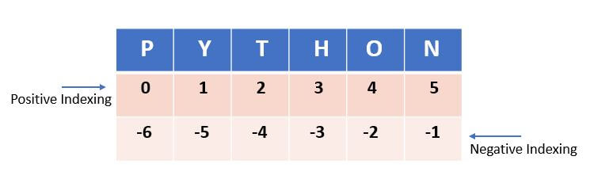
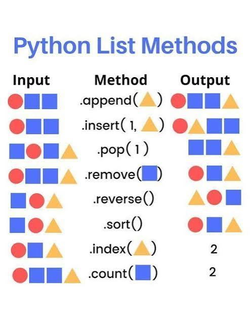
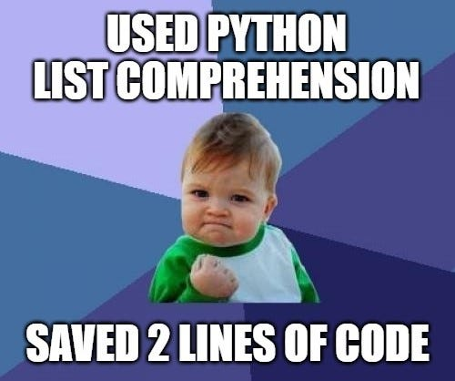

# Лекция 4. Списки: индексы, методы, срезы и list comprehension


## Что мы изучим сегодня?

На прошлой лекции мы разобрали циклы `while` и `for`, научились повторять действия, работать со счётчиками, накопителями, `break`, `continue` и простыми бесконечными циклами.

Теперь нам нужно перейти к следующей важной теме - хранению большого количества данных.

До этого момента мы в основном работали с отдельными переменными:

```python
name = "Anna"
age = 25
city = "Prague"
```

Такой подход подходит, если значений немного. Но в реальных программах почти всегда приходится работать с наборами данных: списком студентов, товарами в корзине, оценками пользователя, задачами в приложении, сообщениями в чате или результатами поиска.

Для таких случаев в Python есть **списки**.

На этой лекции мы разберём:

- зачем нужны списки;
- как создавать списки;
- как получать элементы по индексу;
- как изменять элементы списка;
- как перебирать список через `for`;
- какие основные методы есть у списков;
- как удалять, добавлять, искать и сортировать элементы;
- что такое срезы;
- как создавать новые списки через `list comprehension`.

Главная цель лекции - научиться работать не с одной переменной, а с набором значений.

---

## Зачем нужны списки?

Представим, что нужно сохранить имена трёх студентов:

```python
student_1 = "Anna"
student_2 = "Bob"
student_3 = "Tom"
```

Пока студентов всего трое, такой код ещё можно читать. Но если студентов станет 20, 50 или 100, подход с отдельной переменной для каждого значения быстро станет неудобным.

Например:

```python
student_1 = "Anna"
student_2 = "Bob"
student_3 = "Tom"
student_4 = "Kate"
student_5 = "Alex"
student_6 = "Maria"
student_7 = "John"
student_8 = "Eva"
```

Проблема не только в количестве строк. С такими переменными сложно работать программно. Мы не можем удобно пройтись по всем студентам циклом, быстро добавить нового студента, удалить лишнего, посчитать количество студентов или отсортировать их.

Для таких задач нужен один объект, который хранит сразу несколько значений.

```python
students = ["Anna", "Bob", "Tom", "Kate", "Alex", "Maria", "John", "Eva"]
```

Такая структура называется **список**. Она позволяет хранить сразу несколько значений в одном объекте, а Python предоставляет удобные инструменты для работы с ними.

---

## Что такое список?

**Список** - это упорядоченная коллекция элементов.  Это специальный тип данных `list`, который позволяет хранить сразу несколько значений в одном объекте.

Слово *“упорядоченная”* означает, что элементы хранятся в определённом порядке. Если мы создали список:

```python
students = ["Anna", "Bob", "Tom"]
```

то `"Anna"` находится первой, `"Bob"` - вторым, `"Tom"` - третьим. Python сохраняет этот порядок.

Список создаётся с помощью квадратных скобок `[]`, а элементы внутри списка разделяются запятыми.

```python
numbers = [1, 2, 3, 4, 5]

words = ["яблоко", "банан", "апельсин"]
```

Список может хранить данные разных типов:

```python
mixed_list = [42, "hello", 3.14, True]
```

Технически Python позволяет хранить в одном списке разные типы данных. Но на практике чаще всего список содержит однотипные значения: список чисел, список строк, список товаров, список задач и так далее. Такой список легче читать и обрабатывать.

---

## Создание списка

Создать список можно сразу с готовыми значениями:

```python
products = ["Хлеб", "Молоко", "Сыр"]
```

Можно создать список чисел:

```python
prices = [100, 250, 75, 300]
```

Можно создать список логических значений:

```python
answers = [True, False, True, True]
```

Можно создать пустой список:

```python
tasks = []
```

Пустой список используют, когда данных пока нет, но они появятся позже. Например, пользователь будет добавлять задачи, товары в корзину или оценки студента.

---

## Список внутри списка

Список может хранить не только числа, строки и булевые значения, но и другие списки.

```python
matrix = [
    [1, 2, 3],
    [4, 5, 6],
    [7, 8, 9]
]
```

Такую структуру можно представить как таблицу: внешний список хранит строки, а каждый внутренний список хранит значения внутри строки.

Пока мы не будем глубоко разбирать вложенные списки. Они понадобятся позже, когда будем говорить о таблицах, матрицах, данных из файлов и более сложных структурах.

На этой лекции основной фокус - обычные одномерные списки.

---

## Где списки используются в реальных программах?

Списки встречаются практически везде, где есть набор данных.

Например, в интернет-магазине список может хранить товары в корзине:

```python
cart = ["Ноутбук", "Мышка", "Клавиатура"]
```

В учебном приложении список может хранить оценки:

```python
grades = [10, 8, 12, 9, 11]
```

В планировщике задач список может хранить задачи пользователя:

```python
tasks = ["Купить продукты", "Сделать домашку", "Позвонить клиенту"]
```

В игре список может хранить инвентарь персонажа:

```python
inventory = ["меч", "зелье", "ключ"]
```

Главная идея: список нужен, когда у нас есть не одно значение, а набор связанных значений, с которыми нужно работать как с единым объектом.

---

## Индексы и работа с элементами списка



Когда список уже создан, нам нужно уметь обращаться к его элементам: получать конкретное значение, изменять его, проверять наличие элемента и понимать, какие ошибки могут возникнуть при работе с индексами.

Возьмём список:

```python
fruits = ["яблоко", "банан", "апельсин"]
```

В этом списке три элемента. Каждый элемент имеет свою позицию, и к этой позиции можно обратиться по индексу.

---

### Индексация начинается с нуля

В Python индексация начинается с `0`.

Это значит, что первый элемент списка имеет индекс `0`, второй - индекс `1`, третий - индекс `2`.

```text
список:  ["яблоко", "банан", "апельсин"]
индексы:     0        1          2
```

Поэтому для списка:

```python
fruits = ["яблоко", "банан", "апельсин"]
```

индексы будут такими:

```text
fruits[0] → "яблоко"
fruits[1] → "банан"
fruits[2] → "апельсин"
```

Это правило важно запомнить сразу. Если в списке три элемента, последним индексом будет не `3`, а `2`.

---

### Получение элемента по индексу

Чтобы получить элемент списка, нужно указать имя списка и индекс элемента в квадратных скобках.

```python
fruits = ["яблоко", "банан", "апельсин"]

print(fruits[0])
print(fruits[1])
print(fruits[2])
```

Результат:

```text
яблоко
банан
апельсин
```

Такой способ используется, когда нам нужен конкретный элемент списка.

Например, можно сохранить значение в отдельную переменную:

```python
first_fruit = fruits[0]

print(first_fruit)
```

Результат:

```text
яблоко
```

Индекс - это не сам элемент, а его позиция внутри списка.

При вложенных списках индексы работают так же, но нужно указывать индекс для каждого уровня вложенности.

```python
matrix = [
    [1, 2, 3],
    [4, 5, 6],
    [7, 8, 9]
]

print(matrix[0][1])  # 2
```

Вложенный список `matrix[0]` - это первый внутренний список `[1, 2, 3]`. А `matrix[0][1]` - это второй элемент этого внутреннего списка, то есть `2`.

>> Вложенность может быть любой, но на практике чаще всего встречаются одномерные и двумерные списки. Очень редко встречаются трёхмерные и более сложные структуры.
>>

---

### Отрицательные индексы

В Python можно обращаться к элементам списка с конца. Для этого используются отрицательные индексы.

```python
fruits = ["яблоко", "банан", "апельсин"]

print(fruits[-1])
print(fruits[-2])
print(fruits[-3])
```

Результат:

```text
апельсин
банан
яблоко
```

Индекс `-1` всегда означает последний элемент списка, `-2` - предпоследний, `-3` - третий с конца.

```text
список:  ["яблоко", "банан", "апельсин"]
индексы:     0        1          2
с конца:    -3       -2         -1
```

Отрицательные индексы удобны, когда нужно быстро получить последний элемент, не считая длину списка вручную.

```python
last_fruit = fruits[-1]

print(last_fruit)
```

Результат:

```text
апельсин
```

---

### Изменение элемента списка

Списки в Python можно изменять. Это значит, что мы можем заменить элемент по индексу.

```python
fruits = ["яблоко", "банан", "апельсин"]

fruits[1] = "груша"

print(fruits)
```

Результат:

```text
['яблоко', 'груша', 'апельсин']
```

В этом примере элемент с индексом `1` был заменён. Раньше на этой позиции был `"банан"`, теперь - `"груша"`.

Можно изменить первый элемент:

```python
fruits[0] = "киви"

print(fruits)
```

Результат:

```text
['киви', 'груша', 'апельсин']
```

Это важное свойство списка: список является изменяемым объектом. В дальнейшем мы будем не только изменять элементы, но и добавлять новые, удалять старые, сортировать список и очищать его.

---

### Длина списка: `len()`

Функция `len()` возвращает количество элементов в списке.

```python
fruits = ["яблоко", "банан", "апельсин"]

print(len(fruits))
```

Результат:

```text
3
```

Если список пустой, его длина равна `0`.

```python
tasks = []

print(len(tasks))
```

Результат:

```text
0
```

`len()` часто используют, когда нужно проверить, сколько элементов хранится в списке.

```python
products = ["Хлеб", "Молоко", "Сыр", "Яйца"]

print("Количество товаров:", len(products))
```

Результат:

```text
Количество товаров: 4
```

Важно не путать длину списка и последний индекс. Если длина списка равна `3`, индексы будут `0`, `1`, `2`.

```python
fruits = ["яблоко", "банан", "апельсин"]

print(len(fruits))   # 3
print(fruits[2])     # апельсин
```

Последний индекс можно получить так:

```python
last_index = len(fruits) - 1

print(last_index)
print(fruits[last_index])
```

Результат:

```text
2
апельсин
```

На практике для получения последнего элемента чаще используют отрицательный индекс:

```python
print(fruits[-1])
```

---

## Полезные функции для списков

Некоторые задачи со списками встречаются очень часто: посчитать количество элементов, найти сумму, минимальное или максимальное значение.Для этого в Python есть встроенные функции.

```python
grades = [10, 8, 12, 7, 9]

print(len(grades))
print(sum(grades))
print(max(grades))
print(min(grades))
```

Результат:

```text
5
46
12
7
```

`len()` возвращает количество элементов в списке.

`sum()` считает сумму элементов списка.

`max()` возвращает самое большое значение.

`min()` возвращает самое маленькое значение.

Среднее значение можно посчитать так:

```python
grades = [10, 8, 12, 7, 9]

average = sum(grades) / len(grades)

print(average)
```

Результат:

```text
9.2
```

Эти функции особенно полезны при работе с числовыми списками: оценками, ценами, баллами, статистикой и результатами.

### Проверка наличия элемента: `in`

Оператор `in` позволяет проверить, есть ли элемент в списке.

```python
fruits = ["яблоко", "банан", "апельсин"]

print("банан" in fruits)
print("киви" in fruits)
```

Результат:

```text
True
False
```

`in` возвращает логическое значение: `True`, если элемент найден, и `False`, если элемента нет.

Чаще всего `in` используют вместе с условием `if`.

```python
fruits = ["яблоко", "банан", "апельсин"]

fruit = input("Введите фрукт: ")

if fruit in fruits:
    print("Такой фрукт есть в списке")
else:
    print("Такого фрукта нет в списке")
```

Можно проверить и обратную ситуацию через `not in`.

```python
if fruit not in fruits:
    print("Фрукт не найден")
```

Оператор `in` проверяет наличие конкретного значения, а не индекса.

---

### Ошибка `IndexError`

Если обратиться к индексу, которого нет в списке, Python выдаст ошибку `IndexError`.

```python
fruits = ["яблоко", "банан", "апельсин"]

print(fruits[5])
```

Ошибка:

```text
IndexError: list index out of range
```

В списке всего три элемента, значит доступны индексы `0`, `1`, `2`. Индекса `5` не существует.

Такая же ошибка будет, если попробовать обратиться к элементу пустого списка.

```python
tasks = []

print(tasks[0])
```

Ошибка:

```text
IndexError: list index out of range
```

Чтобы избежать такой ошибки, можно сначала проверить длину списка.

```python
tasks = []

if len(tasks) > 0:
    print(tasks[0])
else:
    print("Список пустой")
```

Или, если нужно получить последний элемент, можно проверить список перед обращением:

```python
fruits = []

if len(fruits) > 0:
    print(fruits[-1])
else:
    print("В списке нет элементов")
```

Ошибка `IndexError` - одна из самых частых ошибок при работе со списками. Обычно она означает, что программа пытается получить элемент по позиции, которой в списке нет.

---

## Операции со списками

Со списками можно выполнять базовые операции: объединять их, дублировать и использовать часть поведения, которое уже знакомо нам по строкам.

Важно понимать: операции со списками работают не с отдельными элементами, а со всей коллекцией.

---

### Сложение списков

Списки можно складывать с помощью оператора `+`. В этом случае Python создаёт новый список, в котором сначала идут элементы первого списка, а затем элементы второго.

```python
list_1 = [1, 2, 3]
list_2 = [4, 5, 6]

result = list_1 + list_2

print(result)
```

Результат:

```text
[1, 2, 3, 4, 5, 6]
```

Оператор `+` не складывает элементы математически. Он именно объединяет два списка.

Например:

```python
numbers_1 = [10, 20]
numbers_2 = [30, 40]

print(numbers_1 + numbers_2)
```

Результат:

```text
[10, 20, 30, 40]
```

А не:

```text
[40, 60]
```

Это важно: сложение списков - это конкатенация, то есть соединение коллекций. Такой приём можно использовать, когда нужно объединить два набора данных.

```python
frontend_students = ["Anna", "Bob"]
backend_students = ["Tom", "Kate"]

all_students = frontend_students + backend_students

print(all_students)
```

Результат:

```text
['Anna', 'Bob', 'Tom', 'Kate']
```

---

### Умножение списка

Список можно умножить на целое число.

```python
numbers = [1, 2]

result = numbers * 3

print(result)
```

Результат:

```text
[1, 2, 1, 2, 1, 2]
```

Умножение списка означает повторение его элементов указанное количество раз.

Например:

```python
line = ["-"] * 10

print(line)
```

Результат:

```text
['-', '-', '-', '-', '-', '-', '-', '-', '-', '-']
```

Такой приём иногда используют, когда нужно быстро создать список с одинаковыми значениями.

```python
scores = [0] * 5

print(scores)
```

Результат:

```text
[0, 0, 0, 0, 0]
```

Например, такой список можно использовать как стартовые значения для очков, попыток или статистики.

---

### Список и строка: что общего?

Списки и строки в Python похожи тем, что оба типа данных являются упорядоченными коллекциями. Строка - это последовательность символов.

```python
word = "Python"
```

Список - это последовательность элементов.

```python
letters = ["P", "y", "t", "h", "o", "n"]
```

И со строкой, и со списком можно работать через индексы.

```python
word = "Python"

print(word[0])
print(word[-1])
```

Результат:

```text
P
n
```

Со списком работает так же:

```python
letters = ["P", "y", "t", "h", "o", "n"]

print(letters[0])
print(letters[-1])
```

Результат:

```text
P
n
```

Также и строки, и списки можно перебирать через цикл `for`.

```python
word = "Python"

for char in word:
    print(char)
```

```python
letters = ["P", "y", "t", "h", "o", "n"]

for letter in letters:
    print(letter)
```

В обоих случаях цикл проходит по элементам коллекции слева направо.

Также для строк и списков работает `len()`.

```python
word = "Python"
letters = ["P", "y", "t", "h", "o", "n"]

print(len(word))
print(len(letters))
```

Результат:

```text
6
6
```

---

### Главное отличие списка от строки

Главное отличие в том, что список можно изменять, а строку нельзя.

Список является изменяемым объектом:

```python
letters = ["P", "y", "t", "h", "o", "n"]

letters[0] = "J"

print(letters)
```

Результат:

```text
['J', 'y', 't', 'h', 'o', 'n']
```

Мы заменили первый элемент списка, и Python это разрешил.

Со строкой такой код не сработает:

```python
word = "Python"

word[0] = "J"
```

Ошибка:

```text
TypeError: 'str' object does not support item assignment
```

Строки в Python неизменяемые. Если нужно получить новую строку, мы не изменяем старую, а создаём новую.

```python
word = "Python"

new_word = "J" + word[1:]

print(new_word)
```

Вывод:

```text
Jython
```

---

## Перебор списка через `for`

На прошлой лекции мы уже разобрали цикл `for`. Теперь становится понятнее, зачем он нужен на практике: чаще всего `for` используют именно для перебора коллекций.

Список хранит несколько значений, а цикл `for` позволяет пройтись по каждому элементу списка и выполнить с ним какое-то действие.

Возьмём список товаров:

```python
products = ["Хлеб", "Молоко", "Сыр", "Яйца"]
```

Если нужно вывести каждый товар, можно использовать цикл:

```python
products = ["Хлеб", "Молоко", "Сыр", "Яйца"]

for product in products:
    print(product)
```

Результат:

```text
Хлеб
Молоко
Сыр
Яйца
```

На каждой итерации переменная `product` получает следующий элемент списка. Сначала `"Хлеб"`, потом `"Молоко"`, затем `"Сыр"` и `"Яйца"`.

---

### Перебор по значениям

Самый частый способ перебора списка - перебор по значениям.

```python
students = ["Anna", "Bob", "Tom"]

for student in students:
    print(student)
```

Результат:

```text
Anna
Bob
Tom
```

Такой вариант подходит, когда нам нужно просто получить каждый элемент списка и что-то с ним сделать: вывести, проверить, использовать в вычислении или добавить в другой список.

Например, можно вывести сообщение для каждого студента:

```python
students = ["Anna", "Bob", "Tom"]

for student in students:
    print("Студент:", student)
```

Результат:

```text
Студент: Anna
Студент: Bob
Студент: Tom
```

---

### Перебор с условием

Внутри цикла можно использовать условия.

Например, выведем только товары дороже `100`.

```python
prices = [50, 120, 80, 300, 40]

for price in prices:
    if price > 100:
        print(price)
```

Результат:

```text
120
300
```

Цикл проходит по всем ценам, а условие `if price > 100` решает, какие значения нужно вывести.

Ещё пример: посчитаем, сколько оценок выше `8`.

```python
grades = [10, 7, 12, 8, 9, 6]

count = 0

for grade in grades:
    if grade > 8:
        count += 1

print("Оценок выше 8:", count)
```

Результат:

```text
Оценок выше 8: 3
```

Здесь используется счётчик `count`. Он увеличивается только тогда, когда текущая оценка больше `8`.

---

### Перебор и накопитель

Цикл `for` часто используют вместе с накопителем.

Например, посчитаем общую сумму товаров:

```python
prices = [100, 250, 75, 300]

total = 0

for price in prices:
    total += price

print("Общая сумма:", total)
```

Результат:

```text
Общая сумма: 725
```

На каждой итерации текущая цена добавляется к переменной `total`.

Такой подход часто используется для подсчёта суммы, количества очков, общей стоимости заказа или статистики.

---

### Перебор по индексам

Иногда нам нужен не только сам элемент, но и его индекс. Для этого можно использовать `range()` и `len()` вместе.

```python
products = ["Хлеб", "Молоко", "Сыр"]

for index in range(len(products)):
    print(index, products[index])
```

Результат:

```text
0 Хлеб
1 Молоко
2 Сыр
```

Разберём идею:

```python
len(products)
```

возвращает количество элементов в списке:

```text
3
```

А:

```python
range(len(products))
```

в этом случае даёт индексы:

```text
0, 1, 2
```

Поэтому внутри цикла мы можем обращаться к элементам так:

```python
products[index]
```

---

### Когда нужен перебор по индексам?

Перебор по значениям проще и читается лучше:

```python
for product in products:
    print(product)
```

Но перебор по индексам нужен, когда нам важно знать позицию элемента или изменить элемент списка.

Например, пронумеруем товары:

```python
products = ["Хлеб", "Молоко", "Сыр"]

for index in range(len(products)):
    print(index + 1, products[index])
```

Результат:

```text
1 Хлеб
2 Молоко
3 Сыр
```

Здесь мы используем `index + 1`, потому что пользователю удобнее видеть нумерацию с единицы, хотя реальные индексы в Python начинаются с нуля.

---

### Изменение элементов через цикл

Если нужно изменить элементы списка, часто используют перебор по индексам.

Например, увеличим каждую цену на `10`.

```python
prices = [100, 200, 300]

for index in range(len(prices)):
    prices[index] += 10

print(prices)
```

Результат:

```text
[110, 210, 310]
```

Здесь мы не просто читаем значения, а изменяем элементы списка по их индексам.

Если бы мы написали так:

```python
prices = [100, 200, 300]

for price in prices:
    price += 10

print(prices)
```

Результат остался бы прежним:

```text
[100, 200, 300]
```

Переменная `price` получает значение элемента, но изменение этой переменной не заменяет элемент внутри списка. Поэтому для изменения списка нужен доступ по индексу.

---

### Перебор через `enumerate()`

В Python есть удобная функция `enumerate()`, которая позволяет получать и индекс, и значение одновременно.

```python
products = ["Хлеб", "Молоко", "Сыр"]

for index, product in enumerate(products):
    print(index, product)
```

Результат:

```text
0 Хлеб
1 Молоко
2 Сыр
```

Если нужна нумерация с единицы, можно использовать параметр `start`.

```python
products = ["Хлеб", "Молоко", "Сыр"]

for index, product in enumerate(products, start=1):
    print(index, product)
```

Результат:

```text
1 Хлеб
2 Молоко
3 Сыр
```

`enumerate()` часто удобнее, чем `range(len(...))`, когда нужно одновременно работать и с номером элемента, и с самим значением.

---

### Практический пример: список покупок

Создадим список покупок и выведем его в удобном формате.

```python
shopping_list = ["Хлеб", "Молоко", "Яйца", "Сыр"]

print("Список покупок:")

for index, product in enumerate(shopping_list, start=1):
    print(index, product)
```

Результат:

```text
Список покупок:
1 Хлеб
2 Молоко
3 Яйца
4 Сыр
```

Такой формат уже ближе к реальным консольным программам: пользователь видит не просто набор значений, а аккуратно пронумерованный список.

---

## Методы списков



До этого мы работали со списками через индексы, операторы и цикл `for`. Но у списков есть и собственные инструменты - **методы**. Подробно прочитать про методы можно [тут](https://www.w3schools.com/python/python_lists_methods.asp).

**Метод** - это действие, которое можно выполнить с объектом. Метод вызывается через точку:

```python
object.method()
```

Например, если у нас есть список:

```python
tasks = ["Повторить циклы", "Выучить списки"]
```

мы можем вызвать у него метод:

```python
tasks.append("Сделать домашку")
```

Методы списков позволяют добавлять элементы, удалять их, искать значения, считать повторения, сортировать список и изменять порядок элементов.

---

### Добавление элементов

Чаще всего список изменяется во время работы программы: пользователь добавляет товары в корзину, задачи в список дел, оценки в журнал или сообщения в чат.

Для добавления элементов в список используются методы:

- `append()` - добавляет элемент в конец списка;
- `insert()` - вставляет элемент на конкретную позицию;
- `extend()` - добавляет в список элементы из другой коллекции.

---

### `append()`

Метод `append()` добавляет один элемент в конец списка.

```python
products = ["Хлеб", "Молоко"]

products.append("Сыр")

print(products)
```

Результат:

```text
['Хлеб', 'Молоко', 'Сыр']
```

Этот метод часто используют, когда список создаётся постепенно.

```python
tasks = []

tasks.append("Повторить циклы")
tasks.append("Выучить списки")
tasks.append("Сделать домашку")

print(tasks)
```

Результат:

```text
['Повторить циклы', 'Выучить списки', 'Сделать домашку']
```

Важно: `append()` добавляет элемент именно в конец списка.

Если попытаться добавить список через `append()`, он добавится как один элемент.

```python
products = ["Хлеб", "Молоко"]
products.append(["Сыр", "Яйца"])

print(products)
```

Результат:

```text
['Хлеб', 'Молоко', ['Сыр', 'Яйца']]
```

Для добавления нескольких элементов из другого списка используют метод `extend()`, который мы разберём ниже.

---

### `insert()`

Метод `insert()` вставляет элемент на конкретную позицию.

```python
products = ["Хлеб", "Сыр"]

products.insert(1, "Молоко")

print(products)
```

Результат:

```text
['Хлеб', 'Молоко', 'Сыр']
```

Синтаксис:

```python
list.insert(index, value)
```

Первый аргумент - индекс, на который нужно вставить элемент. Второй аргумент - само значение.

В примере `"Молоко"` вставляется на индекс `1`, поэтому оказывается между `"Хлеб"` и `"Сыр"`.

---

### `extend()`

Метод `extend()` добавляет в список элементы из другой коллекции.

```python
products = ["Хлеб", "Молоко"]
new_products = ["Сыр", "Яйца"]

products.extend(new_products)

print(products)
```

Результат:

```text
['Хлеб', 'Молоко', 'Сыр', 'Яйца']
```

`extend()` отличается от `append()`.

Если использовать `append()`:

```python
products = ["Хлеб", "Молоко"]
new_products = ["Сыр", "Яйца"]

products.append(new_products)

print(products)
```

Результат:

```text
['Хлеб', 'Молоко', ['Сыр', 'Яйца']]
```

В этом случае второй список добавился как один элемент. А `extend()` добавляет не сам список, а его элементы.

---

### Удаление элементов

Удалять элементы из списка можно несколькими способами:

- `remove()` - удаляет элемент по значению;
- `pop()` - удаляет элемент по индексу;
- `del` - удаляет элемент по индексу;
- `clear()` - очищает весь список.

---

### `remove()`

Метод `remove()` удаляет первый найденный элемент с указанным значением.

```python
products = ["Хлеб", "Молоко", "Сыр"]

products.remove("Молоко")

print(products)
```

Результат:

```text
['Хлеб', 'Сыр']
```

Если в списке несколько одинаковых элементов, `remove()` удалит только первый.

```python
numbers = [1, 2, 3, 2, 4]

numbers.remove(2)

print(numbers)
```

Результат:

```text
[1, 3, 2, 4]
```

Если элемента нет в списке, будет ошибка `ValueError`.

```python
products = ["Хлеб", "Молоко"]

products.remove("Сыр")
```

Ошибка:

```text
ValueError: list.remove(x): x not in list
```

Чтобы избежать ошибки, можно сначала проверить наличие элемента:

```python
products = ["Хлеб", "Молоко"]

if "Сыр" in products:
    products.remove("Сыр")
else:
    print("Такого товара нет")
```

---

### `pop()`

Метод `pop()` удаляет элемент по индексу и возвращает его.

```python
products = ["Хлеб", "Молоко", "Сыр"]

deleted_product = products.pop(1)

print(products)
print(deleted_product)
```

Результат:

```text
['Хлеб', 'Сыр']
Молоко
```

В этом примере удаляется элемент с индексом `1`. Удалённое значение сохраняется в переменную `deleted_product`.

Если вызвать `pop()` без индекса, он удалит последний элемент списка.

```python
products = ["Хлеб", "Молоко", "Сыр"]

last_product = products.pop()

print(products)
print(last_product)
```

Результат:

```text
['Хлеб', 'Молоко']
Сыр
```

`pop()` удобен, когда нужно не просто удалить элемент, но и использовать удалённое значение.

---

### `del`

Оператор `del` удаляет элемент по индексу.

```python
products = ["Хлеб", "Молоко", "Сыр"]

del products[0]

print(products)
```

Результат:

```text
['Молоко', 'Сыр']
```

В отличие от `pop()`, `del` ничего не возвращает. Он просто удаляет элемент.

`del` также можно использовать для удаления части списка через срезы, но к срезам мы перейдём в отдельном блоке.

---

### `clear()`

Метод `clear()` полностью очищает список.

```python
products = ["Хлеб", "Молоко", "Сыр"]

products.clear()

print(products)
```

Результат:

```text
[]
```

Этот метод используют, когда нужно оставить сам список, но удалить из него все элементы.

---

### Поиск и подсчёт элементов

Для поиска и подсчёта элементов используются методы:

- `index()` - возвращает индекс первого найденного элемента;
- `count()` - считает, сколько раз элемент встречается в списке.

---

### `index()`

Метод `index()` возвращает индекс первого найденного элемента.

```python
products = ["Хлеб", "Молоко", "Сыр"]

print(products.index("Молоко"))
```

Результат:

```text
1
```

Если элемент встречается несколько раз, `index()` вернёт индекс первого вхождения.

```python
numbers = [10, 20, 30, 20]

print(numbers.index(20))
```

Результат:

```text
1
```

Если элемента нет в списке, будет ошибка `ValueError`.

```python
products = ["Хлеб", "Молоко"]

print(products.index("Сыр"))
```

Поэтому перед поиском часто используют `in`.

```python
products = ["Хлеб", "Молоко"]

if "Сыр" in products:
    print(products.index("Сыр"))
else:
    print("Элемент не найден")
```

---

### `count()`

Метод `count()` считает, сколько раз значение встречается в списке.

```python
numbers = [10, 20, 30, 10, 20, 10]

print(numbers.count(10))
print(numbers.count(20))
print(numbers.count(5))
```

Результат:

```text
3
2
0
```

`count()` удобен, когда нужно посчитать количество повторений: оценки, голоса, одинаковые товары, ошибки или совпадения.

---

### Сортировка и порядок элементов

Со списками часто нужно работать не только как с набором значений, но и как с упорядоченными данными. Например, отсортировать цены, имена, оценки или результаты.

Для этого используются:

- `sort()` - сортирует исходный список;
- `sorted()` - создаёт новый отсортированный список;
- `reverse()` - разворачивает порядок элементов в исходном списке.

---

### `sort()`

Метод `sort()` сортирует сам список.

```python
numbers = [5, 2, 9, 1]

numbers.sort()

print(numbers)
```

Результат:

```text
[1, 2, 5, 9]
```

Для строк сортировка идёт по алфавиту.

```python
names = ["Tom", "Anna", "Bob"]

names.sort()

print(names)
```

Результат:

```text
['Anna', 'Bob', 'Tom']
```

Чтобы отсортировать список в обратном порядке, можно использовать параметр `reverse=True`.

```python
numbers = [5, 2, 9, 1]

numbers.sort(reverse=True)

print(numbers)
```

Результат:

```text
[9, 5, 2, 1]
```

Важно: `sort()` изменяет исходный список.

---

### `sorted()`

Функция `sorted()` возвращает новый отсортированный список и не изменяет исходный.

```python
numbers = [5, 2, 9, 1]

sorted_numbers = sorted(numbers)

print(numbers)
print(sorted_numbers)
```

Результат:

```text
[5, 2, 9, 1]
[1, 2, 5, 9]
```

Если нужно сохранить исходный порядок, лучше использовать `sorted()`.

Если можно изменить сам список, подойдёт `sort()`.

---

### `reverse()`

Метод `reverse()` разворачивает список в обратном порядке.

```python
numbers = [1, 2, 3, 4]

numbers.reverse()

print(numbers)
```

Результат:

```text
[4, 3, 2, 1]
```

`reverse()` не сортирует значения. Он просто меняет порядок элементов на обратный.

```python
numbers = [10, 3, 7, 1]

numbers.reverse()

print(numbers)
```

Результат:

```text
[1, 7, 3, 10]
```

---

### Копирование списка

При работе со списками важно понимать разницу между копированием списка и созданием второй переменной, которая ссылается на тот же список.

```python
numbers = [1, 2, 3]

other_numbers = numbers

other_numbers.append(4)

print(numbers)
print(other_numbers)
```

Результат:

```text
[1, 2, 3, 4]
[1, 2, 3, 4]
```

Здесь `numbers` и `other_numbers` указывают на один и тот же список. Поэтому изменение через одну переменную видно и через другую.

Чтобы создать отдельную копию списка, можно использовать метод `copy()`.

```python
numbers = [1, 2, 3]

other_numbers = numbers.copy()

other_numbers.append(4)

print(numbers)
print(other_numbers)
```

Результат:

```text
[1, 2, 3]
[1, 2, 3, 4]
```

Теперь это два разных списка.

Глубоко тему ссылок и памяти мы будем разбирать позже. Пока важно запомнить практическое правило: если нужен отдельный список, используйте `copy()`.

---

### Практический пример: список задач

Соберём несколько методов в одном примере.

```python
tasks = []

tasks.append("Повторить циклы")
tasks.append("Выучить списки")
tasks.append("Сделать домашку")

print(tasks)

tasks.insert(1, "Посмотреть запись лекции")

print(tasks)

tasks.remove("Повторить циклы")

print(tasks)

done_task = tasks.pop()

print("Выполненная задача:", done_task)
print("Остались задачи:", tasks)
```

В этом примере список сначала наполняется задачами, затем одна задача вставляется в середину, одна удаляется по значению, а последняя удаляется через `pop()` и сохраняется в отдельную переменную.

---

### Коротко по блоку

Методы списков позволяют изменять список и управлять его содержимым.

Добавление:

```python
append()
insert()
extend()
```

Удаление:

```python
remove()
pop()
del
clear()
```

Поиск и подсчёт:

```python
index()
count()
```

Сортировка и порядок:

```python
sort()
sorted()
reverse()
```

Копирование:

```python
copy()
```

Дальше разберём срезы списков - способ получать часть списка по индексам.

---

## Срезы списков

До этого мы получали один элемент списка по индексу:

```python
numbers = [10, 20, 30, 40, 50]

print(numbers[0])
```

Результат:

```text
10
```

Но иногда нужно получить не один элемент, а часть списка. Для этого используются **срезы**.

Срез позволяет взять диапазон элементов из списка.

---

### Синтаксис среза

Базовый синтаксис среза выглядит так:

```python
list[start:stop]
```

где:

- `start` - индекс, с которого начинается срез;
- `stop` - индекс, на котором срез останавливается.

Важно: элемент с индексом `stop` не включается в результат.

```python
numbers = [10, 20, 30, 40, 50]

print(numbers[1:4])
```

Результат:

```text
[20, 30, 40]
```

Срез начинается с индекса `1`, поэтому первым элементом будет `20`. Останавливается перед индексом `4`, поэтому `50` в результат не попадает.

```text
список:  [10, 20, 30, 40, 50]
индексы:   0   1   2   3   4

numbers[1:4] → [20, 30, 40]
```

---

### Срез от начала списка

Если не указать `start`, срез начнётся с начала списка.

```python
numbers = [10, 20, 30, 40, 50]

print(numbers[:3])
```

Результат:

```text
[10, 20, 30]
```

Запись:

```python
numbers[:3]
```

означает: взять элементы от начала списка до индекса `3`, не включая сам индекс `3`.

---

### Срез до конца списка

Если не указать `stop`, срез пойдёт до конца списка.

```python
numbers = [10, 20, 30, 40, 50]

print(numbers[2:])
```

Результат:

```text
[30, 40, 50]
```

Запись:

```python
numbers[2:]
```

означает: взять элементы с индекса `2` до конца списка.

---

### Копия списка через срез

Если не указать ни `start`, ни `stop`, Python создаст копию списка.

```python
numbers = [10, 20, 30, 40, 50]

copy_numbers = numbers[:]

print(copy_numbers)
```

Результат:

```text
[10, 20, 30, 40, 50]
```

Такой способ часто встречается в коде, но для читаемости можно использовать и метод `copy()`:

```python
copy_numbers = numbers.copy()
```

Оба варианта создают новый список с теми же элементами.

---

### Срез с шагом

У среза есть третий параметр - шаг.

```python
list[start:stop:step]
```

Шаг показывает, через сколько элементов нужно двигаться.

```python
numbers = [10, 20, 30, 40, 50, 60]

print(numbers[0:6:2])
```

Результат:

```text
[10, 30, 50]
```

Здесь срез начинается с индекса `0`, идёт до индекса `6` и берёт каждый второй элемент.

Можно записать короче:

```python
numbers = [10, 20, 30, 40, 50, 60]

print(numbers[::2])
```

Результат:

```text
[10, 30, 50]
```

Такой срез означает: пройти по всему списку с шагом `2`.

---

### Отрицательный шаг

Если шаг отрицательный, список можно пройти в обратном направлении.

```python
numbers = [10, 20, 30, 40, 50]

print(numbers[::-1])
```

Результат:

```text
[50, 40, 30, 20, 10]
```

Запись:

```python
numbers[::-1]
```

часто используют для получения списка в обратном порядке.

Важно: этот способ не изменяет исходный список, а создаёт новый.

```python
numbers = [10, 20, 30, 40, 50]

reversed_numbers = numbers[::-1]

print(numbers)
print(reversed_numbers)
```

Результат:

```text
[10, 20, 30, 40, 50]
[50, 40, 30, 20, 10]
```

---

### Срезы с отрицательными индексами

В срезах можно использовать отрицательные индексы.

```python
numbers = [10, 20, 30, 40, 50]

print(numbers[-3:])
```

Результат:

```text
[30, 40, 50]
```

Запись:

```python
numbers[-3:]
```

означает: взять последние три элемента списка.

Ещё пример:

```python
numbers = [10, 20, 30, 40, 50]

print(numbers[:-1])
```

Результат:

```text
[10, 20, 30, 40]
```

Здесь мы берём список от начала и останавливаемся перед последним элементом.

---

### Срез создаёт новый список

Срез не изменяет исходный список. Он возвращает новый список.

```python
numbers = [10, 20, 30, 40, 50]

part = numbers[1:4]

print(numbers)
print(part)
```

Результат:

```text
[10, 20, 30, 40, 50]
[20, 30, 40]
```

Исходный список `numbers` остался без изменений.

---

### Срезы строк и списков

Срезы работают не только со списками, но и со строками.

```python
word = "Python"

print(word[1:4])
```

Результат:

```text
yth
```

Логика такая же: берём символы с индекса `1` до индекса `4`, не включая `4`.

```python
word = "Python"

print(word[::-1])
```

Результат:

```text
nohtyP
```

Со строками срезы работают так же, как со списками. Главное отличие остаётся прежним: список можно изменять, строку нельзя.

---

### Практический пример: последние элементы списка

Представим, что у нас есть список последних оценок студента:

```python
grades = [10, 8, 12, 9, 11, 7, 10]
```

Нужно получить последние три оценки.

```python
grades = [10, 8, 12, 9, 11, 7, 10]

last_grades = grades[-3:]

print(last_grades)
```

Результат:

```text
[11, 7, 10]
```

Такой подход удобно использовать, когда нужно работать только с последними действиями пользователя, последними заказами, последними сообщениями или последними результатами.

>> Основные моменты по срезам
>>

```python
numbers[:3]    # от начала до индекса 3
numbers[2:]    # от индекса 2 до конца
numbers[:]     # копия списка
numbers[::2]   # каждый второй элемент
numbers[::-1]  # список в обратном порядке
```

---

## List comprehension

До этого мы создавали списки вручную или постепенно наполняли их через `append()`.

Например, создадим список квадратов чисел от `1` до `5` обычным циклом:

```python
numbers = [1, 2, 3, 4, 5]
squares = []

for number in numbers:
    squares.append(number ** 2)

print(squares)
```

Результат:

```text
[1, 4, 9, 16, 25]
```

Такой код работает нормально. Но в Python есть более короткая форма записи для подобных задач - **list comprehension**.

---

### Что такое list comprehension?



**List comprehension** - это компактный способ создать новый список на основе другого набора данных.

Тот же пример можно записать так:

```python
numbers = [1, 2, 3, 4, 5]

squares = [number ** 2 for number in numbers]

print(squares)
```

Результат:

```text
[1, 4, 9, 16, 25]
```

Эта запись делает то же самое, что и цикл с `append()`: проходит по списку `numbers`, берёт каждое число, возводит его в квадрат и добавляет результат в новый список.

---

### Синтаксис list comprehension

Базовый синтаксис выглядит так:

```python
new_list = [expression for item in iterable]
```

Где:

- `new_list` - новый список;
- `expression` - то, что попадёт в новый список;
- `item` - текущий элемент при переборе;
- `iterable` - объект, по которому можно пройтись циклом `for`.

Например:

```python
numbers = [1, 2, 3, 4, 5]

result = [number * 10 for number in numbers]

print(result)
```

Результат:

```text
[10, 20, 30, 40, 50]
```

Здесь `number * 10` - это выражение, которое попадёт в новый список.

---

### Обычный цикл и list comprehension

Обычный вариант:

```python
numbers = [1, 2, 3, 4, 5]
result = []

for number in numbers:
    result.append(number * 10)

print(result)
```

Вариант через list comprehension:

```python
numbers = [1, 2, 3, 4, 5]

result = [number * 10 for number in numbers]

print(result)
```

Результат в обоих случаях будет одинаковым:

```text
[10, 20, 30, 40, 50]
```

List comprehension не делает ничего принципиально нового. Это более короткая запись цикла, который создаёт список.

---

### Создание списка через `range()`

List comprehension можно использовать не только с готовым списком, но и с `range()`.

```python
numbers = [number for number in range(1, 6)]

print(numbers)
```

Результат:

```text
[1, 2, 3, 4, 5]
```

Создадим список квадратов чисел от `1` до `10`.

```python
squares = [number ** 2 for number in range(1, 11)]

print(squares)
```

Результат:

```text
[1, 4, 9, 16, 25, 36, 49, 64, 81, 100]
```

---

### List comprehension с условием

В list comprehension можно добавить условие `if`.

Синтаксис:

```python
new_list = [expression for item in iterable if condition]
```

Например, создадим список только из чётных чисел.

```python
numbers = [1, 2, 3, 4, 5, 6, 7, 8, 9, 10]

even_numbers = [number for number in numbers if number % 2 == 0]

print(even_numbers)
```

Результат:

```text
[2, 4, 6, 8, 10]
```

Цикл проходит по всем числам, но в новый список попадают только те значения, для которых условие `number % 2 == 0` возвращает `True`.

---

### Преобразование и фильтрация одновременно

В list comprehension можно одновременно фильтровать значения и преобразовывать их.

Например, возьмём только чётные числа и сразу возведём их в квадрат.

```python
numbers = [1, 2, 3, 4, 5, 6]

even_squares = [number ** 2 for number in numbers if number % 2 == 0]

print(even_squares)
```

Результат:

```text
[4, 16, 36]
```

Здесь происходит две операции:

1. `if number % 2 == 0` оставляет только чётные числа;
2. `number ** 2` добавляет в новый список квадрат каждого подходящего числа.

---

### Работа со строками

Так как строку можно перебирать через `for`, её тоже можно использовать в list comprehension.

```python
letters = [char for char in "Python"]

print(letters)
```

Результат:

```text
['P', 'y', 't', 'h', 'o', 'n']
```

Можно получить только гласные буквы из строки.

```python
word = "programming"
vowels = "aeiou"

result = [char for char in word if char in vowels]

print(result)
```

Результат:

```text
['o', 'a', 'i']
```

---

### Преобразование списка строк в числа

Частая задача: получить откуда-то список строк и преобразовать его в список чисел.

```python
strings = ["1", "2", "3", "4"]

numbers = [int(value) for value in strings]

print(numbers)
```

Результат:

```text
[1, 2, 3, 4]
```

Такой приём часто встречается при работе с пользовательским вводом, файлами и данными из интернета.

---

### Когда использовать list comprehension?

List comprehension хорошо подходит, когда нужно создать новый список на основе существующих данных.

Хорошие случаи:

```python
squares = [number ** 2 for number in numbers]
```

```python
even_numbers = [number for number in numbers if number % 2 == 0]
```

```python
names_upper = [name.upper() for name in names]
```

Такая запись читается хорошо, если логика короткая и помещается в одну строку.

---

### Когда лучше оставить обычный цикл?

Обычный цикл лучше использовать, если внутри много действий.

Например:

```python
result = []

for number in numbers:
    if number > 0:
        square = number ** 2
        print("Добавляем:", square)
        result.append(square)
```

Такой код лучше не превращать в list comprehension. Если внутри нужна сложная логика, дополнительные проверки, вывод в консоль или несколько действий подряд, обычный цикл будет читаться лучше.

Правило простое: list comprehension должен делать код понятнее, а не просто короче.

---

### Вложенный list comprehension

List comprehension может содержать вложенные циклы, но использовать такую запись нужно осторожно.

Например, создадим пары чисел:

```python
pairs = []

for x in range(1, 4):
    for y in range(1, 3):
        pairs.append([x, y])

print(pairs)
```

Результат:

```text
[[1, 1], [1, 2], [2, 1], [2, 2], [3, 1], [3, 2]]
```

То же самое через list comprehension:

```python
pairs = [[x, y] for x in range(1, 4) for y in range(1, 3)]

print(pairs)
```

Результат:

```text
[[1, 1], [1, 2], [2, 1], [2, 2], [3, 1], [3, 2]]
```

Такой код допустим, но для новичков и в реальных проектах его не всегда удобно читать. Если вложенная логика выглядит тяжело, лучше использовать обычные циклы.

---

### Практический пример: фильтрация цен

Представим, что у нас есть список цен:

```python
prices = [50, 120, 300, 80, 500, 40]
```

Нужно получить новый список только с ценами выше `100`.

Обычный цикл:

```python
expensive_prices = []

for price in prices:
    if price > 100:
        expensive_prices.append(price)

print(expensive_prices)
```

Результат:

```text
[120, 300, 500]
```

Через list comprehension:

```python
prices = [50, 120, 300, 80, 500, 40]

expensive_prices = [price for price in prices if price > 100]

print(expensive_prices)
```

Результат:

```text
[120, 300, 500]
```

Во втором варианте код короче, но логика остаётся понятной.

---

## Практика

В этой практике нужно использовать списки вместе с циклами, условиями, методами, срезами и `list comprehension`.

---

### Практика 1. Список покупок

Создайте список покупок:

```python
products = ["Хлеб", "Молоко", "Сыр", "Яйца"]
```

Выведите все товары в формате:

```text
1. Хлеб
2. Молоко
3. Сыр
4. Яйца
```

После этого добавьте в список ещё один товар и снова выведите обновлённый список.

---

### Практика 2. Удаление товара из списка

Создайте список товаров:

```python
products = ["Хлеб", "Молоко", "Сыр", "Яйца"]
```

Пользователь вводит название товара, который нужно удалить. Если товар есть в списке, удалите его и выведите обновлённый список. Если товара нет, выведите сообщение:

```text
Такого товара нет в списке
```

---

### Практика 3. Оценки студента

Создайте список оценок:

```python
grades = [10, 8, 12, 7, 9, 11]
```

Выведите:

- количество оценок;
- сумму всех оценок;
- среднюю оценку;
- максимальную оценку;
- минимальную оценку.

---

### Практика 4. Фильтрация оценок

Используйте список:

```python
grades = [10, 8, 12, 7, 9, 11, 6]
```

Создайте новый список, в который попадут только оценки выше `8`. Сначала решите задачу обычным циклом `for` и методом `append()`. Затем решите ту же задачу через `list comprehension`.

---

### Практика 5. Последние действия пользователя

Создайте список действий пользователя:

```python
actions = [
    "login",
    "open_profile",
    "change_password",
    "logout",
    "login",
    "open_settings"
]
```

Выведите последние три действия пользователя.

Ожидаемый результат:

```text
logout
login
open_settings
```

---

### Практика 6. Список задач

Создайте пустой список задач:

```python
tasks = []
```

Добавьте в него несколько задач через `append()`.

После этого:

- выведите все задачи;
- измените одну задачу по индексу;
- удалите одну задачу через `pop()`;
- выведите итоговый список задач.

---

### Практика 7. Поиск самого дорогого товара

Создайте список цен:

```python
prices = [100, 250, 75, 300, 50, 500]
```

Найдите самую большую цену и выведите её. Дополнительно: создайте новый список, в который попадут только цены выше `200`.

---

### Практика 8. Преобразование строк в числа

Создайте список строк:

```python
numbers_as_strings = ["10", "20", "30", "40"]
```

Создайте новый список, в котором эти значения будут числами.

Ожидаемый результат:

```text
[10, 20, 30, 40]
```

---

### Практика 9. Работа со строкой как с коллекцией

Пользователь вводит слово.

Создайте список всех символов этого слова.

Пример:

```text
Введите слово: Python
```

Ожидаемый результат:

```text
['P', 'y', 't', 'h', 'o', 'n']
```

После этого выведите слово в обратном порядке.

---

### Практика 10. Мини-анализ списка чисел

Создайте список чисел:

```python
numbers = [3, -1, 7, 0, -5, 8, 2, -9, 6]
```

Создайте отдельные списки:

- только положительные числа;
- только отрицательные числа;
- только чётные числа;
- только нечётные числа.

Часть задач решите обычным циклом, часть - через `list comprehension`.

---

## Домашнее задание

1. Создайте список из 5 любых товаров и выведите каждый товар на новой строке.
2. Создайте список чисел от `1` до `10`. Выведите первый элемент, последний элемент и элемент с индексом `4`.
3. Создайте список имён. Замените второе имя в списке на другое и выведите обновлённый список.
4. Создайте пустой список задач. Добавьте в него 5 задач с помощью `append()` и выведите итоговый список.
5. Создайте список товаров. Запросите у пользователя название товара и проверьте, есть ли такой товар в списке.
6. Создайте список чисел. Найдите сумму всех чисел списка с помощью цикла `for`.
7. Создайте список оценок. Найдите среднюю оценку, максимальную оценку и минимальную оценку.
8. Создайте список чисел. Создайте новый список, в который попадут только чётные числа.
9. Создайте список слов. Создайте новый список, в который попадут только слова длиннее 5 символов.
10. Создайте список цен. Увеличьте каждую цену на 10% и сохраните новые цены в отдельный список.
11. Создайте список товаров. Удалите из списка товар, который введёт пользователь. Если товара нет, выведите сообщение об этом.
12. Создайте список чисел и выведите его в обратном порядке с помощью среза.

### Дополнительные задачи

13. Создайте список из 10 элементов. Выведите первые 3 элемента, последние 3 элемента и элементы с индексами от `2` до `6`.
14. Создайте список строковых чисел:

```python
numbers = ["10", "20", "30", "40", "50"]
```

Создайте новый список, в котором эти значения будут числами.

15. Создайте список чисел. С помощью `list comprehension` создайте новый список квадратов этих чисел.
16. Создайте список чисел. С помощью `list comprehension` создайте новый список только из положительных чисел.
17. Создайте список слов. С помощью `list comprehension` создайте новый список этих слов в верхнем регистре.
18. Создайте список чисел. Найдите первое число, которое больше `100`. Если такого числа нет, выведите сообщение `Число не найдено`.
19. Создайте список покупок. Программа должна показывать меню: добавить товар, удалить товар, показать список, выйти. Программа работает до выбора пункта выхода.
20. Создайте список задач. Программа должна позволять добавлять задачи, удалять задачи по номеру, показывать все задачи и выходить из программы.

---

## Итоги

На этой лекции мы разобрали списки - один из основных типов данных в Python для хранения набора значений.

Список позволяет хранить несколько элементов в одной переменной:

```python
products = ["Хлеб", "Молоко", "Сыр"]
```

Мы научились получать элементы по индексу, использовать отрицательные индексы, изменять значения внутри списка и проверять длину списка через `len()`.

```python
print(products[0])
print(products[-1])
print(len(products))
```

Также мы разобрали базовые операции со списками: объединение через `+`, дублирование через `*`, проверку наличия элемента через `in` и отличие списка от строки. Главное отличие: список можно изменять, а строку нельзя.

Отдельный важный блок - методы списков. Мы рассмотрели методы для добавления, удаления, поиска, подсчёта, сортировки и копирования элементов.

```python
append()
insert()
extend()
remove()
pop()
clear()
index()
count()
sort()
sorted()
reverse()
copy()
```

После этого мы разобрали срезы. Срезы позволяют получать часть списка по индексам.

```python
numbers = [10, 20, 30, 40, 50]

print(numbers[1:4])
print(numbers[:3])
print(numbers[2:])
print(numbers[::-1])
```

В конце лекции мы познакомились с `list comprehension` - компактным способом создавать новые списки на основе существующих данных.

```python
squares = [number ** 2 for number in numbers]

even_numbers = [number for number in numbers if number % 2 == 0]
```

Главная идея лекции: список нужен тогда, когда программа работает не с одним значением, а с набором данных. Через списки удобно хранить товары, задачи, оценки, имена, сообщения, результаты поиска и любые другие связанные значения.

После этой лекции вы должны уметь:

- создавать списки;
- получать и изменять элементы по индексу;
- перебирать список через `for`;
- добавлять и удалять элементы;
- искать элементы в списке;
- сортировать список;
- получать часть списка через срезы;
- создавать новые списки через `list comprehension`.

В следующей лекции мы подробно разберём строки: индексы, срезы, методы строк, форматирование через `f-string`, специальные виды строк и практическую обработку текста.
