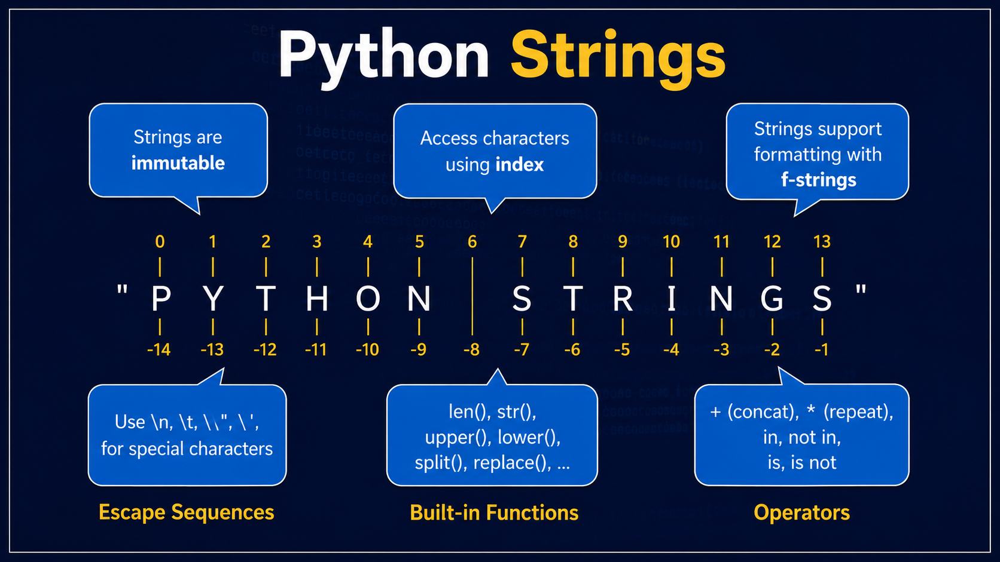
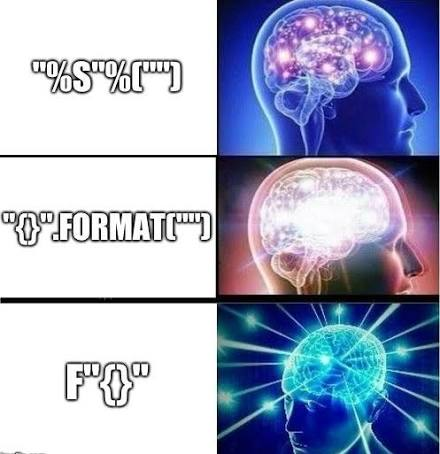
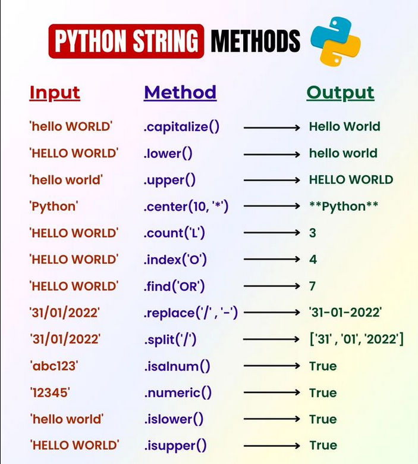

# Лекция 5. Строки: методы, форматирование и обработка текста



## Что мы изучим сегодня?

На прошлой лекции мы подробно разобрали списки: научились хранить наборы данных, получать элементы по индексам, использовать срезы, перебирать коллекции через `for`, применять методы списков и создавать новые списки через `list comprehension`.

Теперь мы переходим к строкам.

Строки в Python нужны для работы с текстом: именами пользователей, email-адресами, сообщениями, паролями, названиями товаров, поисковыми запросами, текстами из файлов и данными, которые вводит пользователь.

На этой лекции мы будем говорить не просто о том, как создать строку, а о том, как **обрабатывать текст**.

Мы разберём:

- как строка устроена как последовательность символов;
- почему строку нельзя изменять по индексу;
- как работают специальные символы `\n`, `\t`, `\"`, `\'`;
- как создавать многострочные строки;
- как форматировать строки через `f-string`;
- что такое `r-string`, `b-string` и `t-string`;
- как менять регистр текста;
- как очищать строку от лишних пробелов;
- как искать и заменять части строки;
- как проверять содержимое строки;
- как разделять строку на список через `split()`;
- как собирать строку из списка через `join()`.

Главная цель лекции - научиться работать со строками как с реальными текстовыми данными, которые нужно очищать, проверять, изменять и красиво выводить.

---

## Короткое повторение: строка как коллекция символов

Строка в Python - это тип данных `str`, который используется для хранения текста.

```python
name = "Anna"
city = "Prague"
message = "Hello, Python!"
```

Строку можно представить как последовательность символов. Каждый символ имеет свою позицию, то есть индекс.

```python
word = "Python"
```

```text
строка:   P  y  t  h  o  n
индексы:  0  1  2  3  4  5
```

Это похоже на списки: у строки тоже есть порядок, индексы, отрицательные индексы, срезы и возможность перебора через `for`.

Получим первый и последний символ строки:

```python
word = "Python"

print(word[0])
print(word[-1])
```

Результат:

```text
P
n
```

Индекс `0` означает первый символ, а индекс `-1` - последний символ.

---

### Срезы строк

Со строками работают срезы так же, как со списками.

```python
word = "Python"

print(word[1:4])
```

Результат:

```text
yth
```

Срез `word[1:4]` берёт символы с индекса `1` до индекса `4`, не включая сам индекс `4`.

Можно получить часть строки от начала:

```python
word = "Python"

print(word[:3])
```

Результат:

```text
Pyt
```

Можно получить часть строки до конца:

```python
word = "Python"

print(word[2:])
```

Результат:

```text
thon
```

Можно развернуть строку через срез с отрицательным шагом:

```python
word = "Python"

print(word[::-1])
```

Результат:

```text
nohtyP
```

Подробно срезы мы уже разбирали на списках. Здесь важно запомнить: та же логика работает и со строками.

---

### Перебор строки через `for`

Так как строка - это последовательность символов, её можно перебирать через цикл `for`.

```python
word = "Python"

for char in word:
    print(char)
```

Результат:

```text
P
y
t
h
o
n
```

На каждой итерации переменная `char` получает следующий символ строки.

Такой подход часто используют, когда нужно проанализировать текст: посчитать символы, найти гласные, проверить наличие цифр или обработать каждый символ отдельно.

---

### Проверка наличия символа или части строки

Оператор `in` работает со строками так же, как со списками.

```python
email = "test@gmail.com"

print("@" in email)
print(".com" in email)
print("admin" in email)
```

Результат:

```text
True
True
False
```

Можно использовать `in` вместе с условием:

```python
email = "test@gmail.com"

if "@" in email:
    print("Email похож на корректный")
else:
    print("В email нет символа @")
```

Оператор `in` может проверять не только один символ, но и целую часть строки.

```python
text = "Python is popular"

if "Python" in text:
    print("В тексте есть слово Python")
```

---

### Главное отличие строки от списка

Строки похожи на списки по работе с индексами, срезами и циклом `for`, но есть важное отличие.

**Список можно изменять, а строку нельзя.**

Например, со списком такой код работает:

```python
letters = ["P", "y", "t", "h", "o", "n"]

letters[0] = "J"

print(letters)
```

Результат:

```text
['J', 'y', 't', 'h', 'o', 'n']
```

А со строкой такой код вызовет ошибку:

```python
word = "Python"

word[0] = "J"
```

Ошибка:

```text
TypeError: 'str' object does not support item assignment
```

Строка является неизменяемым объектом. Это значит, что мы не можем заменить символ внутри строки напрямую.

Если нужно получить изменённую строку, мы создаём новую строку:

```python
word = "Python"

new_word = "J" + word[1:]

print(new_word)
```

Результат:

```text
Jython
```

Исходная строка `word` не изменилась. Мы просто создали новую строку `new_word`.

---

## Экранирование символов

В строках иногда нужно использовать символы, которые нельзя удобно написать обычным способом.

Например:

- перенести текст на новую строку;
- добавить отступ;
- вывести кавычки внутри строки;
- показать обратный слэш `\`.

Для таких случаев используется **экранирование символов**.

Экранирование начинается с обратного слэша `\`.

---

### Перенос строки: `\n`

Символ `\n` означает переход на новую строку.

```python
text = "Привет\nPython"

print(text)
```

Результат:

```text
Привет
Python
```

Хотя строка записана в одну строку кода, при выводе `\n` переносит текст на следующую строку.

Это удобно, когда нужно вывести несколько строк одним `print()`.

```python
message = "Ваш заказ принят\nСпасибо за покупку"

print(message)
```

Результат:

```text
Ваш заказ принят
Спасибо за покупку
```

---

### Табуляция: `\t`

Символ `\t` добавляет табуляцию, то есть горизонтальный отступ.

```python
text = "Имя:\tAnna"

print(text)
```

Результат:

```text
Имя:    Anna
```

Табуляцию можно использовать для простого выравнивания данных в консоли.

```python
print("Товар\tЦена")
print("Хлеб\t40")
print("Молоко\t35")
```

Результат:

```text
Товар   Цена
Хлеб    40
Молоко  35
```

Важно понимать: табуляция не всегда выглядит одинаково в разных редакторах и терминалах. Для серьёзного выравнивания данных позже лучше использовать форматирование строк.

---

### Кавычки внутри строки

Если строка записана в двойных кавычках, внутри неё можно спокойно использовать одинарные кавычки.

```python
text = "It's Python"

print(text)
```

Результат:

```text
It's Python
```

Если строка записана в одинарных кавычках, внутри неё можно использовать двойные кавычки.

```python
text = 'Он сказал: "Привет"'

print(text)
```

Результат:

```text
Он сказал: "Привет"
```

Но если внутри строки нужны такие же кавычки, как и снаружи, их нужно экранировать.

```python
text = "Он сказал: \"Привет\""

print(text)
```

Результат:

```text
Он сказал: "Привет"
```

Здесь `\"` означает: это обычная кавычка внутри строки, а не конец строки.

То же самое работает с одинарной кавычкой.

```python
text = 'It\'s Python'

print(text)
```

Результат:

```text
It's Python
```

---

### Обратный слэш: `\\`

Иногда нужно вывести сам символ обратного слэша `\`.

Например, в пути к файлу на Windows:

```text
C:\Users\Admin\Desktop
```

Но в Python обратный слэш используется для экранирования. Поэтому, чтобы вывести сам `\`, его нужно написать два раза.

```python
path = "C:\\Users\\Admin\\Desktop"

print(path)
```

Результат:

```text
C:\Users\Admin\Desktop
```

Позже мы разберём `r-string`, который позволяет удобнее записывать такие строки.

---

### Частая ошибка

Новички иногда пишут путь к файлу так:

```python
path = "C:\Users\Admin\Desktop"
```

В некоторых случаях Python может воспринять части строки как специальные символы. Например, `\n` будет считаться переносом строки, `\t` - табуляцией.

Поэтому для путей можно использовать двойной обратный слэш:

```python
path = "C:\\Users\\Admin\\Desktop"
```

Или `r-string`:

```python
path = r"C:\Users\Admin\Desktop"
```

К `r-string` мы вернёмся в отдельном блоке про специальные виды строк.

---

## Многострочные строки

Если нужно записать короткий текст с переносом строки, можно использовать `\n`.

```python
message = "Привет\nPython"

print(message)
```

Но если текста много, такая запись быстро становится неудобной.

Например:

```python
message = "Добрый день!\nВаш заказ принят.\nСпасибо за покупку."

print(message)
```

Результат:

```text
Добрый день!
Ваш заказ принят.
Спасибо за покупку.
```

Код работает, но читать такую строку не очень удобно. Чем больше текста, тем сложнее становится понимать, где находятся переносы строк.

Для таких случаев в Python есть **многострочные строки**.

---

### Строки через тройные кавычки

Многострочную строку можно создать с помощью тройных кавычек.

Можно использовать тройные двойные кавычки:

```python
message = """
Добрый день!
Ваш заказ принят.
Спасибо за покупку.
"""

print(message)
```

Результат:

```text
Добрый день!
Ваш заказ принят.
Спасибо за покупку.
```

Можно использовать и тройные одинарные кавычки:

```python
message = '''
Добрый день!
Ваш заказ принят.
Спасибо за покупку.
'''

print(message)
```

Оба варианта работают одинаково.

На практике чаще используют тройные двойные кавычки `"""`.

---

### Где это удобно использовать?

Многострочные строки удобно использовать, когда нужно хранить большой текст.

Например, сообщение пользователю:

```python
message = """
Здравствуйте!
Ваша заявка получена.
Мы свяжемся с вами в ближайшее время.
"""

print(message)
```

Или текст письма:

```python
email_text = """
Добрый день!

Спасибо за ваше сообщение.
Мы проверим информацию и вернёмся с ответом.

С уважением,
Команда поддержки
"""

print(email_text)
```

Или простое меню в консольной программе:

```python
menu = """
1. Добавить задачу
2. Удалить задачу
3. Показать список задач
4. Выйти
"""

print(menu)
```

Многострочные строки делают код понятнее, когда текст должен выглядеть в программе примерно так же, как он будет выглядеть при выводе.

---

### Важный момент с переносами строк

Многострочная строка сохраняет переносы строк и пробелы.

Например:

```python
text = """
Python
Django
React
"""

print(text)
```

Результат будет содержать строки именно в таком порядке.

Но важно заметить: если открывающие тройные кавычки стоят на отдельной строке, первая строка тоже будет пустой.

```python
text = """
Python
Django
React
"""
```

В этой записи перед словом `Python` есть перенос строки.

Если нужно убрать пустую строку в начале, можно начать текст сразу после тройных кавычек:

```python
text = """Python
Django
React"""

print(text)
```

Результат:

```text
Python
Django
React
```

Оба варианта допустимы. Просто нужно понимать, что Python сохраняет текст внутри тройных кавычек почти так, как он написан.

---

### Многострочная строка и переменные

Многострочную строку можно использовать вместе с `f-string`.

```python
name = "Anna"
order_id = 125

message = f"""
Здравствуйте, {name}!

Ваш заказ №{order_id} принят.
Спасибо за покупку.
"""

print(message)
```

Результат:

```text
Здравствуйте, Anna!

Ваш заказ №125 принят.
Спасибо за покупку.
```

Такой подход часто используют для шаблонов сообщений, писем, уведомлений и текстов, где нужно подставить данные пользователя.

Подробно `f-string` мы разберём в следующем блоке.

---

## Форматирование строк

В программах часто нужно собрать строку из обычного текста и значений переменных.

Например, у нас есть данные пользователя:

```python
name = "Anna"
age = 25
city = "Prague"
```

И мы хотим получить сообщение:

```text
Anna, 25 лет, город Prague
```

Для таких задач используется **форматирование строк**.

---

### Конкатенация строк

Один из способов собрать строку - соединить части через `+`.

```python
name = "Anna"

message = "Привет, " + name

print(message)
```

Результат:

```text
Привет, Anna
```

Такой способ работает, но быстро становится неудобным, если переменных несколько.

```python
name = "Anna"
city = "Prague"

message = "Привет, " + name + "! Добро пожаловать в " + city + "."

print(message)
```

Результат:

```text
Привет, Anna! Добро пожаловать в Prague.
```

В реальном коде для таких задач чаще используют `f-string`.

---

### `f-string`



`f-string` позволяет вставлять переменные прямо внутрь строки. Перед строкой ставится буква `f`, а переменные записываются внутри фигурных скобок `{}`.

```python
name = "Anna"
age = 25

message = f"Меня зовут {name}, мне {age} лет"

print(message)
```

Результат:

```text
Меня зовут Anna, мне 25 лет
```

Такой код читается почти как обычный текст: Python сам подставляет значения переменных в нужные места.

---

### Несколько переменных внутри строки

В `f-string` можно использовать любое количество переменных.

```python
product = "Ноутбук"
price = 1200
count = 2

message = f"Товар: {product}, цена: {price}, количество: {count}"

print(message)
```

Результат:

```text
Товар: Ноутбук, цена: 1200, количество: 2
```

Такой формат удобно использовать для сообщений пользователю, чеков, уведомлений, логов и вывода данных в консоль.

---

### Выражения внутри `f-string`

Внутри фигурных скобок можно писать не только переменные, но и простые выражения.

```python
price = 100
count = 3

print(f"Итоговая сумма: {price * count}")
```

Результат:

```text
Итоговая сумма: 300
```

Можно вызвать функцию:

```python
name = "Anna"

print(f"Количество символов в имени: {len(name)}")
```

Результат:

```text
Количество символов в имени: 4
```

Но сложную логику лучше выносить в отдельные переменные.

```python
price = 100
count = 3

total = price * count

print(f"Итоговая сумма: {total}")
```

Такой код читается лучше.

---

### Округление чисел

`f-string` можно использовать для форматирования чисел.

```python
price = 19.999

print(f"Цена: {price:.2f}")
```

Результат:

```text
Цена: 20.00
```

Запись `:.2f` означает: вывести число с двумя цифрами после точки.

Ещё пример:

```python
average_score = 8.756

print(f"Средняя оценка: {average_score:.1f}")
```

Результат:

```text
Средняя оценка: 8.8
```

Здесь `:.1f` оставляет одну цифру после точки.

---

### Форматирование процентов

Число можно вывести как процент.

```python
progress = 0.756

print(f"Прогресс: {progress:.0%}")
```

Результат:

```text
Прогресс: 76%
```

Если нужно оставить одну цифру после точки:

```python
progress = 0.756

print(f"Прогресс: {progress:.1%}")
```

Результат:

```text
Прогресс: 75.6%
```

Такой формат часто используют для прогресса, скидок, статистики и аналитики.

---

### `f-string` и многострочные строки

`f-string` можно использовать вместе с многострочными строками.

```python
name = "Anna"
order_id = 125
total = 350

message = f"""
Здравствуйте, {name}!

Ваш заказ №{order_id} принят.
Сумма заказа: {total} Kč.

Спасибо за покупку.
"""

print(message)
```

Результат:

```text
Здравствуйте, Anna!

Ваш заказ №125 принят.
Сумма заказа: 350 Kč.

Спасибо за покупку.
```

Это удобно для шаблонов сообщений, писем и уведомлений.

---

## Специальные виды строк

Кроме обычных строк и `f-string`, в Python есть ещё несколько специальных вариантов записи строк.

В этой лекции нам важно познакомиться с ними обзорно. Подробно будем возвращаться к ним позже, когда появятся файлы, регулярные выражения, кодировки и шаблоны.

---

### `r-string`

`r-string` - это “сырая строка”. Перед строкой ставится буква `r`.

```python
path = r"C:\Users\Admin\Desktop\file.txt"

print(path)
```

Результат:

```text
C:\Users\Admin\Desktop\file.txt
```

В обычной строке обратный слэш `\` используется для специальных символов: `\n`, `\t`, `\"` и других.

В `r-string` обратный слэш воспринимается почти как обычный символ. Поэтому `r-string` удобно использовать для путей к файлам на Windows. Без `r-string` пришлось бы писать так:

```python
path = "C:\\Users\\Admin\\Desktop\\file.txt"
```

Также `r-string` часто используют в регулярных выражениях. Регулярные выражения мы будем разбирать позже.

---

### `b-string`

`b-string` создаёт не обычную строку, а набор байтов.

```python
data = b"hello"

print(data)
print(type(data))
```

Результат:

```text
b'hello'
<class 'bytes'>
```

Обычная строка имеет тип `str`, а `b-string` создаёт объект типа `bytes`. Байты нужны при работе с файлами, изображениями, сетью, кодировками и бинарными данными. В этой лекции мы не будем подробно разбирать байты. Сейчас достаточно запомнить: `b"hello"` - это не строка `str`, а данные типа `bytes`.

---

### `t-string`

В Python 3.14 появился ещё один вариант - `t-string`.

Синтаксис похож на `f-string`:

```python
name = "Anna"

template = t"Hello, {name}"
```

Но `t-string` нужен не для обычного вывода текста, а для более продвинутой работы с шаблонами.

В базовом курсе нам пока достаточно уверенно пользоваться `f-string`.

К `t-string` можно вернуться позже, когда будем говорить о шаблонах, безопасности и продвинутой обработке текста.

---

## Методы строк



У строк в Python есть собственные методы - готовые действия, которые можно выполнять с текстом.

Метод вызывается через точку:

```python
text.method()
```

Например:

```python
text = "Python"

print(text.lower())
```

Результат:

```text
python
```

Методы строк помогают обрабатывать текст: менять регистр, удалять лишние пробелы, искать части строки, заменять символы, проверять содержимое, разделять строку на части и собирать строку обратно. Подробно разобрать методы строк можно [Тут](https://www.w3schools.com/python/python_ref_string.asp)

> Важно помнить: строки в Python неизменяемые. Поэтому методы строк не изменяют исходную строку, а возвращают новую.

```python
text = "Python"

text.lower()

print(text)
```

Результат:

```text
Python
```

Чтобы сохранить результат, нужно записать его в переменную:

```python
text = "Python"

text = text.lower()

print(text)
```

Результат:

```text
python
```

Дальше разберём методы строк по группам.

---

### Регистр строк

При работе с текстом часто нужно менять регистр символов: делать буквы маленькими, большими или приводить текст к аккуратному виду.

Например, пользователь может ввести имя по-разному:

```python
name_1 = "anna"
name_2 = "ANNA"
name_3 = "aNnA"
```

Для человека это одно и то же имя, но для Python это разные строки.

```python
print(name_1 == name_2)
```

Результат:

```text
False
```

Python сравнивает строки точно: учитывает каждую букву и её регистр.

Поэтому перед сравнением, поиском или сохранением данных строки часто приводят к единому виду.

---

#### `lower()`

Метод `lower()` возвращает новую строку, где все буквы приведены к нижнему регистру.

```python
text = "Python Is Popular"

result = text.lower()

print(result)
```

Результат:

```text
python is popular
```

`lower()` часто используют перед сравнением строк.

```python
answer = input("Введите yes или no: ")

answer = answer.lower()

if answer == "yes":
    print("Продолжаем")
else:
    print("Останавливаем")
```

Теперь пользователь может ввести `YES`, `Yes`, `yes` или `yEs`, а программа всё равно приведёт ответ к одному виду.

---

#### `upper()`

Метод `upper()` возвращает новую строку, где все буквы приведены к верхнему регистру.

```python
text = "python"

result = text.upper()

print(result)
```

Результат:

```text
PYTHON
```

Такой метод может пригодиться, когда нужно выделить текст или привести код, статус или короткую команду к единому виду.

```python
status = "active"

print(status.upper())
```

Результат:

```text
ACTIVE
```

---

#### `capitalize()`

Метод `capitalize()` делает первую букву строки большой, а остальные маленькими.

```python
name = "aNnA"

result = name.capitalize()

print(result)
```

Результат:

```text
Anna
```

`capitalize()` удобно использовать для одного имени, одного слова или короткой фразы.

```python
city = "prague"

city = city.capitalize()

print(city)
```

Результат:

```text
Prague
```

---

#### `title()`

Метод `title()` делает первую букву каждого слова большой.

```python
full_name = "anna smith"

result = full_name.title()

print(result)
```

Результат:

```text
Anna Smith
```

Это удобно для имён, названий, заголовков и коротких фраз.

```python
course = "python basics for beginners"

print(course.title())
```

Результат:

```text
Python Basics For Beginners
```

Важно понимать: `title()` работает по словам и не всегда идеально подходит для всех языков, имён и сложных названий. Но для базовой обработки текста он часто бывает полезен.

---

#### Практический пример: нормализация имени

Представим, что пользователь вводит имя, а мы хотим сохранить его в аккуратном виде.

```python
name = input("Введите имя: ")

name = name.capitalize()

print(f"Привет, {name}!")
```

Если пользователь введёт:

```text
aNnA
```

Результат будет:

```text
Привет, Anna!
```

---

#### Практический пример: проверка команды

Пользователь может ввести команду в разном регистре.

```python
command = input("Введите команду: ")

command = command.lower()

if command == "start":
    print("Запускаем программу")
elif command == "stop":
    print("Останавливаем программу")
else:
    print("Неизвестная команда")
```

Теперь программа не зависит от того, как именно пользователь написал команду: `START`, `Start` или `start`.

---

### Очистка строки

При работе с пользовательским вводом часто встречается проблема лишних пробелов.

Например, пользователь может ввести email так:

```python
email = "  test@gmail.com  "
```

Визуально это почти тот же email, но для Python строка с пробелами и строка без пробелов - это разные значения.

```python
email_1 = "test@gmail.com"
email_2 = "  test@gmail.com  "

print(email_1 == email_2)
```

Результат:

```text
False
```

Чтобы убрать лишние пробелы по краям строки, используют методы очистки.

---

#### `strip()`

Метод `strip()` удаляет пробелы в начале и в конце строки.

```python
email = "  test@gmail.com  "

clean_email = email.strip()

print(clean_email)
```

Результат:

```text
test@gmail.com
```

Важно: `strip()` не удаляет пробелы внутри строки.

```python
text = "  Hello Python  "

clean_text = text.strip()

print(clean_text)
```

Результат:

```text
Hello Python
```

Пробел между `Hello` и `Python` остался, потому что он находится внутри строки, а не по краям.

---

#### `lstrip()`

Метод `lstrip()` удаляет пробелы только слева.

```python
text = "   Python"

result = text.lstrip()

print(result)
```

Результат:

```text
Python
```

Буква `l` означает `left`, то есть левая сторона.

---

#### `rstrip()`

Метод `rstrip()` удаляет пробелы только справа.

```python
text = "Python   "

result = text.rstrip()

print(result)
```

Результат:

```text
Python
```

Буква `r` означает `right`, то есть правая сторона.

---

#### Что ещё удаляет `strip()`

По умолчанию `strip()` удаляет не только обычные пробелы, но и некоторые служебные символы по краям строки: перенос строки `\n` и табуляцию `\t`.

```python
text = "\n\tPython\n"

result = text.strip()

print(result)
```

Результат:

```text
Python
```

Это полезно при работе с данными из файлов, форм, сообщений и пользовательского ввода.

---

#### Очистка пользовательского ввода

Чаще всего `strip()` используют сразу после `input()`.

```python
email = input("Введите email: ")

email = email.strip()

print(email)
```

Можно записать короче:

```python
email = input("Введите email: ").strip()

print(email)
```

Такой подход помогает убрать случайные пробелы, которые пользователь мог поставить перед текстом или после него.

---

#### Очистка и сравнение

Очистку часто комбинируют с `lower()`. Например, пользователь вводит команду:

```python
command = input("Введите команду: ")

command = command.strip().lower()

if command == "start":
    print("Запускаем программу")
elif command == "stop":
    print("Останавливаем программу")
else:
    print("Неизвестная команда")
```

Теперь программа нормально обработает разные варианты ввода:

```text
START
 start
Start 
  sTaRt
```

После `strip().lower()` все эти варианты превратятся в:

```text
start
```

---

### Поиск и замена в строке

После очистки строки часто нужно проверить, есть ли в ней нужный текст, найти позицию фрагмента, посчитать совпадения или заменить одну часть строки на другую.

Для этого используются методы:

```python
find()
count()
replace()
startswith()
endswith()
```

---

#### `find()`

Метод `find()` ищет подстроку внутри строки и возвращает индекс первого найденного совпадения.

```python
text = "Python is popular"

index = text.find("is")

print(index)
```

Результат:

```text
7
```

Слово `"is"` начинается с индекса `7`.

Если подстрока не найдена, `find()` возвращает `-1`.

```python
text = "Python is popular"

index = text.find("JavaScript")

print(index)
```

Результат:

```text
-1
```

Это удобно использовать в условиях.

```python
text = "Python is popular"

if text.find("Python") != -1:
    print("Слово найдено")
else:
    print("Слово не найдено")
```

Но если нам нужно просто проверить наличие текста, чаще читается лучше оператор `in`.

```python
text = "Python is popular"

if "Python" in text:
    print("Слово найдено")
```

`find()` полезен именно тогда, когда нам нужна позиция найденного фрагмента.

---

#### `count()`

Метод `count()` считает, сколько раз подстрока встречается в строке.

```python
text = "Python is popular. Python is simple."

result = text.count("Python")

print(result)
```

Результат:

```text
2
```

Можно считать не только слова, но и отдельные символы.

```python
email = "test@gmail.com"

print(email.count("@"))
```

Результат:

```text
1
```

Такой приём можно использовать для простой проверки email: в нормальном email символ `@` должен встречаться один раз.

```python
email = input("Введите email: ").strip()

if email.count("@") == 1:
    print("Email похож на корректный")
else:
    print("Email некорректный")
```

Это не полноценная проверка email, но хороший пример базовой обработки строки.

---

#### `replace()`

Метод `replace()` заменяет одну часть строки на другую.

```python
text = "I like Java"

new_text = text.replace("Java", "Python")

print(new_text)
```

Результат:

```text
I like Python
```

Важно: `replace()` не изменяет исходную строку, а возвращает новую.

```python
text = "I like Java"

text.replace("Java", "Python")

print(text)
```

Результат:

```text
I like Java
```

Чтобы сохранить результат, нужно записать его в переменную.

```python
text = "I like Java"

text = text.replace("Java", "Python")

print(text)
```

Результат:

```text
I like Python
```

Если совпадений несколько, `replace()` заменит все.

```python
text = "Python, Python, Python"

text = text.replace("Python", "Django")

print(text)
```

Результат:

```text
Django, Django, Django
```

---

#### `startswith()`

Метод `startswith()` проверяет, начинается ли строка с указанного текста.

```python
url = "https://example.com"

print(url.startswith("https"))
```

Результат:

```text
True
```

Это удобно для проверки ссылок, команд, префиксов и форматов данных.

```python
url = input("Введите ссылку: ").strip()

if url.startswith("https://"):
    print("Ссылка использует HTTPS")
else:
    print("Ссылка не начинается с https://")
```

---

#### `endswith()`

Метод `endswith()` проверяет, заканчивается ли строка указанным текстом.

```python
file_name = "report.pdf"

print(file_name.endswith(".pdf"))
```

Результат:

```text
True
```

Этот метод часто используют для проверки расширений файлов.

```python
file_name = input("Введите имя файла: ").strip()

if file_name.endswith(".jpg") or file_name.endswith(".png"):
    print("Это изображение")
else:
    print("Это не изображение")
```

---

#### Практический пример: обработка текста

Представим, что у нас есть текст от пользователя.

```python
text = "  Python is popular. Python is simple.  "

text = text.strip()

print(text.count("Python"))

text = text.replace("Python", "Django")

print(text)
```

Результат:

```text
2
Django is popular. Django is simple.
```

В этом примере мы:

1. убрали лишние пробелы по краям;
2. посчитали, сколько раз встречается слово `"Python"`;
3. заменили `"Python"` на `"Django"`.

---

### Проверка содержимого строки

Иногда нужно проверить, из каких символов состоит строка.

Например:

- пользователь ввёл возраст;
- нужно проверить, что имя состоит из букв;
- нужно убедиться, что пароль или код содержит только буквы и цифры;
- нужно проверить, можно ли преобразовать строку в число.

Для таких задач у строк есть специальные методы проверки.

---

#### `isdigit()`

Метод `isdigit()` проверяет, состоит ли строка только из цифр.

```python
text = "12345"

print(text.isdigit())
```

Результат:

```text
True
```

Если в строке есть хотя бы один нечисловой символ, результат будет `False`.

```python
text = "123abc"

print(text.isdigit())
```

Результат:

```text
False
```

Пробелы тоже считаются символами, поэтому такая строка не пройдёт проверку:

```python
text = "123 "

print(text.isdigit())
```

Результат:

```text
False
```

Поэтому перед проверкой пользовательский ввод часто очищают через `strip()`.

```python
age = input("Введите возраст: ").strip()

if age.isdigit():
    print("Возраст введён корректно")
else:
    print("Возраст должен быть числом")
```

---

#### `isalpha()`

Метод `isalpha()` проверяет, состоит ли строка только из букв.

```python
name = "Anna"

print(name.isalpha())
```

Результат:

```text
True
```

Если в строке есть цифры, пробелы или специальные символы, результат будет `False`.

```python
name = "Anna123"

print(name.isalpha())
```

Результат:

```text
False
```

Пробел между словами тоже делает результат `False`.

```python
name = "Anna Smith"

print(name.isalpha())
```

Результат:

```text
False
```

Это важно понимать: `isalpha()` проверяет всю строку целиком. Если нужно проверить имя и фамилию, такую строку лучше сначала разделить на части или использовать другую логику.

---

#### `isalnum()`

Метод `isalnum()` проверяет, состоит ли строка только из букв и цифр.

```python
username = "Anna123"

print(username.isalnum())
```

Результат:

```text
True
```

Если в строке есть пробелы или специальные символы, результат будет `False`.

```python
username = "Anna_123"

print(username.isalnum())
```

Результат:

```text
False
```

Здесь результат `False`, потому что символ `_` не является ни буквой, ни цифрой.

`isalnum()` можно использовать для простой проверки логинов, кодов, артикулов или коротких идентификаторов.

---

#### Практический пример: проверка возраста

```python
age = input("Введите возраст: ").strip()

if age.isdigit():
    age = int(age)
    print(f"Ваш возраст: {age}")
else:
    print("Ошибка: возраст должен быть числом")
```

Здесь мы сначала очищаем ввод от лишних пробелов, потом проверяем, состоит ли строка из цифр, и только после этого преобразуем её в число.

---

#### Практический пример: проверка имени

```python
name = input("Введите имя: ").strip()

if name.isalpha():
    name = name.capitalize()
    print(f"Привет, {name}!")
else:
    print("Имя должно содержать только буквы")
```

Такой пример показывает базовую валидацию пользовательского ввода.

---

#### Практический пример: проверка логина

```python
username = input("Введите логин: ").strip()

if username.isalnum():
    print("Логин принят")
else:
    print("Логин должен содержать только буквы и цифры")
```

Здесь программа не пропустит логин с пробелами, подчёркиванием или другими специальными символами.

---

### Разделение строки: `split()`

Метод `split()` используется, когда нужно разделить строку на части и получить список.

Например, у нас есть строка с несколькими словами:

```python
text = "Python Django PostgreSQL"
```

Если вызвать `split()` без аргументов, Python разделит строку по пробелам.

```python
text = "Python Django PostgreSQL"

words = text.split()

print(words)
```

Результат:

```text
['Python', 'Django', 'PostgreSQL']
```

В результате мы получили список строк.

Это удобно, когда нужно обработать каждое слово отдельно.

```python
text = "Python Django PostgreSQL"

words = text.split()

for word in words:
    print(word)
```

Результат:

```text
Python
Django
PostgreSQL
```

---

#### Разделение по конкретному символу

В `split()` можно указать разделитель.

Например, строка с данными пользователя:

```python
data = "Anna,25,Prague"
```

Здесь данные разделены запятыми.

```python
data = "Anna,25,Prague"

parts = data.split(",")

print(parts)
```

Результат:

```text
['Anna', '25', 'Prague']
```

Теперь можно получить отдельные части по индексам:

```python
data = "Anna,25,Prague"

parts = data.split(",")

name = parts[0]
age = parts[1]
city = parts[2]

print(name)
print(age)
print(city)
```

Результат:

```text
Anna
25
Prague
```

---

#### Разделение строки с несколькими пробелами

Если вызвать `split()` без аргументов, Python сам обработает лишние пробелы между словами.

```python
text = "Python     Django       PostgreSQL"

words = text.split()

print(words)
```

Результат:

```text
['Python', 'Django', 'PostgreSQL']
```

Это удобно при обработке пользовательского ввода, где человек может случайно поставить больше одного пробела.

---

#### Практический пример: слова в предложении

Представим, что пользователь вводит предложение, а нам нужно посчитать количество слов.

```python
text = input("Введите предложение: ").strip()

words = text.split()

print(f"Количество слов: {len(words)}")
```

Если пользователь введёт:

```text
Python is popular
```

Результат будет:

```text
Количество слов: 3
```

---

#### Практический пример: обработка строки с товарами

Пользователь вводит товары через запятую:

```python
products_text = input("Введите товары через запятую: ")

products = products_text.split(",")

print(products)
```

Если пользователь введёт:

```text
Хлеб,Молоко,Сыр
```

Результат:

```text
['Хлеб', 'Молоко', 'Сыр']
```

Если после запятых могут быть пробелы, элементы можно дополнительно очистить через `strip()`.

```python
products_text = "Хлеб, Молоко, Сыр"

products = products_text.split(",")

clean_products = []

for product in products:
    clean_products.append(product.strip())

print(clean_products)
```

Результат:

```text
['Хлеб', 'Молоко', 'Сыр']
```

---

### Объединение строк: `join()`

Метод `join()` используется, когда нужно собрать одну строку из списка строк.

Например, у нас есть список технологий:

```python
technologies = ["Python", "Django", "PostgreSQL"]
```

И мы хотим получить одну строку:

```text
Python, Django, PostgreSQL
```

Для этого можно использовать `join()`.

```python
technologies = ["Python", "Django", "PostgreSQL"]

result = ", ".join(technologies)

print(result)
```

Результат:

```text
Python, Django, PostgreSQL
```

---

#### Как работает `join()`

Синтаксис выглядит так:

```python
separator.join(list)
```

Где:

- `separator` - строка-разделитель;
- `list` - список строк, который нужно объединить.

Важно: `join()` вызывается не у списка, а у строки-разделителя.

```python
", ".join(technologies)
```

Здесь разделитель - это строка `", "`. Она будет вставлена между элементами списка.

---

#### Разные разделители

Можно объединить элементы через пробел:

```python
words = ["Hello", "Python", "World"]

text = " ".join(words)

print(text)
```

Результат:

```text
Hello Python World
```

Можно объединить через дефис:

```python
date_parts = ["2026", "07", "20"]

date = "-".join(date_parts)

print(date)
```

Результат:

```text
2026-07-20
```

Можно объединить без разделителя:

```python
letters = ["P", "y", "t", "h", "o", "n"]

word = "".join(letters)

print(word)
```

Результат:

```text
Python
```

В этом примере разделитель - пустая строка `""`, поэтому символы просто склеиваются вместе.

---

#### Объединение строк с переносом

Через `join()` можно собрать многострочный текст.

```python
tasks = ["Купить продукты", "Сделать домашку", "Позвонить клиенту"]

text = "\n".join(tasks)

print(text)
```

Результат:

```text
Купить продукты
Сделать домашку
Позвонить клиенту
```

Здесь разделитель `"\n"` добавляет перенос строки между элементами списка.

---

#### Важный момент: элементы должны быть строками

`join()` работает со списком строк.

```python
numbers = ["10", "20", "30"]

result = ", ".join(numbers)

print(result)
```

Результат:

```text
10, 20, 30
```

Но если в списке будут числа, возникнет ошибка.

```python
numbers = [10, 20, 30]

result = ", ".join(numbers)

print(result)
```

Ошибка:

```text
TypeError: sequence item 0: expected str instance, int found
```

Чтобы объединить числа через `join()`, их сначала нужно преобразовать в строки.

```python
numbers = [10, 20, 30]

strings = [str(number) for number in numbers]

result = ", ".join(strings)

print(result)
```

Результат:

```text
10, 20, 30
```

---

#### `split()` и `join()` вместе

`split()` и `join()` часто используют вместе. `split()` разбивает строку на список:

```python
text = "Python Django PostgreSQL"

words = text.split()

print(words)
```

Результат:

```text
['Python', 'Django', 'PostgreSQL']
```

`join()` собирает список обратно в строку:

```python
words = ["Python", "Django", "PostgreSQL"]

text = " | ".join(words)

print(text)
```

Результат:

```text
Python | Django | PostgreSQL
```

То есть:

```text
split() → строка в список
join()  → список в строку
```

---

#### Практический пример: список товаров

Представим, что у нас есть список товаров в корзине.

```python
products = ["Хлеб", "Молоко", "Сыр"]

message = "Ваши товары: " + ", ".join(products)

print(message)
```

Результат:

```text
Ваши товары: Хлеб, Молоко, Сыр
```

Такой подход удобен, когда нужно красиво вывести список значений в одной строке.

---

## Практика

В этой практике нужно использовать методы строк, `f-string`, условия, циклы, `split()` и `join()`.

---

### Практика 1. Нормализация имени

Пользователь вводит имя.

Программа должна:

- убрать лишние пробелы по краям;
- привести имя к виду, где первая буква большая, остальные маленькие;
- вывести приветствие через `f-string`.

Пример ввода:

```text
  aNnA
```

Ожидаемый результат:

```text
Привет, Anna!
```

---

### Практика 2. Проверка команды

Пользователь вводит команду. Программа должна обработать команды:

```text
start
stop
exit
```

При этом пользователь может вводить команду в любом регистре и с лишними пробелами.

Пример ввода:

```text
  START
```

Ожидаемый результат:

```text
Запускаем программу
```

---

### Практика 3. Простая проверка email

Пользователь вводит email.

Программа должна:

- убрать лишние пробелы;
- привести email к нижнему регистру;
- проверить, есть ли в строке символ `@`;
- проверить, заканчивается ли email на `.com`.

Пример ввода:

```text
  TEST@GMAIL.COM  
```

Ожидаемый результат:

```text
Email похож на корректный
```

---

### Практика 4. Проверка возраста

Пользователь вводит возраст.

Программа должна:

- убрать лишние пробелы;
- проверить, состоит ли строка только из цифр;
- если возраст введён корректно, вывести его;
- если нет, вывести сообщение об ошибке.

Пример ввода:

```text
25
```

Ожидаемый результат:

```text
Возраст: 25
```

Пример некорректного ввода:

```text
25 лет
```

Ожидаемый результат:

```text
Возраст должен быть числом
```

---

### Практика 5. Подсчёт символов

Пользователь вводит текст.

Программа должна:

- убрать лишние пробелы по краям;
- вывести длину строки;
- посчитать, сколько раз в строке встречается буква `a`.

Пример ввода:

```text
banana
```

Ожидаемый результат:

```text
Длина строки: 6
Буква a встречается: 3
```

---

### Практика 6. Замена слова в тексте

Дана строка:

```python
text = "I like Java. Java is popular."
```

Замените слово `Java` на `Python`.

Ожидаемый результат:

```text
I like Python. Python is popular.
```

---

### Практика 7. Разделение строки на слова

Пользователь вводит предложение.

Программа должна:

- убрать лишние пробелы по краям;
- разделить строку на слова;
- вывести список слов;
- вывести количество слов.

Пример ввода:

```text
Python is popular
```

Ожидаемый результат:

```text
['Python', 'is', 'popular']
Количество слов: 3
```

---

### Практика 8. Обработка товаров через запятую

Пользователь вводит товары через запятую.

Пример ввода:

```text
Хлеб, Молоко, Сыр
```

Программа должна:

- разделить строку по запятой;
- убрать лишние пробелы у каждого товара;
- вывести список товаров.

Ожидаемый результат:

```text
['Хлеб', 'Молоко', 'Сыр']
```

---

### Практика 9. Сборка строки через `join()`

Дан список:

```python
technologies = ["Python", "Django", "PostgreSQL"]
```

Соберите из него строку через запятую.

Ожидаемый результат:

```text
Python, Django, PostgreSQL
```

---

### Практика 10. Красивый вывод списка задач

Дан список задач:

```python
tasks = ["Купить продукты", "Сделать домашку", "Позвонить клиенту"]
```

Соберите строку, где каждая задача будет выводиться с новой строки.

Ожидаемый результат:

```text
Купить продукты
Сделать домашку
Позвонить клиенту
```

---

### Практика 11. Проверка имени пользователя

Пользователь вводит имя.

Программа должна:

- убрать лишние пробелы;
- проверить, что имя состоит только из букв;
- если имя корректное, привести его к нормальному виду и вывести приветствие;
- если имя некорректное, вывести ошибку.

Пример ввода:

```text
  aNnA  
```

Ожидаемый результат:

```text
Привет, Anna!
```

Пример некорректного ввода:

```text
Anna123
```

Ожидаемый результат:

```text
Имя должно содержать только буквы
```

---

### Практика 12. Мини-анкета пользователя

Пользователь вводит:

- имя;
- email;
- возраст;
- город;
- интересы через запятую.

Программа должна:

- очистить все данные от лишних пробелов;
- имя и город привести к аккуратному виду;
- email привести к нижнему регистру;
- проверить возраст через `isdigit()`;
- интересы разделить через `split(",")`;
- очистить каждый интерес через `strip()`;
- собрать интересы обратно в строку через `join()`;
- вывести анкету через `f-string`.

Пример ввода:

```text
Имя:   aNnA
Email:   ANNA@GMAIL.COM
Возраст: 25
Город:   pRaGuE
Интересы: python, django, html
```

Ожидаемый результат:

```text
---- Анкета пользователя ----
Имя: Anna
Email: anna@gmail.com
Возраст: 25
Город: Prague
Интересы: python, django, html
```

---

## Домашнее задание

1. Пользователь вводит имя. Уберите лишние пробелы по краям и выведите имя с большой первой буквы.
2. Пользователь вводит город и страну. Выведите сообщение через `f-string`.
3. Пользователь вводит email. Уберите лишние пробелы и приведите email к нижнему регистру.
4. Пользователь вводит команду. Обработайте команды `start`, `stop`, `exit`. Команда должна работать в любом регистре.
5. Пользователь вводит строку. Выведите первый символ, последний символ и строку в обратном порядке.
6. Пользователь вводит email. Проверьте, содержит ли строка символ `@` и заканчивается ли она на `.com`.
7. Пользователь вводит имя файла. Проверьте, заканчивается ли файл на `.txt`, `.jpg` или `.png`.
8. Дана строка:

```python
text = "I like Java. Java is popular."
```

Замените `Java` на `Python`.

9. Пользователь вводит текст. Посчитайте, сколько раз в нём встречается буква `a`.
10. Пользователь вводит возраст. Проверьте, состоит ли строка только из цифр. Если возраст введён корректно, преобразуйте его в число.
11. Пользователь вводит предложение. Разделите его на слова и выведите количество слов.
12. Пользователь вводит товары через запятую. Разделите строку на список, очистите каждый товар от лишних пробелов и соберите обратно в строку через запятую.

---

## Итоги

На этой лекции мы разобрали строки как основной тип данных для работы с текстом.

Строка в Python - это тип данных `str`. Она состоит из символов, у неё есть индексы, срезы и возможность перебора через цикл `for`.

```python
word = "Python"

print(word[0])
print(word[-1])
print(word[::-1])
```

Главное отличие строки от списка в том, что строку нельзя изменить по индексу. Если нужно получить изменённый текст, мы создаём новую строку.

```python
word = "Python"

new_word = "J" + word[1:]

print(new_word)
```

Результат:

```text
Jython
```

Также мы разобрали экранирование символов.

```python
\n   # перенос строки
\t   # табуляция
\"   # двойная кавычка внутри строки
\'   # одинарная кавычка внутри строки
\\   # обратный слэш
```

После этого мы посмотрели многострочные строки и форматирование через `f-string`.

```python
name = "Anna"
age = 25

print(f"Меня зовут {name}, мне {age} лет")
```

`f-string` - основной удобный способ подставлять значения переменных внутрь текста.

Также мы коротко познакомились со специальными видами строк.

```python
r"C:\Users\Admin\Desktop"  # сырая строка
b"hello"                  # байты
t"Hello, {name}"           # шаблонная строка Python 3.14+
```

Основная часть лекции была посвящена методам строк. Мы разобрали методы для изменения регистра, очистки, поиска, замены, проверки содержимого, разделения и объединения строк.

```python
text.lower()
text.upper()
text.capitalize()
text.title()

text.strip()
text.lstrip()
text.rstrip()

text.find("Python")
text.count("Python")
text.replace("Java", "Python")
text.startswith("https")
text.endswith(".pdf")

text.isdigit()
text.isalpha()
text.isalnum()

text.split()
", ".join(words)
```

Главная идея лекции: строка - это не просто текст, который можно вывести на экран. Это данные, которые часто нужно очистить, проверить, преобразовать, разделить на части или собрать обратно.

После этой лекции вы должны уметь:

- работать со строкой как с последовательностью символов;
- использовать индексы и срезы строк;
- понимать неизменяемость строк;
- использовать экранирование символов;
- создавать многострочные строки;
- форматировать текст через `f-string`;
- использовать `r-string` для путей;
- применять основные методы строк;
- очищать пользовательский ввод;
- проверять содержимое строки;
- искать и заменять части строки;
- разделять строку через `split()`;
- собирать строку через `join()`.

В следующей лекции мы перейдём к другим структурам данных и разберём кортежи, множества и словари.