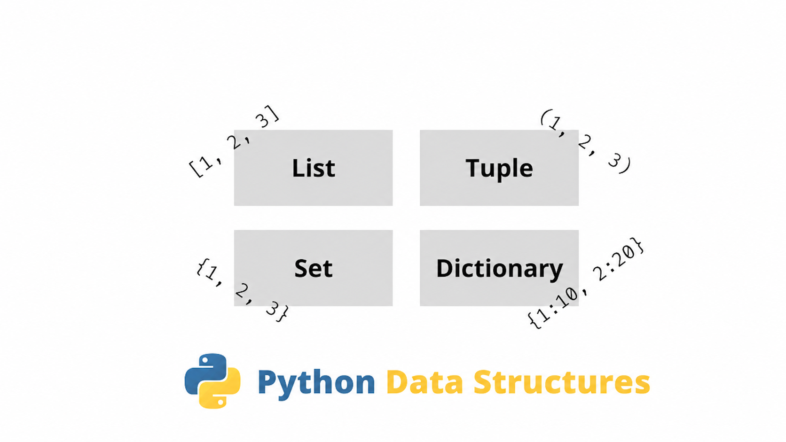
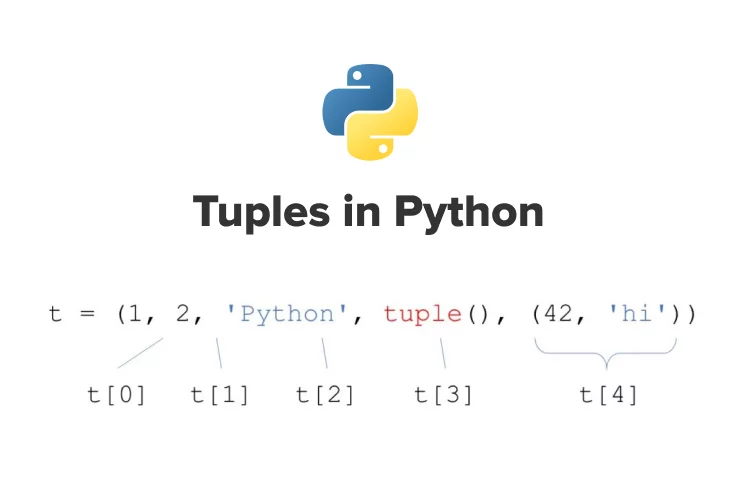
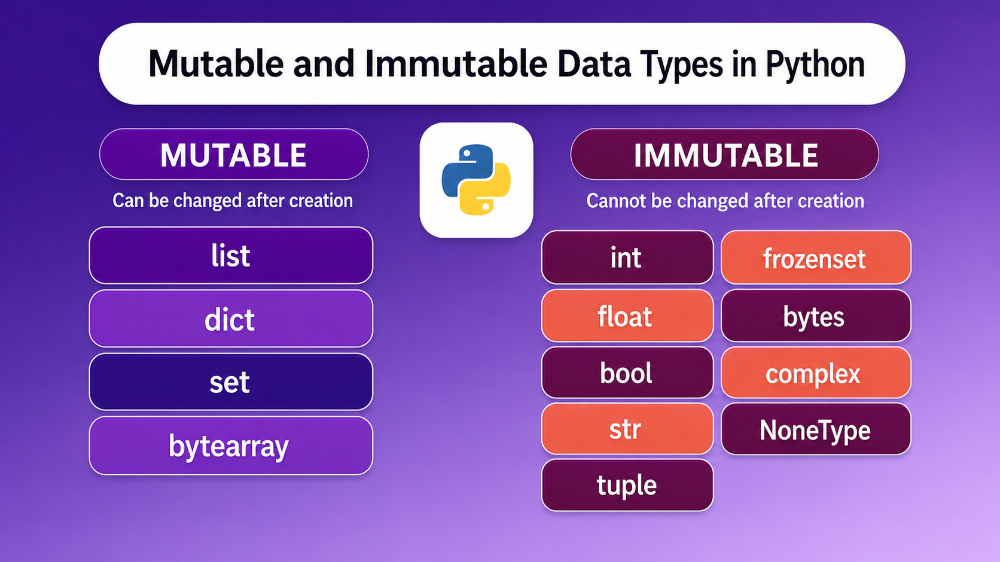
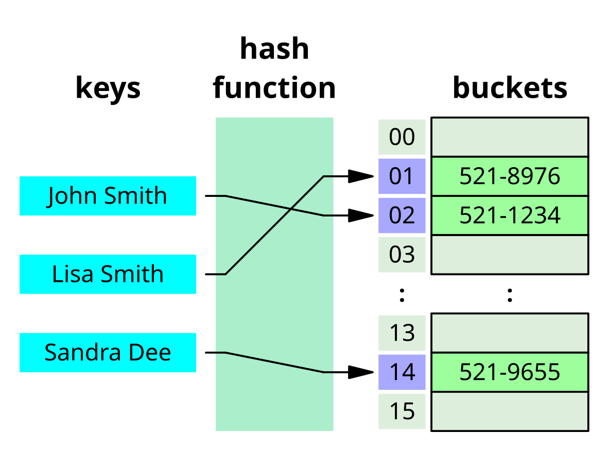
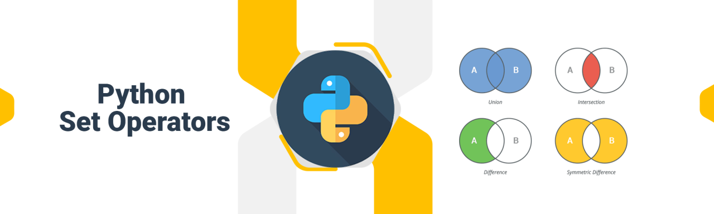
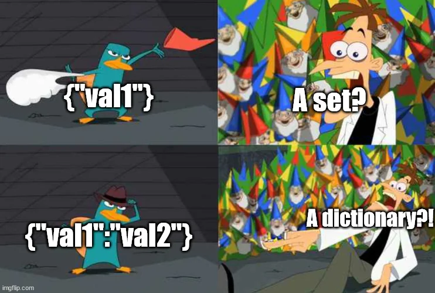

# Лекция 6. Кортежи, хеширование, хеш-таблицы, множества и словари



## Вступление

### Что мы изучим сегодня?

На прошлых лекциях мы уже разобрали строки и списки. Строки используются для работы с текстом, а списки позволяют хранить несколько значений в одной переменной.

```python
products = ["Хлеб", "Молоко", "Сыр"]
```

Список хорошо подходит для набора однотипных данных. Но в реальных программах нам часто приходится хранить более сложную информацию:

- данные пользователя;
- товар в магазине;
- заказ;
- настройки программы;
- уникальные значения;
- фиксированные данные, которые не должны изменяться.

Для разных задач нужны разные структуры данных.

На этой лекции мы разберём:

```text
tuple      → фиксированные упорядоченные данные
hash       → числовой отпечаток объекта
hash table → быстрый поиск и хранение данных
set        → уникальные значения
dict       → пары ключ → значение
```

---

### Зачем нужны новые структуры данных?

Представим товар:

```python
product = ["Ноутбук", 1200, "electronics", 5, True]
```

Чтобы работать с таким списком, нужно помнить назначение каждого индекса:

```text
0 → название
1 → цена
2 → категория
3 → количество
4 → наличие
```

Код работает, но читается плохо:

```python
print(product[3])
```

Без дополнительного объяснения непонятно, что означает значение с индексом `3`.

На этой лекции мы увидим, как:

- защитить фиксированный набор данных от изменения с помощью `tuple`;
- хранить только уникальные элементы с помощью `set`;
- описывать объекты понятными ключами с помощью `dict`;
- понять, почему множества и словари работают быстро.

---

## Кортежи: `tuple`



**Кортеж** (`tuple`) - это упорядоченная неизменяемая коллекция. Кортеж похож на список, но после создания его элементы нельзя заменить, добавить или удалить.

Кортеж удобно использовать для данных, которые не должны случайно изменяться:

- координаты точки;
- дата рождения;
- фиксированная пара значений;
- результат функции из нескольких значений;
- параметры, которые должны оставаться постоянными.

---

### Создание кортежа

Кортеж обычно создаётся с помощью круглых скобок:

```python
point = (10, 20)

print(point)
print(type(point))
```

Результат:

```text
(10, 20)
<class 'tuple'>
```

Внутри кортежа могут находиться значения разных типов:

```python
user = ("Anna", 25, "Prague", True)
```

---

### Индексы, срезы и перебор

Кортеж является упорядоченной коллекцией, поэтому поддерживает индексы и срезы.

```python
user = ("Anna", 25, "Prague")

print(user[0])
print(user[-1])
print(user[1:])
```

Результат:

```text
Anna
Prague
(25, 'Prague')
```

Срез возвращает новый кортеж.

Кортеж можно перебрать циклом `for`:

```python
colors = ("red", "green", "blue")

for color in colors:
    print(color)
```

Сравнение со списком:

```text
list  → упорядоченный и изменяемый
tuple → упорядоченный и неизменяемый
```

---

### Неизменяемость кортежа

Список можно изменить:

```python
numbers = [10, 20, 30]
numbers[0] = 100
```

Кортеж изменить нельзя:

```python
numbers = (10, 20, 30)
numbers[0] = 100
```

Ожидаемая ошибка:

```text
TypeError: 'tuple' object does not support item assignment
```

Неизменяемость полезна, когда структура данных должна оставаться постоянной на протяжении работы программы.

---

### Кортеж из одного элемента

Скобки сами по себе не создают кортеж:

```python
value = (10)
print(type(value))
```

Результат:

```text
<class 'int'>
```

Для кортежа из одного элемента нужна запятая:

```python
value = (10,)
print(type(value))
```

Результат:

```text
<class 'tuple'>
```

Запоминаем:

```text
(10)  → int
(10,) → tuple
```

---

### Распаковка кортежа

Элементы кортежа можно распределить по отдельным переменным:

```python
user = ("Anna", 25, "Prague")

name, age, city = user

print(name)
print(age)
print(city)
```

Python распределяет значения по порядку:

```text
"Anna"   → name
25       → age
"Prague" → city
```

Количество переменных должно совпадать с количеством элементов:

```python
name, age = user
```

Ожидаемая ошибка:

```text
ValueError: too many values to unpack
```

---

### Обмен значений местами

Обычный вариант:

```python
a = 10
b = 20

temp = a
a = b
b = temp
```

В Python значения можно поменять местами короче:

```python
a = 10
b = 20

a, b = b, a

print(a)  # 20
print(b)  # 10
```

Справа формируется набор значений, после чего он распаковывается в переменные слева.

---

### Type hints для кортежей

В аннотации можно указать тип каждого элемента:

```python
point: tuple[int, int] = (10, 20)
user: tuple[str, int, str] = ("Anna", 25, "Prague")
```

```text
tuple[str, int, str]
```

означает, что кортеж должен содержать строку, число и ещё одну строку в указанном порядке.

---

## Хеширование и хеш-таблицы

### Хеширование


Перед тем как перейти к множествам и словарям, нужно разобраться с важной темой - **хешированием**.

Эта тема нужна не сама по себе. Она помогает понять, почему в Python множества (`set`) и словари (`dict`) могут быстро проверять наличие данных, добавлять элементы и находить значения по ключу.

Множества и словари внутри используют идею хеш-таблиц. А хеш-таблица работает через хеширование.

Поэтому сначала разберём:

```text
хеш
хеш-функция
хешируемые объекты
нехешируемые объекты
стабильность хеша
коллизии
```

---

#### Что такое хеш?

**Хеш** - это числовое значение, которое получается из каких-то данных.

Очень просто:

```text
данные → хеш-функция → число
```

Например, у строки `"Python"` может быть своё числовое значение. У числа `100` тоже может быть своё хеш-значение. У кортежа `(10, 20)` тоже может быть своё хеш-значение. Хеш можно представить как числовой отпечаток объекта.

```text
"Python" → числовой отпечаток
100      → числовой отпечаток
(10, 20) → числовой отпечаток
```

Этот отпечаток нужен не для того, чтобы мы его запоминали. Он нужен Python для внутренней работы некоторых структур данных.

---

#### Что такое хеш-функция?

**Хеш-функция** - это алгоритм, который преобразует входные данные в числовое значение.

Существует множество разных алгоритмов хеширования: **sha256**, **md5**, **sha1**, **blake2** и другие. У каждого алгоритма свои особенности. В Python встроенная функция `hash()` использует свой алгоритм для получения числового отпечатка объекта.

У хорошей хеш-функции есть несколько важных свойств.

---

##### 1. Быстрое вычисление

Хеш должен считаться быстро. Если хеш будет вычисляться долго, тогда словари и множества потеряют смысл.

```text
быстрый hash → быстрый поиск
```

---

##### 2. Одинаковые данные дают одинаковый хеш внутри одного запуска программы

Если мы несколько раз получаем хеш одного и того же объекта, значение должно быть одинаковым в рамках текущего запуска программы.

```python
print(hash("Python"))
print(hash("Python"))
print(hash("Python"))
```

В одном запуске программы мы получим одинаковое значение.

Это важно, потому что Python должен понимать, что один и тот же ключ ведёт к одному и тому же месту хранения.

---

##### 3. Разные данные желательно должны давать разные хеши

Например:

```python
print(hash("Python"))
print(hash("Django"))
print(hash("Flask"))
```

Обычно разные значения дают разные хеши. Но слово “обычно” здесь важное. Иногда разные данные могут дать одинаковый хеш. Такая ситуация называется **коллизией**. К коллизиям мы ещё вернёмся в блоке про хеш-таблицы.

---

#### Важный момент: `hash()` не всегда стабилен между запусками программы

Если вы запустите программу сегодня и получите:

```python
print(hash("Python"))
```

А потом перезапустите файл, число может измениться. Это нормально. Python может использовать случайное начальное значение для хеширования строк. Это сделано в том числе для безопасности.

Пример:

```python
print(hash("Python"))
```

Первый запуск:

```text
-6549202216047073042
```

Второй запуск:

```text
483248348234823948
```

**Это не ошибка.** Поэтому встроенный `hash()` не нужно использовать, если вам нужен постоянный хеш, который должен быть одинаковым всегда: сегодня, завтра, на другом компьютере, на сервере. Для таких задач используют модуль `hashlib`.

---

#### Стабильный хеш через `hashlib`

Если нужен стабильный хеш, например для проверки целостности файла или получения постоянного отпечатка строки, используют модуль hashlib.

> Для хранения паролей одного `sha256` недостаточно. Эту тему мы отдельно разберём при создании авторизации.

```python
import hashlib

text = "Python"

result = hashlib.sha256(text.encode()).hexdigest()

print(result)
```

Результат:

```text
18885f27b5af9012df19e496460f9294d5ab76128824c6f993787004f6d9a7db
```

Такой хеш будет одинаковым при каждом запуске программы для строки `"Python"`. Но для наших ближайших тем - множеств и словарей - нам достаточно понимать встроенный `hash()`.

---

#### Изменяемые и неизменяемые объекты



Для хеширования важно понимать, какие объекты можно хешировать, а какие нельзя. В Python все объекты можно условно разделить на две группы:

```text
изменяемые объекты
неизменяемые объекты
```

Эта тема напрямую связана с хешированием. Потому что хеш должен быть стабильным. Если объект используется для быстрого поиска, Python должен быть уверен, что его значение внезапно не изменится.

---

##### Что значит "изменяемость"?


**Изменяемость** означает, можно ли изменить содержимое объекта после его создания.

Если объект можно изменить после создания - он называется **изменяемым**.

Если объект нельзя изменить после создания - он называется **неизменяемым**.

Простыми словами:

```text
mutable   → объект можно изменить
immutable → объект нельзя изменить
```

---

##### Неизменяемые объекты

К неизменяемым объектам относятся:

| Тип    | Пример |
| --------- | ------------ |
| `int`   | `10`       |
| `float` | `3.14`     |
| `str`   | `"Python"` |
| `bool`  | `True`     |
| `tuple` | `(10, 20)` |
| `None`  | `None`     |

После создания такие объекты нельзя изменить “внутри”.

Например, число:

```python
number = 10
```

Мы можем написать:

```python
number = number + 5
```

Но это не значит, что старое число `10` изменилось. Python создаёт новое значение и просто связывает имя `number` уже с новым объектом. Проверим это через `id()`.

```python
number = 10

print(id(number))

number = number + 5

print(id(number))
```

Результат может быть примерно таким:

```text
140720440490712
140720440490872
```

Числа могут быть другими, это нормально.

Главная идея:

```text
был один объект
после изменения появился другой объект
```

То есть само число `10` не поменялось. Переменная `number` просто стала ссылаться на другое значение.

---

##### Строки тоже неизменяемые

Со строками похожая ситуация.

```python
text = "Python"

print(id(text))

text = text + " language"

print(id(text))
```

Может показаться, что мы изменили строку. Но на самом деле Python создал новую строку:

```text
было:  "Python"
стало: "Python language"
```

Старая строка не изменилась. Появилась новая строка.

---

##### Изменяемые объекты

К изменяемым объектам относятся:

| Тип   | Пример         |
| -------- | -------------------- |
| `list` | `[1, 2, 3]`        |
| `set`  | `{1, 2, 3}`        |
| `dict` | `{"key": "value"}` |

Изменяемый объект можно поменять после создания.

Например, список:

```python
numbers = [10, 20, 30]

print(id(numbers))

numbers.append(40)

print(id(numbers))
```

Результат может быть примерно таким:

```text
3068150586048
3068150586048
```

Обратите внимание: `id` остался тем же. Это значит, что объект остался тем же самым, но его содержимое изменилось.

Было:

```text
[10, 20, 30]
```

Стало:

```text
[10, 20, 30, 40]
```

---

##### Почему это важно для хеширования?

Вернёмся к хешу. Хеш - это числовой отпечаток объекта. Если объект не меняется, его отпечаток можно использовать безопасно.

```python
print(hash("Python"))
print(hash(100))
print(hash((10, 20)))
```

Но если объект можно изменить, его отпечаток становится ненадёжным.

Представим список:

```python
numbers = [1, 2, 3]
```

Сначала он выглядит так:

```text
[1, 2, 3]
```

Потом мы его меняем:

```python
numbers.append(4)
```

Теперь он выглядит так:

```text
[1, 2, 3, 4]
```

Если бы Python разрешил использовать такой объект для хеширования, возникла бы проблема:

```text
объект изменился → хеш должен измениться → место хранения тоже должно измениться
```

Но если объект уже использовался для быстрого поиска, Python мог бы его просто потерять.

Поэтому правило такое:

```text
изменяемые объекты нельзя использовать там, где нужен стабильный хеш
```

---

##### Хешируемые объекты

**Хешируемый объект** - это объект, для которого Python может получить стабильный хеш. Обычно хешируемыми являются неизменяемые объекты.

Например:

```python
print(hash(10))
print(hash(3.14))
print(hash("Python"))
print(hash(True))
print(hash(None))
print(hash((1, 2, 3)))
```

Все эти значения можно хешировать, потому что они не меняются внутри себя после создания. То есть Python может безопасно получить для них числовой отпечаток.

```text
объект → hash() → число
```

---

##### Нехешируемые объекты

**Нехешируемый объект** - это объект, для которого Python не может получить стабильный хеш. Обычно нехешируемыми являются изменяемые объекты.

Например:

```python
print(hash([1, 2, 3]))
```

Ожидаемая ошибка:

```text
TypeError: unhashable type: 'list'
```

Список нельзя хешировать, потому что его можно изменить.

Также нельзя хешировать множество:

```python
print(hash({1, 2, 3}))
```

Ожидаемая ошибка:

```text
TypeError: unhashable type: 'set'
```

Позже мы увидим, что словарь тоже относится к изменяемым объектам, поэтому его тоже нельзя хешировать.

---

##### Важный момент с кортежем

Кортеж относится к неизменяемым объектам. Но это не значит, что любой кортеж можно хешировать. Такой кортеж можно хешировать:

```python
point = (10, 20)

print(hash(point))
```

Потому что внутри него лежат неизменяемые значения. А такой кортеж хешировать нельзя:

```python
data = ([10, 20], 30)

print(hash(data))
```

Ожидаемая ошибка:

```text
TypeError: unhashable type: 'list'
```

Потому что внутри кортежа лежит список. Сам кортеж изменить нельзя, но список внутри него изменить можно:

```python
data = ([10, 20], 30)

data[0].append(100)

print(data)
```

Результат:

```text
([10, 20, 100], 30)
```

Получается, содержимое внутри кортежа всё равно может измениться. Поэтому для хеширования важно не только то, что объект является кортежем, но и то, какие значения лежат внутри него.

---

##### Это надо запомнить

```text
Неизменяемые объекты обычно хешируемые.
Изменяемые объекты обычно нехешируемые.
```

Но для кортежей есть уточнение:

```text
tuple хешируемый только тогда, когда внутри него лежат хешируемые значения
```

Эта идея нам нужна дальше, потому что некоторые структуры данных в Python используют хеши для быстрого поиска и хранения элементов.

---

### Хеш-таблицы



Теперь, когда мы разобрались с хешами, хеш-функциями и поняли, почему не все объекты можно хешировать, можно перейти к следующему важному понятию - **хеш-таблице**.

**Хеш-таблица** - это структура данных, которая позволяет быстро сохранять и находить данные с помощью хеширования.

Идея хеш-таблицы очень простая:

```text
данные → hash → индекс → ячейка в таблице
```

То есть программа берёт значение, получает для него хеш, а потом на основе этого хеша понимает, в какую ячейку таблицы нужно положить данные.

---

#### Зачем нужна хеш-таблица?

Представим обычный список:

```python
products = ["Хлеб", "Молоко", "Сыр", "Яблоки", "Сок"]
```

Если нам нужно проверить, есть ли в списке `"Сыр"`, Python может идти по элементам по порядку:

```text
Хлеб → Молоко → Сыр
```

То есть программа проверяет элементы один за другим. Для маленького списка это не проблема. Но если элементов будет не 5, а 50 000? Тогда обычный последовательный поиск может быть медленным.

Хеш-таблица решает эту проблему иначе. Она не ищет элемент от начала до конца. Она пытается сразу вычислить место, где этот элемент должен лежать.

---

#### Как работает хеш-таблица

Очень упрощённая схема такая:

```text
значение → хеш-функция → хеш → индекс → ячейка
```

Например, у нас есть значение:

```text
"apple"
```

Хеш-функция получает из него число:

```text
hash("apple") → большое число
```

Но в таблице обычно ограниченное количество ячеек. Например, у нас есть таблица из 8 ячеек:

```text
0
1
2
3
4
5
6
7
```

Чтобы понять, в какую ячейку положить значение, можно взять остаток от деления хеша на размер таблицы:

```text
hash("apple") % 8
```

Результат будет числом от `0` до `7`.

Например:

```text
hash("apple") % 8 → 1
```

Значит, значение `"apple"` можно положить в ячейку с индексом `1`.

---

#### Упрощённый пример таблицы

Представим хеш-таблицу из 8 ячеек.

```text
индексы: 0 1 2 3 4 5 6 7
```

Пусть мы хотим сохранить несколько строк:

```text
"apple"
"banana"
"grape"
"peach"
```

Условно представим, что после вычисления хеша они попали в такие ячейки:

| Индекс | Значение |
| ------------ | ---------------- |
| 0            | `None`         |
| 1            | `"apple"`      |
| 2            | `"banana"`     |
| 3            | `"grape"`      |
| 4            | `None`         |
| 5            | `None`         |
| 6            | `"peach"`      |
| 7            | `None`         |

На практике индекс получается не вручную, а примерно по такой идее:

```python
index = hash("apple") % 8
```

Мы берём хеш и приводим его к диапазону индексов нашей таблицы.

> В реальной реализации Python вычисление позиции и разрешение коллизий устроены сложнее. Здесь мы используем упрощённую модель, чтобы понять основную идею хеш-таблицы.

---

#### Почему поиск становится быстрым?

Если мы хотим найти `"apple"`, нам не нужно проверять все ячейки подряд.

Мы снова считаем:

```python
index = hash("apple") % 8
```

Получаем индекс `1`.

И сразу идём в ячейку `1`.

```text
"apple" → hash → 1 → ячейка 1
```

То есть хеш-таблица позволяет не искать значение от начала до конца, а быстро вычислять место, где оно должно находиться.

Именно поэтому структуры, построенные на хеш-таблицах, часто очень быстро проверяют наличие элементов.

---

#### А что если ячейка уже занята?

Теперь появляется важный вопрос. Что будет, если два разных значения попадут в одну и ту же ячейку?

Например:

```text
hash("banana") % 8 → 2
hash("melon") % 8  → 2
```

Получается, и `"banana"`, и `"melon"` хотят попасть в ячейку `2`. Такая ситуация называется **коллизией**.

```text
коллизия → разные данные получили одно место в таблице
```

Коллизии - это нормальная ситуация для хеш-таблиц. Хорошая хеш-таблица должна уметь с ними работать.

---

#### Пример коллизии

Допустим, у нас есть такая таблица:

| Индекс | Значение |
| ------------ | ---------------- |
| 0            | `None`         |
| 1            | `"apple"`      |
| 2            | `"banana"`     |
| 3            | `"grape"`      |
| 4            | `None`         |
| 5            | `None`         |
| 6            | `"peach"`      |
| 7            | `None`         |

Теперь мы хотим добавить `"melon"`.

Условно считаем:

```python
hash("melon") % 8
```

И получаем:

```text
2
```

Но ячейка `2` уже занята:

```text
2 → "banana"
```

Значит, просто положить `"melon"` туда нельзя.

---

#### Как можно решить коллизию?

Один из способов - искать следующую свободную ячейку.

Например:

```text
2 → занято
3 → занято
4 → свободно
```

Значит, `"melon"` можно положить в ячейку `4`.

После этого таблица будет выглядеть так:

| Индекс | Значение |
| ------------ | ---------------- |
| 0            | `None`         |
| 1            | `"apple"`      |
| 2            | `"banana"`     |
| 3            | `"grape"`      |
| 4            | `"melon"`      |
| 5            | `None`         |
| 6            | `"peach"`      |
| 7            | `None`         |

Такой подход называется **открытая адресация**.

Смысл простой:

```text
если нужная ячейка занята → ищем другое свободное место
```

---

#### Как потом найти элемент после коллизии?

Может появиться вопрос:

```text
Если "melon" должен был попасть в ячейку 2, но оказался в ячейке 4,
как Python потом его найдёт?
```

Ответ: при поиске используется такой же путь. Python снова считает индекс:

```text
hash("melon") % 8 → 2
```

Смотрит ячейку `2`. Там лежит не `"melon"`, а `"banana"`. Значит, Python продолжает проверять дальше:

```text
2 → banana
3 → grape
4 → melon
```

И находит нужное значение. То есть важно, что при добавлении и при поиске используется один и тот же алгоритм движения по таблице.

---

#### Какие ещё есть способы решать коллизии?

В других реализациях хеш-таблиц могут использоваться другие подходы. Например, можно хранить в каждой ячейке список значений, которые туда попали. Тогда при коллизии новое значение просто добавляется в список.

```text
2 → [banana, melon]
```

Такой подход называется **цепочками**. И он часто используется в других языках программирования например в **Java**.

#### Что происходит, когда таблица заполняется?

Если хеш-таблица почти заполнена, коллизий становится больше. Например, если свободных ячеек мало, программе всё чаще приходится искать новое место.

```text
нужная ячейка занята
следующая занята
следующая занята
следующая занята
```

Чем больше таких ситуаций, тем медленнее становится работа. Поэтому хеш-таблицы могут увеличиваться в размере. Этот процесс называется **перехеширование**.

Очень упрощённо:

```text
старая таблица стала тесной
создаётся новая таблица большего размера
элементы пересчитывают свои позиции
данные раскладываются заново
```

Это нужно, чтобы сохранить быстрый поиск и добавление элементов.

---

## Множества: `set`



Теперь, когда мы разобрались с хешированием и хеш-таблицами, можно перейти к первой структуре данных, которая использует эту идею - **множеству**.

**Множество** (`set`) - это изменяемая коллекция уникальных хешируемых элементов.

В этом определении сразу есть несколько важных особенностей:

- `set` хранит только уникальные значения
- `set` не поддерживает работу по индексам
- `set` можно изменять
- элементы `set` должны быть хешируемыми

Множества особенно удобно использовать, когда нам нужно:

- убрать повторяющиеся значения;
- быстро проверить наличие элемента;
- хранить только уникальные данные;
- найти общие элементы двух коллекций;
- объединить несколько наборов данных;
- найти различия между наборами данных.

---

### Как множество связано с хеш-таблицей?

Под капотом множество использует идею хеш-таблицы. Когда мы добавляем значение в множество, Python вычисляет его хеш и определяет место хранения.

Очень упрощённо:

```text
значение → hash() → место в хеш-таблице
```

Например:

```python
skills = {"Python", "SQL", "Django"}
```

Для каждого элемента Python получает хеш:

```text
"Python" → hash("Python") → ячейка
"SQL"    → hash("SQL")    → ячейка
"Django" → hash("Django") → ячейка
```

Именно поэтому элементы множества должны быть хешируемыми. Если попытаться добавить в множество изменяемый и нехешируемый объект, Python не сможет определить для него стабильное место в хеш-таблице.

---

### Почему в множестве нет повторений?

Представим, что мы создаём такое множество:

```python
technologies = {
    "Python",
    "Django",
    "SQL",
    "Python",
    "SQL"
}

print(technologies)
```

Результат будет примерно таким:

```text
{'Python', 'Django', 'SQL'}
```

Повторяющиеся значения исчезли.

Почему?

Когда Python пытается второй раз добавить строку `"Python"`, он получает тот же хеш и понимает, что равное значение уже хранится в множестве.

Очень упрощённо:

```text
"Python" → hash → ячейка уже занята значением "Python"
```

Поэтому второй одинаковый элемент не добавляется. Важно понимать: множество не удаляет дубликаты после создания. Оно изначально не хранит несколько одинаковых элементов.

---

### Создание множества

Непустое множество можно создать с помощью фигурных скобок:

```python
numbers = {1, 2, 3, 4, 5}

print(numbers)
print(type(numbers))
```

Результат:

```text
{1, 2, 3, 4, 5}
<class 'set'>
```

Множество может содержать значения разных хешируемых типов:

```python
data = {
    10,
    3.14,
    "Python",
    True,
    (10, 20)
}

print(data)
```

Технически это допустимо, но на практике в одной коллекции обычно стараются хранить логически связанные значения.

Например, категории товаров:

```python
categories = {
    "food",
    "books",
    "electronics"
}
```

Или уникальные идентификаторы пользователей:

```python
user_ids = {1, 2, 3, 4, 5}
```

Или набор технологий:

```python
technologies = {
    "Python",
    "Django",
    "PostgreSQL"
}
```

---

### Создание пустого множества

Для создания пустого множества нельзя использовать просто фигурные скобки:

```python
items = {}

print(type(items))
```

Результат:

```text
<class 'dict'>
```

Пустые фигурные скобки создают словарь, который мы разберём позже. Пустое множество создаётся через функцию `set()`:

```python
items = set()

print(items)
print(type(items))
```

Результат:

```text
set()
<class 'set'>
```

Это важное отличие:

```text
{}    → пустой словарь
set() → пустое множество
```

---

### Создание множества из другой коллекции

Функция `set()` может преобразовать другую коллекцию во множество.

Например, список:

```python
numbers = [1, 2, 2, 3, 3, 3, 4]

unique_numbers = set(numbers)

print(unique_numbers)
```

Результат:

```text
{1, 2, 3, 4}
```

Повторяющиеся значения исчезли. Можно создать множество из кортежа:

```python
numbers = (10, 20, 20, 30)

unique_numbers = set(numbers)

print(unique_numbers)
```

Результат:

```text
{10, 20, 30}
```

Можно создать множество из строки:

```python
letters = set("banana")

print(letters)
```

Результат может выглядеть так:

```text
{'b', 'a', 'n'}
```

Строка перебирается посимвольно, поэтому множество получает уникальные символы.

Количество повторений при этом теряется:

```text
banana → b, a, n
```

---

### Множество не поддерживает индексы

Список является упорядоченной последовательностью, поэтому мы можем обращаться к его элементам по индексу:

```python
numbers = [10, 20, 30]

print(numbers[0])
```

Результат:

```text
10
```

Но множество не является последовательностью и не хранит позиции элементов.

Поэтому так сделать нельзя:

```python
numbers = {10, 20, 30}

print(numbers[0])
```

Ожидаемая ошибка:

```text
TypeError: 'set' object is not subscriptable
```

Это означает, что множество нельзя использовать с квадратными скобками для получения элемента по индексу.

Также у множества нет срезов:

```python
numbers = {10, 20, 30, 40}

print(numbers[1:3])
```

Такой код тоже приведёт к ошибке.

---

### Порядок элементов множества

Множество не предназначено для хранения элементов в определённом порядке.

Например:

```python
technologies = {
    "Python",
    "Django",
    "SQL",
    "HTML"
}

print(technologies)
```

Порядок элементов при выводе может отличаться от порядка, в котором мы их записали.

Мы написали:

```text
Python
Django
SQL
HTML
```

Но можем увидеть:

```text
{'SQL', 'Python', 'HTML', 'Django'}
```

При другом запуске программы порядок может выглядеть иначе.

Поэтому нельзя писать код, который зависит от позиции элемента в множестве.

Неправильная идея:

```text
первый элемент множества всегда Python
```

У множества нет понятия «первый элемент» в том же смысле, что у списка или кортежа.

Если порядок важен, лучше использовать список.

---

### Методы для работы с `set`

Множество является изменяемой коллекцией.

Это значит, что после создания множества мы можем:

- добавлять новые элементы;
- удалять существующие элементы;
- проверять наличие элемента;
- получать количество элементов;
- перебирать множество циклом;
- полностью очищать множество.

Для этого у типа `set` есть специальные методы и операторы.

Основные методы, которые мы рассмотрим:

| Метод    | Назначение                                                                   |
| ------------- | -------------------------------------------------------------------------------------- |
| `add()`     | Добавляет один элемент                                             |
| `update()`  | Добавляет несколько элементов                               |
| `remove()`  | Удаляет элемент и вызывает ошибку, если его нет |
| `discard()` | Удаляет элемент без ошибки, если его нет              |
| `pop()`     | Удаляет и возвращает произвольный элемент         |
| `clear()`   | Удаляет все элементы                                                 |

Также для работы с множествами используются:

```text
in      → проверить наличие элемента
not in  → проверить отсутствие элемента
len()   → получить количество элементов
for     → перебрать элементы множества
```

---

#### Добавление элементов

Для добавления элементов в множество используются два основных метода:

```text
add()    → добавить один элемент
update() → добавить несколько элементов
```

---

##### Метод `add()`

Метод `add()` добавляет в множество один новый элемент.

```python
technologies = {
    "Python",
    "SQL"
}

technologies.add("Django")

print(technologies)
```

Результат может выглядеть так:

```text
{'Python', 'SQL', 'Django'}
```

Порядок элементов может отличаться, потому что множество не хранит элементы по позициям.

---

##### Добавление существующего элемента

Если попытаться добавить значение, которое уже находится в множестве, второй раз оно не сохранится.

```python
technologies = {
    "Python",
    "SQL"
}

technologies.add("Python")

print(technologies)
```

Результат:

```text
{'Python', 'SQL'}
```

Ошибки не произойдёт.

Множество просто останется без изменений, потому что оно хранит только уникальные элементы.

Очень упрощённо:

```text
"Python"
→ hash("Python")
→ такое значение уже существует
→ повторно не добавляем
```

---

##### `add()` принимает только один аргумент

Метод `add()` предназначен для добавления одного элемента.

Так можно:

```python
technologies.add("Django")
```

А так нельзя:

```python
technologies.add("Django", "Flask")
```

Ожидаемая ошибка:

```text
TypeError: set.add() takes exactly one argument
```

Если нужно добавить несколько элементов, используется метод `update()`.

---

##### Добавление кортежа через `add()`

Кортеж считается одним объектом, поэтому его можно добавить в множество целиком.

```python
points = set()

points.add((10, 20))
points.add((30, 40))

print(points)
```

Результат:

```text
{(10, 20), (30, 40)}
```

Каждый кортеж является отдельным элементом множества. **Но все значения внутри кортежа должны быть хешируемыми.**

---

##### Ошибка при добавлении нехешируемого объекта

Список нельзя добавить в множество:

```python
items = set()

items.add([1, 2, 3])
```

Ожидаемая ошибка:

```text
TypeError: unhashable type: 'list'
```

Это происходит потому, что список является изменяемым и нехешируемым объектом.

---

##### Метод `update()`

Метод `update()` добавляет в множество сразу несколько элементов.

```python
technologies = {
    "Python",
    "SQL"
}

technologies.update([
    "Django",
    "Flask",
    "FastAPI"
])

print(technologies)
```

Результат может выглядеть так:

```text
{'Python', 'SQL', 'Django', 'Flask', 'FastAPI'}
```

Метод `update()` получает коллекцию, перебирает её и добавляет каждый элемент отдельно.

---

##### `update()` работает с разными коллекциями

В `update()` можно передать список:

```python
technologies.update([
    "Django",
    "Flask"
])
```

Можно передать кортеж:

```python
technologies.update((
    "HTML",
    "CSS"
))
```

Можно передать другое множество:

```python
backend = {
    "Python",
    "Django"
}

databases = {
    "PostgreSQL",
    "Redis"
}

backend.update(databases)

print(backend)
```

Результат:

```text
{'Python', 'Django', 'PostgreSQL', 'Redis'}
```

Исходное множество `backend` изменилось.

---

##### `update()` может принимать несколько коллекций

Метод `update()` может получить сразу несколько коллекций.

```python
technologies = {
    "Python"
}

backend = {
    "Django",
    "Flask"
}

databases = {
    "PostgreSQL",
    "Redis"
}

technologies.update(
    backend,
    databases
)

print(technologies)
```

Все элементы из `backend` и `databases` будут добавлены в `technologies`.

---

##### Разница между `add()` и `update()`

Метод `add()` добавляет переданный объект целиком.

```python
items = set()

items.add((1, 2, 3))

print(items)
```

Результат:

```text
{(1, 2, 3)}
```

Кортеж стал одним элементом множества.

Метод `update()` перебирает коллекцию и добавляет каждый её элемент отдельно.

```python
items = set()

items.update((1, 2, 3))

print(items)
```

Результат:

```text
{1, 2, 3}
```

Главное отличие:

```text
add(collection)    → добавляет коллекцию как один элемент
update(collection) → перебирает коллекцию и добавляет её элементы
```

При этом переданная в `add()` коллекция должна быть хешируемой.

---

##### Важный момент со строками

Строка является итерируемым объектом. Это значит, что её можно перебирать по символам. Если использовать `add()`, строка добавится целиком:

```python
items = set()

items.add("Python")

print(items)
```

Результат:

```text
{'Python'}
```

Внутри множества находится один элемент - строка `"Python"`. Если использовать `update()`, строка будет разобрана на символы:

```python
items = set()

items.update("Python")

print(items)
```

Результат может выглядеть так:

```text
{'P', 'y', 't', 'h', 'o', 'n'}
```

Метод `update()` перебрал строку и добавил каждый символ отдельно.

Запоминаем:

```text
add("Python")    → {"Python"}
update("Python") → {"P", "y", "t", "h", "o", "n"}
```

---

#### Проверка наличия элементов

Для проверки наличия элемента используется оператор `in`.

```python
technologies = {
    "Python",
    "Django",
    "SQL"
}

print("Python" in technologies)
print("Java" in technologies)
```

Результат:

```text
True
False
```

---

##### Проверка через условие

```python
technologies = {
    "Python",
    "Django",
    "SQL"
}

if "Python" in technologies:
    print("Технология найдена")
```

Результат:

```text
Технология найдена
```

---

##### Проверка отсутствия через `not in`

Для проверки отсутствия элемента используется оператор `not in`.

```python
technologies = {
    "Python",
    "Django",
    "SQL"
}

if "Java" not in technologies:
    print("Java не найден")
```

Результат:

```text
Java не найден
```

---

##### Почему проверка в множестве быстрая?

Множество использует хеш-таблицу.

Когда мы пишем:

```python
"Python" in technologies
```

Python не обязательно перебирает все элементы один за другим, как это может происходить в списке.

Очень упрощённо:

```text
"Python"
→ hash("Python")
→ нужное место в хеш-таблице
→ проверка значения
```

Именно поэтому множества часто используют для большого количества проверок на наличие.

Например:

```python
blocked_user_ids = {
    102,
    205,
    307,
    411
}

user_id = 205

if user_id in blocked_user_ids:
    print("Доступ запрещён")
```

---

#### Получение количества элементов

Функция `len()` возвращает количество элементов множества.

```python
technologies = {
    "Python",
    "Django",
    "SQL"
}

print(len(technologies))
```

Результат:

```text
3
```

Если при создании указать повторяющиеся значения, `len()` всё равно посчитает только уникальные элементы.

```python
technologies = {
    "Python",
    "Django",
    "Python",
    "SQL",
    "SQL"
}

print(len(technologies))
```

Результат:

```text
3
```

Хотя в коде было записано пять значений, множество сохранило только три уникальных:

```text
Python
Django
SQL
```

---

#### Перебор множества

Множество можно перебрать циклом `for`.

```python
technologies = {
    "Python",
    "Django",
    "SQL"
}

for technology in technologies:
    print(technology)
```

Результат может выглядеть так:

```text
Django
Python
SQL
```

Порядок вывода может отличаться. Поэтому при переборе множества нельзя рассчитывать, что элементы будут получены в том же порядке, в котором они были добавлены.

---

#### Удаление элементов

Для удаления элементов из множества используются методы:

```text
remove()
discard()
pop()
clear()
```

У каждого из них своё поведение.

---

##### Метод `remove()`

Метод `remove()` удаляет указанное значение.

```python
technologies = {
    "Python",
    "Django",
    "SQL"
}

technologies.remove("Django")

print(technologies)
```

Результат может выглядеть так:

```text
{'Python', 'SQL'}
```

Но если элемента в множестве нет, возникает ошибка `KeyError`.

```python
technologies = {
    "Python",
    "Django",
    "SQL"
}

technologies.remove("Java")
```

Ожидаемая ошибка:

```text
KeyError: 'Java'
```

Метод `remove()` стоит использовать, когда мы уверены, что элемент существует. Можно предварительно проверить наличие:

```python
if "Java" in technologies:
    technologies.remove("Java")
```

---

##### Метод `discard()`

Метод `discard()` тоже удаляет указанное значение.

```python
technologies = {
    "Python",
    "Django",
    "SQL"
}

technologies.discard("Django")

print(technologies)
```

Главное отличие от `remove()` заключается в поведении при отсутствии элемента.

```python
technologies.discard("Java")
```

Ошибки не будет. Множество просто останется без изменений.

Сравним:

```text
remove()  → вызывает KeyError, если элемента нет
discard() → ничего не делает, если элемента нет
```

Если существование элемента заранее неизвестно, `discard()` обычно безопаснее.

---

##### Метод `pop()`

Метод `pop()` удаляет и возвращает произвольный элемент множества. Чаще всего это первый элемент, который Python находит в хеш-таблице.

```python
technologies = {
    "Python",
    "Django",
    "SQL"
}

removed_item = technologies.pop()

print("Удалённый элемент:", removed_item)
print("Оставшиеся элементы:", technologies)
```

Результат может выглядеть так:

```text
Удалённый элемент: Django
Оставшиеся элементы: {'Python', 'SQL'}
```

Но при другом запуске может быть удалён другой элемент. У множества нет первого или последнего элемента в привычном смысле, поэтому нельзя заранее рассчитывать, какое значение вернёт `pop()`.

---

##### Ошибка при вызове `pop()` у пустого множества

```python
technologies = set()

technologies.pop()
```

Ожидаемая ошибка:

```text
KeyError: 'pop from an empty set'
```

Поэтому перед использованием можно проверить множество:

```python
if technologies:
    removed_item = technologies.pop()
```

Пустое множество преобразуется в `False`, а непустое - в `True`.

---

##### Метод `clear()`

Метод `clear()` удаляет все элементы множества.

```python
technologies = {
    "Python",
    "Django",
    "SQL"
}

technologies.clear()

print(technologies)
```

Результат:

```text
set()
```

Сам объект множества продолжает существовать, но становится пустым.

---

#### Сравнение методов удаления

| Метод         | Что делает                                    | Ошибка при отсутствии элемента |
| ------------------ | ------------------------------------------------------ | --------------------------------------------------------- |
| `remove(value)`  | Удаляет указанное значение     | `KeyError`                                              |
| `discard(value)` | Удаляет указанное значение     | Ошибки нет                                       |
| `pop()`          | Удаляет произвольный элемент | `KeyError`, если множество пустое    |
| `clear()`        | Удаляет все элементы                 | Ошибки нет                                       |

---

### Операции над множествами

Рассмотрим две группы студентов:

```python
python_students = {
    "Anna",
    "Ivan",
    "Maria",
    "Dmitry"
}

javascript_students = {
    "Maria",
    "Dmitry",
    "Alex",
    "John"
}
```


| Операция                              | Оператор | Метод                    | Результат                                     |
| --------------------------------------------- | ---------------- | ----------------------------- | ------------------------------------------------------ |
| Объединение                        | `A \| B`        | `A.union(B)`                | Все уникальные элементы           |
| Пересечение                        | `A & B`        | `A.intersection(B)`         | Общие элементы                            |
| Разность                              | `A - B`        | `A.difference(B)`           | Есть в`A`, но нет в `B`                 |
| Симметрическая разность | `A ^ B`        | `A.symmetric_difference(B)` | Есть только в одном множестве |

```python
print(python_students | javascript_students)
print(python_students & javascript_students)
print(python_students - javascript_students)
print(python_students ^ javascript_students)
```

Для разности порядок важен:

```text
A - B не равно B - A
```

Практический пример с навыками:

```python
user_skills = {"Python", "Django", "SQL", "Git"}
required_skills = {"Python", "Django", "Docker", "PostgreSQL"}

matching_skills = user_skills & required_skills
missing_skills = required_skills - user_skills

print(matching_skills)
print(missing_skills)
```

---

### Подмножества и надмножества

Пусть все элементы `A` находятся внутри `B`.

```python
python_skills = {"Python", "SQL"}
backend_skills = {"Python", "SQL", "Django", "Docker"}
```

Проверки:

```python
print(python_skills.issubset(backend_skills))
print(backend_skills.issuperset(python_skills))
print(python_skills <= backend_skills)
print(backend_skills >= python_skills)
```

Строгие операторы `<` и `>` дополнительно требуют, чтобы множества не были равны.

Метод `isdisjoint()` проверяет отсутствие общих элементов:

```python
frontend = {"HTML", "CSS", "JavaScript"}
backend = {"Python", "Django", "SQL"}

print(frontend.isdisjoint(backend))
```

Результат:

```text
True
```

---

### Методы, изменяющие исходное множество

Обычные операции возвращают новый объект:

```python
result = set_a & set_b
```

Методы с окончанием `_update` изменяют исходное множество:

| Новый объект    | Изменение исходного множества |
| -------------------------- | -------------------------------------------------------- |
| `union()`                | `update()`                                             |
| `intersection()`         | `intersection_update()`                                |
| `difference()`           | `difference_update()`                                  |
| `symmetric_difference()` | `symmetric_difference_update()`                        |

```python
set_a = {1, 2, 3, 4}
set_b = {3, 4, 5, 6}

set_a.intersection_update(set_b)

print(set_a)  # {3, 4}
```

---

### Неизменяемое множество: `frozenset`

`frozenset` - неизменяемая версия множества.

```python
permissions = frozenset({
    "read",
    "write"
})
```

У него нет методов `add()`, `remove()` и других операций, изменяющих содержимое. При этом доступны объединение, пересечение, разность и сравнение множеств.

Поскольку `frozenset` неизменяемый, его можно хешировать и использовать как элемент другого множества или ключ словаря:

```python
groups = {
    frozenset({1, 2}),
    frozenset({3, 4})
}
```

---

### Type hints для множеств

```python
technologies: set[str] = {
    "Python",
    "Django",
    "SQL"
}

points: set[tuple[int, int]] = {
    (10, 20),
    (30, 40)
}

permissions: frozenset[str] = frozenset({
    "read",
    "write"
})
```

---

### Когда использовать множество?

Используйте `set`, когда:

- нужны уникальные значения;
- нужно удалить дубликаты;
- требуется много проверок через `in`;
- необходимо найти пересечение или разность наборов;
- порядок элементов не важен.

Если нужны индексы, порядок и повторяющиеся элементы, лучше использовать список.

---

## Словари: `dict`



Теперь перейдём к словарям - одной из самых важных и часто используемых структур данных в Python.

Со словарями мы будем встречаться практически во всех дальнейших темах:

- при работе с файлами;
- при работе с JSON;
- при отправке и получении данных через API;
- при создании пользователей;
- при хранении товаров;
- при работе с настройками;
- при взаимодействии с базами данных;
- при разработке backend-приложений.

Но сначала вернёмся к проблеме, которую мы рассмотрели в начале лекции.

---

### Проблема хранения объекта в списке

Представим, что нам нужно сохранить данные о товаре.

У товара есть:

- название;
- цена;
- категория;
- количество;
- статус наличия.

Мы можем использовать список:

```python
product = [
    "Ноутбук",
    1200,
    "electronics",
    5,
    True
]
```

Технически такой код работает.

Мы можем получать элементы по индексам:

```python
print(product[0])
print(product[1])
print(product[4])
```

Результат:

```text
Ноутбук
1200
True
```

Но проблема заключается в том, что мы должны помнить значение каждого индекса:

```text
0 → название
1 → цена
2 → категория
3 → количество
4 → наличие
```

Если мы увидим такой код:

```python
print(product[3])
```

Без дополнительного объяснения непонятно, что означает число `3`.

Это может быть:

- количество товара;
- рейтинг;
- скидка;
- номер склада;
- срок гарантии.

Чем больше характеристик появляется у объекта, тем сложнее становится работать с таким списком.

```python
product = [
    "Ноутбук",
    1200,
    "electronics",
    5,
    True,
    "Lenovo",
    "black",
    2.4
]
```

Теперь нужно помнить уже восемь индексов. Такой код сложно читать, поддерживать и изменять.

---

### Как решить проблему индексов?

Было бы удобнее дать каждому значению понятное имя.

Например:

```text
title     → Ноутбук
price     → 1200
category  → electronics
quantity  → 5
in_stock  → True
```

Именно для такого хранения данных в Python существуют словари.

---

### Что такое словарь?

**Словарь** (`dict`) - это изменяемая коллекция, которая хранит данные в формате:

```text
ключ → значение
```

В Python пара ключа и значения записывается через двоеточие:

```text
ключ: значение
```

Пример словаря с данными товара:

```python
product = {
    "title": "Ноутбук",
    "price": 1200,
    "category": "electronics",
    "quantity": 5,
    "in_stock": True
}
```

Теперь каждое значение имеет понятный ключ:

```text
"title"     → "Ноутбук"
"price"     → 1200
"category"  → "electronics"
"quantity"  → 5
"in_stock"  → True
```

Нам больше не нужно запоминать индексы.

Вместо:

```python
print(product[0])
```

мы можем написать:

```python
print(product["title"])
```

Такой код намного легче читать. Даже человек, который впервые увидел программу, сможет понять, какие данные мы получаем.

---

### Ключ и значение

Каждый элемент словаря состоит из двух частей:

```text
ключ
значение
```

Рассмотрим простой словарь:

```python
user = {
    "name": "Anna",
    "age": 25,
    "city": "Prague"
}
```

Ключи:

```text
"name"
"age"
"city"
```

Значения:

```text
"Anna"
25
"Prague"
```

Можно представить словарь как таблицу:

| Ключ   | Значение |
| ---------- | ---------------- |
| `"name"` | `"Anna"`       |
| `"age"`  | `25`           |
| `"city"` | `"Prague"`     |

Ключ используется для поиска данных. Значение - это информация, которая связана с этим ключом.

Например:

```text
ключ "name" → значение "Anna"
ключ "age"  → значение 25
ключ "city" → значение "Prague"
```

---

### Основные особенности словаря

У словаря есть несколько важных особенностей:

- словарь хранит пары ключ → значение
- ключи внутри словаря уникальные
- доступ к данным происходит по ключу
- словарь является изменяемым
- ключи должны быть хешируемыми
- значениями могут быть любые объекты

Разберём каждую особенность постепенно.

---

### Словарь является изменяемым

После создания словаря мы можем:

- добавлять новые пары;
- изменять существующие значения;
- удалять пары;
- полностью очищать словарь.

Например:

```python
user = {
    "name": "Anna",
    "age": 25
}

user["city"] = "Prague"

print(user)
```

Результат:

```text
{
    'name': 'Anna',
    'age': 25,
    'city': 'Prague'
}
```

Мы добавили новую пару:

```text
"city" → "Prague"
```

Также можно изменить существующее значение:

```python
user["age"] = 26

print(user)
```

Теперь значение ключа `"age"` изменилось.

---

### Как словарь связан с хеш-таблицей?

Словарь использует идею хеш-таблицы. Когда мы обращаемся к значению по ключу:

```python
print(product["title"])
```

Python должен быстро найти значение, связанное с ключом `"title"`.

Очень упрощённо происходит следующее:

```text
"title"
→ hash("title")
→ место в хеш-таблице
→ значение "Ноутбук"
```

То есть ключ словаря проходит через хеш-функцию. Полученный хеш помогает Python определить, где находится нужная пара. Именно поэтому ключи словаря должны быть хешируемыми.

---

### Почему ключ должен быть хешируемым?

Представим ключ:

```python
"title"
```

Строка является неизменяемым и хешируемым объектом.

Python может получить её хеш:

```python
print(hash("title"))
```

После этого хеш используется для поиска данных в словаре. Если бы ключ можно было изменить после добавления, его хеш мог бы измениться. Тогда Python не смог бы найти значение в прежнем месте. Поэтому в качестве ключей нельзя использовать изменяемые и нехешируемые объекты, например списки.

---

### Создание словаря

Словарь создаётся с помощью фигурных скобок `{}`.

```python
user = {
    "name": "Anna",
    "age": 25,
    "city": "Prague"
}

print(user)
print(type(user))
```

Результат:

```text
{'name': 'Anna', 'age': 25, 'city': 'Prague'}
<class 'dict'>
```

Каждая пара записывается по схеме:

```text
ключ: значение
```

Пары отделяются друг от друга запятыми:

```python
user = {
    "name": "Anna",
    "age": 25,
    "city": "Prague"
}
```

Последняя запятая необязательна:

```python
user = {
    "name": "Anna",
    "age": 25,
    "city": "Prague",
}
```

> Но её часто оставляют, особенно в многострочных словарях. Так удобнее добавлять новые поля и изменять структуру словаря.

---

### Создание пустого словаря

Пустой словарь создаётся с помощью пустых фигурных скобок:

```python
user = {}

print(user)
print(type(user))
```

Результат:

```text
{}
<class 'dict'>
```

Также можно использовать функцию `dict()`:

```python
user = dict()

print(user)
print(type(user))
```

Результат:

```text
{}
<class 'dict'>
```

Оба варианта создают пустой словарь.

Запоминаем разницу:

```text
{}     → пустой словарь
set()  → пустое множество
```

Это одна из частых ошибок при первом знакомстве со множествами и словарями.

---

### Создание словаря через `dict()`

Словарь можно создать с помощью функции `dict()`.

```python
user = dict(
    name="Anna",
    age=25,
    city="Prague"
)

print(user)
```

Результат:

```text
{'name': 'Anna', 'age': 25, 'city': 'Prague'}
```

В этом варианте ключи записываются как имена аргументов:

```python
name="Anna"
age=25
city="Prague"
```

Python автоматически превращает их в строковые ключи:

```text
"name"
"age"
"city"
```

У такого способа есть ограничение: ключи должны выглядеть как корректные имена переменных.

Например, так написать нельзя:

```python
user = dict(
    first-name="Anna"
)
```

Дефис нельзя использовать внутри имени аргумента.

В таком случае нужно использовать обычный синтаксис словаря:

```python
user = {
    "first-name": "Anna"
}
```

---

### Создание словаря из последовательности пар

Функция `dict()` может создать словарь из списка или кортежа, внутри которого находятся пары значений.

Например:

```python
data = [
    ("name", "Anna"),
    ("age", 25),
    ("city", "Prague")
]

user = dict(data)

print(user)
```

Результат:

```text
{'name': 'Anna', 'age': 25, 'city': 'Prague'}
```

Каждый внутренний кортеж состоит из двух элементов:

```text
(ключ, значение)
```

Например:

```text
("name", "Anna")
("age", 25)
("city", "Prague")
```

Первый элемент становится ключом. Второй элемент становится значением.

---

### Ключи словаря должны быть уникальными

Внутри одного словаря не может быть двух одинаковых ключей.

Рассмотрим пример:

```python
user = {
    "name": "Anna",
    "age": 25,
    "name": "Maria"
}

print(user)
```

Результат:

```text
{'name': 'Maria', 'age': 25}
```

Первое значение:

```text
"name" → "Anna"
```

было заменено новым значением:

```text
"name" → "Maria"
```

Это произошло потому, что ключи должны быть уникальными.

```text
"name" → одно место хранения
```

Если мы повторно используем существующий ключ, Python не создаёт вторую пару, а заменяет значение существующего ключа.

---

### Значения могут повторяться

Ключи должны быть уникальными, но значения могут повторяться.

```python
students = {
    "Anna": 10,
    "Ivan": 8,
    "Maria": 10,
    "John": 8
}
```

Значения `10` и `8` повторяются. Это нормально.

Главное правило:

```text
ключи должны быть уникальными
значения могут повторяться
```

---

### Получение значения по ключу

```python
product = {
    "title": "Ноутбук",
    "price": 1200,
    "quantity": 5
}

print(product["title"])
print(product["price"])
```

Ключ должен совпадать точно, включая регистр и пробелы:

```text
"name" != "Name"
```

Если ключ отсутствует, квадратные скобки вызывают `KeyError`:

```python
print(product["category"])
```

---

### Безопасное получение через `get()`

```python
print(product.get("title"))
print(product.get("category"))
```

Если ключа нет, `get()` возвращает `None`.

Можно указать значение по умолчанию:

```python
category = product.get(
    "category",
    "Категория не указана"
)

print(category)
```

Сравнение:

| Запись                     | Если ключа нет      |
| -------------------------------- | ------------------------------- |
| `dictionary[key]`              | `KeyError`                    |
| `dictionary.get(key)`          | `None`                        |
| `dictionary.get(key, default)` | Возвращает`default` |

Квадратные скобки подходят для обязательных полей, а `get()` - для необязательных.

---

### Проверка ключей и значений

Оператор `in` у словаря проверяет ключи:

```python
product = {
    "title": "Ноутбук",
    "price": 1200
}

print("title" in product)
print("category" not in product)
```

Для проверки значения используется `values()`:

```python
print("Ноутбук" in product.values())
```

---

### Добавление и изменение элементов

Один и тот же синтаксис используется для добавления и изменения:

```python
product["category"] = "electronics"
product["price"] = 1100
```

Главное правило:

```text
ключа нет  → создаётся новая пара
ключ есть  → значение изменяется
```

---

### Метод `update()` и объединение словарей

`update()` добавляет и изменяет сразу несколько пар:

```python
product.update({
    "price": 1000,
    "quantity": 3,
    "brand": "Lenovo"
})
```

Метод изменяет исходный словарь.

Оператор `|` создаёт новый словарь:

```python
user = {
    "name": "Anna",
    "age": 25
}

contacts = {
    "email": "anna@example.com",
    "phone": "+420123456789"
}

result = user | contacts
```

При совпадении ключей используется значение из правого словаря.

```text
update() → изменяет исходный словарь
|        → создаёт новый словарь
```

---

### Основные методы словаря

| Метод или операция | Назначение                                                                                 |
| ---------------------------------- | ---------------------------------------------------------------------------------------------------- |
| `get()`                          | Безопасно получает значение                                                 |
| `update()`                       | Добавляет или изменяет пары                                                  |
| `pop()`                          | Удаляет ключ и возвращает его значение                              |
| `popitem()`                      | Удаляет и возвращает последнюю добавленную пару            |
| `clear()`                        | Очищает словарь                                                                        |
| `keys()`                         | Возвращает ключи                                                                      |
| `values()`                       | Возвращает значения                                                                |
| `items()`                        | Возвращает пары ключ-значение                                              |
| `copy()`                         | Создаёт поверхностную копию                                                 |
| `setdefault()`                   | Получает значение или добавляет значение по умолчанию |

---

### Удаление элементов

Удаление через `del`:

```python
product = {
    "title": "Ноутбук",
    "price": 1200,
    "category": "electronics"
}

del product["category"]
```

Если ключа нет, возникает `KeyError`.

Метод `pop()` удаляет ключ и возвращает его значение:

```python
removed_price = product.pop("price")
```

Можно передать значение по умолчанию:

```python
category = product.pop(
    "category",
    "Категория не найдена"
)
```

Метод `popitem()` удаляет последнюю добавленную пару и возвращает кортеж:

```python
key, value = product.popitem()
```

Метод `clear()` удаляет все элементы:

```python
product.clear()
```

Сравнение:

| Способ            | Поведение                                                                    |
| ----------------------- | ------------------------------------------------------------------------------------- |
| `del dictionary[key]` | Удаляет пару, возможен`KeyError`                                 |
| `pop(key)`            | Удаляет и возвращает значение                               |
| `pop(key, default)`   | Безопасный вариант с результатом по умолчанию |
| `popitem()`           | Удаляет последнюю пару                                            |
| `clear()`             | Очищает словарь                                                         |

---

### `keys()`, `values()` и `items()`

```python
user = {
    "name": "Anna",
    "age": 25,
    "city": "Prague"
}

print(user.keys())
print(user.values())
print(user.items())
```

Результаты имеют специальные типы:

```text
dict_keys
dict_values
dict_items
```

При необходимости их можно преобразовать в список:

```python
keys = list(user.keys())
values = list(user.values())
pairs = list(user.items())
```

`items()` представляет каждую пару как кортеж:

```text
("name", "Anna")
("age", 25)
```

---

### Копирование словаря

Простое присваивание не создаёт новый словарь:

```python
original = {
    "title": "Laptop",
    "price": 1200
}

copied = original
copied["price"] = 1000

print(original["price"])  # 1000
```

Обе переменные указывают на один объект.

Метод `copy()` создаёт новый внешний словарь:

```python
copied = original.copy()
```

Но это **поверхностная копия**. Вложенные изменяемые объекты могут остаться общими:

```python
original = {
    "name": "Anna",
    "skills": ["Python", "SQL"]
}

copied = original.copy()
copied["skills"].append("Django")

print(original["skills"])
```

Тему глубокого копирования мы разберём отдельно.

---

### Метод `setdefault()`

`setdefault()` возвращает существующее значение или добавляет ключ со значением по умолчанию:

```python
user = {
    "name": "Anna"
}

city = user.setdefault(
    "city",
    "Prague"
)

print(city)
print(user)
```

Сравнение:

```text
get()        → получает значение, но не изменяет словарь
setdefault() → получает значение или добавляет новую пару
```

Метод полезен при группировке данных:

```python
products_by_category = {}

products_by_category.setdefault(
    "electronics",
    []
).append("Laptop")
```

---

### Перебор словаря

Словарь в обычном цикле возвращает ключи:

```python
for key in user:
    print(key)
```

Только значения:

```python
for value in user.values():
    print(value)
```

Ключи и значения одновременно:

```python
for key, value in user.items():
    print(f"{key}: {value}")
```

Переменные лучше называть по смыслу:

```python
grades = {
    "Anna": 10,
    "Ivan": 8,
    "Maria": 9
}

for student, grade in grades.items():
    print(f"{student}: {grade}")
```

Во время перебора можно изменять значения существующих ключей, но нельзя добавлять или удалять пары так, чтобы менялся размер словаря:

```python
for product in products:
    del products[product]
```

Ожидаемая ошибка:

```text
RuntimeError: dictionary changed size during iteration
```

Для удаления можно перебирать копию ключей:

```python
for key in list(products.keys()):
    del products[key]
```

---

### Порядок элементов

Современный Python сохраняет порядок добавления ключей:

```python
user = {}

user["name"] = "Anna"
user["age"] = 25
user["city"] = "Prague"

for key in user:
    print(key)
```

Результат:

```text
name
age
city
```

Изменение значения не меняет позицию ключа. Если ключ удалить и добавить снова, он окажется в конце.

---

### Вложенные словари и списки словарей

В словаре могут храниться другие коллекции.

Вложенный словарь:

```python
user = {
    "name": "Anna",
    "address": {
        "city": "Prague",
        "street": "Main Street"
    }
}

print(user["address"]["city"])
```

Список внутри словаря:

```python
user = {
    "name": "Anna",
    "skills": [
        "Python",
        "SQL",
        "Django"
    ]
}

print(user["skills"][0])
```

Список словарей:

```python
products = [
    {
        "id": 1,
        "title": "Laptop",
        "price": 1200
    },
    {
        "id": 2,
        "title": "Phone",
        "price": 800
    }
]

for product in products:
    print(product["title"], product["price"])
```

Такая структура часто встречается при работе с JSON, API и результатами запросов к базе данных.

---

### Type hints для словарей

```python
product: dict[str, object] = {
    "title": "Laptop",
    "price": 1200,
    "in_stock": True
}
```

Если все значения одного типа:

```python
grades: dict[str, int] = {
    "Anna": 10,
    "Ivan": 8
}
```

В реальных проектах для сложных словарей также используют `TypedDict`, классы и модели данных. Эти инструменты мы рассмотрим позже.

---

## Практика

### Задача 1. Работа с кортежем

Создайте кортеж с координатами точки:

```python
point = (15, 30)
```

Необходимо:

1. Вывести координату `x`.
2. Вывести координату `y`.
3. Распаковать кортеж в переменные `x` и `y`.
4. Вывести результат:

```text
Координаты точки: x = 15, y = 30
```

---

### Задача 2. Удаление дубликатов

Дан список технологий:

```python
technologies = [
    "Python",
    "JavaScript",
    "Python",
    "SQL",
    "JavaScript",
    "Django"
]
```

Необходимо:

1. Получить уникальные технологии.
2. Вывести количество уникальных технологий.
3. Проверить, находится ли `"Python"` среди технологий.

---

### Задача 3. Общие студенты

Даны две группы студентов:

```python
python_students = {
    "Anna",
    "Ivan",
    "Maria",
    "Alex"
}

javascript_students = {
    "Maria",
    "Alex",
    "John",
    "Kate"
}
```

Найдите:

1. Всех студентов.
2. Студентов, которые посещают оба курса.
3. Студентов только курса Python.
4. Студентов только курса JavaScript.
5. Студентов, которые посещают только один курс.

---

### Задача 4. Данные о товаре

Создайте словарь товара:

```python
product = {
    "title": "Laptop",
    "price": 1200,
    "quantity": 5
}
```

Необходимо:

1. Вывести название товара.
2. Безопасно получить категорию со значением по умолчанию `"Категория не указана"`.
3. Добавить категорию `"electronics"`.
4. Изменить цену на `1100`.
5. Добавить поле `"in_stock"`.
6. Значение `"in_stock"` должно зависеть от количества товара.

---

### Задача 5. Перебор словаря

Дан словарь оценок:

```python
grades = {
    "Anna": 10,
    "Ivan": 7,
    "Maria": 9,
    "John": 6
}
```

Необходимо:

1. Вывести имя и оценку каждого студента.
2. Найти сумму всех оценок.
3. Вычислить среднюю оценку.
4. Вывести студентов, оценка которых больше или равна `8`.

---

### Задача 6. Список товаров

Дан список словарей:

```python
products = [
    {
        "id": 1,
        "title": "Laptop",
        "price": 1200,
        "quantity": 3
    },
    {
        "id": 2,
        "title": "Phone",
        "price": 800,
        "quantity": 0
    },
    {
        "id": 3,
        "title": "Keyboard",
        "price": 100,
        "quantity": 10
    }
]
```

Необходимо:

1. Вывести название и цену каждого товара.
2. Вывести только товары в наличии.
3. Найти самый дорогой товар.
4. Посчитать общую стоимость всех товаров на складе:

```text
цена × количество
```

---

## Домашнее задание

### Задача 1. Информация о книге

Создайте словарь с информацией о книге:

```text
название
автор
год выпуска
жанр
количество страниц
```

Необходимо:

1. Вывести название и автора.
2. Добавить поле `"in_stock"`.
3. Изменить год выпуска.
4. Безопасно получить рейтинг книги.
5. Перебрать словарь и вывести все его пары.

---

### Задача 2. Уникальные слова

Дан список слов:

```python
words = [
    "python",
    "code",
    "python",
    "developer",
    "code",
    "backend"
]
```

Необходимо:

1. Получить множество уникальных слов.
2. Вывести количество уникальных слов.
3. Проверить наличие слова `"backend"`.
4. Добавить слово `"django"`.
5. Удалить слово `"code"`.

---

### Задача 3. Сравнение навыков

Даны навыки пользователя и требования вакансии:

```python
user_skills = {
    "Python",
    "SQL",
    "Git",
    "Django"
}

required_skills = {
    "Python",
    "Django",
    "Docker",
    "PostgreSQL"
}
```

Найдите:

1. Подходящие навыки пользователя.
2. Навыки, которых ему не хватает.
3. Навыки пользователя, которые не указаны в вакансии.
4. Все технологии из двух множеств.

---

### Задача 4. Статистика оценок

Дан словарь:

```python
grades = {
    "Anna": 10,
    "Ivan": 7,
    "Maria": 9,
    "John": 6,
    "Kate": 8
}
```

Необходимо:

1. Вывести всех студентов и их оценки.
2. Найти среднюю оценку.
3. Найти максимальную и минимальную оценку.
4. Вывести студентов с оценкой выше средней.
5. Создать множество всех уникальных оценок.

---

### Задача 5. Каталог товаров

Создайте список минимум из пяти товаров.

Каждый товар должен быть представлен словарём:

```python
{
    "id": 1,
    "title": "Laptop",
    "category": "electronics",
    "price": 1200,
    "quantity": 3
}
```

Программа должна:

1. Вывести все товары.
2. Вывести только товары в наличии.
3. Найти товары выбранной категории.
4. Найти самый дорогой товар.
5. Найти самый дешёвый товар.
6. Посчитать общую стоимость товаров на складе.
7. Создать множество всех категорий.
8. Проверить наличие товара по его `id`.

---

### Дополнительное задание

Добавьте в каталог поиск товара по названию.

Название вводит пользователь:

```python
search_title = input(
    "Введите название товара: "
)
```

Если товар найден, выведите его данные.

Если товара нет, выведите:

```text
Товар не найден
```

Поиск должен работать независимо от регистра:

```text
Laptop
laptop
LAPTOP
```

должны считаться одним названием.

---

## Итоги лекции

На этой лекции мы разобрали три новые структуры данных и идею, которая лежит в основе множеств и словарей.

### Главное о структурах данных

| Структура | Изменяемая | Дубликаты            | Доступ                      |
| ------------------ | -------------------- | ----------------------------- | --------------------------------- |
| `list`           | Да                 | Разрешены            | По индексу               |
| `tuple`          | Нет               | Разрешены            | По индексу               |
| `set`            | Да                 | Не сохраняются   | Проверка значения |
| `dict`           | Да                 | Ключи уникальны | По ключу                   |

### Краткое назначение

```text
list  → упорядоченная изменяемая коллекция
tuple → фиксированная упорядоченная коллекция
set   → набор уникальных хешируемых элементов
dict  → пары ключ → значение
```

### Хеширование

Хеширование преобразует объект в числовой отпечаток и помогает быстро находить данные в хеш-таблице.

```text
объект → hash() → место хранения
```

Элементы `set` и ключи `dict` должны быть хешируемыми.

Обычно можно использовать:

```text
числа
строки
кортежи из хешируемых элементов
frozenset
```

Нельзя использовать:

```text
list
set
dict
```

### Как выбрать коллекцию?

Используйте `list`, когда важны порядок, индексы и возможность изменения.

Используйте `tuple`, когда данные должны оставаться фиксированными.

Используйте `set`, когда нужны уникальные значения или операции над наборами.

Используйте `dict`, когда данные удобно описывать именованными ключами.

Правильный выбор структуры данных делает программу понятнее, надёжнее и удобнее для дальнейшей разработки.

В следующих темах словари и списки словарей будут постоянно встречаться при работе с:

```text
JSON
API
файлами
базами данных
backend-приложениями
```

---
