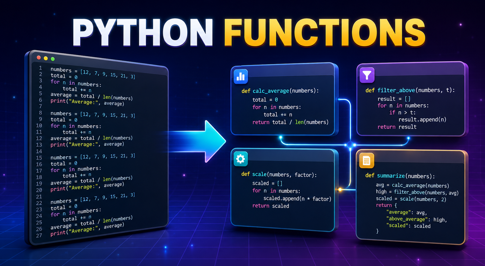

# Лекция 7. Функции, типизация и рефакторинг



## Вступление

На предыдущих лекциях мы научились писать условия, использовать циклы и работать с коллекциями. Благодаря этому мы уже можем создавать достаточно сложные программы.

Например, программа для работы с каталогом товаров может:

- выводить все товары;
- искать товары по названию;
- фильтровать их по категории;
- проверять наличие на складе;
- изменять количество товаров;
- вычислять общую стоимость.

Пока программа небольшая, весь код можно последовательно написать в одном файле. Но с появлением новых возможностей программа постепенно увеличивается, а некоторые действия начинают повторяться.

Например, одинаковый вывод информации о товаре может потребоваться при отображении всего каталога, результатов поиска или товаров выбранной категории:

```python
for product in products:
    print(
        product["title"],
        product["price"],
        product["quantity"]
    )
```

Постепенно возникают проблемы:

- одинаковый код повторяется в разных местах;
- программа становится длинной;
- в коде становится сложнее ориентироваться;
- одно изменение приходится вносить несколько раз;
- увеличивается вероятность допустить ошибку.

Нам нужен способ разделить большую программу на небольшие понятные действия, дать каждому действию имя и использовать его повторно.

Для решения этой задачи в Python применяются **функции**.

## Что такое функция?

**Функция** - это именованный блок кода, который выполняет определённую задачу.

Функцию можно представить как небольшую команду внутри программы. Вместо того чтобы каждый раз писать одно и то же действие заново, мы описываем его один раз, даём ему имя, а затем вызываем в нужных местах.

С некоторыми функциями Python мы уже знакомы:

```python
print("Hello!")

name = input("Введите имя: ")

name_length = len(name)

number = int("10")
```

В этом примере:

- `print()` выводит информацию;
- `input()` получает данные от пользователя;
- `len()` определяет количество элементов;
- `int()` преобразует значение в целое число.

Это готовые функции, которые предоставляет Python. Но разработчик также может создавать собственные функции.

---

### Создание функции


Для объявления функции используется ключевое слово `def`.

```python
def show_welcome():
    print("Добро пожаловать в программу!")
```

Разберём объявление функции по частям:

```text
def            - ключевое слово для создания функции
show_welcome   - имя функции
()             - круглые скобки
:              - начало тела функции
отступ         - код, который относится к функции
```

Код внутри функции обязательно записывается с отступом:

```python
def show_welcome():
    print("Добро пожаловать в программу!")
    print("Начинаем работу!")
```

Само объявление функции не запускает находящийся внутри неё код. Python только создаёт функцию и запоминает, какие действия она должна выполнять.

---

### Вызов функции

Чтобы выполнить код внутри функции, её необходимо **вызвать**. Для этого записывается имя функции и круглые скобки:

```python
show_welcome()
```

Полный пример:

```python
def show_welcome():
    print("Добро пожаловать в программу!")


show_welcome()
```

Результат:

```text
Добро пожаловать в программу!
```

Важно различать два действия:

```python
def show_welcome():
    print("Добро пожаловать в программу!")
```

Здесь мы **объявили функцию** - описали, что она должна делать.

```python
show_welcome()
```

А здесь мы **вызвали функцию** - попросили Python выполнить её код.

---

### Повторное использование функции

Одну функцию можно вызвать любое количество раз:

```python
def show_separator():
    print("-" * 30)


show_separator()
print("Каталог товаров")
show_separator()
```

Результат:

```text
------------------------------
Каталог товаров
------------------------------
```

Действие было описано только один раз, но использовано дважды.

```text
один раз объявили → много раз вызвали
```

Если позже мы захотим изменить вид разделителя, достаточно изменить только тело функции:

```python
def show_separator():
    print("=" * 40)
```

Все места, в которых вызывается `show_separator()`, автоматически начнут использовать новый вариант.

---

### Круглые скобки при вызове

Для вызова функции необходимо написать круглые скобки:

```python
show_welcome()
```

Если написать только имя функции:

```python
show_welcome
```

код внутри неё не выполнится. В таком случае мы обращаемся к самой функции, но не вызываем её.

```python
def show_message():
    print("Функция выполняется!")


show_message     # Функция не вызывается
show_message()   # Функция вызывается
```

К возможности сохранять и передавать функции мы вернёмся позже.

---

### В каком порядке выполняется программа?

Python продолжает выполнять программу сверху вниз. Когда он встречает объявление функции, то создаёт её, но не выполняет код внутри. Тело функции запускается только во время вызова.

```python
print("Начало программы")


def show_message():
    print("Код внутри функции")


print("Функция создана")

show_message()

print("Конец программы")
```

Результат:

```text
Начало программы
Функция создана
Код внутри функции
Конец программы
```

Функцию необходимо объявить до того места, где она вызывается. Следующий код приведёт к ошибке:

```python
show_message()


def show_message():
    print("Hello!")
```

В момент вызова Python ещё не знает о существовании функции `show_message()`:

```text
NameError: name 'show_message' is not defined
```

Обычно функции объявляют в верхней части файла, а их вызовы размещают ниже.

## Параметры и аргументы

Пока созданные нами функции всегда выполняют одно и то же действие:

```python
def show_welcome():
    print("Добро пожаловать в программу!")
```

При каждом вызове результат будет одинаковым:

```python
show_welcome()
show_welcome()
```

Чтобы функция могла работать с разными данными, в неё можно передавать значения. Например, создадим функцию, которая приветствует пользователя по имени:

```python
def greet_user(name):
    print(f"Привет, {name}!")
```

Теперь при вызове функции мы можем передавать разные имена:

```python
greet_user("Daniil")
greet_user("Anna")
greet_user("Alex")
```

Результат:

```text
Привет, Daniil!
Привет, Anna!
Привет, Alex!
```

Одна функция выполняет одинаковое действие, но работает с разными данными.

---

### Что такое параметр?

**Параметр** - это переменная, которая указывается в круглых скобках во время объявления функции.

```python
def greet_user(name):
    print(f"Привет, {name}!")
```

В этом примере `name` - параметр функции. Параметр можно представить как специальную переменную, значение которой будет получено во время вызова функции.

Внутри функции с параметром можно работать так же, как с обычной переменной:

```python
def show_name(name):
    print(f"Имя пользователя: {name}")
    print(f"Количество символов: {len(name)}")
```

---

### Что такое аргумент?

**Аргумент** - это конкретное значение, которое передаётся функции во время её вызова.

```python
greet_user("Daniil")
```

В этом примере:

- `name` - параметр;
- `"Daniil"` - аргумент.

```text
Параметр - переменная при объявлении функции.
Аргумент - значение при вызове функции.
```

Рассмотрим ещё один пример:

```python
def show_price(price):
    print(f"Цена товара: {price} Kč")


show_price(1200)
```

Здесь:

- `price` - параметр;
- `1200` - аргумент.

Во время вызова значение `1200` передаётся в параметр `price`. После этого функция может использовать `price` внутри своего тела.

Упрощённо этот процесс можно представить так:

```text
show_price(1200)
           ↓
      price = 1200
           ↓
выполнение тела функции
```

---

### Несколько параметров

Функция может принимать несколько параметров. Они перечисляются в круглых скобках через запятую. Создадим функцию для вывода информации о товаре:

```python
def show_product(title, price, quantity):
    print(
        f"{title} - "
        f"{price} Kč, "
        f"количество: {quantity}"
    )
```

При вызове необходимо передать значения для всех параметров:

```python
show_product("Laptop", 1200, 3)
show_product("Phone", 800, 0)
show_product("Keyboard", 100, 10)
```

Результат:

```text
Laptop - 1200 Kč, количество: 3
Phone - 800 Kč, количество: 0
Keyboard - 100 Kč, количество: 10
```

При каждом вызове Python связывает переданные аргументы с параметрами функции:

```text
title     = "Laptop"
price     = 1200
quantity  = 3
```

После этого выполняется код внутри функции.

---

### Позиционные аргументы

По умолчанию аргументы передаются в функцию по позиции.

```python
show_product("Laptop", 1200, 3)
```

Python связывает значения с параметрами в том порядке, в котором они были переданы:

```text
первый аргумент  → title
второй аргумент  → price
третий аргумент  → quantity
```

Такие аргументы называются **позиционными**. Порядок позиционных аргументов имеет значение. Если перепутать значения местами, программа может вывести неправильный результат:

```python
show_product(1200, "Laptop", 3)
```

Результат:

```text
1200 - Laptop Kč, количество: 3
```

Python не понимает смысл переданных данных. Он только распределяет их по порядку. Поэтому при использовании позиционных аргументов важно соблюдать правильную последовательность.

---

### Именованные аргументы

Аргумент можно передать, явно указав имя параметра:

```python
show_product(
    title="Laptop",
    price=1200,
    quantity=3
)
```

Такие аргументы называются **именованными**. При использовании именованных аргументов порядок уже не имеет значения:

```python
show_product(
    quantity=3,
    title="Laptop",
    price=1200
)
```

Python понимает, какому параметру предназначено каждое значение, потому что мы указали его имя.

Именованные аргументы особенно полезны, когда:

- функция принимает несколько значений;
- по самому значению сложно понять его назначение;
- мы хотим сделать вызов функции более понятным;
- необходимо изменить порядок передаваемых аргументов.

Сравним два варианта:

```python
create_product("Laptop", 1200, 3, True)
```

Без объявления функции сложно сразу понять, что означают `3` и `True`.

С именованными аргументами вызов читается понятнее:

```python
create_product(
    title="Laptop",
    price=1200,
    quantity=3,
    is_available=True
)
```

---

### Совместное использование аргументов

В одном вызове можно использовать и позиционные, и именованные аргументы:

```python
show_product(
    "Laptop",
    price=1200,
    quantity=3
)
```

Но позиционные аргументы должны находиться перед именованными.

Правильно:

```python
show_product(
    "Laptop",
    price=1200,
    quantity=3
)
```

Неправильно:

```python
show_product(
    title="Laptop",
    1200,
    3
)
```

Такой код приведёт к синтаксической ошибке, потому что позиционные аргументы записаны после именованного.

---

### Количество аргументов должно соответствовать параметрам

Если у функции три обязательных параметра, при вызове необходимо передать три аргумента:

```python
def show_product(title, price, quantity):
    print(
        f"{title} - "
        f"{price} Kč, "
        f"количество: {quantity}"
    )
```

Если передать недостаточно аргументов:

```python
show_product("Laptop", 1200)
```

Python сообщит, что значение для параметра `quantity` отсутствует:

```text
TypeError: show_product() missing 1 required positional argument: 'quantity'
```

Если передать слишком много аргументов:

```python
show_product("Laptop", 1200, 3, "electronics")
```

такой вызов также приведёт к ошибке:

```text
TypeError: show_product() takes 3 positional arguments but 4 were given
```

## Параметры по умолчанию

До этого момента у нас все параметры функции были обязательными.

Например:

```python
def greet_user(name, greeting):
    print(f"{greeting}, {name}!")
```

При вызове необходимо передать оба аргумента:

```python
greet_user("Daniil", "Привет")
```

Если не передать значение для одного из параметров, возникнет ошибка:

```python
greet_user("Daniil")
```

```text
TypeError: greet_user() missing 1 required positional argument: 'greeting'
```

Однако некоторые значения часто остаются одинаковыми. Чтобы не передавать их при каждом вызове, параметру можно назначить **значение по умолчанию**.

---

### Создание параметра со значением по умолчанию

Значение по умолчанию указывается при объявлении функции с помощью оператора `=`:

```python
def greet_user(name, greeting="Привет"):
    print(f"{greeting}, {name}!")
```

Теперь параметр `greeting` является необязательным.

Функцию можно вызвать, передав только имя:

```python
greet_user("Daniil")
```

Результат:

```text
Привет, Daniil!
```

Поскольку аргумент для параметра `greeting` не был передан, Python использовал значение `"Привет"`.

Упрощённо это можно представить так:

```text
аргумент передан     → используется переданное значение
аргумент не передан  → используется значение по умолчанию
```

---

### Замена значения по умолчанию

Значение по умолчанию используется только в том случае, если соответствующий аргумент не был передан.

При необходимости его можно заменить:

```python
greet_user("Daniil")
greet_user("Anna", "Добро пожаловать")
greet_user("Alex", "Добрый вечер")
```

Результат:

```text
Привет, Daniil!
Добро пожаловать, Anna!
Добрый вечер, Alex!
```

В первом вызове используется значение по умолчанию:

```python
greeting = "Привет"
```

Во втором и третьем вызовах используются переданные значения:

```python
greeting = "Добро пожаловать"
greeting = "Добрый вечер"
```

---

### Обязательные и необязательные параметры

Рассмотрим объявление функции:

```python
def greet_user(name, greeting="Привет"):
    print(f"{greeting}, {name}!")
```

В этой функции:

- `name` - обязательный параметр;
- `greeting` - необязательный параметр со значением по умолчанию.

Значение для `name` необходимо передать при каждом вызове:

```python
greet_user("Daniil")
```

Если вызвать функцию без аргументов:

```python
greet_user()
```

возникнет ошибка:

```text
TypeError: greet_user() missing 1 required positional argument: 'name'
```

Наличие значения по умолчанию у одного параметра не делает остальные параметры необязательными.

---

### Несколько параметров по умолчанию

Функция может содержать несколько необязательных параметров:

```python
def show_product(
    title,
    price,
    quantity=0,
    category="other"
):
    print(f"Название: {title}")
    print(f"Цена: {price} Kč")
    print(f"Количество: {quantity}")
    print(f"Категория: {category}")
```

Передадим только обязательные аргументы:

```python
show_product("Laptop", 1200)
```

Результат:

```text
Название: Laptop
Цена: 1200 Kč
Количество: 0
Категория: other
```

Python использовал стандартные значения для `quantity` и `category`.

Передадим все аргументы:

```python
show_product(
    "Laptop",
    1200,
    3,
    "electronics"
)
```

Результат:

```text
Название: Laptop
Цена: 1200 Kč
Количество: 3
Категория: electronics
```

---

### Изменение отдельных значений

Если функция содержит несколько параметров по умолчанию, удобнее использовать именованные аргументы.

Например, мы хотим указать категорию, но оставить стандартное количество:

```python
show_product(
    "Laptop",
    1200,
    category="electronics"
)
```

Результат:

```text
Название: Laptop
Цена: 1200 Kč
Количество: 0
Категория: electronics
```

Мы не передали аргумент для `quantity`, поэтому Python использовал значение `0`. При этом значение для `category` было передано явно.

Именованные аргументы позволяют изменять только необходимые значения:

```python
show_product(
    title="Phone",
    price=800,
    quantity=5
)
```

Параметр `category` снова получит значение `"other"`.

---

### Порядок параметров

Обязательные параметры должны находиться перед параметрами со значениями по умолчанию.

Правильно:

```python
def create_product(title, price, quantity=0):
    print(title, price, quantity)
```

Здесь сначала записаны обязательные параметры:

```text
title
price
```

После них находится необязательный параметр:

```text
quantity=0
```

Неправильно:

```python
def create_product(quantity=0, title, price):
    print(title, price, quantity)
```

Такое объявление приведёт к ошибке:

```text
SyntaxError: non-default argument follows default argument
```

Python не разрешает размещать обязательные параметры после параметров со значениями по умолчанию.

Правило можно записать так:

```text
сначала обязательные параметры
после них параметры со значениями по умолчанию
```

---

### Когда использовать значения по умолчанию?

Значения по умолчанию полезны, когда у функции есть стандартное поведение, которое иногда необходимо изменить.

Например:

```python
def calculate_price(price, discount=0):
    final_price = price - price * discount / 100
    print(f"Итоговая цена: {final_price} Kč")
```

Вызов без скидки:

```python
calculate_price(1000)
```

Результат:

```text
Итоговая цена: 1000.0 Kč
```

Вызов со скидкой:

```python
calculate_price(1000, 20)
```

Результат:

```text
Итоговая цена: 800.0 Kč
```

Параметры по умолчанию делают функцию удобнее: обязательные данные мы передаём всегда, а дополнительные - только при необходимости.

## Возвращение результата функции: `return`

Функция может не только выполнять действия, но и возвращать результат своей работы. Для возвращения значения используется ключевое слово `return`.

```python
def calculate_total(price, quantity):
    total = price * quantity
    return total
```

Вызовем функцию и сохраним результат в переменную:

```python
result = calculate_total(1200, 3)

print(result)
```

Результат:

```text
3600
```

Когда выполняется строка:

```python
result = calculate_total(1200, 3)
```

функция вычисляет результат и возвращает его:

```text
calculate_total(1200, 3) → 3600
```

Поэтому в переменную `result` записывается число `3600`.

---

### Использование возвращённого значения

Результат функции можно сохранить в переменную и использовать дальше:

```python
total = calculate_total(1200, 3)
delivery = 150

final_price = total + delivery

print(f"Итоговая стоимость: {final_price} Kč")
```

Результат:

```text
Итоговая стоимость: 3750 Kč
```

Также вызов функции можно сразу использовать в выражении:

```python
final_price = calculate_total(1200, 3) + 150

print(final_price)
```

Или передать в другую функцию:

```python
print(calculate_total(1200, 3))
```

`return` возвращает значение из функции, а `print()` только выводит информацию в консоль.

---

### `return` завершает выполнение функции

После выполнения `return` функция сразу прекращает свою работу.

```python
def calculate_total(price, quantity):
    total = price * quantity

    return total

    print("Расчёт завершён")
```

Строка:

```python
print("Расчёт завершён")
```

не выполнится, потому что она находится после `return`.

Поэтому весь необходимый код функции должен располагаться до возвращения результата.

---

### Несколько `return` в функции

В одной функции может быть несколько `return`. Это удобно при использовании условий.

```python
def get_product_status(quantity):
    if quantity > 0:
        return "Товар есть в наличии"

    return "Товара нет в наличии"
```

Проверим функцию:

```python
status = get_product_status(5)
print(status)
```

Результат:

```text
Товар есть в наличии
```

Если условие выполняется, функция возвращает первый результат и сразу завершает работу. Если условие не выполняется, Python переходит к следующему `return`.

---

### Возвращение разных типов данных

Функция может возвращать значения разных типов:

```python
def get_product_title():
    return "Laptop"


def calculate_price():
    return 1200


def is_available():
    return True
```

Функция также может возвращать список, словарь или другой объект:

```python
def create_product():
    product = {
        "title": "Laptop",
        "price": 1200,
        "quantity": 3
    }

    return product
```

Используем результат:

```python
product = create_product()

print(product["title"])
print(product["price"])
```

---

### Возвращение нескольких значений

Функция может вернуть несколько значений:

```python
def calculate_price(price, discount):
    discount_amount = price * discount / 100
    final_price = price - discount_amount

    return discount_amount, final_price
```

Результаты можно сохранить в несколько переменных:

```python
discount_amount, final_price = calculate_price(1000, 20)

print(f"Размер скидки: {discount_amount} Kč")
print(f"Итоговая цена: {final_price} Kč")
```

Результат:

```text
Размер скидки: 200.0 Kč
Итоговая цена: 800.0 Kč
```

Благодаря `return` функция может передать результат своей работы в основную программу. Этот результат можно сохранить, использовать в вычислениях, условиях или передать другой функции.

## Область видимости переменных

Переменные в Python доступны не во всех частях программы. Место, в котором можно использовать переменную, называется её **областью видимости**.

Переменные могут быть:

- **локальными;**
- **глобальными.**

---

### Локальные переменные

Переменная, созданная внутри функции, называется **локальной**.

```python
def calculate_total(price, quantity):
    total = price * quantity
    return total
```

Переменная `total` существует только внутри функции `calculate_total()`. Если попробовать обратиться к `total` за пределами функции:

```python
print(total)
```

возникнет ошибка:

```text
NameError: name 'total' is not defined
```

Основная программа не видит локальные переменные функции.

---

### Параметры функции тоже являются локальными

Параметры доступны только внутри функции:

```python
def greet_user(name):
    message = f"Привет, {name}!"
    return message
```

В этой функции локальными являются:

```text
name
message
```

За пределами функции использовать их нельзя:

```python
greet_user("Daniil")

print(name)
```

Результат:

```text
NameError: name 'name' is not defined
```

При каждом новом вызове функция получает новые локальные значения:

```python
print(greet_user("Daniil"))
print(greet_user("Anna"))
```

---

### Глобальные переменные

**Глобальная переменная** создаётся за пределами функции и доступна в основной программе. Своего рода глобальная переменная - это переменная, которая видна всем функциям.

```python
tax = 21


def calculate_price(price):
    tax_amount = price * tax / 100
    return price + tax_amount
```

Функция может использовать глобальную переменную `tax`:

```python
result = calculate_price(1000)

print(result)
```

Результат:

```text
1210.0
```

Глобальная переменная доступна как в основной программе, так и внутри функций.

```python
tax = 21

print(tax)


def show_tax():
    print(tax)
```

---

### Локальная и глобальная переменные с одинаковым именем

Локальная переменная может иметь такое же имя, как глобальная:

```python
price = 1000


def show_price():
    price = 500
    print(f"Цена внутри функции: {price} Kč")


show_price()

print(f"Цена за пределами функции: {price} Kč")
```

Результат:

```text
Цена внутри функции: 500 Kč
Цена за пределами функции: 1000 Kč
```

Несмотря на одинаковые имена, это две разные переменные:

```text
price внутри функции  → локальная переменная
price вне функции     → глобальная переменная
```

Локальная переменная не изменяет глобальную.

---

### Изменение глобальной переменной

По умолчанию функция может читать глобальную переменную, но не может напрямую изменить её.

```python
counter = 0


def increase_counter():
    counter = counter + 1
```

Такой код приведёт к ошибке:

```text
UnboundLocalError
```

Поскольку внутри функции выполняется присваивание, Python считает `counter` локальной переменной.

Для изменения глобальной переменной используется ключевое слово `global`:

```python
counter = 0


def increase_counter():
    global counter
    counter += 1


increase_counter()
increase_counter()

print(counter)
```

Результат:

```text
2
```

Однако частое изменение глобальных переменных усложняет программу. Обычно лучше вернуть новое значение с помощью `return`:

```python
def increase_counter(counter):
    return counter + 1


counter = 0

counter = increase_counter(counter)
counter = increase_counter(counter)

print(counter)
```

Результат:

```text
2
```

Так функция явно получает значение и возвращает результат своей работы.

> P.S. Вообще лучше избегать глобальных переменных, если это возможно. Они усложняют программу и делают её менее предсказуемой. Так как глобальные переменные могут быть изменены в любом месте программы, что затрудняет отслеживание их состояния.

---

### Кратко об области видимости

```text
Глобальная переменная:
создаётся за пределами функции
доступна в основной программе
может быть прочитана внутри функции

Локальная переменная:
создаётся внутри функции
доступна только внутри этой функции
не существует за её пределами

Параметр функции:
является локальной переменной
```

Область видимости помогает отделять внутренние данные функции от остальных частей программы. Благодаря этому функции могут работать независимо и не изменять случайно переменные основной программы.

## Произвольное количество аргументов: `*args` и `**kwargs`

Иногда заранее неизвестно, сколько аргументов будет передано в функцию. Для работы с произвольным количеством аргументов в Python используются:

- `*args` - для позиционных аргументов;
- `**kwargs` - для именованных аргументов.

> args - сокращение от "arguments" (аргументы), kwargs - сокращение от "keyword arguments" (именованные аргументы). Эти названия являются общепринятыми, но их можно заменить на другие.

### `*args`: произвольное количество позиционных аргументов

Если перед названием параметра поставить `*`, все переданные позиционные аргументы будут собраны в кортеж.

```python
def print_args(*args):
    print(args)


print_args(1, 2, 3, "hello")
```

Результат:

```text
(1, 2, 3, 'hello')
```

В этом примере переменная `args` содержит кортеж:

```python
(1, 2, 3, "hello")
```

Название `args` является общепринятым, но можно использовать и другое название:

```python
def print_numbers(*numbers):
    print(numbers)
```

Главное - поставить `*` перед названием параметра.

### Использование `*args` в цикле

Так как аргументы собираются в кортеж, их можно перебрать с помощью цикла:

```python
def print_words(*words):
    for word in words:
        print(word)


print_words("Python", "is", "awesome")
```

Результат:

```text
Python
is
awesome
```

### Использование `*args` в вычислениях

Создадим функцию, которая перемножает любое количество чисел:

```python
def multiply(*numbers):
    result = 1

    for number in numbers:
        result *= number

    return result


print(multiply(2, 3, 4))
```

Результат:

```text
24
```

Функция может принимать разное количество аргументов:

```python
print(multiply(2, 5))
print(multiply(2, 3, 4))
print(multiply(1, 2, 3, 4, 5))
```

---

### `**kwargs`: произвольное количество именованных аргументов

Если перед названием параметра поставить `**`, все переданные именованные аргументы будут собраны в словарь.

```python
def print_kwargs(**kwargs):
    print(kwargs)


print_kwargs(
    name="Alice",
    age=25,
    city="Prague"
)
```

Результат:

```text
{
    'name': 'Alice',
    'age': 25,
    'city': 'Prague'
}
```

В этом примере:

```text
name, age, city → ключи словаря
Alice, 25, Prague → значения словаря
```

Название `kwargs` является общепринятым, но его также можно заменить:

```python
def print_user(**user_data):
    print(user_data)
```

Главное - использовать `**` перед названием параметра.

### Использование `**kwargs` в цикле

Поскольку `kwargs` является словарём, его можно перебрать с помощью метода `items()`:

```python
def print_user_info(**kwargs):
    for key, value in kwargs.items():
        print(f"{key}: {value}")


print_user_info(
    name="John",
    age=30,
    country="USA"
)
```

Результат:

```text
name: John
age: 30
country: USA
```

### Использование `**kwargs` для настроек

С помощью `**kwargs` можно передавать дополнительные настройки функции:

```python
def configure_settings(**kwargs):
    settings = {
        "theme": "light",
        "language": "English",
        "notifications": True
    }

    settings.update(kwargs)

    return settings
```

Изменим часть стандартных настроек:

```python
result = configure_settings(
    language="French",
    notifications=False
)

print(result)
```

Результат:

```text
{
    'theme': 'light',
    'language': 'French',
    'notifications': False
}
```

Переданные значения заменили соответствующие стандартные настройки.

---

### Совместное использование `*args` и `**kwargs`

Обе конструкции можно использовать в одной функции:

```python
def print_information(*args, **kwargs):
    print("Позиционные аргументы:", args)
    print("Именованные аргументы:", kwargs)
```

Вызовем функцию:

```python
print_information(
    10,
    20,
    30,
    name="Daniil",
    city="Prague"
)
```

Результат:

```text
Позиционные аргументы: (10, 20, 30)
Именованные аргументы: {'name': 'Daniil', 'city': 'Prague'}
```

При совместном использовании `*args` записывается перед `**kwargs`:

```python
def function_name(*args, **kwargs):
    ...
```

Также перед `*args` можно добавить обычные обязательные параметры:

```python
def create_order(customer, *products, **details):
    print(f"Покупатель: {customer}")
    print(f"Товары: {products}")
    print(f"Дополнительная информация: {details}")
```

Вызовем функцию:

```python
create_order(
    "Daniil",
    "Laptop",
    "Mouse",
    delivery="Prague",
    payment="card"
)
```

Аргументы распределятся следующим образом:

```text
customer → "Daniil"

products → ("Laptop", "Mouse")

details → {
    "delivery": "Prague",
    "payment": "card"
}
```

---

### Распаковка коллекций с `*` и `**`

Символы `*` и `**` используются не только при объявлении функции, но и при её вызове.

#### Распаковка списка или кортежа

Создадим функцию, принимающую два числа:

```python
def multiply(a, b):
    return a * b
```

У нас есть кортеж с аргументами:

```python
numbers = (3, 4)
```

Распакуем его с помощью `*`:

```python
result = multiply(*numbers)

print(result)
```

Эта запись:

```python
multiply(*numbers)
```

работает так же, как:

```python
multiply(3, 4)
```

#### Распаковка словаря

Создадим функцию с именованными параметрами:

```python
def print_person(name, age):
    print(f"Имя: {name}")
    print(f"Возраст: {age}")
```

Подготовим словарь:

```python
person = {
    "name": "Alice",
    "age": 30
}
```

Передадим его в функцию с помощью `**`:

```python
print_person(**person)
```

Эта запись работает так же, как:

```python
print_person(
    name="Alice",
    age=30
)
```

Имена ключей словаря должны совпадать с названиями параметров функции.

---

## Типизация и аннотации типов

Python - язык с динамической типизацией. Это означает, что тип переменной определяется автоматически во время выполнения программы.

```python
value = 10
print(type(value))

value = "Hello"
print(type(value))
```

Одна переменная может хранить значения разных типов.

Начиная с Python 3.5, в функциях можно использовать **аннотации типов**. Они позволяют указать ожидаемые типы параметров и возвращаемого значения.

```python
def add(x: int, y: int) -> int:
    result = x + y
    return result
```

Разберём запись функции:

```text
x: int   - параметр x должен содержать целое число
y: int   - параметр y должен содержать целое число
-> int   - функция должна вернуть целое число
```

Тип параметра указывается после его названия через двоеточие:

```python
parameter: type
```

Тип возвращаемого значения указывается после круглых скобок с помощью стрелки `->`:

```python
def function_name(parameter: type) -> return_type:
    ...
```

Ещё один пример:

```python
def calculate_total(price: float, quantity: int) -> float:
    return price * quantity
```

Вызовем функцию:

```python
total = calculate_total(299.90, 3)

print(total)
```

Результат:

```text
899.7
```

В этом примере:

```text
price: float    - цена является дробным числом
quantity: int   - количество является целым числом
-> float        - функция возвращает дробное число
```

Важно понимать, что аннотации не изменяют типы данных и не запрещают передавать значения другого типа. Python продолжает использовать динамическую типизацию.

Аннотации нужны для того, чтобы:

- сделать код понятнее;
- показать, какие данные ожидает функция;
- получить подсказки от IDE;
- использовать инструменты для проверки типов.

Указывать типы необязательно, но в современных проектах функции принято покрывать аннотациями типов.

## Передача изменяемых и неизменяемых объектов в функцию

В Python данные делятся на изменяемые и неизменяемые.

| Неизменяемые типы | Изменяемые типы |
| --------------------------------- | ----------------------------- |
| `int`                           | `list`                      |
| `float`                         | `dict`                      |
| `str`                           | `set`                       |
| `bool`                          | Объекты классов |
| `tuple`                         |                               |

- **Неизменяемые объекты** нельзя изменить после создания.
- **Изменяемые объекты** можно изменять без создания нового объекта.

При вызове функции параметр начинает ссылаться на переданный объект.

Поведение функции зависит от того, изменяемый это объект или неизменяемый.

### Передача неизменяемого объекта

Рассмотрим пример с числом:

```python
def modify_number(number):
    number += 10
    print(f"Внутри функции: {number}")


value = 5

modify_number(value)

print(f"За пределами функции: {value}")
```

Результат:

```text
Внутри функции: 15
За пределами функции: 5
```

Числа являются неизменяемыми объектами.

Операция:

```python
number += 10
```

не изменяет старое число. Python создаёт новый объект со значением `15`, после чего локальный параметр `number` начинает ссылаться на него.

Переменная `value` продолжает ссылаться на число `5`.

То же самое происходит со строками:

```python
def modify_text(text):
    text += "!"
    print(f"Внутри функции: {text}")


message = "Hello"

modify_text(message)

print(f"За пределами функции: {message}")
```

Результат:

```text
Внутри функции: Hello!
За пределами функции: Hello
```

### Передача изменяемого объекта

Список является изменяемым объектом:

```python
def add_product(products):
    products.append("Keyboard")


product_list = ["Laptop", "Mouse"]

add_product(product_list)

print(product_list)
```

Результат:

```text
['Laptop', 'Mouse', 'Keyboard']
```

Параметр `products` и переменная `product_list` ссылаются на один список.

Метод `append()` изменяет этот список, поэтому изменение видно и за пределами функции.

То же самое происходит со словарями:

```python
def change_price(product):
    product["price"] = 1500


product_data = {
    "title": "Laptop",
    "price": 1200
}

change_price(product_data)

print(product_data)
```

Результат:

```text
{'title': 'Laptop', 'price': 1500}
```

### Изменение объекта и создание нового объекта

Важно различать изменение переданного объекта и присваивание нового объекта.

```python
def replace_products(products):
    products = ["Monitor", "Keyboard"]


product_list = ["Laptop", "Mouse"]

replace_products(product_list)

print(product_list)
```

Результат:

```text
['Laptop', 'Mouse']
```

Строка:

```python
products = ["Monitor", "Keyboard"]
```

создаёт новый список и записывает ссылку на него в локальный параметр `products`.

Она не заменяет список, на который ссылается переменная `product_list`.

Сравним:

```python
def modify_products(products):
    products.append("Keyboard")


def replace_products(products):
    products = ["Monitor", "Keyboard"]
```

В первом случае изменяется переданный список. Во втором случае создаётся новый локальный список.

### Как не изменять исходный список

Если функция не должна изменять исходные данные, можно создать копию списка:

```python
def add_product(products):
    products_copy = products.copy()
    products_copy.append("Keyboard")

    return products_copy
```

Используем функцию:

```python
original_products = ["Laptop", "Mouse"]

new_products = add_product(original_products)

print(original_products)
print(new_products)
```

Результат:

```text
['Laptop', 'Mouse']
['Laptop', 'Mouse', 'Keyboard']
```

Метод `copy()` создаёт поверхностную копию списка. Если коллекция содержит вложенные изменяемые объекты, можно использовать `deepcopy()`:

```python
from copy import deepcopy


def add_tag(products):
    products_copy = deepcopy(products)
    products_copy[0]["tags"].append("sale")

    return products_copy
```

Проверим функцию:

```python
products = [
    {
        "title": "Laptop",
        "tags": ["electronics"]
    }
]

new_products = add_tag(products)

print(products)
print(new_products)
```

Результат:

```text
[{'title': 'Laptop', 'tags': ['electronics']}]

[{'title': 'Laptop', 'tags': ['electronics', 'sale']}]
```

`deepcopy()` копирует не только внешнюю коллекцию, но и вложенные объекты.

---

## Документирование функций: `docstring`

`docstring` - это строка документации, которая описывает назначение функции. Она записывается сразу после объявления функции:

```python
def calculate_total(price, quantity):
    """Вычисляет общую стоимость товаров."""
    return price * quantity
```

Для более подробного описания можно указать параметры и возвращаемое значение:

```python
def calculate_total(price: float, quantity: int) -> float:
    """
    Вычисляет общую стоимость товаров.

    Args:
        price: Цена одного товара.
        quantity: Количество товаров.

    Returns:
        Общая стоимость товаров.
    """
    return price * quantity
```

Документацию функции можно посмотреть с помощью `help()`:

```python
help(calculate_total)
```

Или через атрибут `__doc__`:

```python
print(calculate_total.__doc__)
```

Строки документации помогают другим разработчикам понять назначение функции, не изучая всё её содержимое.

## Анонимные функции `lambda`

**Лямбда-функция** - это короткая функция, которая создаётся без ключевого слова `def`.

Она записывается в одну строку с помощью ключевого слова `lambda`.

Синтаксис:

```python
lambda параметры: выражение
```

Создадим лямбда-функцию для вычисления квадрата числа:

```python
square = lambda number: number ** 2

print(square(5))
```

Результат:

```text
25
```

Эта лямбда-функция выполняет ту же задачу, что и обычная функция:

```python
def square(number):
    return number ** 2
```

В `lambda` не нужно писать `return`. Результат выражения возвращается автоматически.

### Несколько параметров

Лямбда-функция может принимать несколько параметров:

```python
add = lambda a, b: a + b

print(add(10, 5))
```

Результат:

```text
15
```

Ещё один пример:

```python
calculate_total = lambda price, quantity: price * quantity

print(calculate_total(299.90, 3))
```

Результат:

```text
899.7
```

### Условие в `lambda`

В лямбда-функции можно использовать короткое условное выражение:

```python
get_status = lambda quantity: "В наличии" if quantity > 0 else "Нет в наличии"

print(get_status(5))
print(get_status(0))
```

Результат:

```text
В наличии
Нет в наличии
```

Лямбда-функция может содержать только одно выражение. В ней нельзя записать несколько обычных инструкций, циклов или большой блок условий. Поэтому `lambda` используется для небольших действий. Для сложной логики лучше создать обычную функцию через `def`.

Чаще всего лямбда-функции не сохраняют в переменные, а сразу передают другим функциям:

```python
def calculate(a, b, operation):
    return operation(a, b)


result = calculate(10, 5, lambda a, b: a * b)

print(result)
```

Результат:

```text
50
```

---

## Использование `lambda` с `sorted()`

Функция `sorted()` возвращает новую отсортированную коллекцию.

```python
numbers = [5, 2, 8, 1, 4]

sorted_numbers = sorted(numbers)

print(sorted_numbers)
```

Результат:

```text
[1, 2, 4, 5, 8]
```

Через параметр `key` можно передать функцию, которая определит правило сортировки.

Например, отсортируем слова по длине:

```python
words = ["Python", "JS", "Django", "API"]

sorted_words = sorted(words, key=lambda word: len(word))

print(sorted_words)
```

Результат:

```text
['JS', 'API', 'Python', 'Django']
```

Отсортируем товары по цене:

```python
products = [
    {"title": "Laptop", "price": 1200},
    {"title": "Mouse", "price": 30},
    {"title": "Keyboard", "price": 80}
]

sorted_products = sorted(
    products,
    key=lambda product: product["price"]
)

print(sorted_products)
```

Для сортировки по убыванию используется параметр `reverse=True`:

```python
sorted_products = sorted(
    products,
    key=lambda product: product["price"],
    reverse=True
)
```

### Использование `lambda` с `min()` и `max()`

Параметр `key` также можно использовать с функциями `min()` и `max()`.

Найдём самый дешёвый товар:

```python
cheapest_product = min(
    products,
    key=lambda product: product["price"]
)

print(cheapest_product)
```

Результат:

```text
{'title': 'Mouse', 'price': 30}
```

Найдём самый дорогой товар:

```python
most_expensive_product = max(
    products,
    key=lambda product: product["price"]
)

print(most_expensive_product)
```

Результат:

```text
{'title': 'Laptop', 'price': 1200}
```

---

## Функция `map()`

Функция `map()` применяет переданную функцию к каждому элементу последовательности.

Синтаксис:

```python
map(function, iterable)
```

- `function` - функция, которая будет вызвана для каждого элемента;
- `iterable` - последовательность, которую необходимо обработать.

Создадим список квадратов чисел:

```python
def square(number):
    return number ** 2


numbers = [1, 2, 3, 4, 5]

result = map(square, numbers)

print(list(result))
```

Результат:

```text
[1, 4, 9, 16, 25]
```

Функция `map()` возвращает специальный объект-итератор. Чтобы получить обычный список, результат передают в `list()`.

### Использование `map()` с `lambda`

```python
numbers = [1, 2, 3, 4, 5]

squared_numbers = list(
    map(lambda number: number ** 2, numbers)
)

print(squared_numbers)
```

Результат:

```text
[1, 4, 9, 16, 25]
```

Увеличим каждую цену на 10%:

```python
prices = [100, 250, 500]

new_prices = list(
    map(lambda price: price * 1.10, prices)
)

print(new_prices)
```

Результат:

```text
[110.00000000000001, 275.0, 550.0]
```

Результат можно округлить:

```python
new_prices = list(
    map(lambda price: round(price * 1.10, 2), prices)
)
```

### Применение `map()` к строкам

```python
words = ["hello", "world", "python"]

upper_words = list(map(str.upper, words))

print(upper_words)
```

Результат:

```text
['HELLO', 'WORLD', 'PYTHON']
```

### Работа с несколькими последовательностями

В `map()` можно передать несколько последовательностей:

```python
prices = [100, 200, 300]
quantities = [2, 3, 4]

totals = list(
    map(
        lambda price, quantity: price * quantity,
        prices,
        quantities
    )
)

print(totals)
```

Результат:

```text
[200, 600, 1200]
```

Первый элемент списка `prices` обрабатывается вместе с первым элементом списка `quantities`, второй - со вторым и так далее.

---

## Функция `filter()`

Функция `filter()` отбирает элементы последовательности по заданному условию.

Синтаксис:

```python
filter(function, iterable)
```

Функция, переданная в `filter()`, должна возвращать:

- `True` - элемент остаётся;
- `False` - элемент исключается.

Отберём чётные числа:

```python
def is_even(number):
    return number % 2 == 0


numbers = [1, 2, 3, 4, 5, 6]

result = filter(is_even, numbers)

print(list(result))
```

Результат:

```text
[2, 4, 6]
```

Как и `map()`, функция `filter()` возвращает итератор.

### Использование `filter()` с `lambda`

```python
numbers = [1, 2, 3, 4, 5, 6]

even_numbers = list(
    filter(lambda number: number % 2 == 0, numbers)
)

print(even_numbers)
```

Результат:

```text
[2, 4, 6]
```

Отберём слова, длина которых больше трёх символов:

```python
words = ["apple", "cat", "banana", "dog", "elephant"]

long_words = list(
    filter(lambda word: len(word) > 3, words)
)

print(long_words)
```

Результат:

```text
['apple', 'banana', 'elephant']
```

Отберём товары, которые есть в наличии:

```python
products = [
    {"title": "Laptop", "in_stock": True},
    {"title": "Mouse", "in_stock": False},
    {"title": "Keyboard", "in_stock": True}
]

available_products = list(
    filter(lambda product: product["in_stock"], products)
)

print(available_products)
```

### Использование `filter()` без функции

Если вместо функции передать `None`, `filter()` удалит все ложные значения:

```python
values = [10, 0, "", "Python", None, False, 25]

result = list(filter(None, values))

print(result)
```

Результат:

```text
[10, 'Python', 25]
```

К ложным значениям относятся `0`, пустые строки, `None`, `False` и пустые коллекции.

---

## Функция `zip()`

Функция `zip()` объединяет элементы нескольких последовательностей.

Синтаксис:

```python
zip(iterable1, iterable2, ...)
```

Объединим имена и возраст пользователей:

```python
names = ["Alice", "Bob", "Charlie"]
ages = [25, 30, 35]

users = list(zip(names, ages))

print(users)
```

Результат:

```text
[('Alice', 25), ('Bob', 30), ('Charlie', 35)]
```

Каждый элемент результата является кортежем.

### Использование `zip()` в цикле

```python
names = ["Alice", "Bob", "Charlie"]
ages = [25, 30, 35]

for name, age in zip(names, ages):
    print(f"{name}: {age}")
```

Результат:

```text
Alice: 25
Bob: 30
Charlie: 35
```

### Создание словаря с помощью `zip()`

```python
names = ["Alice", "Bob", "Charlie"]
ages = [25, 30, 35]

users = dict(zip(names, ages))

print(users)
```

Результат:

```text
{'Alice': 25, 'Bob': 30, 'Charlie': 35}
```

### Последовательности разной длины

Если последовательности имеют разную длину, `zip()` остановится на самой короткой:

```python
names = ["Alice", "Bob", "Charlie"]
ages = [25, 30]

print(list(zip(names, ages)))
```

Результат:

```text
[('Alice', 25), ('Bob', 30)]
```

Значение `"Charlie"` не попало в результат, потому что для него отсутствует возраст.

### Распаковка результата `zip()`

```python
users = [
    ("Alice", 25),
    ("Bob", 30),
    ("Charlie", 35)
]

names, ages = zip(*users)

print(list(names))
print(list(ages))
```

Результат:

```text
['Alice', 'Bob', 'Charlie']
[25, 30, 35]
```

---

## Функция `enumerate()`

Функция `enumerate()` позволяет одновременно получать индекс и значение элемента во время перебора коллекции.

Без `enumerate()` пришлось бы отдельно создавать переменную для индекса:

```python
products = ["Laptop", "Mouse", "Keyboard"]

index = 0

for product in products:
    print(index, product)
    index += 1
```

С `enumerate()` этот код записывается проще:

```python
products = ["Laptop", "Mouse", "Keyboard"]

for index, product in enumerate(products):
    print(index, product)
```

Результат:

```text
0 Laptop
1 Mouse
2 Keyboard
```

Через параметр `start` можно указать начальное значение счётчика:

```python
for number, product in enumerate(products, start=1):
    print(f"{number}. {product}")
```

Результат:

```text
1. Laptop
2. Mouse
3. Keyboard
```

Функция `enumerate()` особенно удобна для создания нумерованных списков и работы с индексами элементов.

---

## Функции `any()` и `all()`

Функции `any()` и `all()` используются для проверки нескольких логических значений.

### Функция `any()`

Функция `any()` возвращает `True`, если хотя бы один элемент является истинным.

```python
values = [False, False, True, False]

print(any(values))
```

Результат:

```text
True
```

Проверим, есть ли в списке положительное число:

```python
numbers = [-5, -2, 0, 8, -1]

result = any(number > 0 for number in numbers)

print(result)
```

Результат:

```text
True
```

### Функция `all()`

Функция `all()` возвращает `True`, только если все элементы являются истинными.

```python
values = [True, True, True]

print(all(values))
```

Результат:

```text
True
```

Проверим, все ли студенты сдали экзамен:

```python
grades = [75, 62, 91, 58]

result = all(grade >= 50 for grade in grades)

print(result)
```

Результат:

```text
True
```

Практический пример с товарами:

```python
products = [
    {"title": "Laptop", "in_stock": True},
    {"title": "Mouse", "in_stock": False},
    {"title": "Keyboard", "in_stock": True}
]

has_available_product = any(
    product["in_stock"] for product in products
)

all_products_available = all(
    product["in_stock"] for product in products
)

print(has_available_product)
print(all_products_available)
```

Результат:

```text
True
False
```

Кратко:

```text
any() → хотя бы один элемент должен быть True
all() → все элементы должны быть True
```

---

## Функция `reduce()`

Функция `reduce()` последовательно объединяет элементы коллекции и возвращает одно итоговое значение.

Она не является встроенной функцией, поэтому её необходимо импортировать из модуля `functools`:

```python
from functools import reduce
```

Синтаксис:

```python
reduce(function, iterable)
```

Перемножим все числа списка:

```python
from functools import reduce


numbers = [1, 2, 3, 4]

result = reduce(
    lambda total, number: total * number,
    numbers
)

print(result)
```

Результат:

```text
24
```

Вычисление происходит последовательно:

```text
1 * 2 = 2
2 * 3 = 6
6 * 4 = 24
```

Функция, переданная в `reduce()`, получает два значения:

```python
lambda total, number: total * number
```

- `total` - накопленный результат;
- `number` - следующий элемент коллекции.

### Начальное значение

В `reduce()` можно указать начальное значение, которое будет использоваться в качестве первого аргумента функции. 

```python
from functools import reduce


numbers = [1, 2, 3, 4]

result = reduce(
    lambda total, number: total + number,
    numbers,
    100
)

print(result)
```

Результат:

```text
110
```

Вычисление начинается со значения `100`:

```text
100 + 1 + 2 + 3 + 4 = 110
```

Для простого сложения лучше использовать встроенную функцию `sum()`:

```python
numbers = [1, 2, 3, 4]

print(sum(numbers))
```

`reduce()` полезна, когда необходимо выполнить более сложное последовательное накопление результата.

---

## Краткое сравнение функций

| Функция  | Назначение                                                                       |
| --------------- | ------------------------------------------------------------------------------------------ |
| `sorted()`    | Сортирует элементы                                                        |
| `map()`       | Преобразует каждый элемент                                         |
| `filter()`    | Отбирает элементы по условию                                      |
| `zip()`       | Объединяет несколько последовательностей             |
| `enumerate()` | Возвращает индекс и значение                                      |
| `any()`       | Проверяет, есть ли хотя бы одно истинное значение |
| `all()`       | Проверяет, являются ли все значения истинными       |
| `reduce()`    | Объединяет элементы в одно итоговое значение        |

---

# Использование AI при работе с функциями

AI может помочь разработчику написать функцию, объяснить существующий код, найти ошибку или подготовить тестовые данные.

Но AI не заменяет знание Python. Разработчик должен понимать полученный код, проверять его и уметь исправить возможные ошибки.

## Создание функции с помощью AI

Чтобы AI написал подходящую функцию, необходимо подробно описать задачу.

Плохой запрос:

```text
Напиши функцию для товаров.
```

Из такого запроса непонятно:

- какие данные получает функция;
- что она должна делать;
- какой результат должна возвращать;
- в каком формате хранятся товары.

Сформулируем запрос точнее:

```text
Напиши функцию на Python, которая принимает список цен,
увеличивает каждую цену на 10% и возвращает новый список.

Добавь аннотации типов и docstring.
Исходный список изменять нельзя.
```

AI может предложить следующую функцию:

```python
def increase_prices(prices: list[float]) -> list[float]:
    """
    Увеличивает каждую цену на 10%.

    Args:
        prices: Список исходных цен.

    Returns:
        Новый список с увеличенными ценами.
    """
    return list(
        map(lambda price: round(price * 1.10, 2), prices)
    )
```

Проверим результат:

```python
prices = [100, 250, 500]

new_prices = increase_prices(prices)

print(prices)
print(new_prices)
```

Результат:

```text
[100, 250, 500]
[110.0, 275.0, 550.0]
```

AI выполнил несколько требований:

- создал функцию;
- добавил аннотации типов;
- написал `docstring`;
- использовал `map()` и `lambda`;
- не изменил исходный список;
- округлил полученные значения.

## Что указывать в запросе

При создании функции полезно сообщить AI:

1. Назначение функции.
2. Какие параметры она получает.
3. Какие типы данных используются.
4. Что функция должна вернуть.
5. Какие ограничения необходимо соблюдать.
6. Нужно ли использовать определённые конструкции Python.
7. Нужны ли аннотации типов и `docstring`.

Шаблон запроса:

```text
Напиши функцию на Python, которая [описание действия].

Функция получает:
- [название и описание первого параметра];
- [название и описание второго параметра].

Функция должна вернуть [описание результата].

Дополнительные требования:
- добавь аннотации типов;
- добавь docstring;
- не изменяй исходные данные;
- используй [lambda, map, filter или другую конструкцию].
```

## Объяснение функции с помощью AI

AI можно попросить объяснить уже написанный код.

Например:

```python
def get_available_products(products: list[dict]) -> list[dict]:
    """Возвращает товары, которые находятся в наличии."""
    return list(
        filter(lambda product: product["in_stock"], products)
    )
```

Пример запроса:

```text
Объясни эту функцию начинающему программисту.

Расскажи:
1. Что получает функция.
2. Как работает filter().
3. Что проверяет lambda.
4. Почему результат преобразуется в list().
5. Что функция возвращает.
```

Такой запрос полезнее, чем обычная команда:

```text
Объясни код.
```

Чем точнее вопрос, тем более понятным и полезным будет ответ.

## Поиск ошибок с помощью AI

Рассмотрим функцию с ошибкой:

```python
def get_even_numbers(numbers):
    return list(
        filter(lambda number: number % 2, numbers)
    )
```

Разработчик хотел получить чётные числа:

```python
numbers = [1, 2, 3, 4, 5, 6]

print(get_even_numbers(numbers))
```

Но функция возвращает:

```text
[1, 3, 5]
```

Можно отправить AI следующий запрос:

```text
Найди ошибку в функции.

Она должна возвращать только чётные числа,
но сейчас возвращает нечётные.

Объясни причину ошибки и покажи исправленный вариант.
```

Исправленная функция:

```python
def get_even_numbers(numbers: list[int]) -> list[int]:
    """Возвращает только чётные числа."""
    return list(
        filter(lambda number: number % 2 == 0, numbers)
    )
```

AI должен не только показать исправленный код, но и объяснить ошибку. В исходной функции выражение:

```python
number % 2
```

возвращало `1` для нечётных чисел. Значение `1` считается истинным, поэтому `filter()` оставлял нечётные числа.

## Создание тестовых данных

AI удобно использовать для подготовки данных, на которых можно проверить функцию.

Пример запроса:

```text
Создай список из пяти товаров.

Каждый товар должен быть словарём с ключами:
title, price, quantity и in_stock.

Добавь товары с разными ценами и количеством.
Хотя бы одного товара не должно быть в наличии.
```

Пример результата:

```python
products = [
    {
        "title": "Laptop",
        "price": 1200,
        "quantity": 3,
        "in_stock": True
    },
    {
        "title": "Mouse",
        "price": 30,
        "quantity": 0,
        "in_stock": False
    },
    {
        "title": "Keyboard",
        "price": 80,
        "quantity": 7,
        "in_stock": True
    },
    {
        "title": "Monitor",
        "price": 350,
        "quantity": 2,
        "in_stock": True
    },
    {
        "title": "Headphones",
        "price": 150,
        "quantity": 0,
        "in_stock": False
    }
]
```

Теперь эти данные можно использовать для проверки `filter()`, `map()`, `sorted()`, `any()` и `all()`.

## Проверка граничных случаев

Недостаточно проверить функцию только на одном обычном примере.

Например, функция вычисляет среднее арифметическое:

```python
def calculate_average(numbers: list[float]) -> float:
    return sum(numbers) / len(numbers)
```

Для обычного списка она работает:

```python
print(calculate_average([10, 20, 30]))
```

Но при передаче пустого списка возникнет ошибка деления на ноль:

```python
print(calculate_average([]))
```

Можно попросить AI найти граничные случаи:

```text
Проанализируй функцию calculate_average().

Предложи граничные случаи, на которых её нужно проверить.
Не переписывай функцию, пока не объяснишь возможные проблемы.
```

После анализа функцию можно исправить:

```python
def calculate_average(numbers: list[float]) -> float:
    """Возвращает среднее арифметическое переданных чисел."""
    if not numbers:
        return 0

    return sum(numbers) / len(numbers)
```

Примеры граничных случаев:

- пустой список;
- список из одного числа;
- отрицательные числа;
- дробные числа;
- очень большие значения.

## Улучшение кода с помощью AI

AI можно попросить улучшить уже работающую функцию:

```python
def products_filter(data):
    result = []

    for item in data:
        if item["in_stock"] == True:
            result.append(item)

    return result
```

Пример запроса:

```text
Улучши эту функцию.

Требования:
- добавь понятное название;
- добавь аннотации типов;
- добавь docstring;
- используй filter() и lambda;
- объясни каждое изменение;
- поведение функции не изменяй.
```

Возможный результат:

```python
def get_available_products(products: list[dict]) -> list[dict]:
    """Возвращает список товаров, находящихся в наличии."""
    return list(
        filter(lambda product: product["in_stock"], products)
    )
```

При улучшении кода важно убедиться, что результат работы функции не изменился.


# Практические задания

1. Напишите функцию `greet(name)`, которая принимает имя пользователя и возвращает строку `"Привет, {name}!"`.

2. Создайте функцию `add(a, b)`, которая принимает два числа и возвращает их сумму.

3. Реализуйте функцию `is_even(n)`, которая принимает число и возвращает `True`, если оно чётное, иначе `False`.

4. Напишите функцию `factorial(n)`, которая принимает число `n` и возвращает его факториал без использования рекурсии.

5. Создайте функцию `find_max(a, b, c)`, которая принимает три числа и возвращает наибольшее из них.

6. Реализуйте функцию `power(base, exp)`, которая принимает основание и показатель степени и возвращает число `base`, возведённое в степень `exp`.

7. Создайте функцию `average(*numbers)`, которая принимает любое количество чисел и возвращает их среднее значение.

8. Напишите функцию `is_palindrome(word)`, которая проверяет, является ли переданное слово палиндромом.

9. Реализуйте функцию `is_fibonacci(n)`, которая проверяет, является ли число `n` числом Фибоначчи.

10. Напишите функцию `squares(n)`, которая принимает число `n` и возвращает список квадратов чисел от `1` до `n`.

11. Создайте функцию `filter_even(numbers)`, которая принимает список чисел и возвращает новый список, содержащий только чётные числа.

12. Создайте функцию `sum_numbers(*args)`, которая принимает любое количество аргументов и возвращает их сумму.

13. Напишите функцию `print_person_info(**kwargs)`, которая принимает именованные аргументы `name`, `age`, `city` и выводит информацию о человеке.

# Домашнее задание

1. Создайте функцию `calculate_final_price(price, quantity, discount=0)`, которая принимает цену товара, количество и необязательную скидку в процентах, а затем возвращает итоговую стоимость покупки.

2. Напишите функцию `format_full_name(first_name, last_name, middle_name="")`, которая принимает имя, фамилию и необязательное отчество и возвращает полное имя одной строкой.

3. Создайте функцию `get_statistics(*numbers)`, которая принимает любое количество чисел и возвращает словарь с их количеством, суммой, минимальным, максимальным и средним значением.

4. Реализуйте функцию `create_product(title, price, **kwargs)`, которая принимает название, цену и дополнительные характеристики товара и возвращает словарь со всеми переданными данными.

5. Создайте функцию `sort_products(products)`, которая принимает список товаров и с помощью `sorted()` и `lambda` возвращает новый список, отсортированный по возрастанию цены.

6. Напишите функцию `find_cheapest_product(products)`, которая с помощью `min()` и `lambda` возвращает товар с самой низкой ценой.

7. Реализуйте функцию `find_most_expensive_product(products)`, которая с помощью `max()` и `lambda` возвращает товар с самой высокой ценой.

8. Создайте функцию `apply_discount(prices, discount)`, которая с помощью `map()` и `lambda` возвращает новый список цен с применённой скидкой.

9. Напишите функцию `get_available_products(products)`, которая с помощью `filter()` и `lambda` возвращает только товары, находящиеся в наличии.

10. Создайте функцию `create_students_dictionary(names, grades)`, которая с помощью `zip()` объединяет список имён и список оценок и возвращает словарь.

11. Реализуйте функцию `create_numbered_list(items)`, которая с помощью `enumerate()` возвращает список пронумерованных строк.

12. Напишите функцию `check_numbers(numbers)`, которая с помощью `any()` проверяет наличие отрицательных чисел, а с помощью `all()` проверяет, являются ли все элементы числами больше нуля.

13. Создайте функцию `calculate_cart_total(cart)`, которая с помощью `reduce()` вычисляет общую стоимость товаров в корзине с учётом цены и количества.

## Итоги лекции

На этой лекции мы разобрали функции и инструменты Python для обработки коллекций.

### Главное о функциях

| Элемент | Назначение |
| --- | --- |
| `def` | Создание функции |
| Параметры | Получение данных внутри функции |
| Аргументы | Значения, передаваемые при вызове |
| `return` | Возвращение результата |
| `docstring` | Описание работы функции |
| Аннотации типов | Указание ожидаемых типов данных |

### Аргументы функций

В Python можно использовать позиционные и именованные аргументы, а также задавать значения по умолчанию.

```text
обычные параметры → принимают отдельные значения
*args              → собирает позиционные аргументы в кортеж
**kwargs           → собирает именованные аргументы в словарь
```

### Короткие функции

`lambda` используется для создания небольшой функции, состоящей из одного выражения.

```python
lambda number: number * 2
```

Чаще всего `lambda` применяется вместе с функциями обработки коллекций.

### Работа с коллекциями

| Функция | Назначение |
| --- | --- |
| `sorted()` | Сортирует элементы |
| `min()` | Находит минимальный элемент |
| `max()` | Находит максимальный элемент |
| `map()` | Преобразует каждый элемент |
| `filter()` | Отбирает подходящие элементы |
| `zip()` | Объединяет несколько коллекций |
| `enumerate()` | Добавляет нумерацию |
| `any()` | Проверяет, есть ли хотя бы одно истинное значение |
| `all()` | Проверяет, истинны ли все значения |
| `reduce()` | Получает один результат из всей коллекции |

### Копирование коллекций

Метод `copy()` создаёт поверхностную копию коллекции.

Функция `deepcopy()` создаёт полную копию вместе со всеми вложенными объектами.

```text
copy()     → копирует внешнюю коллекцию
deepcopy() → копирует внешнюю и вложенные коллекции
```

### Как выбрать инструмент?

Используйте обычную функцию `def`, когда требуется выполнить несколько действий или повторно использовать код.

Используйте `lambda`, когда нужна небольшая функция для сортировки, преобразования или фильтрации данных.

Используйте `map()`, когда нужно изменить каждый элемент коллекции.

Используйте `filter()`, когда нужно выбрать только подходящие элементы.

Используйте `reduce()`, когда из всей коллекции необходимо получить одно итоговое значение.

Функции помогают разделять программу на небольшие части, избегать повторения кода и упрощать его проверку.

