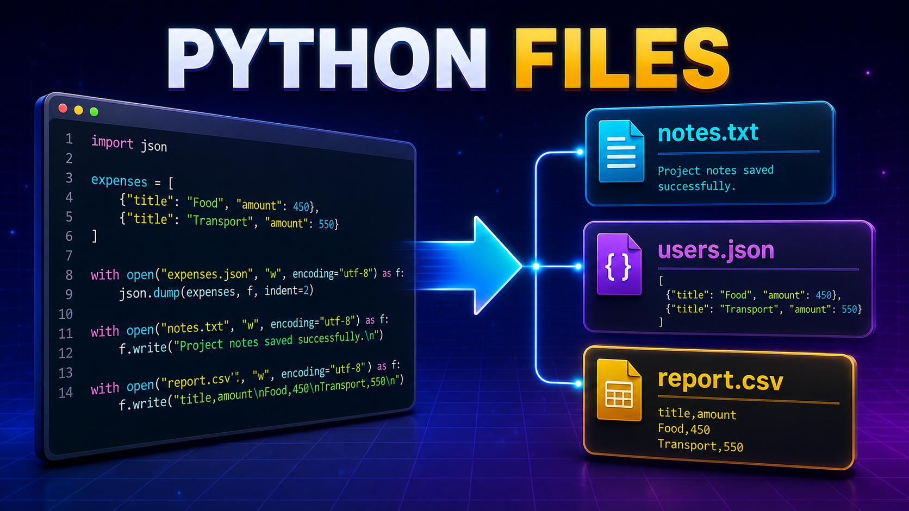

# Лекция 8. Работа с файлами, JSON и CSV



## Вступление

На предыдущих лекциях мы научились работать с различными типами данных, коллекциями и функциями. Благодаря этому мы уже можем создавать программы, которые принимают данные от пользователя, обрабатывают их и выводят результат.

Например, мы можем создать программу для учёта расходов:

```python
expenses = [
    {
        "title": "Продукты",
        "category": "Еда",
        "amount": 450
    },
    {
        "title": "Проездной",
        "category": "Транспорт",
        "amount": 550
    }
]
```

С помощью функций такая программа может:

- добавлять новые расходы;
- выводить все записи;
- искать расходы по категории;
- вычислять общую сумму;
- изменять и удалять данные.

Но пока у нашей программы есть серьёзная проблема.

Все данные хранятся в переменных и существуют только во время работы программы. Если закрыть программу, а затем запустить её снова, список расходов вернётся в исходное состояние, а все добавленные пользователем данные исчезнут.

```text
Запуск программы
        ↓
Создание данных
        ↓
Работа с данными
        ↓
Завершение программы
        ↓
Данные исчезают
```

В реальных программах данные должны сохраняться:

- список пользователей;
- каталог товаров;
- история заказов;
- настройки программы;
- результаты вычислений;
- записи о расходах.

Нам нужен способ записать данные на диск, а затем загрузить их при следующем запуске программы. Для решения этой задачи используются **файлы**.

На этой лекции мы научимся работать с обычными текстовыми файлами, а также познакомимся с форматами `JSON` и `CSV`.

```text
TXT  → обычный текст
JSON → структурированные данные
CSV  → табличные данные
```

После этой лекции наши программы смогут не только обрабатывать информацию, но и сохранять её между запусками.

---

## Работа с текстовыми файлами

Текстовые файлы имеют расширение `.txt` и хранят информацию в виде обычного текста. Например, файл `notes.txt` может содержать список задач:

```text
Купить продукты
Оплатить интернет
Подготовиться к лекции
```

Python позволяет открывать такие файлы, читать их содержимое, записывать новую информацию и добавлять данные в конец файла.

---

### Открытие и закрытие файла

Для открытия файла используется встроенная функция `open()`:

```python
file = open("notes.txt", "r", encoding="utf-8")
```

Функция `open()` возвращает файловый объект. Через него программа взаимодействует с файлом.

Разберём конструкцию по частям:

```python
file = open("notes.txt", "r", encoding="utf-8")
#           └────┬────┘  │         └────┬────┘
#           путь к файлу  режим        кодировка
```

| Часть           | Назначение                 |
| -------------------- | ------------------------------------ |
| `"notes.txt"`      | Имя или путь к файлу |
| `"r"`              | Режим работы              |
| `encoding="utf-8"` | Кодировка текста      |

Если файл находится рядом с программой, достаточно указать его имя:

```text
lesson08/
├── main.py
└── notes.txt
```

```python
file = open("notes.txt", "r", encoding="utf-8")
```

Если файл находится во вложенной папке, необходимо указать путь:

```text
lesson08/
├── main.py
└── data/
    └── notes.txt
```

```python
file = open("data/notes.txt", "r", encoding="utf-8")
```

После завершения работы файл необходимо закрыть с помощью метода `close()`:

```python
file = open("notes.txt", "r", encoding="utf-8")

# Работа с файлом

file.close()
```

`open()` открывает файл, а `close()` завершает работу с ним:

```text
open()  → файл открыт
close() → файл закрыт
```

Проверить состояние файла можно через свойство `closed`:

```python
file = open("notes.txt", "r", encoding="utf-8")

print(file.closed)

file.close()

print(file.closed)
```

Результат:

```text
False
True
```

После закрытия файла работать с ним нельзя:

```python
file = open("notes.txt", "r", encoding="utf-8")

file.close()

text = file.read()
```

Программа завершится с ошибкой:

```text
ValueError: I/O operation on closed file
```

### Режимы работы с файлами

Второй аргумент функции `open()` определяет режим работы с файлом:

```python
open("notes.txt", "r", encoding="utf-8")
#                  │
#                  └── режим работы
```

Основные режимы:

| Режим | Название | Назначение                                                     |
| ---------- | ---------------- | ------------------------------------------------------------------------ |
| `"r"`    | Read             | Чтение файла                                                  |
| `"w"`    | Write            | Запись с удалением старого содержимого |
| `"a"`    | Append           | Добавление данных в конец файла               |
| `"x"`    | Create           | Создание нового файла                                 |

Режим влияет не только на доступные операции, но и на поведение Python, если файл существует или отсутствует.

| Режим | Если файл существует           | Если файла нет |
| ---------- | ------------------------------------------------ | -------------------------- |
| `"r"`    | Открывает для чтения           | Ошибка               |
| `"w"`    | Удаляет старое содержимое | Создаёт файл    |
| `"a"`    | Добавляет данные в конец    | Создаёт файл    |
| `"x"`    | Ошибка                                     | Создаёт файл    |

По умолчанию `open()` использует режим `"r"`:

```python
file = open("notes.txt", encoding="utf-8")
```

Эта запись равнозначна следующей:

```python
file = open("notes.txt", "r", encoding="utf-8")
```

---

### Дополнительные обозначения режимов

Кроме основных режимов существуют дополнительные обозначения:

| Обозначение | Назначение                                    |
| ---------------------- | ------------------------------------------------------- |
| `"t"`                | Работа с текстом                          |
| `"b"`                | Работа с двоичными данными       |
| `"+"`                | Одновременное чтение и запись |

Режим `"t"` используется для текстовых файлов и устанавливается по умолчанию:

```python
open("notes.txt", "rt", encoding="utf-8")
```

Запись `"rt"` означает открыть текстовый файл для чтения. Обычно букву `t` не указывают:

```python
open("notes.txt", "r", encoding="utf-8")
```

Режим `"b"` используется для двоичных файлов:

```python
open("photo.jpg", "rb")
```

Например, для изображений, аудио, видео и других нетекстовых файлов. При работе в двоичном режиме параметр `encoding` не указывается.

Символ `+` позволяет одновременно читать и записывать данные:

```python
open("notes.txt", "r+", encoding="utf-8")
```

На начальном этапе мы сосредоточимся на четырёх основных режимах:

```text
r → чтение
w → запись
a → добавление
x → создание
```

### Ошибки при работе с файлами

В Python предусмотрены специальные ошибки для работы с файлами:

- `FileNotFoundError` - файл не найден;
- `FileExistsError` - файл уже существует;

Ошибок может быть больше, но на начальном этапе достаточно знать эти две.

Для обработки ошибок используется конструкция `try ... except`:

```python
try:
    file = open("unknown.txt", "r", encoding="utf-8")
        pass #  Работа с файлом
    file.close()
except FileNotFoundError:
    print("Файл не найден")
```

Это позволяет программе продолжить работу, даже если файл отсутствует.

---

### Оператор `with`

При обычном открытии файла программист должен самостоятельно вызвать метод `close()`:

```python
file = open("notes.txt", "r", encoding="utf-8")

text = file.read()

file.close()
```

Но `close()` можно случайно забыть вызвать. Кроме того, до него может не дойти выполнение программы из-за ошибки.

Для безопасной работы с файлами используется оператор `with`:

```python
with open("notes.txt", "r", encoding="utf-8") as file:
    text = file.read()

print(text)
```

Разберём конструкцию:

```python
with open("notes.txt", "r", encoding="utf-8") as file:
#    └──────────────────┬──────────────────┘
#               открытие файла

    text = file.read()
    # код внутри блока работает с открытым файлом
```

Файловый объект сохраняется в переменную после ключевого слова `as`:

```python
as file
```

Все действия с файлом выполняются внутри блока `with`:

```python
with open("notes.txt", "r", encoding="utf-8") as file:
    text = file.read()
    print(text)
```

После завершения блока Python автоматически закрывает файл:

```python
with open("notes.txt", "r", encoding="utf-8") as file:
    print(file.closed)

print(file.closed)
```

Результат:

```text
False
True
```

Внутри блока файл открыт, а после выхода из блока - закрыт. Поэтому дальше для работы с файлами мы будем использовать именно оператор `with`:

```python
with open("путь", "режим", encoding="utf-8") as file:
    # Работа с файлом
    pass
```

---

### Режим `"r"` - чтение файла

Режим `"r"` открывает существующий файл для чтения:

```python
with open("notes.txt", "r", encoding="utf-8") as file:
    text = file.read()

print(text)
```

Метод `read()` читает всё содержимое файла и возвращает его в виде строки.

Если `notes.txt` содержит:

```text
Купить продукты
Оплатить интернет
Подготовиться к лекции
```

результат будет следующим:

```text
Купить продукты
Оплатить интернет
Подготовиться к лекции
```

Полученные данные имеют тип `str`:

```python
with open("notes.txt", "r", encoding="utf-8") as file:
    text = file.read()

print(type(text))
```

Результат:

```text
<class 'str'>
```

Если попытаться открыть несуществующий файл в режиме `"r"`, возникнет ошибка:

```python
with open("unknown.txt", "r", encoding="utf-8") as file:
    text = file.read()
```

```text
FileNotFoundError
```

Режим `"r"` не создаёт новый файл. Он работает только с уже существующими файлами.

#### Метод `read()`

Метод `read()` читает весь файл:

```python
with open("notes.txt", "r", encoding="utf-8") as file:
    text = file.read()
```

Можно указать количество символов:

```python
with open("notes.txt", "r", encoding="utf-8") as file:
    text = file.read(6)

print(text)
```

Python прочитает только первые шесть символов.

#### Метод `readline()`

Метод `readline()` читает одну строку:

```python
with open("notes.txt", "r", encoding="utf-8") as file:
    print(first_line, end="")
    print(second_line, end="")

print(first_line)
print(second_line)
```

Каждый новый вызов продолжает чтение со следующей строки.

#### Метод `readlines()`

Метод `readlines()` читает все строки и возвращает список:

```python
with open("notes.txt", "r", encoding="utf-8") as file:
    lines = file.readlines()

print(lines)
```

Результат:

```python
[
    "Купить продукты\n",
    "Оплатить интернет\n",
    "Подготовиться к лекции"
]
```

Символ `\n` обозначает перенос строки.

#### Перебор файла

Файл можно перебирать с помощью цикла `for`:

```python
with open("notes.txt", "r", encoding="utf-8") as file:
    for line in file:
        print(line.strip())
```

Метод `strip()` удаляет перенос строки и лишние пробелы по краям. Такой способ удобен при работе с большими файлами, потому что программа читает их построчно.

---

### Режим `"w"` - запись в файл

Режим `"w"` открывает файл для записи:

```python
with open("notes.txt", "w", encoding="utf-8") as file:
    file.write("Изучить работу с файлами")
```

Для записи используется метод `write()`. После выполнения программы файл будет содержать:

```text
Изучить работу с файлами
```

Главная особенность режима `"w"` - он удаляет старое содержимое файла.

Например, файл содержит:

```text
Купить продукты
Оплатить интернет
```

Выполним программу:

```python
with open("notes.txt", "w", encoding="utf-8") as file:
    file.write("Подготовиться к лекции")
```

Теперь старые данные будут удалены:

```text
Подготовиться к лекции
```

Если указанного файла не существует, режим `"w"` создаст его автоматически:

```python
with open("result.txt", "w", encoding="utf-8") as file:
    file.write("Результат программы")
```

Метод `write()` не добавляет перенос строки автоматически:

```python
with open("notes.txt", "w", encoding="utf-8") as file:
    file.write("Первая строка")
    file.write("Вторая строка")
```

Результат:

```text
Первая строкаВторая строка
```

Перенос строки необходимо добавить самостоятельно:

```python
with open("notes.txt", "w", encoding="utf-8") as file:
    file.write("Первая строка\n")
    file.write("Вторая строка\n")
```

Результат:

```text
Первая строка
Вторая строка
```

Для записи нескольких строк можно использовать метод `writelines()`:

```python
tasks = [
    "Купить продукты\n",
    "Оплатить интернет\n",
    "Подготовиться к лекции\n"
]

with open("notes.txt", "w", encoding="utf-8") as file:
    file.writelines(tasks)
```

Метод `writelines()` также не добавляет `\n` автоматически. Переносы должны находиться внутри строк.

---

### Режим `"a"` - добавление данных

Режим `"a"` открывает файл и добавляет новые данные в его конец:

```python
with open("notes.txt", "a", encoding="utf-8") as file:
    file.write("Позвонить клиенту\n")
```

Старое содержимое файла при этом сохраняется.

До выполнения программы:

```text
Купить продукты
Оплатить интернет
```

После выполнения программы:

```text
Купить продукты
Оплатить интернет
Позвонить клиенту
```

Если файл не существует, режим `"a"` создаст его автоматически:

```python
with open("history.txt", "a", encoding="utf-8") as file:
    file.write("Программа запущена\n")
```

Каждый новый запуск программы будет добавлять строку в конец файла:

```text
Программа запущена
Программа запущена
Программа запущена
```

Режим `"a"` удобно использовать для:

- истории действий;
- журналов работы программы;
- новых заметок;
- результатов, которые нельзя удалять;
- добавления новых записей.

---

### Режим `"x"` - создание файла

Режим `"x"` используется для создания нового файла:

```python
with open("report.txt", "x", encoding="utf-8") as file:
    file.write("Новый отчёт")
```

Если файла `report.txt` не существует, Python создаст его и запишет данные.

Если файл с таким именем уже существует, программа завершится с ошибкой:

```text
FileExistsError
```

Например:

```python
with open("report.txt", "x", encoding="utf-8") as file:
    file.write("Новый отчёт")
```

Режим `"x"` используется, когда важно не перезаписать существующий файл.

Сравним его с режимом `"w"`:

```text
"w" → перезапишет существующий файл
"x" → остановит программу с ошибкой
```

Например, при создании отчёта безопаснее использовать `"x"`, если старый отчёт нельзя удалять:

```python
with open("report_2026.txt", "x", encoding="utf-8") as file:
    file.write("Отчёт за 2026 год")
```

---

## Работа с JSON

Обычные текстовые файлы подходят для хранения текста, но в программах данные часто имеют более сложную структуру. Например, список расходов состоит из словарей:

```python
expenses = [
    {
        "title": "Продукты",
        "category": "Еда",
        "amount": 450
    },
    {
        "title": "Проездной",
        "category": "Транспорт",
        "amount": 550
    }
]
```

Если записать эти данные в обычный текстовый файл, после чтения мы получим строку. Чтобы снова работать со списками и словарями, понадобится самостоятельно преобразовывать текст. Для хранения структурированных данных удобно использовать формат `JSON`.

---

### Что такое JSON


`JSON (JavaScript Object Notation)` - это текстовый формат для хранения и передачи структурированных данных.

Несмотря на название, JSON используется не только в `JavaScript`. С ним работают `Python`, `Java`, `PHP`, `C#` и многие другие языки программирования.

`JSON` часто применяется для:

- хранения настроек программы;
- сохранения списков пользователей и товаров;
- обмена данными между frontend и backend;
- передачи данных через API;
- хранения результатов работы программы.

`JSON`-файлы имеют расширение `.json`:

```text
expenses.json
users.json
settings.json
products.json
```

Например, файл `expenses.json` может выглядеть так:

```json
[
    {
        "title": "Продукты",
        "category": "Еда",
        "amount": 450
    },
    {
        "title": "Проездной",
        "category": "Транспорт",
        "amount": 550
    }
]
```

Такая структура очень похожа на список словарей в Python.

---

### Структура JSON-файла

JSON поддерживает несколько основных типов данных:

| JSON         | Python                             |
| ------------ | ---------------------------------- |
| object`{}` | словарь`dict`             |
| array`[]`  | список`list`               |
| string       | строка`str`                |
| number       | число`int` или `float` |
| `true`     | `True`                           |
| `false`    | `False`                          |
| `null`     | `None`                           |

Пример JSON-объекта:

```json
{
    "name": "Anna",
    "age": 25,
    "is_student": true,
    "email": null,
    "skills": ["Python", "HTML", "CSS"]
}
```

После преобразования в Python он будет выглядеть так:

```python
{
    "name": "Anna",
    "age": 25,
    "is_student": True,
    "email": None,
    "skills": ["Python", "HTML", "CSS"]
}
```

Обратите внимание на отличия:

```text
JSON    → Python
true    → True
false   → False
null    → None
```

Строки и названия ключей в `JSON` записываются только в двойных кавычках:

```json
{
    "name": "Anna"
}
```

Одинарные кавычки использовать нельзя:

```text
{'name': 'Anna'}
```

Такая запись допустима в `Python`, но не является правильным `JSON`.

---

### Модуль `json`

Для работы с `JSON` в `Python` используется встроенный модуль `json`. Подключим его с помощью `import`:

```python
import json
```

Устанавливать дополнительную библиотеку не нужно - модуль уже входит в стандартную библиотеку Python.

> import будем разбираться подробнее в следующей лекции. Пока достаточно знать, что он позволяет подключать встроенные и сторонние модули.

Модуль `json` позволяет:

- преобразовать объект Python в JSON;
- преобразовать JSON обратно в объект Python;
- записать данные в JSON-файл;
- прочитать данные из JSON-файла.

Основные функции модуля:

| Функция   | Назначение                                    |
| ---------------- | ------------------------------------------------------- |
| `json.dumps()` | Python-объект → JSON-строка                |
| `json.loads()` | JSON-строка → Python-объект                |
| `json.dump()`  | Запись Python-объекта в JSON-файл     |
| `json.load()`  | Чтение Python-объекта из JSON-файла |

---

### Преобразование Python-объекта в JSON-строку

Функция `json.dumps()` преобразует объект Python в строку формата JSON:

```python
import json

user = {
    "name": "Anna",
    "age": 25,
    "is_student": True
}

json_string = json.dumps(user)

print(json_string)
print(type(json_string))
```

Результат:

```text
{"name": "Anna", "age": 25, "is_student": true}
<class 'str'>
```

Исходные данные были словарём:

```python
type(user)
```

После преобразования мы получили строку:

```python
type(json_string)
```

```text
dict → JSON → str
```

Буква `s` в названии `dumps` означает `string` - строка.

---

### Параметры `ensure_ascii` и `indent`

Если данные содержат кириллицу, по умолчанию символы могут быть преобразованы в специальные Unicode-последовательности:

```python
import json

user = {
    "name": "Анна",
    "city": "Прага"
}

json_string = json.dumps(user)

print(json_string)
```

Результат будет выглядеть примерно так:

```text
{"name": "\u0410\u043d\u043d\u0430", "city": "\u041f\u0440\u0430\u0433\u0430"}
```

Чтобы сохранить обычное отображение символов, используется параметр:

```python
ensure_ascii=False
```

```python
json_string = json.dumps(user, ensure_ascii=False)

print(json_string)
```

Результат:

```json
{"name": "Анна", "city": "Прага"}
```

Параметр `indent` добавляет отступы и делает JSON более читаемым:

```python
json_string = json.dumps(
    user,
    ensure_ascii=False,
    indent=4
)

print(json_string)
```

Результат:

```json
{
    "name": "Анна",
    "city": "Прага"
}
```

В наших примерах мы часто будем использовать оба параметра:

```python
json.dumps(data, ensure_ascii=False, indent=4)
```

---

### Преобразование JSON-строки в Python-объект

Функция `json.loads()` выполняет обратное преобразование: принимает JSON-строку и возвращает объект Python.

```python
import json

json_string = '''
{
    "name": "Anna",
    "age": 25,
    "is_student": true
}
'''

user = json.loads(json_string)

print(user)
print(type(user))
```

Результат:

```text
{'name': 'Anna', 'age': 25, 'is_student': True}
<class 'dict'>
```

Теперь с полученным словарём можно работать обычными средствами Python:

```python
print(user["name"])
print(user["age"])
```

Результат:

```text
Anna
25
```

Последовательность преобразования:

```text
JSON-строка → json.loads() → объект Python
```

Буква `s` в названии `loads` также означает, что функция работает со строкой.

---

### Запись данных в JSON-файл

Для записи данных в файл используется функция `json.dump()`.

Создадим список расходов:

```python
import json

expenses = [
    {
        "title": "Продукты",
        "category": "Еда",
        "amount": 450
    },
    {
        "title": "Проездной",
        "category": "Транспорт",
        "amount": 550
    }
]
```

Запишем его в файл `expenses.json`:

```python
with open("expenses.json", "w", encoding="utf-8") as file:
    json.dump(
        expenses,
        file,
        ensure_ascii=False,
        indent=4
    )
```

Функция `json.dump()` получает два основных аргумента:

```python
json.dump(expenses, file)
#         └──┬──┘   └─┬─┘
#          данные     файл
```

После выполнения программы будет создан файл `expenses.json`:

```json
[
    {
        "title": "Продукты",
        "category": "Еда",
        "amount": 450
    },
    {
        "title": "Проездной",
        "category": "Транспорт",
        "amount": 550
    }
]
```

Файл открывается в режиме `"w"`, поэтому старое содержимое будет заменено новыми данными.

---

### Чтение данных из JSON-файла

Для чтения данных используется функция `json.load()`:

```python
import json

with open("expenses.json", "r", encoding="utf-8") as file:
    expenses = json.load(file)

print(expenses)
print(type(expenses))
```

Результат:

```text
[
    {'title': 'Продукты', 'category': 'Еда', 'amount': 450},
    {'title': 'Проездной', 'category': 'Транспорт', 'amount': 550}
]
<class 'list'>
```

Функция `json.load()` прочитала JSON-файл и автоматически преобразовала данные в список Python.

Теперь их можно перебирать:

```python
for expense in expenses:
    print(expense["title"], "-", expense["amount"])
```

Результат:

```text
Продукты - 450
Проездной - 550
```

Можно также вычислить общую сумму:

```python
total = 0

for expense in expenses:
    total += expense["amount"]

print("Общая сумма:", total)
```

Результат:

```text
Общая сумма: 1000
```

---

### Разница между `dump()` и `dumps()`

Названия функций похожи, поэтому важно понимать разницу.

| Функция   | Результат                                              |
| ---------------- | --------------------------------------------------------------- |
| `json.dumps()` | Возвращает JSON-строку                          |
| `json.dump()`  | Записывает данные в JSON-файл              |
| `json.loads()` | Преобразует JSON-строку в объект Python |
| `json.load()`  | Читает данные из JSON-файла                  |

Работа со строкой:

```python
json_string = json.dumps(data)
data = json.loads(json_string)
```

Работа с файлом:

```python
json.dump(data, file)
data = json.load(file)
```

Можно запомнить так:

```text
Функция заканчивается на s → работает со строкой
Функция без s              → работает с файлом
```

---

### Изменение данных в JSON-файле

Чтобы изменить данные в JSON-файле, необходимо выполнить три действия:

```text
Прочитать данные
        ↓
Изменить объект Python
        ↓
Записать данные обратно
```

Например, добавим новый расход в файл `expenses.json`.

Сначала прочитаем существующие данные:

```python
import json

with open("expenses.json", "r", encoding="utf-8") as file:
    expenses = json.load(file)
```

Добавим новый словарь в список:

```python
new_expense = {
    "title": "Интернет",
    "category": "Услуги",
    "amount": 400
}

expenses.append(new_expense)
```

После этого запишем обновлённый список обратно в файл:

```python
with open("expenses.json", "w", encoding="utf-8") as file:
    json.dump(
        expenses,
        file,
        ensure_ascii=False,
        indent=4
    )
```

Полная программа:

```python
import json

with open("expenses.json", "r", encoding="utf-8") as file:
    expenses = json.load(file)

new_expense = {
    "title": "Интернет",
    "category": "Услуги",
    "amount": 400
}

expenses.append(new_expense)

with open("expenses.json", "w", encoding="utf-8") as file:
    json.dump(
        expenses,
        file,
        ensure_ascii=False,
        indent=4
    )
```

JSON-файл нельзя изменить как обычный список прямо на диске. Сначала данные загружаются в программу, изменяются и затем полностью записываются обратно.

---

### Небольшая практика

Создайте программу для хранения списка книг.

Начальный список:

```python
books = [
    {
        "title": "Гарри Поттер",
        "author": "Джоан Роулинг",
        "year": 1997
    },
    {
        "title": "Ведьмак",
        "author": "Анджей Сапковский",
        "year": 1990
    }
]
```

Выполните следующие действия:

1. Запишите список в файл `books.json`.
2. Используйте параметры `ensure_ascii=False` и `indent=4`.
3. Прочитайте данные из файла.
4. Выведите название и автора каждой книги.
5. Добавьте в список ещё одну книгу.
6. Сохраните обновлённый список обратно в файл.

Пример вывода:

```text
Гарри Поттер - Джоан Роулинг
Ведьмак - Анджей Сапковский
```

---

## Работа с CSV

Формат `JSON` удобен для хранения списков, словарей и вложенных структур. Но если данные представлены в виде таблицы, часто используется формат `CSV`.

Например, список товаров:

| id | name                 | price | quantity |
| -- | -------------------- | ----- | -------- |
| 1  | Ноутбук       | 25000 | 5        |
| 2  | Мышь             | 650   | 15       |
| 3  | Клавиатура | 1200  | 8        |

В CSV-файле эти данные можно сохранить построчно.

---

### Что такое CSV


`CSV` - это текстовый формат для хранения табличных данных.

Название расшифровывается как:

```text
Comma-Separated Values
```

То есть значения, разделённые запятыми.

CSV-файлы имеют расширение `.csv`:

```text
products.csv
users.csv
expenses.csv
employees.csv
```

Формат CSV часто используется для:

- хранения таблиц;
- экспорта данных из программ;
- переноса данных между разными системами;
- работы с Excel и Google Таблицами;
- сохранения отчётов.

В отличие от JSON, CSV предназначен именно для табличных данных. Каждая строка файла представляет одну запись, а значения внутри строки соответствуют столбцам.

---

### Структура CSV-файла

Создадим файл `products.csv`:

```csv
id,name,price,quantity
1,Ноутбук,25000,5
2,Мышь,650,15
3,Клавиатура,1200,8
```

Первая строка содержит названия столбцов:

```text
id,name,price,quantity
```

Остальные строки содержат данные:

```text
1,Ноутбук,25000,5
2,Мышь,650,15
3,Клавиатура,1200,8
```

Каждая строка должна иметь одинаковую структуру:

```text
id → name → price → quantity
```

По умолчанию значения разделяются запятыми, но в некоторых CSV-файлах используются другие разделители, например точка с запятой:

```csv
id;name;price;quantity
1;Ноутбук;25000;5
2;Мышь;650;15
```

---

### Модуль `csv`

Для работы с CSV в Python используется встроенный модуль `csv`:

```python
import csv
```

Устанавливать дополнительную библиотеку не нужно.

Основные инструменты модуля:

| Инструмент | Назначение                                   |
| -------------------- | ------------------------------------------------------ |
| `csv.reader()`     | Чтение данных в виде списков   |
| `csv.writer()`     | Запись списков в CSV                     |
| `csv.DictReader()` | Чтение данных в виде словарей |
| `csv.DictWriter()` | Запись словарей в CSV                   |

CSV-файл открывается с помощью функции `open()`:

```python
with open(
    "products.csv",
    "r",
    encoding="utf-8",
    newline=""
) as file:
    # Работа с CSV
```

Параметр `newline=""` рекомендуется использовать при работе с модулем `csv`. Он помогает правильно обрабатывать переносы строк и предотвращает появление пустых строк при записи файла.

---

### Чтение CSV-файла с помощью `csv.reader()`

Функция `csv.reader()` читает CSV-файл и возвращает его строки в виде списков:

```python
import csv

with open(
    "products.csv",
    "r",
    encoding="utf-8",
    newline=""
) as file:
    reader = csv.reader(file)

    for row in reader:
        print(row)
```

Результат:

```text
['id', 'name', 'price', 'quantity']
['1', 'Ноутбук', '25000', '5']
['2', 'Мышь', '650', '15']
['3', 'Клавиатура', '1200', '8']
```

Каждая строка CSV-файла превращается в отдельный список. Значения можно получать по индексам:

```python
import csv

with open(
    "products.csv",
    "r",
    encoding="utf-8",
    newline=""
) as file:
    reader = csv.reader(file)

    for row in reader:
        print("Название:", row[1])
        print("Цена:", row[2])
```

Важно помнить, что `csv.reader()` возвращает все значения в виде строк:

```python
print(type(row[2]))
```

Результат:

```text
<class 'str'>
```

Если значение нужно использовать в вычислениях, его необходимо преобразовать:

```python
price = int(row[2])
quantity = int(row[3])

total = price * quantity
```

---

### Работа с заголовками

Первая строка CSV-файла часто содержит названия столбцов:

```csv
id,name,price,quantity
```

При использовании `csv.reader()` эта строка читается как обычная строка данных.

Чтобы получить заголовки отдельно, используется функция `next()`:

```python
import csv

with open(
    "products.csv",
    "r",
    encoding="utf-8",
    newline=""
) as file:
    reader = csv.reader(file)

    headers = next(reader)

    print("Заголовки:", headers)

    for row in reader:
        print(row)
```

Результат:

```text
Заголовки: ['id', 'name', 'price', 'quantity']
['1', 'Ноутбук', '25000', '5']
['2', 'Мышь', '650', '15']
['3', 'Клавиатура', '1200', '8']
```

После вызова `next(reader)` цикл начинает работу со второй строки файла.

---

### Запись данных с помощью `csv.writer()`

Для записи данных используется функция `csv.writer()`:

```python
import csv

products = [
    [1, "Ноутбук", 25000, 5],
    [2, "Мышь", 650, 15],
    [3, "Клавиатура", 1200, 8]
]

with open(
    "products.csv",
    "w",
    encoding="utf-8",
    newline=""
) as file:
    writer = csv.writer(file)

    writer.writerow(["id", "name", "price", "quantity"])
    writer.writerows(products)
```

После выполнения программы файл `products.csv` будет содержать:

```csv
id,name,price,quantity
1,Ноутбук,25000,5
2,Мышь,650,15
3,Клавиатура,1200,8
```

Файл открыт в режиме `"w"`, поэтому старое содержимое будет удалено. Если файла не существует, Python создаст его автоматически.

---

### Методы `writerow()` и `writerows()`

Метод `writerow()` записывает одну строку:

```python
writer.writerow(["id", "name", "price", "quantity"])
```

Можно записать ещё одну строку:

```python
writer.writerow([1, "Ноутбук", 25000, 5])
```

Метод `writerows()` записывает сразу несколько строк:

```python
products = [
    [1, "Ноутбук", 25000, 5],
    [2, "Мышь", 650, 15],
    [3, "Клавиатура", 1200, 8]
]

writer.writerows(products)
```

Сравним методы:

```text
writerow()  → записывает одну строку
writerows() → записывает несколько строк
```

---

### Чтение данных с помощью `csv.DictReader()`

Работать со значениями по индексам не всегда удобно:

```python
row[1]
row[2]
row[3]
```

Кроме того, необходимо помнить, какой столбец находится под каждым индексом. `csv.DictReader()` читает каждую строку как словарь. Названия столбцов из первой строки становятся ключами.

```python
import csv

with open(
    "products.csv",
    "r",
    encoding="utf-8",
    newline=""
) as file:
    reader = csv.DictReader(file)

    for product in reader:
        print(product)
```

Результат:

```text
{'id': '1', 'name': 'Ноутбук', 'price': '25000', 'quantity': '5'}
{'id': '2', 'name': 'Мышь', 'price': '650', 'quantity': '15'}
{'id': '3', 'name': 'Клавиатура', 'price': '1200', 'quantity': '8'}
```

Теперь значения можно получать по названиям ключей:

```python
import csv

with open(
    "products.csv",
    "r",
    encoding="utf-8",
    newline=""
) as file:
    reader = csv.DictReader(file)

    for product in reader:
        print(product["name"], "-", product["price"])
```

Результат:

```text
Ноутбук - 25000
Мышь - 650
Клавиатура - 1200
```

Можно выполнить вычисления:

```python
import csv

with open(
    "products.csv",
    "r",
    encoding="utf-8",
    newline=""
) as file:
    reader = csv.DictReader(file)

    for product in reader:
        price = int(product["price"])
        quantity = int(product["quantity"])

        total = price * quantity

        print(product["name"], "-", total)
```

`DictReader` удобнее использовать, когда CSV-файл содержит заголовки.

---

### Запись данных с помощью `csv.DictWriter()`

`csv.DictWriter()` позволяет записывать в CSV список словарей.

Создадим данные:

```python
products = [
    {
        "id": 1,
        "name": "Ноутбук",
        "price": 25000,
        "quantity": 5
    },
    {
        "id": 2,
        "name": "Мышь",
        "price": 650,
        "quantity": 15
    },
    {
        "id": 3,
        "name": "Клавиатура",
        "price": 1200,
        "quantity": 8
    }
]
```

Для создания `DictWriter` необходимо передать список названий столбцов:

```python
fieldnames = ["id", "name", "price", "quantity"]
```

Полный пример записи:

```python
import csv

products = [
    {
        "id": 1,
        "name": "Ноутбук",
        "price": 25000,
        "quantity": 5
    },
    {
        "id": 2,
        "name": "Мышь",
        "price": 650,
        "quantity": 15
    },
    {
        "id": 3,
        "name": "Клавиатура",
        "price": 1200,
        "quantity": 8
    }
]

fieldnames = ["id", "name", "price", "quantity"]

with open(
    "products.csv",
    "w",
    encoding="utf-8",
    newline=""
) as file:
    writer = csv.DictWriter(file, fieldnames=fieldnames)

    writer.writeheader()
    writer.writerows(products)
```

Метод `writeheader()` записывает названия столбцов:

```csv
id,name,price,quantity
```

Метод `writerows()` записывает все словари из списка.

Также можно записать один словарь:

```python
writer.writerow(
    {
        "id": 4,
        "name": "Монитор",
        "price": 7500,
        "quantity": 4
    }
)
```

Названия ключей в словарях должны соответствовать значениям из `fieldnames`.

---

### Разделители в CSV-файлах

Хотя название CSV говорит о разделении запятыми, на практике могут использоваться разные символы. Например, файл с разделителем `;`:

```csv
id;name;price;quantity
1;Ноутбук;25000;5
2;Мышь;650;15
```

Чтобы прочитать такой файл, необходимо указать параметр `delimiter`:

```python
import csv

with open(
    "products.csv",
    "r",
    encoding="utf-8",
    newline=""
) as file:
    reader = csv.DictReader(file, delimiter=";")

    for product in reader:
        print(product)
```

При записи разделитель указывается таким же способом:

```python
import csv

with open(
    "products.csv",
    "w",
    encoding="utf-8",
    newline=""
) as file:
    writer = csv.writer(file, delimiter=";")

    writer.writerow(["id", "name", "price", "quantity"])
    writer.writerow([1, "Ноутбук", 25000, 5])
```

Основные варианты разделителей:

```text
,  → запятая
;  → точка с запятой
\t → табуляция
```

При чтении файла важно указать тот разделитель, который используется внутри него.

---

## Практическая работа: «Каталог фильмов»

### Задача

Разработать консольное приложение для ведения личного каталога фильмов. Приложение должно позволять добавлять фильмы, искать их, фильтровать по жанрам, изменять статус просмотра и получать статистику.

---

### Хранение данных

Все фильмы должны храниться в файле `movies.json`. Один фильм представляется словарём:

```python
{
    "id": 1,
    "title": "The Matrix",
    "year": 1999,
    "genres": ["Фантастика", "Боевик"],
    "rating": 8.7,
    "watched": True
}
```

Пример содержимого `movies.json`:

```json
[
    {
        "id": 1,
        "title": "The Matrix",
        "year": 1999,
        "genres": ["Фантастика", "Боевик"],
        "rating": 8.7,
        "watched": true
    },
    {
        "id": 2,
        "title": "Interstellar",
        "year": 2014,
        "genres": ["Фантастика", "Драма"],
        "rating": 8.7,
        "watched": false
    }
]
```

Доступные жанры должны храниться в кортеже:

```python
AVAILABLE_GENRES = (
    "Боевик",
    "Драма",
    "Комедия",
    "Фантастика",
    "Фэнтези",
    "Триллер",
    "Приключения",
    "Мультфильм"
)
```

---

### Возможности программы

Пользователь должен иметь возможность:

1. Просмотреть все фильмы.
2. Добавить новый фильм.
3. Найти фильмы по названию.
4. Получить фильмы определённого жанра.
5. Отметить фильм просмотренным.
6. Посмотреть статистику каталога.
7. Экспортировать каталог в CSV.
8. Сохранить рекомендации в TXT.
9. Завершить программу.

Пример меню:

```text
========== КАТАЛОГ ФИЛЬМОВ ==========

1. Показать все фильмы
2. Добавить фильм
3. Найти фильм по названию
4. Показать фильмы по жанру
5. Отметить фильм просмотренным
6. Показать статистику
7. Экспортировать каталог в CSV
8. Сохранить рекомендации
0. Завершить программу
```

---

### Требования к функциям

| Функция                         | Назначение                                                                          |
| -------------------------------------- | --------------------------------------------------------------------------------------------- |
| `load_movies()`                      | Загружает фильмы из`movies.json` и возвращает список      |
| `save_movies(movies)`                | Сохраняет список фильмов в`movies.json`                              |
| `generate_id(movies)`                | Возвращает новый уникальный`id`                                    |
| `show_movies(movies)`                | Выводит каталог фильмов                                                  |
| `add_movie(movies)`                  | Добавляет новый фильм                                                      |
| `find_movies_by_title(movies)`       | Ищет фильмы по полной или частичной части названия |
| `filter_by_genre(movies)`            | Выводит фильмы выбранного жанра                                   |
| `mark_as_watched(movies)`            | Изменяет статус фильма на просмотренный                    |
| `get_unique_genres(movies)`          | Возвращает множество жанров из каталога                    |
| `calculate_genre_statistics(movies)` | Возвращает количество фильмов по каждому жанру       |
| `show_statistics(movies)`            | Выводит общую статистику                                                |
| `export_to_csv(movies)`              | Экспортирует каталог в`movies.csv`                                      |
| `save_recommendations(movies)`       | Сохраняет рекомендации в`recommendations.txt`                         |
| `show_menu()`                        | Выводит главное меню                                                        |
| `main()`                             | Управляет работой приложения                                        |

Каждая функция должна выполнять только одну задачу.

---

### Правила работы

- `id` фильма должен быть уникальным.
- Название фильма не должно быть пустым.
- Год выхода должен быть целым числом.
- Рейтинг должен находиться в диапазоне от `0` до `10`.
- Фильм может иметь несколько жанров.
- Выбирать жанры можно только из `AVAILABLE_GENRES`.
- Новый фильм по умолчанию считается непросмотренным.
- Поиск по названию не должен зависеть от регистра.
- После добавления фильма или изменения его статуса данные необходимо сохранить в JSON.
- Если `movies.json` отсутствует, программа должна начать работу с пустым каталогом.
- Программа должна работать до выбора команды `0`.

---

### Статистика

Программа должна показывать:

- общее количество фильмов;
- количество просмотренных фильмов;
- количество непросмотренных фильмов;
- средний рейтинг;
- фильм с самым высоким рейтингом;
- уникальные жанры;
- количество фильмов каждого жанра.

Пример:

```text
Всего фильмов: 6
Просмотрено: 3
Не просмотрено: 3
Средний рейтинг: 8.52
Лучший фильм: Зелёная миля — 9.1
```

---

### Экспорт в CSV

Файл `movies.csv` должен содержать следующие столбцы:

```text
id, title, year, genres, rating, watched
```

Пример:

```csv
id,title,year,genres,rating,watched
1,The Matrix,1999,Фантастика; Боевик,8.7,True
2,Interstellar,2014,Фантастика; Драма,8.7,False
```

Несколько жанров записываются в одну строку через `;`.

---

### Рекомендации

В файл `recommendations.txt` должны попадать фильмы, которые:

- ещё не просмотрены;
- имеют рейтинг не ниже `8.0`.

Фильмы необходимо отсортировать по рейтингу от большего к меньшему.

Пример:

```text
РЕКОМЕНДАЦИИ К ПРОСМОТРУ

1. Зелёная миля (1999) — 9.1
2. Interstellar (2014) — 8.7
3. Марсианин (2015) — 8.0
```

---

### Используемые инструменты Python

В проекте необходимо использовать:

- список для хранения фильмов;
- словарь для одного фильма;
- список для жанров фильма;
- кортеж для доступных жанров;
- множество для уникальных жанров;
- словарь для статистики по жанрам;
- функции;
- циклы и условия;
- JSON, CSV и TXT-файлы.

---

### Дополнительные возможности

После выполнения основной части можно добавить:

1. Удаление фильма по `id`.
2. Изменение рейтинга.
3. Возврат фильма в статус «не просмотрен».
4. Сортировку по названию, году или рейтингу.
5. Вывод только просмотренных или непросмотренных фильмов.

---

## Домашнее задание

Каждую задачу выполняйте в отдельном Python-файле. Разделяйте программу на функции.

### Обязательные задачи

1. **Личный дневник.** Запросите у пользователя пять событий за день и сохраните их в файл `diary.txt`. Каждое событие должно находиться на новой строке. После сохранения прочитайте файл и выведите его содержимое.
2. **Статистика текста.** Прочитайте содержимое файла `text.txt`. Определите количество строк, слов и символов в тексте. Полученную статистику сохраните в файл `statistics.txt`.
3. **Поиск в текстовом файле.** Запросите у пользователя слово и найдите все строки файла `text.txt`, содержащие это слово. Поиск не должен зависеть от регистра. Найденные строки сохраните в файл `search_result.txt`.
4. **Телефонная книга.** Запросите данные трёх контактов: имя, номер телефона и электронную почту. Сохраните контакты в файл `contacts.json`. После сохранения загрузите данные из файла и выведите список контактов.

   Один контакт должен храниться в следующем формате:

   ```python
   {
       "name": "Anna",
       "phone": "+420123456789",
       "email": "anna@example.com"
   }
   ```
5. **Фильтр товаров.** В файле `products.json` хранится список товаров. Запросите у пользователя максимальную цену и выведите все товары, которые есть в наличии (`quantity > 0`) и стоят не дороже указанной суммы.

   Один товар должен храниться в следующем формате:

   ```python
   {
       "id": 1,
       "title": "Keyboard",
       "price": 1200,
       "quantity": 5
   }
   ```
6. **Изменение статуса задачи.** В файле `tasks.json` хранится список задач. Запросите `id` задачи, отметьте её выполненной и сохраните изменения в тот же файл. Если задача не найдена, выведите соответствующее сообщение.

   Одна задача должна храниться в следующем формате:

   ```python
   {
       "id": 1,
       "title": "Повторить работу с файлами",
       "completed": False
   }
   ```
7. **Экспорт студентов в CSV.** Создайте список из пяти студентов. Для каждого студента сохраните имя, группу и результат экзамена. Запишите данные в файл `students.csv` с заголовками столбцов.

   Один студент должен храниться в следующем формате:

   ```python
   {
       "name": "Alex",
       "group": "Python-21",
       "score": 85
   }
   ```
8. **Результаты экзамена.** Прочитайте данные из файла `students.csv`. Выведите количество студентов, средний результат, имя лучшего студента и список студентов, набравших не менее 60 баллов.
9. **Конвертер JSON в CSV.** В файле `employees.json` хранится список сотрудников. Перенесите данные в файл `employees.csv`. Столбцы CSV-файла должны соответствовать ключам словарей.

   Один сотрудник должен храниться в следующем формате:

   ```python
   {
       "id": 1,
       "name": "Anna",
       "department": "Development",
       "salary": 45000
   }
   ```
10. **Учёт расходов.** Создайте консольную программу для хранения расходов в файле `expenses.json`. Пользователь должен иметь возможность добавить расход, показать все расходы, узнать общую сумму и получить сумму расходов по выбранной категории.

    Один расход должен храниться в следующем формате:

    ```python
    {
        "id": 1,
        "title": "Продукты",
        "category": "Еда",
        "amount": 850
    }
    ```

    Программа должна работать до выбора команды завершения. Добавление, вывод и подсчёт расходов оформите отдельными функциями.

### Дополнительные задачи

11. **Частота слов.** Прочитайте текст из файла `text.txt` и подсчитайте, сколько раз встречается каждое слово. Регистр букв и знаки препинания не должны влиять на результат. Сохраните статистику в файл `word_statistics.json`.
12. **Уникальные посетители.** В файле `visits.csv` находятся имена посетителей сайта. Один пользователь может встречаться несколько раз. Получите множество уникальных имён, отсортируйте их и сохраните в файл `unique_visitors.txt`.
13. **Статистика продаж.** В файле `sales.csv` хранятся название товара, категория, количество и цена одной единицы. Рассчитайте общую сумму продаж, найдите самый продаваемый товар и определите сумму продаж для каждой категории. Результат сохраните в файл `sales_report.txt`.
14. **Объединение файлов.** В файле `students.json` хранятся `id`, имена и группы студентов, а в файле `scores.csv` — `id` студентов и результаты экзамена. Объедините данные по `id` и сохраните полный список в файл `student_results.csv`.
15. **Рейтинг студентов.** В файле `journal.json` хранится список студентов и их оценки.

    Один студент должен храниться в следующем формате:

    ```python
    {
        "id": 1,
        "name": "Alex",
        "grades": [8, 10, 7, 9]
    }
    ```

    Рассчитайте среднюю оценку каждого студента, отсортируйте студентов по среднему результату и экспортируйте рейтинг в файл `rating.csv`. Трёх лучших студентов дополнительно сохраните в файл `top_students.txt`.

---

## Итоги лекции

На этой лекции мы научились работать с файлами и сохранять данные так, чтобы они не исчезали после завершения программы.

Мы рассмотрели обычные текстовые файлы, формат JSON и табличный формат CSV. Также научились загружать сохранённые данные, обрабатывать их и записывать полученный результат обратно в файл.

### Работа с текстовыми файлами

Для открытия файлов используется функция `open()`.

Конструкция `with` автоматически закрывает файл после завершения работы:

```python
with open(
    "notes.txt",
    "r",
    encoding="utf-8"
) as file:
    text = file.read()
```

Основные режимы работы:

| Режим | Назначение                                                     |
| ---------- | ------------------------------------------------------------------------ |
| `r`      | Чтение файла                                                  |
| `w`      | Запись с удалением старого содержимого |
| `a`      | Добавление данных в конец файла               |
| `x` | Создание нового файла |

При работе с текстом необходимо указывать кодировку:

```python
encoding="utf-8"
```

Она позволяет корректно сохранять и читать русский, украинский, чешский и другие языки.

### Формат JSON

JSON используется для хранения структурированных данных.

Он хорошо подходит для сохранения:

```text
списков
словарей
чисел
строк
логических значений
```

Для загрузки данных применяется `json.load()`:

```python
with open(
    "movies.json",
    "r",
    encoding="utf-8"
) as file:
    movies = json.load(file)
```

Для сохранения — `json.dump()`:

```python
with open(
    "movies.json",
    "w",
    encoding="utf-8"
) as file:
    json.dump(
        movies,
        file,
        ensure_ascii=False,
        indent=4
    )
```

Параметр `ensure_ascii=False` сохраняет текст без замены букв специальными кодами, а `indent=4` делает файл удобным для чтения.

### Формат CSV

CSV используется для хранения табличных данных.

Каждая строка файла представляет одну запись, а столбцы содержат отдельные характеристики этой записи.

```text
id,title,year,rating
1,The Matrix,1999,8.7
2,Interstellar,2014,8.7
```

Для работы со словарями удобно использовать:

| Инструмент | Назначение                                       |
| -------------------- | ---------------------------------------------------------- |
| `csv.DictReader()` | Читает строки CSV в виде словарей |
| `csv.DictWriter()` | Записывает словари в CSV                 |
| `writeheader()`    | Добавляет названия столбцов       |
| `writerow()`       | Записывает одну строку                 |
| `writerows()`      | Записывает несколько строк         |

При открытии CSV-файла для записи рекомендуется указывать:

```python
newline=""
```

Это помогает избежать появления лишних пустых строк.

### Сравнение форматов

| Формат | Для чего подходит                                                   |
| ------------ | ---------------------------------------------------------------------------------- |
| TXT          | Обычный текст, заметки, отчёты и сообщения      |
| JSON         | Списки, словари и вложенные структуры данных |
| CSV          | Таблицы, отчёты и экспорт данных                        |

```text
TXT  → текст
JSON → структуры Python
CSV  → таблицы
```

### Обработка данных

Мы закрепили работу со списками и словарями при чтении файлов.

Загруженные данные можно:

```text
перебирать
искать
фильтровать
изменять
сортировать
использовать для вычисления статистики
```

После изменения данных их необходимо повторно записать в файл. Иначе изменения будут существовать только до завершения программы.

### Разделение программы на функции

Работу с файлами удобно разделять на отдельные функции:

```python
def load_data():
    pass


def save_data(data):
    pass
```

Одна функция отвечает за загрузку данных, а другая — за сохранение.

Остальные действия программы также необходимо разделять на небольшие функции:

```text
добавление
поиск
фильтрация
изменение
вывод
экспорт
```

Так программа становится понятнее, а отдельные части кода проще проверять и изменять.

### Как выбрать формат?

Используйте TXT, когда необходимо сохранить обычный текст без сложной структуры.

Используйте JSON, когда нужно сохранить списки, словари или другие связанные данные Python.

Используйте CSV, когда данные должны быть представлены в виде таблицы или открываться в Excel и похожих программах.

Работа с файлами позволяет создавать программы с постоянным хранением данных. Эти знания понадобятся при разработке каталогов, журналов, систем учёта, отчётов и приложений, которые позже будут работать с API и базами данных.
