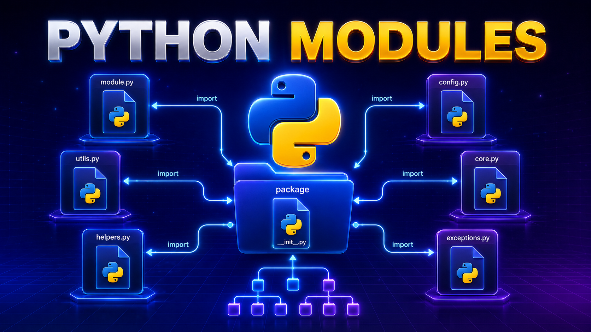

# Модули и пакеты в Python



## Вступление

Первые программы на Python обычно помещаются в один файл. Пока кода немного, с ним удобно работать, но со временем файл становится большим, а нужные функции становится сложнее находить и повторно использовать.

Чтобы разделить код, Python позволяет выносить его в отдельные файлы - **модули**. Связанные модули можно объединять в папки - **пакеты**.

В этой лекции мы научимся создавать собственные модули и пакеты, подключать их разными способами и использовать готовые модули стандартной библиотеки Python.

---

## Что такое модуль


**Модуль** - это файл с расширением `.py`, содержащий Python-код, который можно использовать в других файлах программы.

Внутри модуля могут находиться:

- переменные;
- функции;
- классы;
- другие инструкции Python.

Название модуля совпадает с названием файла, но записывается без расширения `.py`:

```text
calculator.py → модуль calculator
validation.py → модуль validation
storage.py    → модуль storage
```

Рассмотрим создание собственного модуля на примере простого калькулятора.

Создадим проект из двух файлов:

```text
project/
├── main.py
└── calculator.py
```

Файл `calculator.py` будет содержать функции, отвечающие за вычисления:

```python
def add(a, b):
    return a + b


def subtract(a, b):
    return a - b


def multiply(a, b):
    return a * b


def divide(a, b):
    if b == 0:
        return "На ноль делить нельзя"

    return a / b
```

Теперь `calculator.py` является нашим собственным модулем. В файле `main.py` этих функций нет. Чтобы воспользоваться ими, необходимо подключить модуль `calculator`.

### Подключение модуля через `import`

Для подключения модуля используется инструкция `import`.

Общий синтаксис:

```python
import название_модуля
```

Подключим модуль `calculator` в файле `main.py`:

```python
import calculator
```

Расширение `.py` в инструкции импорта указывать не нужно. После импорта имя `calculator` становится доступно в файле `main.py`. Через него можно обращаться к объектам, которые находятся внутри модуля.

Например, вызовем функцию `add()`:

```python
import calculator


result = calculator.add(10, 5)

print(result)
```

Результат:

```text
15
```

Функция `add()` была объявлена в файле `calculator.py`, но вызвали мы её из файла `main.py`.

```text
main.py
   │
   │ import calculator
   ▼
calculator.py
```

### Обращение к содержимому модуля

После обычного импорта к содержимому модуля обращаются через точку.

Общий синтаксис:

```python
название_модуля.название_объекта
```

В нашем примере:

```python
calculator.add
```

Эта запись состоит из двух частей:

```text
calculator.add
     │       │
     │       └── функция внутри модуля
     └────────── название модуля
```

Чтобы вызвать функцию, после её названия необходимо поставить круглые скобки и передать аргументы:

```python
calculator.add(10, 5)
```

Используем все функции созданного модуля:

```python
import calculator


print(calculator.add(10, 5))
print(calculator.subtract(10, 5))
print(calculator.multiply(10, 5))
print(calculator.divide(10, 5))
```

Результат:

```text
15
5
50
2.0
```

Теперь обязанности разделены между двумя файлами. Файл `calculator.py` выполняет вычисления:

```python
def add(a, b):
    return a + b


def subtract(a, b):
    return a - b


def multiply(a, b):
    return a * b


def divide(a, b):
    if b == 0:
        return "На ноль делить нельзя"

    return a / b
```

Файл `main.py` получает данные, вызывает необходимые функции и выводит результат:

```python
import calculator


first_number = float(input("Введите первое число: "))
second_number = float(input("Введите второе число: "))

print(f"Сумма: {calculator.add(first_number, second_number)}")
print(f"Разность: {calculator.subtract(first_number, second_number)}")
print(f"Произведение: {calculator.multiply(first_number, second_number)}")
print(f"Частное: {calculator.divide(first_number, second_number)}")
```

| Файл          | Ответственность                                                                |
| ----------------- | --------------------------------------------------------------------------------------------- |
| `main.py`       | Получение данных, вызов функций и вывод результата |
| `calculator.py` | Выполнение вычислений                                                     |

Таким образом, `main.py` управляет работой программы, а `calculator.py` предоставляет готовые инструменты для вычислений.

### Почему нельзя вызвать функцию напрямую

После обычного импорта нельзя вызвать функцию только по её названию:

```python
import calculator


result = add(10, 5)

print(result)
```

Такой код завершится ошибкой:

```text
NameError: name 'add' is not defined
```

Python сообщает, что имя `add` не определено в файле `main.py`.

Инструкция:

```python
import calculator
```

добавляет в текущий файл имя модуля `calculator`, но не добавляет отдельно имена всех его функций.

Поэтому функцию необходимо вызывать через название модуля:

```python
import calculator


result = calculator.add(10, 5)

print(result)
```

Сравните два варианта:

```python
add(10, 5)
```

В текущем файле имя `add` отсутствует, поэтому Python не понимает, какую функцию необходимо вызвать.

```python
calculator.add(10, 5)
```

Здесь явно указано, что функция `add()` находится в модуле `calculator`. Такая запись также делает код понятнее: при чтении программы сразу видно, откуда была получена функция.

Пока будем использовать обычный импорт:

```python
import calculator
```

и обращаться к содержимому модуля через точку:

```python
calculator.add()
calculator.subtract()
calculator.multiply()
calculator.divide()
```

Позже мы рассмотрим способ, позволяющий импортировать отдельные функции и вызывать их без названия модуля.

### В модуле могут находиться переменные

Модуль может содержать не только функции, но и переменные. Добавим в `calculator.py` название программы:

```python
APP_NAME = "Простой калькулятор"


def add(a, b):
    return a + b


def subtract(a, b):
    return a - b
```

После импорта переменная также будет доступна через название модуля:

```python
import calculator


print(calculator.APP_NAME)
print(calculator.add(10, 5))
```

Результат:

```text
Простой калькулятор
15
```

К переменной обращаются без круглых скобок:

```python
calculator.APP_NAME
```

Функцию необходимо вызвать, поэтому после её названия ставятся круглые скобки:

```python
calculator.add(10, 5)
```

Сравните:

```text
calculator.APP_NAME   → получение значения переменной
calculator.add(10, 5) → вызов функции
```

Таким образом, внутри модуля могут находиться разные объекты:

```text
calculator
├── APP_NAME
├── add()
├── subtract()
├── multiply()
└── divide()
```

Для обращения к любому из них сначала указывается название модуля:

```python
calculator.APP_NAME
calculator.add(10, 5)
calculator.subtract(10, 5)
```

### Где размещать инструкции импорта

Инструкции импорта обычно размещают в начале файла:

```python
import calculator


print(calculator.add(10, 5))
print(calculator.subtract(10, 5))
```

Не нужно повторно импортировать модуль перед каждым вызовом функции:

```python
import calculator
print(calculator.add(10, 5))

import calculator
print(calculator.subtract(10, 5))
```

Достаточно подключить модуль один раз в начале файла:

```python
import calculator


print(calculator.add(10, 5))
print(calculator.subtract(10, 5))
print(calculator.multiply(10, 5))
```

Так при открытии файла сразу видно, какие модули использует программа. Обычная структура файла выглядит следующим образом:

```text
импорты
   ↓
переменные и функции текущего файла
   ↓
основной код программы
```

Например:

```python
import calculator


first_number = 20
second_number = 4

result = calculator.divide(first_number, second_number)

print(result)
```

Подробно разбирать, что именно происходит внутри Python во время импорта, мы будем в следующих разделах.

### Расположение файлов

На первом этапе основной файл и созданный модуль будем размещать в одной папке:

```text
project/
├── main.py
└── calculator.py
```

В этом случае в файле `main.py` модуль можно подключить по его названию:

```python
import calculator
```

Название в инструкции `import` должно соответствовать названию файла.

Например, если файл называется:

```text
calculations.py
```

то импорт должен выглядеть так:

```python
import calculations
```

Следующий вариант работать не будет:

```text
project/
├── main.py
└── calculations.py
```

```python
import calculator
```

Python попытается найти модуль `calculator`, но файла с таким названием в проекте нет. В результате возникнет ошибка:

```text
ModuleNotFoundError: No module named 'calculator'
```

Такая ошибка означает, что Python не смог найти указанный модуль.

При её появлении необходимо проверить:

- правильно ли написано название модуля;
- совпадает ли оно с названием файла;
- находится ли файл в нужной папке;
- не указано ли расширение `.py` в инструкции импорта;
- нет ли опечатки или различия в регистре букв.

### Как называть собственные модули

Название модуля должно помогать понять его назначение.

Рекомендуется:

- использовать английские слова;
- писать название строчными буквами;
- использовать `_`, если название состоит из нескольких слов;
- не использовать пробелы;
- не использовать дефисы;
- выбирать понятные названия.

Хорошие названия:

```text
calculator.py
validation.py
file_manager.py
user_service.py
report_generator.py
```

Название:

```text
validation.py
```

подсказывает, что внутри находятся функции проверки данных.

Название:

```text
file_manager.py
```

может использоваться для модуля, отвечающего за чтение и сохранение файлов.

Название:

```text
calculator.py
```

показывает, что модуль содержит функции для выполнения вычислений.

Неудачные названия:

```text
My Module.py
my-module.py
file123.py
new.py
новый файл.py
```

Пробелы и дефисы затрудняют импорт, а названия `new.py` и `file123.py` ничего не говорят о назначении модуля.

Также не рекомендуется называть собственные файлы так же, как стандартные модули Python:

```text
random.py
math.py
json.py
```

Например, если создать в проекте собственный файл `random.py`, он может помешать правильному импорту стандартного модуля `random`. Поэтому название собственного модуля должно быть не только понятным, но и не создавать конфликтов с уже существующими модулями.

---

## Импорт отдельных объектов из модуля

В предыдущем разделе мы подключали весь модуль `calculator`:

```python
import calculator
```

После такого импорта функции необходимо вызывать через название модуля:

```python
calculator.add(10, 5)
calculator.subtract(10, 5)
```

Однако иногда из большого модуля нужна только одна функция. В таком случае можно импортировать не весь модуль под его именем, а конкретный объект из него.

Для этого используется конструкция:

```python
from название_модуля import название_объекта
```

Например:

```python
from calculator import add
```

Разберём эту запись:

```text
from calculator import add
       │                 │
       │                 └── объект, который мы импортируем
       └──────────────────── модуль, из которого выполняется импорт
```

После такого импорта функцию `add()` можно вызывать напрямую - без названия модуля:

```python
from calculator import add


result = add(10, 5)

print(result)
```

Результат:

```text
15
```

Функция по-прежнему находится в файле `calculator.py`, но её имя теперь доступно непосредственно в файле `main.py`.

Рассмотрим полную структуру проекта:

```text
project/
├── main.py
└── calculator.py
```

Файл `calculator.py`:

```python
def add(a, b):
    return a + b


def subtract(a, b):
    return a - b


def multiply(a, b):
    return a * b


def divide(a, b):
    if b == 0:
        return "На ноль делить нельзя"

    return a / b
```

Файл `main.py`:

```python
from calculator import add


first_number = 10
second_number = 5

result = add(first_number, second_number)

print(result)
```

Инструкция:

```python
from calculator import add
```

добавляет имя `add` в текущий файл. Поэтому функция вызывается напрямую:

```python
add(10, 5)
```

Писать название модуля перед функцией уже не нужно.

Следующий вариант будет неправильным:

```python
from calculator import add


result = calculator.add(10, 5)
```

В этом случае возникнет ошибка:

```text
NameError: name 'calculator' is not defined
```

Мы импортировали функцию `add`, но не добавили в текущий файл имя `calculator`.

Сравните:

```python
import calculator
```

После такого импорта доступно имя модуля:

```python
calculator.add(10, 5)
```

А после импорта:

```python
from calculator import add
```

доступно имя функции:

```python
add(10, 5)
```

Это два разных способа импорта.

### Импорт нескольких объектов

Из одного модуля можно импортировать сразу несколько объектов.

Общий синтаксис:

```python
from название_модуля import объект_1, объект_2, объект_3
```

Например, импортируем функции `add()` и `subtract()`:

```python
from calculator import add, subtract


print(add(10, 5))
print(subtract(10, 5))
```

Результат:

```text
15
5
```

Обе функции теперь доступны непосредственно в файле `main.py`.

При этом остальные функции модуля импортированы не были:

```python
from calculator import add, subtract


print(multiply(10, 5))
```

Результатом будет ошибка:

```text
NameError: name 'multiply' is not defined
```

Функция `multiply()` существует в файле `calculator.py`, но мы не импортировали её в `main.py`.

Чтобы использовать эту функцию, её необходимо добавить в инструкцию импорта:

```python
from calculator import add, subtract, multiply


print(add(10, 5))
print(subtract(10, 5))
print(multiply(10, 5))
```

Если импортируемых объектов немного, их можно записать в одной строке:

```python
from calculator import add, subtract
```

Если список становится длинным, его удобнее оформить с помощью круглых скобок:

```python
from calculator import (
    add,
    subtract,
    multiply,
    divide,
)
```

После этого все перечисленные функции можно вызывать напрямую:

```python
from calculator import (
    add,
    subtract,
    multiply,
    divide,
)


print(add(10, 5))
print(subtract(10, 5))
print(multiply(10, 5))
print(divide(10, 5))
```

Такой формат легче читать и изменять. Например, новую функцию можно добавить отдельной строкой, не переписывая весь импорт.

### Импорт переменных из модуля

С помощью конструкции `from ... import ...` можно импортировать не только функции, но и переменные.

Добавим в файл `calculator.py` несколько переменных:

```python
APP_NAME = "Простой калькулятор"
VERSION = "1.0"


def add(a, b):
    return a + b


def subtract(a, b):
    return a - b
```

Теперь импортируем переменную `APP_NAME` и функцию `add()`:

```python
from calculator import APP_NAME, add


print(APP_NAME)
print(add(10, 5))
```

Результат:

```text
Простой калькулятор
15
```

Имена импортированных объектов используются так же, как если бы они были объявлены непосредственно в файле `main.py`:

```python
print(APP_NAME)
```

```python
print(add(10, 5))
```

Однако фактически они были созданы в другом файле и подключены через импорт.

### Сравнение двух способов импорта

Рассмотрим два основных способа подключения объектов из модуля.

Первый способ:

```python
import calculator
```

Использование:

```python
calculator.add(10, 5)
calculator.subtract(10, 5)
```

Второй способ:

```python
from calculator import add, subtract
```

Использование:

```python
add(10, 5)
subtract(10, 5)
```

Основное отличие заключается в том, какое имя появляется в текущем файле.

| Инструкция                     | Что становится доступно | Как обращаться к функции |
| ---------------------------------------- | -------------------------------------------- | --------------------------------------------- |
| `import calculator`                    | Имя модуля`calculator`            | `calculator.add()`                          |
| `from calculator import add`           | Имя функции`add`                 | `add()`                                     |
| `from calculator import add, subtract` | Имена`add` и `subtract`            | `add()` и `subtract()`                   |

Обычный импорт делает происхождение функции более заметным:

```python
calculator.add(10, 5)
```

При чтении кода сразу видно, что функция `add()` находится в модуле `calculator`.

Прямой импорт делает запись короче:

```python
add(10, 5)
```

Но по одному вызову уже невозможно определить, в каком модуле была создана эта функция. Для этого необходимо посмотреть на импорты в начале файла. Оба способа являются правильными. Выбор зависит от размера программы и количества используемых объектов. Если из модуля используется много функций, часто удобнее импортировать сам модуль:

```python
import calculator


print(calculator.add(10, 5))
print(calculator.subtract(10, 5))
print(calculator.multiply(10, 5))
print(calculator.divide(10, 5))
```

Если нужна только одна или две функции, можно импортировать их отдельно:

```python
from calculator import add, subtract


print(add(10, 5))
print(subtract(10, 5))
```

### Что происходит с именами

Каждый Python-файл имеет собственное пространство имён. Пространство имён можно представить как набор названий, которые доступны внутри файла:

```text
main.py
├── first_number
├── second_number
├── result
└── print
```

После обычного импорта:

```python
import calculator
```

в пространстве имён появляется название модуля:

```text
main.py
├── calculator
├── first_number
├── second_number
└── result
```

Функция `add()` остаётся внутри пространства имён модуля `calculator`:

```text
main.py
└── calculator
    ├── add()
    ├── subtract()
    ├── multiply()
    └── divide()
```

Поэтому используется запись:

```python
calculator.add(10, 5)
```

После прямого импорта:

```python
from calculator import add
```

в пространстве имён текущего файла появляется имя `add`:

```text
main.py
├── add()
├── first_number
├── second_number
└── result
```

Поэтому функцию можно вызвать напрямую:

```python
add(10, 5)
```

Это объясняет, почему два способа импорта требуют разной записи при вызове функции.

### Конфликт имён

Прямой импорт может привести к конфликту имён. Представим, что в файле `main.py` уже существует функция `add()`:

```python
def add(a, b):
    return f"Результат: {a + b}"
```

Затем из модуля `calculator` импортируется другая функция с таким же названием:

```python
from calculator import add
```

Полный код:

```python
def add(a, b):
    return f"Результат: {a + b}"


from calculator import add


print(add(10, 5))
```

После импорта имя `add` будет связано с функцией из модуля `calculator`. Функция, объявленная выше в `main.py`, окажется перекрыта новым значением. Порядок инструкций имеет значение.

Если сначала выполнить импорт, а затем создать функцию с таким же названием:

```python
from calculator import add


def add(a, b):
    return f"Результат: {a + b}"


print(add(10, 5))
```

теперь имя `add` будет связано с функцией, объявленной в `main.py`.

Результат:

```text
Результат: 15
```

Python использует последнее значение, которое было присвоено имени `add`. Такие ситуации делают программу сложнее для понимания. Разработчик может ожидать вызов функции из модуля, но фактически будет вызвана функция из текущего файла.

Обычный импорт помогает избежать подобного конфликта:

```python
import calculator


def add(a, b):
    return f"Результат: {a + b}"


print(add(10, 5))
print(calculator.add(10, 5))
```

Результат:

```text
Результат: 15
15
```

Здесь две функции не конфликтуют:

```text
add             → функция из main.py
calculator.add  → функция из calculator.py
```

Название модуля создаёт отдельное пространство, внутри которого находятся его объекты.

Поэтому запись:

```python
calculator.add()
```

не только показывает происхождение функции, но и защищает код от случайных конфликтов имён.

### Импорт всех объектов через `*`

Python позволяет импортировать сразу все доступные объекты из модуля:

```python
from calculator import *
```

После такого импорта функции можно вызывать напрямую:

```python
from calculator import *


print(add(10, 5))
print(subtract(10, 5))
print(multiply(10, 5))
print(divide(10, 5))
```

На первый взгляд этот способ кажется удобным. Не нужно перечислять функции и писать название модуля перед каждым вызовом. **Однако использовать импорт через `*` не рекомендуется.**

Рассмотрим пример:

```python
from calculator import *


print(add(10, 5))
```

По этому коду невозможно сразу понять:

- какие именно объекты были импортированы;
- сколько имён появилось в текущем файле;
- в каком модуле была создана функция `add()`;
- не было ли перезаписано существующее имя;
- откуда появилась используемая переменная или функция.

Проблема становится заметнее, если импортировать все объекты сразу из нескольких модулей:

```python
from calculator import *
from statistics import *
from helpers import *
```

Теперь в текущем файле может появиться большое количество функций и переменных. Если в двух модулях есть функции с одинаковыми названиями, одна из них перекроет другую:

```python
from first_module import *
from second_module import *
```

Предположим, что в обоих модулях существует функция `calculate()`. После выполнения второго импорта имя `calculate` будет связано с функцией из `second_module`. При этом по вызову:

```python
calculate()
```

невозможно понять, какая именно функция будет выполнена.

Поэтому вместо:

```python
from calculator import *
```

лучше явно перечислить необходимые объекты:

```python
from calculator import add, subtract
```

Или импортировать сам модуль:

```python
import calculator
```

Тогда вызовы будут понятными:

```python
calculator.add(10, 5)
calculator.subtract(10, 5)
```

Сравните:

```python
from calculator import *
```

Мы не видим, какие имена добавляются в текущий файл.

```python
from calculator import add, subtract
```

Мы сразу видим, какие функции импортируются.

```python
import calculator
```

Все объекты остаются внутри пространства имён `calculator`. Для учебных примеров конструкция `from module import *` иногда встречается, но в реальных проектах её обычно избегают.

### Ошибки при импорте отдельных объектов

Если указанный объект отсутствует в модуле, Python не сможет выполнить импорт. Например, в файле `calculator.py` нет функции `power()`:

```python
def add(a, b):
    return a + b
```

Но в `main.py` мы пытаемся её импортировать:

```python
from calculator import power
```

В результате возникнет ошибка:

```text
ImportError: cannot import name 'power' from 'calculator'
```

Эта ошибка означает, что Python нашёл модуль `calculator`, но не обнаружил в нём объект с названием `power`.

При такой ошибке необходимо проверить:

- существует ли функция или переменная в указанном модуле;
- правильно ли написано её название;
- совпадает ли регистр букв;
- сохранены ли изменения в файле;
- не было ли название функции изменено.

Например, Python различает регистр букв:

```python
def calculate_price():
    pass
```

Правильный импорт:

```python
from services import calculate_price
```

Неправильный импорт:

```python
from services import Calculate_Price
```

Имена `calculate_price` и `Calculate_Price` считаются разными. Необходимо также различать две похожие ошибки.

Если Python не нашёл сам модуль:

```python
from calculators import add
```

возникнет:

```text
ModuleNotFoundError: No module named 'calculators'
```

Если модуль найден, но в нём нет указанного объекта:

```python
from calculator import calculate
```

возникнет:

```text
ImportError: cannot import name 'calculate' from 'calculator'
```

| Ошибка                        | Что не удалось найти                       |
| ----------------------------------- | ----------------------------------------------------------- |
| `ModuleNotFoundError`             | Модуль или файл                                |
| `ImportError: cannot import name` | Объект внутри найденного модуля |

### Какой способ импорта выбрать

Универсального правила, подходящего для всех ситуаций, нет. Но можно использовать несколько практических рекомендаций. Используйте обычный импорт, если работаете с большим количеством объектов модуля:

```python
import calculator


calculator.add(10, 5)
calculator.subtract(10, 5)
calculator.multiply(10, 5)
```

Такой код немного длиннее, но хорошо показывает происхождение каждой функции.

Импортируйте отдельные объекты, если из модуля нужны одна или две функции:

```python
from calculator import add, subtract


add(10, 5)
subtract(10, 5)
```

Не используйте импорт через `*`:

```python
from calculator import *
```

Он скрывает список импортированных объектов и увеличивает вероятность конфликта имён.

Основные варианты можно представить так:

| Ситуация                                                               | Подходящий импорт                   |
| ------------------------------------------------------------------------------ | --------------------------------------------------- |
| Нужна одна функция                                             | `from calculator import add`                      |
| Нужно несколько функций                                   | `from calculator import add, subtract`            |
| Используется много объектов модуля              | `import calculator`                               |
| Возможны одинаковые названия                         | `import calculator`                               |
| Необходимо явно показать источник функции | `import calculator`                               |
| Нужно импортировать всё через`*`                   | Лучше выбрать другой способ |

Таким образом, конструкция:

```python
from calculator import add
```

позволяет получить конкретный объект из модуля и использовать его напрямую:

```python
add(10, 5)
```

Но вместе с более короткой записью появляется риск конфликта имён. Поэтому важно понимать, какие объекты добавляются в текущий файл, и выбирать способ импорта в зависимости от структуры программы.

---

## Псевдонимы при импорте: `as`

Иногда название модуля или импортируемого объекта слишком длинное либо совпадает с другим именем в программе. В таком случае при импорте можно назначить ему другое имя - **псевдоним**. Для создания псевдонима используется ключевое слово `as`.

### Псевдоним для модуля

Общий синтаксис:

```python
import название_модуля as псевдоним
```

Например:

```python
import calculator as calc
```

Теперь обращаться к функциям модуля нужно через имя `calc`:

```python
import calculator as calc


print(calc.add(10, 5))
print(calc.subtract(10, 5))
```

После создания псевдонима исходное имя модуля в текущем файле недоступно:

```python
import calculator as calc


print(calculator.add(10, 5))
```

Возникнет ошибка:

```text
NameError: name 'calculator' is not defined
```

Правильный вариант:

```python
print(calc.add(10, 5))
```

Псевдоним не изменяет название файла `calculator.py`. Он создаёт новое имя для модуля только в текущем файле.

### Псевдоним для отдельного объекта

Псевдоним можно назначить отдельной функции, переменной или классу.

Общий синтаксис:

```python
from название_модуля import название_объекта as псевдоним
```

Например:

```python
from calculator import multiply as mul


result = mul(10, 5)

print(result)
```

Результат:

```text
50
```

После такого импорта используется имя `mul`, а исходное имя `multiply` в текущем файле недоступно.

```python
from calculator import multiply as mul


print(multiply(10, 5))
```

Результат:

```text
NameError: name 'multiply' is not defined
```

### Решение конфликтов имён

Псевдонимы помогают импортировать объекты с одинаковыми названиями из разных модулей.

Предположим, в двух модулях существует функция `calculate()`:

```text
project/
├── main.py
├── price_calculator.py
└── discount_calculator.py
```

Если импортировать функции без псевдонимов:

```python
from price_calculator import calculate
from discount_calculator import calculate
```

второй импорт перекроет первый. В текущем файле останется только одна функция под именем `calculate`.

Используем псевдонимы:

```python
from price_calculator import calculate as calculate_total
from discount_calculator import calculate as calculate_discount


total = calculate_total(1000, 3)
result = calculate_discount(total, 10)

print(total)
print(result)
```

Теперь функции имеют разные имена:

```text
calculate_total     → функция из price_calculator.py
calculate_discount  → функция из discount_calculator.py
```

Конфликт можно решить и с помощью импорта самих модулей:

```python
import price_calculator as price
import discount_calculator as discount


total = price.calculate(1000, 3)
result = discount.calculate(total, 10)
```

### Общепринятые псевдонимы

Для некоторых библиотек существуют общепринятые сокращения:

```python
import pandas as pd
import numpy as np
import matplotlib.pyplot as plt
```

Их содержимое используется через псевдонимы:

```python
pd.DataFrame()
np.array()
plt.show()
```

Для собственных модулей псевдоним выбирает разработчик:

```python
import calculator as calc
import datetime as dt
import file_manager as files
```

Псевдоним должен быть коротким, но понятным.

Хороший вариант:

```python
import calculator as calc
```

Неудачный вариант:

```python
import calculator as x
```

По имени `x` сложно понять, какой модуль используется.

### Сравнение способов импорта

| Инструкция                       | Доступное имя | Использование |
| ------------------------------------------ | ------------------------- | -------------------------- |
| `import calculator`                      | `calculator`            | `calculator.add()`       |
| `import calculator as calc`              | `calc`                  | `calc.add()`             |
| `from calculator import add`             | `add`                   | `add()`                  |
| `from calculator import add as addition` | `addition`              | `addition()`             |

Ключевое слово `as` не изменяет импортируемый модуль, функцию или переменную. Оно только создаёт для объекта другое имя в текущем файле.

Псевдонимы стоит использовать, когда необходимо:

- сократить длинное название модуля;
- применить общепринятое сокращение;
- избежать конфликта одинаковых имён;
- сделать назначение импортированного объекта понятнее.

---

## Как Python выполняет импорт и переменная `__name__`

Когда Python встречает инструкцию `import`, он не просто получает доступ к функциям и переменным модуля. Код импортируемого файла выполняется.

Рассмотрим структуру проекта:

```text
project/
├── main.py
└── calculator.py
```

Файл `calculator.py`:

```python
print("Модуль calculator загружен")


def add(a, b):
    return a + b
```

Файл `main.py`:

```python
import calculator


result = calculator.add(10, 5)

print(result)
```

Результат:

```text
Модуль calculator загружен
15
```

Строка:

```python
print("Модуль calculator загружен")
```

выполнилась во время импорта. После этого Python получил доступ к функции `add()`.

При выполнении инструкции:

```python
import calculator
```

Python:

1. Находит модуль `calculator`.
2. Создаёт объект модуля и добавляет его в кеш `sys.modules`.
3. Выполняет код модуля.
4. Делает модуль доступным под именем `calculator` в импортирующем файле.

### Повторный импорт модуля

В рамках одного запуска программы Python обычно выполняет код модуля только при первом импорте.

```python
import calculator
import calculator
import calculator
```

Результат:

```text
Модуль calculator загружен
```

Сообщение выводится только один раз. После первого импорта Python сохраняет загруженный модуль в специальном кеше. При повторном импорте используется уже существующий объект модуля, поэтому его код заново не выполняется.

Это предотвращает лишнее повторное выполнение кода и ускоряет работу программы.

### Переменная `__name__`

В каждом Python-файле автоматически существует специальная переменная:

```python
__name__
```

Её значение зависит от того, как был запущен файл. Добавим в `calculator.py` вывод переменной `__name__`:

```python
print(__name__)


def add(a, b):
    return a + b
```

Если запустить файл напрямую:

```bash
python calculator.py
```

результат будет таким:

```text
__main__
```

Когда файл запускается напрямую, переменная `__name__` получает значение:

```python
"__main__"
```

Если импортировать этот файл в `main.py`:

```python
import calculator
```

результат будет другим:

```text
calculator
```

При импорте переменная `__name__` содержит название модуля.

| Способ запуска файла   | Значение`__name__`  |
| ---------------------------------------- | ----------------------------- |
| Файл запущен напрямую | `"__main__"`                |
| Файл импортирован        | Название модуля |

### Конструкция `if __name__ == "__main__"`

Иногда в модуле находится код для проверки его работы:

```python
def add(a, b):
    return a + b


print(add(10, 5))
```

Если импортировать такой модуль, тестовый вызов тоже выполнится:

```python
import calculator
```

Результат:

```text
15
```

Чтобы тестовый код выполнялся только при прямом запуске файла, используется условие:

```python
if __name__ == "__main__":
    ...
```

Файл `calculator.py`:

```python
def add(a, b):
    return a + b


if __name__ == "__main__":
    print(add(10, 5))
```

Теперь при прямом запуске:

```bash
python calculator.py
```

условие будет истинным:

```python
__name__ == "__main__"
```

Поэтому Python выведет:

```text
15
```

Но при импорте:

```python
import calculator
```

переменная `__name__` будет содержать значение `"calculator"`. Условие окажется ложным, поэтому тестовый код не выполнится.

Функция при этом останется доступной:

```python
import calculator


print(calculator.add(20, 10))
```

Результат:

```text
30
```

Конструкция:

```python
if __name__ == "__main__":
    ...
```

позволяет использовать один файл двумя способами:

- запускать его как самостоятельную программу;
- импортировать как модуль без выполнения тестового или демонстрационного кода.

Часто основную логику программы помещают в функцию `main()`:

```python
def add(a, b):
    return a + b


def main():
    first_number = 10
    second_number = 5

    result = add(first_number, second_number)

    print(result)


if __name__ == "__main__":
    main()
```

Функция `main()` будет вызвана только при прямом запуске файла. При импорте Python создаст функции `add()` и `main()`, но не станет запускать их автоматически.

---

## Пакеты в Python

По мере роста проекта хранить весь код в одном файле становится неудобно. Программу можно разделить на несколько модулей, а связанные модули объединить в **пакет**. **Модуль** - это отдельный файл с расширением `.py`.

```text
calculator.py
```

**Пакет** - это папка, в которой находятся связанные модули.

```text
calculations/
├── arithmetic.py
└── geometry.py
```

Например, модуль `arithmetic.py` может содержать арифметические функции, а `geometry.py` - функции для геометрических вычислений.

| Понятие | Что представляет собой | Пример      |
| -------------- | ------------------------------------------ | ----------------- |
| Модуль   | Один Python-файл                   | `arithmetic.py` |
| Пакет     | Папка с модулями             | `calculations/` |

Рассмотрим структуру проекта:

```text
project/
├── main.py
└── calculations/
    ├── arithmetic.py
    └── geometry.py
```

Файл `arithmetic.py`:

```python
def add(a, b):
    return a + b


def subtract(a, b):
    return a - b
```

Файл `geometry.py`:

```python
def rectangle_area(width, height):
    return width * height


def triangle_area(base, height):
    return base * height / 2
```

### Импорт модуля из пакета

Чтобы импортировать модуль из пакета, его путь записывают через точку:

```python
import calculations.arithmetic
```

Здесь:

```text
calculations.arithmetic
│            │
│            └── модуль arithmetic.py
└─────────────── пакет calculations
```

После импорта к функциям необходимо обращаться через полный путь:

```python
import calculations.arithmetic


result = calculations.arithmetic.add(10, 5)

print(result)
```

Результат:

```text
15
```

### Импорт модуля с помощью `from`

Модуль можно импортировать из пакета с помощью конструкции `from ... import ...`:

```python
from calculations import arithmetic
```

Теперь обращаться к функциям можно через имя модуля:

```python
from calculations import arithmetic


print(arithmetic.add(10, 5))
print(arithmetic.subtract(10, 5))
```

Результат:

```text
15
5
```

При необходимости можно импортировать несколько модулей:

```python
from calculations import arithmetic, geometry


print(arithmetic.add(10, 5))
print(geometry.rectangle_area(10, 4))
```

Результат:

```text
15
40
```

### Импорт отдельной функции из модуля пакета

Из модуля, находящегося внутри пакета, можно импортировать отдельную функцию:

```python
from calculations.arithmetic import add
```

После этого функция используется напрямую:

```python
from calculations.arithmetic import add


result = add(10, 5)

print(result)
```

Результат:

```text
15
```

Путь в инструкции импорта читается последовательно:

```text
from calculations.arithmetic import add
     │            │                 │
     │            │                 └── функция
     │            └──────────────────── модуль
     └───────────────────────────────── пакет
```

### Псевдонимы при импорте из пакета

При импорте модуля или функции из пакета также можно использовать псевдонимы:

```python
import calculations.arithmetic as arithmetic
```

```python
result = arithmetic.add(10, 5)

print(result)
```

Псевдоним можно назначить и отдельной функции:

```python
from calculations.geometry import rectangle_area as calculate_area


result = calculate_area(10, 4)

print(result)
```

### Вложенные пакеты

Пакет может содержать не только модули, но и другие пакеты. Они называются **вложенными пакетами** или **подпакетами**.

Например:

```text
shop/
├── products/
│   ├── create.py
│   └── search.py
└── orders/
    ├── create.py
    └── cancel.py
```

Импорт модуля из вложенного пакета также выполняется через точку:

```python
from shop.products import search
```

Или можно импортировать отдельную функцию:

```python
from shop.products.search import find_product
```

Пакеты помогают:

- объединять связанные модули;
- разделять большую программу на логические части;
- избегать слишком больших файлов;
- упрощать поиск и повторное использование кода;
- создавать понятную структуру проекта.

Обычно пакет также содержит специальный файл `__init__.py`.

---

## Файл `__init__.py`

Внутри пакета обычно создают специальный файл:

```text
__init__.py
```

Добавим его в пакет `calculations`:

```text
project/
├── main.py
└── calculations/
    ├── __init__.py
    ├── arithmetic.py
    └── geometry.py
```

Файл `__init__.py` показывает, что папка является обычным Python-пакетом. Чаще всего он может оставаться пустым:

```python
# calculations/__init__.py
```

В современных версиях Python пакет может работать и без `__init__.py`, но его рекомендуется добавлять, чтобы структура проекта была понятной и предсказуемой.

### Выполнение файла `__init__.py`

Код внутри `__init__.py` выполняется при первом импорте пакета.

Например:

```python
# calculations/__init__.py

print("Пакет calculations загружен")
```

Файл `main.py`:

```python
import calculations
```

Результат:

```text
Пакет calculations загружен
```

Как и обычные модули, пакет загружается один раз в рамках одного запуска программы.

### Импорт объектов через `__init__.py`

Файл `__init__.py` можно использовать, чтобы определить, какие функции будут доступны напрямую из пакета.

Файл `arithmetic.py`:

```python
def add(a, b):
    return a + b


def subtract(a, b):
    return a - b
```

Файл `geometry.py`:

```python
def rectangle_area(width, height):
    return width * height
```

Импортируем эти функции в `__init__.py`:

```python
from .arithmetic import add, subtract
from .geometry import rectangle_area
```

Точка перед названием модуля означает, что он находится внутри текущего пакета.

Теперь функции можно импортировать напрямую из `calculations`:

```python
from calculations import add, subtract, rectangle_area


print(add(10, 5))
print(subtract(10, 5))
print(rectangle_area(10, 4))
```

Результат:

```text
15
5
40
```

Без импортов в `__init__.py` пришлось бы указывать полный путь к каждому модулю:

```python
from calculations.arithmetic import add, subtract
from calculations.geometry import rectangle_area
```

Оба варианта правильные. Файл `__init__.py` позволяет сделать работу с пакетом удобнее, но не требует переносить в него все функции.

### Что размещают в `__init__.py`

Обычно файл `__init__.py` используют для:

- обозначения обычного Python-пакета;
- выполнения начальной настройки пакета;
- импорта основных функций и классов;
- создания удобного интерфейса пакета.

Не следует помещать в него большое количество логики. Основной код лучше хранить в отдельных модулях, а через `__init__.py` предоставлять доступ только к наиболее важным объектам.

Таким образом, `__init__.py` помогает Python работать с папкой как с пакетом и позволяет управлять тем, как другие части программы будут использовать его содержимое.

---

## Стандартная библиотека Python

Python поставляется с набором готовых модулей и пакетов, которые называются **стандартной библиотекой**.

Они позволяют решать распространённые задачи:

- выполнять математические вычисления;
- генерировать случайные значения;
- работать с датой и временем;
- управлять файлами и папками;
- получать информацию о системе;
- работать с JSON, CSV и другими форматами данных.

Модули стандартной библиотеки не нужно устанавливать отдельно. Они доступны сразу после установки Python, но перед использованием их необходимо импортировать. Например, модуль `math` содержит математические функции и константы:

```python
import math


print(math.sqrt(25))
print(math.pi)
```

Результат:

```text
5.0
3.141592653589793
```

### Стандартная библиотека и встроенные функции

Стандартные модули не следует путать со встроенными функциями Python. Встроенные функции доступны без импорта:

```python
print("Hello")
print(len("Python"))
print(round(10.75))
```

Модули стандартной библиотеки необходимо импортировать:

```python
import math
import random
import datetime
```

### Импорт стандартных модулей

Для стандартной библиотеки используются уже знакомые способы импорта.

Импорт всего модуля:

```python
import math


print(math.sqrt(36))
```

Импорт отдельного объекта:

```python
from math import sqrt


print(sqrt(36))
```

Импорт с псевдонимом:

```python
import datetime as dt


print(dt.date.today())
```

### Основные модули стандартной библиотеки

| Модуль | Назначение                                                                   |
| ------------ | -------------------------------------------------------------------------------------- |
| `math`     | Математические функции и константы                      |
| `random`   | Генерация случайных значений                                 |
| `datetime` | Работа с датой и временем                                         |
| `time`     | Работа со временем и задержками                             |
| `os`       | Взаимодействие с операционной системой              |
| `sys`      | Информация о Python и параметры запуска программы |
| `pathlib`  | Работа с путями, файлами и папками                         |
| `json`     | Работа с данными в формате JSON                                  |
| `csv`      | Чтение и запись CSV-файлов                                          |

Модули `json` и `csv` уже использовались при работе с файлами. Далее подробнее рассмотрим `math`, `random`, `datetime`, `time`, `os`, `sys` и `pathlib`.

### Просмотр содержимого модуля

Чтобы посмотреть названия объектов, находящихся внутри модуля, можно использовать функцию `dir()`:

```python
import math


print(dir(math))
```

Для получения справки по модулю или отдельной функции используется `help()`:

```python
import math


help(math.sqrt)
```

Стандартная библиотека предоставляет готовые инструменты для решения многих задач. Перед написанием собственной функции стоит проверить, нет ли подходящего решения в одном из стандартных модулей Python.

---

## Модуль `math`

Модуль `math` содержит математические функции и константы, которых нет среди встроенных возможностей Python. Подробнее о модуле `math` можно узнать в официальной документации: [https://docs.python.org/3/library/math.html](https://docs.python.org/3/library/math.html).

Перед использованием модуль необходимо импортировать:

```python
import math
```

### Основные возможности модуля

| Объект          | Назначение                              |
| --------------------- | ------------------------------------------------- |
| `math.pi`           | Число π                                     |
| `math.e`            | Число Эйлера                           |
| `math.sqrt(x)`      | Квадратный корень                 |
| `math.pow(x, y)`    | Возведение числа в степень |
| `math.floor(x)`     | Округление вниз                     |
| `math.ceil(x)`      | Округление вверх                   |
| `math.factorial(x)` | Факториал числа                     |

Пример:

```python
import math


print(math.pi)
print(math.sqrt(81))
print(math.pow(2, 3))
```

Результат:

```text
3.141592653589793
9.0
8.0
```

Функция `math.pow()` всегда возвращает вещественное число. Для обычного возведения в степень также можно использовать оператор `**`:

```python
print(math.pow(2, 3))
print(2 ** 3)
```

Результат:

```text
8.0
8
```

### Округление чисел

```python
import math


number = 4.7

print(math.floor(number))
print(math.ceil(number))
```

Результат:

```text
4
5
```

Функция `floor()` округляет число вниз, а `ceil()` - вверх.

### Факториал числа

Факториал - это произведение всех целых чисел от `1` до указанного числа.

```python
import math


print(math.factorial(5))
```

Результат:

```text
120
```

Функция `factorial()` принимает только целые неотрицательные числа.

### Пример вычисления площади круга

```python
import math


radius = float(input("Введите радиус круга: "))

area = math.pi * radius ** 2

print(f"Площадь круга: {area:.2f}")
```

Модуль `math` используется, когда программе необходимы дополнительные математические функции, точные константы и специальные вычисления.

## Модуль `random`

Модуль `random` используется для генерации случайных значений, выбора случайных элементов и перемешивания коллекций.
Подробнее о модуле `random` можно узнать в официальной документации: [https://docs.python.org/3/library/random.html](https://docs.python.org/3/library/random.html).

```python
import random
```

### Основные функции

| Функция              | Назначение                                                                   |
| --------------------------- | -------------------------------------------------------------------------------------- |
| `random.random()`         | Случайное вещественное число от `0.0` включительно до `1.0` не включительно |
| `random.randint(a, b)`    | Случайное целое число от `a` до `b` включительно |
| `random.randrange(a, b)`  | Случайное целое число от `a` включительно до `b` не включительно |
| `random.uniform(a, b)`    | Случайное вещественное число                                 |
| `random.choice(items)`    | Один случайный элемент                                             |
| `random.sample(items, k)` | Несколько неповторяющихся элементов                   |
| `random.shuffle(items)`   | Перемешивание списка                                                |

### Случайные числа

```python
import random


print(random.random())
print(random.randint(1, 10))
print(random.uniform(1, 10))
```

Результат будет изменяться при каждом запуске программы.

Функция `randint()` включает обе границы диапазона:

```python
number = random.randint(1, 5)
```

Переменная `number` может получить значение `1`, `2`, `3`, `4` или `5`.

### Выбор случайного элемента

```python
import random


colors = ["красный", "зелёный", "синий"]

selected_color = random.choice(colors)

print(selected_color)
```

Чтобы выбрать несколько неповторяющихся элементов, используется `sample()`:

```python
numbers = [1, 2, 3, 4, 5]

selected_numbers = random.sample(numbers, 3)

print(selected_numbers)
```

### Перемешивание списка

```python
import random


cards = ["A", "K", "Q", "J"]

random.shuffle(cards)

print(cards)
```

Функция `shuffle()` изменяет исходный список и ничего не возвращает.

Модуль `random` подходит для игр, случайного выбора, генерации тестовых данных и простых симуляций. Для создания паролей и токенов безопасности используют модуль `secrets`.

## Модули `datetime` и `time`

Модули `datetime` и `time` предназначены для работы с датой и временем, но решают разные задачи. `datetime` используется для создания, изменения и форматирования дат. Модуль `time` позволяет работать со временем выполнения программы и создавать задержки.

### Получение текущей даты и времени

```python
from datetime import date, datetime


today = date.today()
now = datetime.now()

print(today)
print(now)
```

Пример результата:

```text
2026-08-07
2026-08-07 14:30:45.123456
```

### Создание даты

```python
from datetime import date


birthday = date(1998, 3, 30)

print(birthday)
```

Параметры передаются в следующем порядке:

```text
год, месяц, день
```

### Форматирование даты

Метод `strftime()` преобразует дату в строку указанного формата:

```python
from datetime import datetime


now = datetime.now()
formatted_date = now.strftime("%d.%m.%Y %H:%M")

print(formatted_date)
```

Пример результата:

```text
07.08.2026 14:30
```

Основные обозначения:

| Обозначение | Значение |
| ---------------------- | ---------------- |
| `%d`                 | День         |
| `%m`                 | Месяц       |
| `%Y`                 | Год           |
| `%H`                 | Часы         |
| `%M`                 | Минуты     |
| `%S`                 | Секунды   |

### Преобразование строки в дату

Метод `strptime()` преобразует строку в объект даты и времени:

```python
from datetime import datetime


date_string = "30.03.1998"
birthday = datetime.strptime(date_string, "%d.%m.%Y")

print(birthday)
```

Результат:

```text
1998-03-30 00:00:00
```

Формат должен соответствовать расположению значений в строке.

### Изменение даты

Для добавления или вычитания времени используется `timedelta`:

```python
from datetime import date, timedelta


today = date.today()
next_week = today + timedelta(days=7)

print(today)
print(next_week)
```

Можно указывать дни, часы, минуты и секунды:

```python
period = timedelta(days=2, hours=5, minutes=30)
```

### Модуль `time`

Функция `time.time()` возвращает количество секунд, прошедших с 1 января 1970 года:

```python
import time


current_time = time.time()

print(current_time)
```

Для приостановки программы используется `sleep()`:

```python
import time


print("Начало")

time.sleep(2)

print("Прошло две секунды")
```

Для измерения времени выполнения кода удобно использовать `perf_counter()`:

```python
import time


start = time.perf_counter()

total = sum(range(1_000_000))

end = time.perf_counter()

print(f"Время выполнения: {end - start:.4f} секунд")
```

## Модули `os` и `sys`

Модули `os` и `sys` позволяют программе взаимодействовать с операционной системой и средой выполнения Python.

### Модуль `os`

Модуль `os` используется для работы с файлами, папками и системными путями.

```python
import os
```

Получение текущей рабочей папки:

```python
import os


current_directory = os.getcwd()

print(current_directory)
```

Получение содержимого папки:

```python
items = os.listdir()

print(items)
```

Создание новой папки:

```python
os.mkdir("reports")
```

Если необходимо создать сразу несколько вложенных папок, используется `makedirs()`:

```python
os.makedirs("data/reports", exist_ok=True)
```

Параметр `exist_ok=True` предотвращает ошибку, если папка уже существует. Для создания правильного пути можно использовать `os.path.join()`:

```python
file_path = os.path.join("data", "reports", "result.txt")

print(file_path)
```

Проверка существования файла или папки:

```python
if os.path.exists(file_path):
    print("Путь существует")
else:
    print("Путь не найден")
```

Модуль также позволяет переименовывать и удалять файлы:

```python
os.rename("old_name.txt", "new_name.txt")
os.remove("new_name.txt")
```

Функция `os.remove()` удаляет файл, поэтому перед её использованием необходимо проверять правильность пути.

### Модуль `sys`

Модуль `sys` предоставляет информацию о Python и позволяет работать с параметрами запуска программы.

```python
import sys
```

Получение версии Python:

```python
import sys


print(sys.version)
```

Получение названия операционной системы:

```python
print(sys.platform)
```

### Аргументы командной строки

Список `sys.argv` содержит аргументы, переданные программе во время запуска. Файл `main.py`:

```python
import sys


print(sys.argv)
```

Запуск программы:

```bash
python main.py Daniil 27
```

Результат:

```text
['main.py', 'Daniil', '27']
```

Первый элемент - название запущенного файла. Остальные элементы - переданные аргументы.

```python
import sys


name = sys.argv[1]
age = sys.argv[2]

print(f"Имя: {name}")
print(f"Возраст: {age}")
```

Перед обращением к аргументам желательно проверять их количество:

```python
import sys


if len(sys.argv) < 2:
    print("Необходимо передать имя")
    sys.exit()

name = sys.argv[1]

print(f"Привет, {name}!")
```

Функция `sys.exit()` завершает выполнение программы.

## Модуль `pathlib`

Модуль `pathlib` предоставляет современный объектно-ориентированный способ работы с путями, файлами и папками.

```python
from pathlib import Path
```

Вместо обычной строки путь представляется объектом `Path`.

### Создание пути

```python
from pathlib import Path


file_path = Path("data") / "notes.txt"

print(file_path)
```

Оператор `/` объединяет отдельные части пути:

```text
data/notes.txt
```

Такой способ работает в разных операционных системах.

### Получение текущей папки

```python
from pathlib import Path


current_directory = Path.cwd()

print(current_directory)
```

### Информация о пути

```python
from pathlib import Path


file_path = Path("data/report.txt")

print(file_path.name)
print(file_path.stem)
print(file_path.suffix)
print(file_path.parent)
```

Результат:

```text
report.txt
report
.txt
data
```

| Свойство | Значение                             |
| ---------------- | -------------------------------------------- |
| `name`         | Полное название файла     |
| `stem`         | Название без расширения |
| `suffix`       | Расширение файла              |
| `parent`       | Родительская папка          |

### Проверка пути

```python
from pathlib import Path


file_path = Path("data/notes.txt")

print(file_path.exists())
print(file_path.is_file())
print(file_path.is_dir())
```

Методы возвращают `True` или `False`.

### Создание папки

```python
from pathlib import Path


directory = Path("data/reports")

directory.mkdir(parents=True, exist_ok=True)
```

Здесь:

- `parents=True` разрешает создать недостающие родительские папки;
- `exist_ok=True` предотвращает ошибку, если папка уже существует.

### Просмотр содержимого папки

```python
from pathlib import Path


directory = Path("data")

for item in directory.iterdir():
    print(item)
```

### Чтение и запись текста

```python
from pathlib import Path


file_path = Path("notes.txt")

file_path.write_text("Изучить модули Python", encoding="utf-8")

content = file_path.read_text(encoding="utf-8")

print(content)
```

Методы `write_text()` и `read_text()` позволяют работать с небольшими текстовыми файлами без явного использования `open()`.

### Сравнение `os.path` и `pathlib`

Обычный способ:

```python
import os


file_path = os.path.join("data", "notes.txt")
```

Современный способ:

```python
from pathlib import Path


file_path = Path("data") / "notes.txt"
```

Оба варианта работают правильно, но `pathlib` обычно делает код короче и понятнее. В современных Python-проектах для работы с путями чаще используют именно `pathlib`.

---

## Абсолютные и относительные импорты

При работе с пакетами Python позволяет использовать два способа импорта:

- абсолютный импорт;
- относительный импорт.

Разница между ними заключается в том, откуда начинается путь к модулю.

Рассмотрим структуру проекта:

```text
project/
├── main.py
└── calculations/
    ├── __init__.py
    ├── arithmetic.py
    └── geometry/
        ├── __init__.py
        └── rectangle.py
```

Файл `arithmetic.py`:

```python
def multiply(a, b):
    return a * b
```

### Абсолютный импорт

**Абсолютный импорт** указывает полный путь к модулю, начиная от корневого пакета проекта.

В файле `rectangle.py`:

```python
from calculations.arithmetic import multiply


def rectangle_area(width, height):
    return multiply(width, height)
```

Путь читается последовательно:

```text
from calculations.arithmetic import multiply
     │            │                 │
     │            │                 └── функция
     │            └──────────────────── модуль
     └───────────────────────────────── пакет
```

Использование функции в `main.py`:

```python
from calculations.geometry.rectangle import rectangle_area


area = rectangle_area(10, 5)

print(area)
```

Результат:

```text
50
```

Абсолютные импорты удобно читать, потому что по ним сразу видно, в каком пакете и модуле находится нужный объект.

### Относительный импорт

**Относительный импорт** указывает путь к модулю относительно текущего пакета.

В относительных импортах используются точки:

| Запись | Значение                             |
| ------------ | -------------------------------------------- |
| `.`        | Текущий пакет                    |
| `..`       | Родительский пакет          |
| `...`      | Пакет на два уровня выше |

Рассмотрим файл:

```text
calculations/__init__.py
```

Чтобы импортировать функцию из модуля `arithmetic.py`, находящегося в том же пакете, используется одна точка:

```python
from .arithmetic import multiply
```

Точка означает: найти модуль `arithmetic` внутри текущего пакета `calculations`.

После этого функцию можно импортировать напрямую из пакета:

```python
from calculations import multiply


print(multiply(10, 5))
```

### Импорт из родительского пакета

Файл `rectangle.py` находится во вложенном пакете `geometry`:

```text
calculations/
├── arithmetic.py
└── geometry/
    └── rectangle.py
```

Чтобы из `rectangle.py` обратиться к модулю `arithmetic.py`, необходимо подняться на один уровень выше:

```python
from ..arithmetic import multiply


def rectangle_area(width, height):
    return multiply(width, height)
```

Здесь:

```text
from ..arithmetic import multiply
     │      │                 │
     │      │                 └── функция
     │      └──────────────────── модуль arithmetic.py
     └─────────────────────────── переход в родительский пакет
```

Для этого же импорта можно использовать абсолютную запись:

```python
from calculations.arithmetic import multiply
```

Оба варианта работают одинаково:

```python
# Абсолютный импорт
from calculations.arithmetic import multiply
```

```python
# Относительный импорт
from ..arithmetic import multiply
```

### Импорт из текущего вложенного пакета

Добавим ещё один модуль:

```text
calculations/
└── geometry/
    ├── __init__.py
    ├── rectangle.py
    └── triangle.py
```

Файл `triangle.py`:

```python
def triangle_area(base, height):
    return base * height / 2
```

В файле `geometry/__init__.py` функцию можно импортировать из текущего пакета:

```python
from .rectangle import rectangle_area
from .triangle import triangle_area
```

Теперь обе функции доступны через пакет `geometry`:

```python
from calculations.geometry import rectangle_area, triangle_area


print(rectangle_area(10, 5))
print(triangle_area(10, 5))
```

Результат:

```text
50
25.0
```

### Ограничения относительных импортов

Относительный импорт используется только внутри пакетов.

Нельзя написать:

```python
import .arithmetic
```

Для относительного импорта обязательно используется конструкция `from`:

```python
from . import arithmetic
```

или:

```python
from .arithmetic import multiply
```

Также файл с относительным импортом нельзя корректно запускать как обычный самостоятельный файл.

Например, если запустить:

```bash
python calculations/geometry/rectangle.py
```

может возникнуть ошибка:

```text
ImportError: attempted relative import with no known parent package
```

Это происходит потому, что Python запускает `rectangle.py` как отдельный файл и не знает, к какому пакету он относится.

Такой модуль необходимо запускать из корневой папки проекта с помощью параметра `-m`:

```bash
python -m calculations.geometry.rectangle
```

Параметр `-m` сообщает Python, что файл нужно запустить как модуль, входящий в пакет.

### Какой импорт использовать

| Абсолютный импорт                                           | Относительный импорт                                                        |
| --------------------------------------------------------------------------- | ---------------------------------------------------------------------------------------------- |
| Содержит полный путь от корневого пакета | Содержит путь относительно текущего пакета               |
| `from calculations.arithmetic import multiply`                            | `from ..arithmetic import multiply`                                                          |
| Сразу показывает расположение модуля       | Делает внутренние импорты пакета короче                     |
| Удобен между разными частями проекта        | Используется преимущественно внутри одного пакета |

В большинстве случаев абсолютные импорты легче читать и понимать. Относительные импорты удобно использовать внутри пакета, особенно при обращении к соседним модулям.

Не следует использовать слишком большое количество точек:

```python
from ....utils.helpers import calculate
```

Такие импорты сложно читать. Если путь становится слишком длинным, лучше использовать абсолютный импорт.

## Циклические импорты

**Циклический импорт** возникает, когда два или несколько модулей пытаются импортировать друг друга.

Рассмотрим структуру проекта:

```text
project/
├── main.py
├── users.py
└── orders.py
```

Файл `users.py` импортирует функцию из `orders.py`:

```python
from orders import get_order_info


def get_user_info():
    return "Пользователь: Daniil"
```

В то же время файл `orders.py` импортирует функцию из `users.py`:

```python
from users import get_user_info


def get_order_info():
    return "Заказ №15"
```

Получается замкнутый круг:

```text
users.py → orders.py → users.py
```

Попробуем использовать функцию в `main.py`:

```python
from users import get_user_info


print(get_user_info())
```

При запуске программы может возникнуть ошибка:

```text
ImportError: cannot import name 'get_user_info'
from partially initialized module 'users'
```

### Почему возникает ошибка

Python выполняет импорт последовательно:

1. `main.py` начинает импортировать модуль `users`;
2. модуль `users` пытается импортировать `orders`;
3. модуль `orders` пытается снова импортировать `users`;
4. модуль `users` ещё не успел полностью загрузиться;
5. функция `get_user_info()` ещё не была создана;
6. Python не может завершить импорт.

Выражение:

```text
partially initialized module
```

означает, что модуль начал загружаться, но его выполнение ещё не завершилось.

### Вынесение общего кода в отдельный модуль

Основной способ устранения циклического импорта - изменить структуру программы и вынести общий код в отдельный модуль.

Создадим файл `common.py`:

```text
project/
├── main.py
├── common.py
├── users.py
└── orders.py
```

Файл `common.py`:

```python
def format_info(title, value):
    return f"{title}: {value}"
```

Теперь оба модуля могут использовать общую функцию.

Файл `users.py`:

```python
from common import format_info


def get_user_info():
    return format_info("Пользователь", "Daniil")
```

Файл `orders.py`:

```python
from common import format_info


def get_order_info():
    return format_info("Заказ", "№15")
```

Файл `main.py`:

```python
from users import get_user_info
from orders import get_order_info


print(get_user_info())
print(get_order_info())
```

Результат:

```text
Пользователь: Daniil
Заказ: №15
```

Теперь зависимости направлены только в одну сторону:

```text
users.py  ────→ common.py
orders.py ────→ common.py
```

Модули `users.py` и `orders.py` больше не импортируют друг друга.

### Перенос импорта внутрь функции

Иногда импорт можно перенести внутрь функции, чтобы он выполнялся не во время загрузки модуля, а только при вызове функции.

Файл `users.py`:

```python
def get_user_info():
    from orders import get_order_info

    return f"Пользователь Daniil. {get_order_info()}"
```

Файл `orders.py`:

```python
def get_order_info():
    return "Заказ №15"
```

Файл `main.py`:

```python
from users import get_user_info


print(get_user_info())
```

Результат:

```text
Пользователь Daniil. Заказ №15
```

Такой импорт называется **локальным импортом**. Он может временно решить проблему, потому что выполняется только во время вызова функции. Однако не следует использовать локальные импорты для постоянного исправления неудобной структуры проекта.

Если модули слишком сильно зависят друг от друга, лучше разделить их обязанности или вынести общий код в отдельный модуль.

### Изменение направления зависимостей

Импорты в проекте должны образовывать понятное направление.

Проблемная структура:

```text
users.py ⇄ orders.py
```

Более правильная структура:

```text
main.py
├──→ users.py
└──→ orders.py
```

Файл `main.py` может импортировать оба модуля и связывать их результаты:

```python
from users import get_user_info
from orders import get_order_info


user = get_user_info()
order = get_order_info()

print(f"{user}. {order}")
```

В этом случае модулям `users.py` и `orders.py` не требуется знать друг о друге.

### Как избежать циклических импортов

Чтобы не создавать циклические импорты:

- разделяйте модули по назначению;
- не допускайте взаимного импорта двух модулей;
- выносите общие функции и классы в отдельный модуль;
- связывайте разные части программы в главном файле;
- следите, чтобы зависимости имели понятное направление;
- используйте локальные импорты только в обоснованных случаях.

Циклический импорт обычно указывает не только на проблему с инструкциями `import`, но и на слишком сильную связь между частями программы. Чаще всего его исправляют изменением структуры проекта.

---

## Работа с AI-помощником

AI-помощник можно использовать для анализа импортов и поиска причин ошибок в структуре модулей. При этом важно не просить готовое решение сразу, а сначала получить объяснение проблемы.

Даны файлы `users.py`, `orders.py` и `main.py`, при запуске которых возникает ошибка циклического импорта. Передайте AI-помощнику структуру проекта, полный текст ошибки и содержимое файлов. Попросите:

1. Объяснить последовательность загрузки модулей.
2. Найти место возникновения циклического импорта.
3. Предложить два способа исправления без изменения поведения программы.
4. Объяснить, какой вариант лучше подходит для небольшой программы и почему.

Пример запроса:

```text
Проанализируй структуру модулей и ошибку импорта. Сначала объясни,
как Python загружает эти файлы и где возникает цикл. Затем предложи
два способа исправления. Не пиши готовый код, пока не объяснишь причину ошибки.
```

После ответа проверьте предложения AI-помощника: модули не должны импортировать друг друга, а программа должна запускаться из `main.py` и выводить прежний результат.

---

## Практические задания

1. Создайте модуль `calculator.py` с функциями `add(a, b)`, `subtract(a, b)`, `multiply(a, b)` и `divide(a, b)`. Импортируйте модуль в `main.py` и вызовите все функции.

2. Создайте модуль `converter.py` с функциями `celsius_to_fahrenheit(celsius)` и `kilometers_to_miles(kilometers)`. Импортируйте функции с помощью `from ... import`.

3. Создайте модуль `text_tools.py` с функцией `count_words(text)`. Импортируйте её в `main.py` под именем `words_count`.

4. Создайте модуль `number_checker.py` с функцией `is_even(number)`. Добавьте проверочный код, который выполняется только при самостоятельном запуске модуля через `if __name__ == "__main__"`.

5. Создайте пакет `geometry` с модулями `circle.py` и `rectangle.py`. Реализуйте функции `circle_area(radius)` и `rectangle_area(width, height)`.

6. В файле `geometry/__init__.py` импортируйте функции из модулей `circle.py` и `rectangle.py` с помощью относительных импортов. Вызовите их в `main.py` через импорт из пакета `geometry`.

7. Используя модуль `math`, запросите радиус круга и вычислите его площадь и длину окружности. Результаты округлите до двух знаков после запятой.

8. Используя модуль `random`, сгенерируйте результаты броска двух игральных кубиков и выведите их сумму. Если значения одинаковые, выведите сообщение `"Выпал дубль!"`.

9. Создайте список участников и с помощью модуля `random` выберите одного победителя, выберите трёх разных участников и перемешайте исходный список.

10. Запросите у пользователя дату в формате `день.месяц.год`. С помощью модуля `datetime` преобразуйте её в дату и выведите дату, которая наступит через семь дней.

11. Используя модуль `time`, измерьте время выполнения операции `sum(range(10_000_000))` и выведите результат измерения.

12. Используя модуль `os`, выведите текущую рабочую папку, создайте папку `reports` и получите список файлов и папок внутри неё.

13. Используя `pathlib`, создайте папку `notes`, запишите текст в файл `notes.txt`, прочитайте его и выведите название, расширение и родительскую папку файла.

14. Создайте программу `greeting.py`, которая получает имя и возраст через аргументы командной строки и выводит приветствие. Если аргументов недостаточно, завершите программу с помощью `sys.exit()`.

15. Исправьте циклический импорт между модулями `users.py` и `orders.py`. Модули не должны импортировать друг друга - импортируйте необходимые функции и объедините результаты в `main.py`.

---

## Домашнее задание

1. Создайте модуль `discount.py` с функцией `calculate_discount(price, percent)`, которая вычисляет итоговую стоимость товара после применения скидки. Импортируйте модуль в `main.py` и проверьте работу функции.

2. Создайте модуль `text_tools.py` с функциями `count_characters(text)`, `count_words(text)` и `reverse_text(text)`. Импортируйте функции с помощью `from ... import`.

3. Создайте модуль `temperature.py` с функциями `celsius_to_fahrenheit(celsius)` и `fahrenheit_to_celsius(fahrenheit)`. Импортируйте модуль под именем `temp` и вызовите обе функции.

4. Создайте модуль `password_checker.py` с функцией `is_strong_password(password)`. Пароль считается надёжным, если содержит не менее восьми символов, хотя бы одну цифру и одну заглавную букву. Добавьте проверочный код через `if __name__ == "__main__"`.

5. Создайте пакет `converters` с модулями `length.py` и `weight.py`. Реализуйте функции для перевода километров в мили и килограммов в фунты. В файле `converters/__init__.py` импортируйте функции с помощью относительных импортов, а затем вызовите их в `main.py`.

6. Используя модуль `math`, запросите длины двух катетов прямоугольного треугольника и вычислите длину гипотенузы. Результат округлите до двух знаков после запятой.

7. Используя модуль `random`, создайте учебный генератор случайных комбинаций заданной пользователем длины. Комбинация должна содержать буквы и цифры. Набор доступных символов запишите самостоятельно в строку.

8. Запросите у пользователя дату рождения в формате `день.месяц.год`. Используя модуль `datetime`, вычислите количество полных лет пользователя.

9. Используя модуль `time`, создайте обратный отсчёт от `5` до `1`. Между выводом чисел должна проходить одна секунда. После завершения выведите сообщение `"Время вышло!"`.

10. Используя `pathlib`, создайте папку `homework`, а внутри неё файл `result.txt`. Запишите в файл текущую дату и сообщение `"Домашнее задание выполнено"`, затем прочитайте и выведите его содержимое.

11. Создайте программу `calculator.py`, которая получает два числа и математическую операцию через аргументы командной строки. Поддержите операции `+`, `-`, `*` и `/`. Если аргументов недостаточно, выведите пример правильного запуска и завершите программу с помощью `sys.exit()`. При запуске операции умножения передавайте символ `*` в кавычках: `python calculator.py 10 "*" 5`.

12. Даны модули `employees.py` и `departments.py`, которые импортируют друг друга. Удалите взаимные импорты. Вынесите общий код в отдельный модуль или импортируйте функции из обоих модулей в `main.py`.

---

## Итоги лекции

В этой лекции мы познакомились с модулями и пакетами Python, рассмотрели разные способы импорта и научились использовать готовые инструменты стандартной библиотеки.

| Тема | Что изучили |
|---|---|
| Модуль | Отдельный файл `.py`, содержащий функции, переменные или классы |
| `import` | Импорт всего модуля |
| `from ... import` | Импорт отдельных объектов из модуля |
| `as` | Создание псевдонима для модуля или объекта |
| Собственные модули | Создание и подключение своих файлов с кодом |
| `__name__` | Определение способа запуска модуля |
| `if __name__ == "__main__"` | Запуск проверочного или основного кода только при прямом запуске файла |
| Пакет | Папка, объединяющая связанные модули |
| `__init__.py` | Инициализация пакета и настройка доступных импортов |
| Абсолютный импорт | Импорт с указанием полного пути от корня проекта |
| Относительный импорт | Импорт модулей внутри одного пакета |
| Стандартная библиотека | Использование готовых модулей, поставляемых вместе с Python |
| Циклический импорт | Ошибка, возникающая при взаимном импорте модулей |

Для импорта всего модуля используется инструкция:

```python
import math


result = math.sqrt(25)
```

Отдельные объекты можно импортировать с помощью `from ... import`:

```python
from math import sqrt


result = sqrt(25)
```

Псевдоним позволяет использовать другое имя:

```python
import datetime as dt


current_date = dt.datetime.now()
```

Условие `if __name__ == "__main__"` отделяет код модуля от кода, который должен выполняться только при его самостоятельном запуске:

```python
def main():
    print("Программа запущена")


if __name__ == "__main__":
    main()
```

Пакеты позволяют объединять несколько связанных модулей:

```text
geometry/
├── __init__.py
├── circle.py
└── rectangle.py
```

Внутри пакета можно использовать относительные импорты:

```python
from .circle import circle_area
from .rectangle import rectangle_area
```

После прохождения лекции вы умеете:

- создавать собственные модули и подключать их к программе;
- использовать разные способы импорта;
- управлять выполнением кода через `__name__`;
- создавать пакеты и настраивать файл `__init__.py`;
- применять абсолютные и относительные импорты;
- работать с основными модулями стандартной библиотеки;
- находить и устранять циклические импорты.
