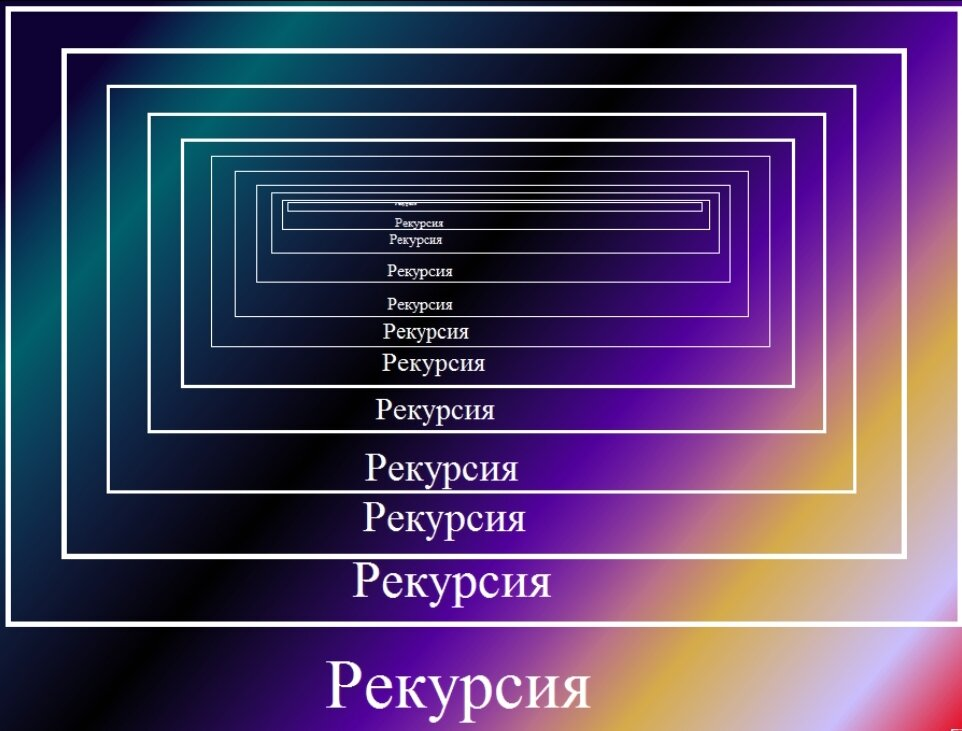
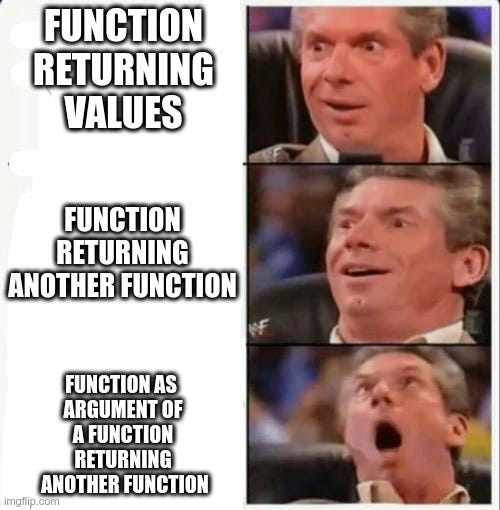
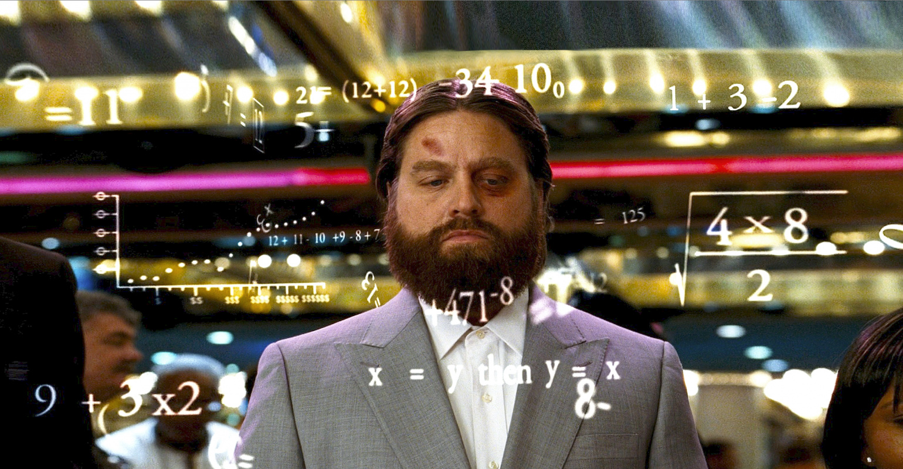
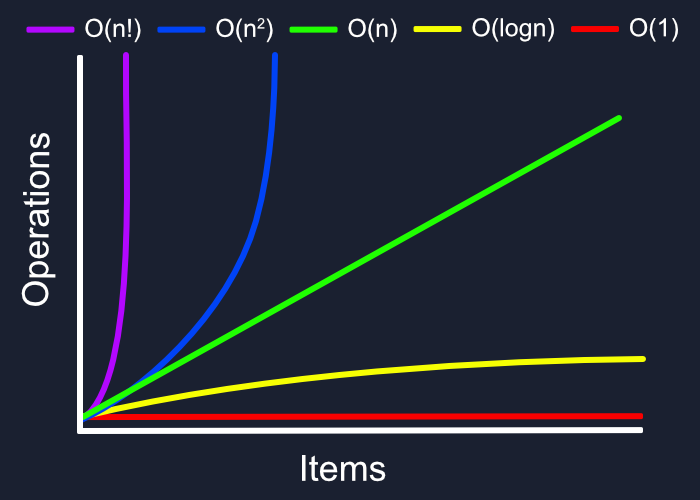
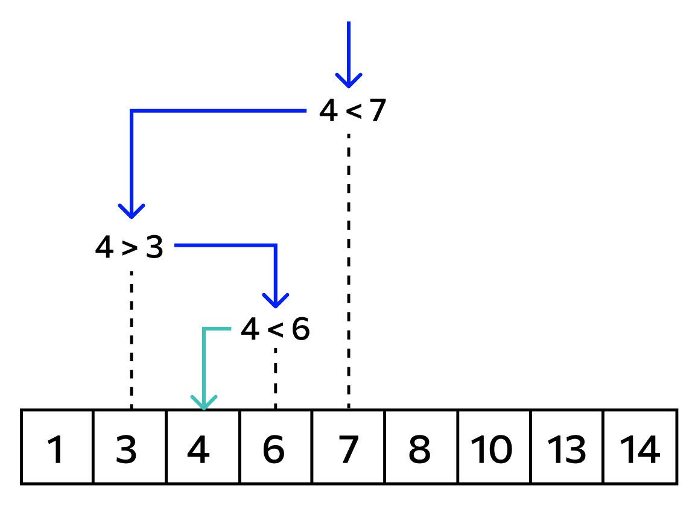
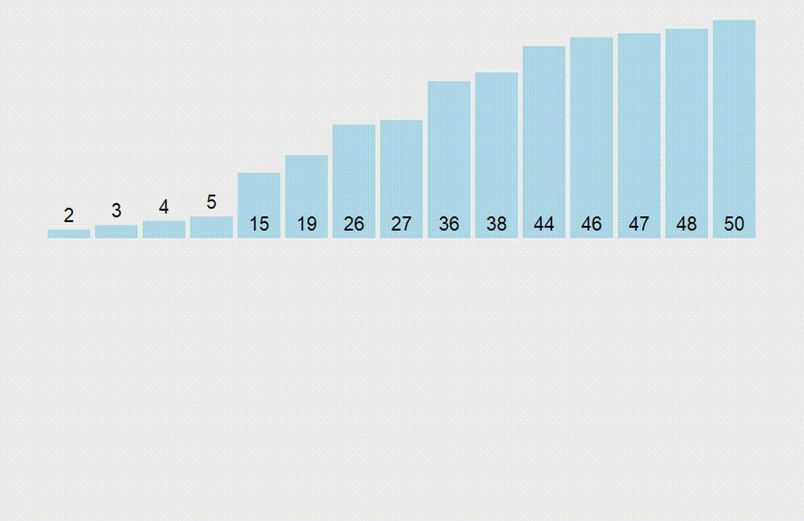
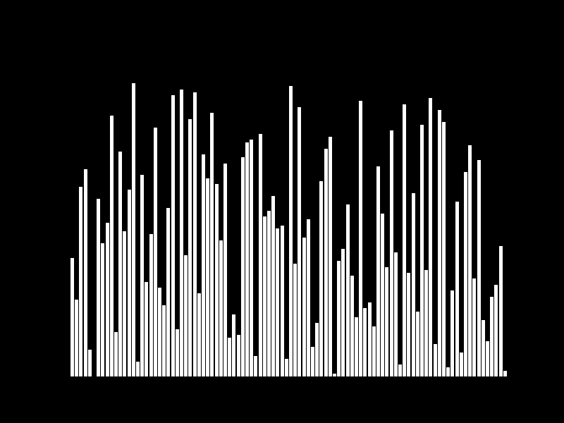
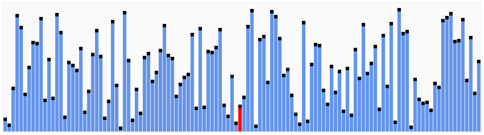

# Лекция 10. Рекурсия, алгоритмы, поиск и сортировки



## Что мы изучим сегодня?

На предыдущих лекциях мы научились работать с основными конструкциями Python, создавать функции, разделять программу на модули и использовать стандартную библиотеку.

Но одну и ту же задачу часто можно решить несколькими способами. Один вариант будет понятным, но медленным, другой - более сложным, зато сможет быстро обрабатывать большие объёмы данных.

На этой лекции мы разберём:

- что такое рекурсия и как она работает;
- что происходит в стеке вызовов;
- зачем рекурсивной функции нужен базовый случай;
- что такое алгоритм;
- как оценивать сложность алгоритма с помощью Big O;
- чем линейный поиск отличается от бинарного;
- как сортировать данные с помощью `sort()` и `sorted()`;
- как работают пузырьковая сортировка, сортировка слиянием и быстрая сортировка;
- как выбрать подходящий алгоритм для конкретной задачи.

Главная цель лекции - понять не только **как написать алгоритм**, но и **как оценить его эффективность**.

---

## Рекурсия

### Что такое рекурсия?

**Рекурсия** - это способ решения задачи, при котором функция вызывает саму себя с изменёнными аргументами.

Рекурсия подходит для задач, которые можно разделить на более маленькие задачи того же типа.

Например:

- вычисление факториала;
- обход вложенных папок;
- обработка древовидных структур;
- бинарный поиск;
- сортировка слиянием;
- быстрая сортировка.

Рекурсивная функция обязательно должна содержать две части:

1. **Базовый случай** - условие, при котором функция перестаёт вызывать саму себя.
2. **Рекурсивный шаг** - новый вызов функции с изменёнными аргументами, который приближает программу к базовому случаю.

Общая схема рекурсивной функции:

```python
def recursive_function(value):
    if условие_выхода:
        return результат

    return recursive_function(изменённое_значение)
```

Если базового случая нет или аргумент не приближается к нему, функция будет продолжать вызывать саму себя, пока Python не остановит программу с ошибкой `RecursionError`.

---

### Факториал числа

**Факториал числа** `n` - это произведение всех целых чисел от `1` до `n`.

Факториал обозначается знаком `!`:

```text
5! = 5 × 4 × 3 × 2 × 1 = 120
```

Для нуля действует отдельное правило:

```text
0! = 1
```

Сначала вычислим факториал без рекурсии с помощью цикла `for`:

```python
def factorial(n):
    if n < 0:
        raise ValueError("Факториал определён только для неотрицательных чисел")

    result = 1

    for number in range(1, n + 1):
        result *= number

    return result


print(factorial(5))
```

Результат:

```text
120
```

Теперь запишем рекурсивный вариант:

```python
def factorial(n):
    if n < 0:
        raise ValueError("Факториал определён только для неотрицательных чисел")

    if n <= 1:
        return 1

    return n * factorial(n - 1)


print(factorial(5))
```

В этой функции:

```python
def factorial(n):
    if n <= 1:
        return 1

    ...
```

- базовый случай, который останавливает рекурсию.

Строка:

```python
def factorial(n):
    ...
    return n * factorial(n - 1)
```

- рекурсивный шаг. При каждом вызове значение `n` уменьшается на единицу и приближается к базовому случаю.

---

### Как выполняются рекурсивные вызовы?

Вызов `factorial(5)` создаёт следующую цепочку:

```text
factorial(5) → 5 * factorial(4)
factorial(4) → 4 * factorial(3)
factorial(3) → 3 * factorial(2)
factorial(2) → 2 * factorial(1)
factorial(1) → 1
```

После достижения базового случая результаты начинают возвращаться назад:

```text
factorial(1) = 1
factorial(2) = 2 * 1 = 2
factorial(3) = 3 * 2 = 6
factorial(4) = 4 * 6 = 24
factorial(5) = 5 * 24 = 120
```

Функция не создаёт свою полную копию. Для каждого вызова Python создаёт новый **кадр в стеке вызовов**. В нём хранятся аргументы, локальные переменные и место, в которое программа должна вернуться после завершения функции.

---

### Стек вызовов

**Стек вызовов** - это структура, в которой Python хранит информацию о выполняющихся функциях.

Стек работает по принципу:

```text
последним добавлен → первым завершён
```

Такой принцип называется **LIFO** - Last In, First Out. При вызове `factorial(5)` кадры добавляются в стек:

```text
factorial(5)
factorial(4)
factorial(3)
factorial(2)
factorial(1)
```

После выполнения базового случая они удаляются в обратном порядке. Каждый кадр занимает память. Поэтому слишком глубокая рекурсия может привести к ошибке:

```text
RecursionError: maximum recursion depth exceeded
```

Например:

```python
def countdown(number):
    print(number)
    return countdown(number - 1)


countdown(5)
```

В этой функции нет базового случая. Значение будет уменьшаться бесконечно, а количество кадров в стеке - увеличиваться.

Исправленный вариант:

```python
def countdown(number):
    if number <= 0:
        print("Старт!")
        return

    print(number)
    countdown(number - 1)


countdown(5)
```

Результат:

```text
5
4
3
2
1
Старт!
```

---

### Преимущества и ограничения рекурсии



**Преимущества рекурсии:**

- позволяет кратко описывать задачи, которые естественно делятся на одинаковые подзадачи;
- часто делает алгоритм понятнее;
- удобно используется для деревьев, вложенных структур и алгоритмов «разделяй и властвуй»;
- помогает выразить решение без большого количества вложенных циклов.

**Ограничения рекурсии:**

- каждый вызов занимает память в стеке;
- вызов функции требует дополнительных ресурсов;
- слишком глубокая рекурсия вызывает `RecursionError`;
- неправильный базовый случай может привести к бесконечным вызовам;
- многие простые задачи в Python удобнее и безопаснее решать с помощью циклов.

Рекурсия не всегда лучше цикла. Например, обычный обратный отсчёт проще реализовать через `for`:

```python
for number in range(5, 0, -1):
    print(number)

print("Старт!")
```

Выбирайте рекурсию, когда она действительно делает решение понятнее или соответствует структуре задачи.

---

## Алгоритмы



### Что такое алгоритм?

**Алгоритм** - это конечная последовательность понятных шагов, необходимых для решения задачи. Программа содержит один или несколько алгоритмов, записанных на языке программирования.

Например, алгоритм поиска товара может выглядеть так:

1. Получить идентификатор товара.
2. Перебрать товары в списке.
3. Сравнить идентификатор каждого товара с искомым.
4. Вернуть найденный товар.
5. Если список закончился - сообщить, что товар не найден.

Признаки хорошего алгоритма:

- **точность** - каждый шаг описан однозначно;
- **конечность** - алгоритм завершается после конечного количества действий;
- **корректность** - алгоритм возвращает правильный результат;
- **эффективность** - алгоритм не выполняет лишние действия и разумно использует память;
- **понятность** - решение можно прочитать, проверить и изменить.

Одну задачу можно решить разными алгоритмами. Например, число в списке можно найти обычным перебором или бинарным поиском. Оба варианта могут вернуть правильный результат, но количество действий будет отличаться.

Для первого знакомства с алгоритмами можно использовать книги:

1. **«Грокаем алгоритмы» - Адитья Бхаргава.** Книга объясняет основные алгоритмы на простых примерах и содержит много иллюстраций. Скачать можно [здесь](https://video.ittensive.com/python-basic/algorithms.pdf)
2. **«Алгоритмы. Вводный курс» - Томас Кормен.** Более подробное введение в способы построения и анализа алгоритмов. Скачать можно [здесь](https://coollib.net/b/745087-tomas-kormen-algoritmyi-vvodnyiy-kurs)

---

## О-большое - Big O



### Что такое Big O?

**Big O** - это способ описать, как меняется количество операций или объём используемой памяти при увеличении количества входных данных. Размер входных данных обычно обозначается буквой `n`.

Например:

- список из `10` элементов - `n = 10`;
- список из `1 000` элементов - `n = 1 000`;
- строка из `50` символов - `n = 50`.

Big O не показывает точное время выполнения в секундах. Оно показывает **скорость роста количества действий**. Два компьютера могут выполнить один алгоритм за разное время, но характер роста останется одинаковым.

---

### Временная и пространственная сложность

С помощью Big O можно оценивать два вида сложности. **Временная сложность** показывает, как растёт количество операций. **Пространственная сложность** показывает, как растёт количество дополнительной памяти. Например, алгоритм может работать быстро, но создавать несколько новых списков. В таком случае временная сложность будет хорошей, а расход памяти - большим.

---

### Основные виды сложности

| Big O          | Название                 | Как растёт количество операций                                         | Пример                                                              |
| -------------- | -------------------------------- | ------------------------------------------------------------------------------------------------- | ------------------------------------------------------------------------- |
| `O(1)`       | Константная           | Не зависит от размера данных                                              | Получение элемента списка по индексу      |
| `O(log n)`   | Логарифмическая   | Растёт очень медленно                                                          | Бинарный поиск                                               |
| `O(n)`       | Линейная                 | Растёт пропорционально количеству элементов               | Линейный поиск                                               |
| `O(n log n)` | Квазилинейная       | Немного быстрее роста`n²`                                                   | Эффективные сортировки                               |
| `O(n²)`     | Квадратичная         | Увеличивается примерно как квадрат`n`                            | Два вложенных цикла                                      |
| `O(2ⁿ)`     | Экспоненциальная | Примерно удваивается при добавлении одного элемента | Наивный рекурсивный алгоритм Фибоначчи |
| `O(n!)`      | Факториальная       | Перебирает огромное количество вариантов                     | Перебор всех перестановок                          |

.jpg)

Чем быстрее растёт функция, тем хуже алгоритм масштабируется на больших данных.

---

### Константная сложность - `O(1)`

Получение элемента списка по известному индексу выполняется за постоянное количество действий:

```python
numbers = [10, 20, 30, 40, 50]

print(numbers[2])
```

Неважно, содержит список `5`, `500` или `5 000 000` элементов. Если индекс известен, Python сразу обращается к нужному элементу.

---

### Линейная сложность - `O(n)`

Если необходимо проверить каждый элемент списка, количество действий зависит от его длины:

```python
numbers = [10, 20, 30, 40, 50]

for number in numbers:
    print(number)
```

Если элементов станет в десять раз больше, цикл выполнит примерно в десять раз больше итераций.

---

### Квадратичная сложность - `O(n²)`

Два вложенных цикла часто создают квадратичную сложность:

```python
numbers = [1, 2, 3, 4]

for first_number in numbers:
    for second_number in numbers:
        print(first_number, second_number)
```

Для `4` элементов внутреннее действие выполнится `16` раз:

```text
4 × 4 = 16
```

Для `1 000` элементов количество действий будет близко к:

```text
1 000 × 1 000 = 1 000 000
```

---

### Логарифмическая сложность - `O(log n)`

Логарифмический алгоритм на каждом шаге значительно уменьшает область работы. Бинарный поиск делит оставшуюся часть списка пополам:

```text
1 000 элементов
500 элементов
250 элементов
125 элементов
...
```

Поэтому даже для очень большого списка требуется относительно мало шагов.

---

### Что не учитывают в Big O?

При оценке сложности обычно не учитывают:

- постоянные множители;
- отдельные простые операции;
- небольшие различия между компьютерами;
- точное время выполнения.

Например:

```python
for number in numbers:
    print(number)

for number in numbers:
    print(number * 2)
```

Список обходится два раза. Формально количество операций можно представить как `2n`, но в Big O постоянный множитель отбрасывается:

```text
O(2n) → O(n)
```

---

## Линейный поиск

**Линейный поиск** - это алгоритм, который последовательно проверяет элементы, пока не найдёт нужное значение или не достигнет конца списка. Алгоритм подходит как для отсортированных, так и для неотсортированных данных.

Пример:

```python
def linear_search(items, target):
    for index, item in enumerate(items):
        if item == target:
            return index

    return -1


numbers = [38, 12, 7, 23, 91, 16]

result = linear_search(numbers, 23)

print(result)
```

Результат:

```text
3
```

Если значение отсутствует, функция возвращает `-1`:

```python
print(linear_search(numbers, 100))
```

Результат:

```text
-1
```

---

### Сложность линейного поиска

В лучшем случае элемент находится в начале списка:

```text
O(1)
```

В худшем случае элемент находится в конце или отсутствует. Тогда необходимо проверить весь список:

```text
O(n)
```

При оценке линейного поиска обычно указывают худший случай - `O(n)`.

---

### Поиск объекта в списке словарей

Линейный поиск часто применяется в обычных программах. Например, найдём товар по идентификатору:

```python
products = [
    {"id": 1, "title": "Laptop", "price": 1200},
    {"id": 2, "title": "Phone", "price": 800},
    {"id": 3, "title": "Keyboard", "price": 100}
]


def find_product_by_id(products, product_id):
    for product in products:
        if product["id"] == product_id:
            return product

    return None


product = find_product_by_id(products, 2)

print(product)
```

Результат:

```text
{'id': 2, 'title': 'Phone', 'price': 800}
```

Этот алгоритм не требует предварительной сортировки товаров.

---

## Бинарный поиск



### Что такое бинарный поиск?

**Бинарный поиск** - это алгоритм поиска, который на каждом шаге делит область поиска пополам. Главное условие: бинарный поиск работает только с **отсортированными данными**. Если список не отсортирован, алгоритм может вернуть неправильный результат, даже если искомый элемент в нём присутствует.

Бинарный поиск использует подход **«разделяй и властвуй»**:

1. Найти средний элемент.
2. Сравнить его с искомым значением.
3. Если значения равны - вернуть индекс.
4. Если искомое значение больше - продолжить поиск справа.
5. Если искомое значение меньше - продолжить поиск слева.
6. Повторять, пока значение не будет найдено или диапазон поиска не закончится.

---

### Как работает бинарный поиск?

Допустим, есть отсортированный список:

```text
[2, 5, 8, 12, 16, 23, 38, 56, 72, 91]
```

Нужно найти число `23`.

Сначала определяем средний элемент:

```text
left = 0
right = 9
mid = (0 + 9) // 2 = 4
```

Под индексом `4` находится число `16`.

```text
16 < 23
```

Значит, левую половину можно отбросить и продолжить поиск справа. На следующем шаге диапазон снова делится пополам. Процесс продолжается, пока число не будет найдено.

---

### Сравнение линейного и бинарного поиска

| Количество элементов | Линейный поиск - максимум проверок | Бинарный поиск - примерно шагов |
| --------------------------------------: | --------------------------------------------------------------: | --------------------------------------------------------: |
|                                  `10` |                                                          `10` |                                                     `4` |
|                                 `100` |                                                         `100` |                                                     `7` |
|                               `1 000` |                                                       `1 000` |                                                    `10` |
|                           `1 000 000` |                                                   `1 000 000` |                                                    `20` |

Линейный поиск имеет сложность `O(n)`, а бинарный - `O(log n)`.

При этом бинарному поиску требуется отсортированный список. Если данные необходимо предварительно сортировать только ради одного поиска, затраты на сортировку тоже нужно учитывать.

---

### Итеративная реализация бинарного поиска

```python
def binary_search(items, target):
    left = 0
    right = len(items) - 1

    while left <= right:
        middle = (left + right) // 2

        if items[middle] == target:
            return middle

        if items[middle] < target:
            left = middle + 1
        else:
            right = middle - 1

    return -1


numbers = [2, 5, 8, 12, 16, 23, 38, 56, 72, 91]

result = binary_search(numbers, 23)

print("Элемент найден на индексе:", result)
```

Результат:

```text
Элемент найден на индексе: 5
```

Переменные `left` и `right` хранят границы области поиска, а `middle` - индекс среднего элемента.

Цикл выполняется, пока левая граница не станет больше правой:

```python
while left <= right:
    ...
```

Если диапазон закончился, значение отсутствует в списке.

---

### Рекурсивная реализация бинарного поиска

```python
def binary_search_recursive(items, target, left, right):
    if left > right:
        return -1

    middle = (left + right) // 2

    if items[middle] == target:
        return middle

    if items[middle] < target:
        return binary_search_recursive(
            items,
            target,
            middle + 1,
            right
        )

    return binary_search_recursive(
        items,
        target,
        left,
        middle - 1
    )


numbers = [2, 5, 8, 12, 16, 23, 38, 56, 72, 91]

result = binary_search_recursive(
    numbers,
    23,
    0,
    len(numbers) - 1
)

print("Элемент найден на индексе:", result)
```

Базовый случай:

```python
def binary_search_recursive(items, target, left, right):
    if left > right:
        return -1

    ...
```

означает, что область поиска закончилась, а элемент не найден.

Итеративная и рекурсивная версии имеют временную сложность `O(log n)`. Итеративная версия обычно использует меньше дополнительной памяти, потому что не создаёт новые кадры в стеке вызовов.

---

## Алгоритмы сортировки в Python

**Сортировка** - это упорядочивание элементов по определённому правилу.

Данные можно сортировать:

- по возрастанию или убыванию;
- по алфавиту;
- по длине строки;
- по цене;
- по дате;
- по одному из полей словаря.

Сортировка упрощает просмотр данных и позволяет применять алгоритмы, которым требуется определённый порядок, например бинарный поиск.

В обычной программе сначала следует использовать встроенные инструменты Python - метод `sort()` и функцию `sorted()`. Ручные алгоритмы сортировки изучают, чтобы понять принципы их работы и научиться оценивать сложность.

---

## Сортировка с помощью `sort()` и `sorted()`

### Метод `sort()`

Метод `sort()` сортирует исходный список.

```python
numbers = [5, 2, 9, 1, 7]

numbers.sort()

print(numbers)
```

Результат:

```text
[1, 2, 5, 7, 9]
```

Метод изменяет список и возвращает `None`:

```python
numbers = [5, 2, 9, 1, 7]

result = numbers.sort()

print(result)
```

Результат:

```text
None
```

Поэтому результат `sort()` не нужно сохранять в новую переменную.

---

### Функция `sorted()`

Функция `sorted()` возвращает новый отсортированный список и не изменяет исходную коллекцию.

```python
numbers = [5, 2, 9, 1, 7]

sorted_numbers = sorted(numbers)

print(numbers)
print(sorted_numbers)
```

Результат:

```text
[5, 2, 9, 1, 7]
[1, 2, 5, 7, 9]
```

`sorted()` можно применять не только к спискам, но и к другим итерируемым объектам, например к кортежам, множествам и строкам. Результатом всё равно будет список.

---

### Сравнение `sort()` и `sorted()`

| Инструмент | Изменяет исходный список | Возвращает новый список | Работает с другими коллекциями |
| -------------------- | ---------------------------------------------- | -------------------------------------------- | --------------------------------------------------------- |
| `list.sort()`      | Да                                           | Нет                                       | Нет                                                    |
| `sorted()`         | Нет                                         | Да                                         | Да                                                      |

Используйте `sort()`, если исходный список можно изменить.

Используйте `sorted()`, если нужно сохранить первоначальный порядок данных.

---

### Сортировка по убыванию

Параметр `reverse=True` меняет направление сортировки:

```python
numbers = [5, 2, 9, 1, 7]

numbers.sort(reverse=True)

print(numbers)
```

Результат:

```text
[9, 7, 5, 2, 1]
```

Параметр доступен и для `sorted()`:

```python
sorted_numbers = sorted(numbers, reverse=True)
```

---

### Сортировка с помощью `key`

Параметр `key` принимает функцию, которая определяет значение для сравнения.

Отсортируем строки по длине:

```python
words = ["Python", "AI", "algorithm", "code"]

sorted_words = sorted(words, key=len)

print(sorted_words)
```

Результат:

```text
['AI', 'code', 'Python', 'algorithm']
```

Отсортируем товары по цене:

```python
products = [
    {"title": "Laptop", "price": 1200},
    {"title": "Phone", "price": 800},
    {"title": "Keyboard", "price": 100}
]

products_by_price = sorted(
    products,
    key=lambda product: product["price"]
)

print(products_by_price)
```

Для сортировки от самой высокой цены к самой низкой добавим `reverse=True`:

```python
products_by_price = sorted(
    products,
    key=lambda product: product["price"],
    reverse=True
)
```

Сортировка Python является **стабильной**. Если ключи двух элементов равны, их взаимный порядок сохраняется.

Встроенная сортировка Python основана на алгоритме **Timsort**. В худшем случае её временная сложность составляет `O(n log n)`, а уже частично упорядоченные данные она может обрабатывать быстрее.

---

## Пузырьковая сортировка - Bubble Sort

**Пузырьковая сортировка** - это алгоритм, который последовательно сравнивает соседние элементы и меняет их местами, если они расположены в неправильном порядке.

После каждого полного прохода самый большой из ещё не отсортированных элементов перемещается в конец списка.

### Принцип работы

1. Сравнить первый и второй элементы.
2. Поменять их местами, если первый больше второго.
3. Перейти к следующей паре.
4. Продолжить до конца списка.
5. Повторять проходы, пока перестановки не прекратятся.


Рассмотрим список:

```text
[5, 3, 8, 2]
```

После первого прохода:

```text
[3, 5, 2, 8]
```

Число `8` переместилось в конец и уже находится на правильной позиции.

---

### Реализация пузырьковой сортировки

```python
def bubble_sort(items):
    length = len(items)

    for pass_number in range(length):
        swapped = False

        for index in range(0, length - pass_number - 1):
            if items[index] > items[index + 1]:
                items[index], items[index + 1] = (
                    items[index + 1],
                    items[index]
                )
                swapped = True

        if not swapped:
            break

    return items


numbers = [64, 34, 25, 12, 22, 11, 90]

print(bubble_sort(numbers))
```

Результат:

```text
[11, 12, 22, 25, 34, 64, 90]
```

Переменная `swapped` показывает, выполнялись ли перестановки во время прохода.

Если перестановок не было, список уже отсортирован и работу можно завершить:

```python
for pass_number in range(length):
    ...

    if not swapped:
        break
```

Эта реализация изменяет исходный список.

---

### Сложность пузырьковой сортировки

- лучший случай - `O(n)`, если список уже отсортирован и используется проверка `swapped`;
- средний случай - `O(n²)`;
- худший случай - `O(n²)`;
- дополнительная память - `O(1)`.

Пузырьковая сортировка легко объясняется, но работает медленно на больших списках. В реальных программах вместо неё обычно используют `sort()` или `sorted()`.

---

## Сортировка слиянием - Merge Sort

**Сортировка слиянием** - это алгоритм, который делит список на две части, рекурсивно сортирует каждую часть, а затем объединяет их в один отсортированный список.

Алгоритм использует подход **«разделяй и властвуй»**.

### Принцип работы

**Разделение:**

1. Разделить список пополам.
2. Снова разделить каждую половину.
3. Продолжать, пока в каждой части не останется один элемент.

**Слияние:**

1. Сравнить первые элементы двух частей.
2. Добавить меньший элемент в результат.
3. Повторять сравнение.
4. Добавить оставшиеся элементы.





Список из одного элемента уже считается отсортированным. Это базовый случай рекурсии.

---

### Реализация сортировки слиянием

```python
def merge(left, right):
    result = []
    left_index = 0
    right_index = 0

    while left_index < len(left) and right_index < len(right):
        if left[left_index] <= right[right_index]:
            result.append(left[left_index])
            left_index += 1
        else:
            result.append(right[right_index])
            right_index += 1

    result.extend(left[left_index:])
    result.extend(right[right_index:])

    return result


def merge_sort(items):
    if len(items) <= 1:
        return items

    middle = len(items) // 2

    left_half = merge_sort(items[:middle])
    right_half = merge_sort(items[middle:])

    return merge(left_half, right_half)


numbers = [38, 27, 43, 3, 9, 82, 10]

print(merge_sort(numbers))
```

Результат:

```text
[3, 9, 10, 27, 38, 43, 82]
```

Функция `merge_sort()` отвечает за разделение списка, а функция `merge()` - за объединение отсортированных частей. Сравнение через `<=` позволяет сначала брать равный элемент из левой части и сохранять стабильность сортировки.

---

### Сложность сортировки слиянием

- лучший случай - `O(n log n)`;
- средний случай - `O(n log n)`;
- худший случай - `O(n log n)`;
- дополнительная память для новых списков - `O(n)`;
- глубина стека рекурсивных вызовов - `O(log n)`.

Сортировка слиянием работает предсказуемо и является стабильной, но требует дополнительной памяти.

---

## Быстрая сортировка - Quick Sort

**Быстрая сортировка** - это алгоритм, который выбирает опорный элемент, разделяет остальные элементы относительно него и рекурсивно сортирует полученные части.

Опорный элемент называется **pivot**.

### Принцип работы

1. Выбрать опорный элемент `pivot`.
2. Поместить меньшие элементы в левую часть.
3. Поместить равные элементы в среднюю часть.
4. Поместить большие элементы в правую часть.
5. Рекурсивно отсортировать левую и правую части.
6. Объединить результаты.




Эффективность быстрой сортировки зависит от того, насколько удачно выбирается опорный элемент.

---

### Реализация быстрой сортировки

```python
def quick_sort(items):
    if len(items) <= 1:
        return items

    pivot = items[len(items) // 2]

    left = [item for item in items if item < pivot]
    middle = [item for item in items if item == pivot]
    right = [item for item in items if item > pivot]

    return quick_sort(left) + middle + quick_sort(right)


numbers = [3, 6, 8, 10, 1, 2, 1]

print(quick_sort(numbers))
```

Результат:

```text
[1, 1, 2, 3, 6, 8, 10]
```

Этот вариант удобен для изучения, но создаёт новые списки `left`, `middle` и `right`. Он не является сортировкой на месте.

---

### Сложность быстрой сортировки

- лучший случай - `O(n log n)`;
- средний случай - `O(n log n)`;
- худший случай - `O(n²)`;
- расход дополнительной памяти зависит от реализации.

Худший случай возникает, когда опорный элемент снова и снова делит список крайне неравномерно - например, оказывается минимальным или максимальным значением.

В представленном примере опорным выбирается средний по индексу элемент. Поэтому уже отсортированный список не обязательно станет худшим случаем. Однако удачное деление всё равно не гарантировано для любых входных данных.

Классическая быстрая сортировка часто реализуется на месте и обычно считается нестабильной. Наша учебная версия проще для чтения, но использует дополнительную память для новых списков.

---

## Сравнение алгоритмов сортировки

| Характеристика              |      Bubble Sort |                                                 Merge Sort |                                    Quick Sort - учебная версия |                                 `sort()` / `sorted()` |
| ----------------------------------------- | ---------------: | ---------------------------------------------------------: | --------------------------------------------------------------------------: | --------------------------------------------------------: |
| Лучший случай                 |         `O(n)` |                                             `O(n log n)` |                                                              `O(n log n)` | до`O(n)` на упорядоченных данных |
| Средний случай               |       `O(n²)` |                                             `O(n log n)` |                                                              `O(n log n)` |                                            `O(n log n)` |
| Худший случай                 |       `O(n²)` |                                             `O(n log n)` |                                                                  `O(n²)` |                                            `O(n log n)` |
| Дополнительная память |         `O(1)` |                                                   `O(n)` |                                      Создаёт новые списки |                          Зависит от данных |
| Стабильность                  |             Да |                                                       Да | Не следует считать общей гарантией Quick Sort |                                                      Да |
| Основное применение     | Обучение | Изучение стабильной сортировки |                   Изучение «разделяй и властвуй» |                       Реальные программы |

### Пузырьковая сортировка

Пузырьковая сортировка понятна и легко реализуется, но выполняет слишком много сравнений на больших списках.

Лучший случай - список уже отсортирован:

```text
[1, 2, 3, 4, 5]
```

Худший случай - список расположен в обратном порядке:

```text
[5, 4, 3, 2, 1]
```

### Сортировка слиянием

Сортировка слиянием имеет сложность `O(n log n)` независимо от первоначального порядка элементов.

Она работает стабильно и предсказуемо, но создаёт дополнительные списки.

### Быстрая сортировка

Быстрая сортировка работает быстро, если опорный элемент делит список примерно на равные части.

Если деление постоянно получается неравномерным, сложность может ухудшиться до `O(n²)`.

### Встроенная сортировка Python

Для обычных задач используйте:

```python
items.sort()
```

или:

```python
sorted_items = sorted(items)
```

Самостоятельные реализации Bubble Sort, Merge Sort и Quick Sort нужны прежде всего для понимания алгоритмов, рекурсии и оценки сложности.

---

## Как выбрать алгоритм поиска?

| Ситуация                                                                                     | Подходящий вариант                                                                                            |
| ---------------------------------------------------------------------------------------------------- | ------------------------------------------------------------------------------------------------------------------------------ |
| Данные не отсортированы, поиск выполняется один раз      | Линейный поиск                                                                                                    |
| Данные отсортированы, поисков будет много                        | Бинарный поиск                                                                                                    |
| Нужно найти объект по условию в небольшом списке            | Линейный поиск                                                                                                    |
| Нужен многократный быстрый поиск по уникальному ключу | Лучше заранее выбрать подходящую структуру данных, например словарь |

Бинарный поиск не всегда автоматически лучше линейного. Необходимо учитывать подготовку данных, количество поисков и структуру программы.

---

## Типичные ошибки

### Отсутствует базовый случай рекурсии

```python
def countdown(number):
    return countdown(number - 1)
```

Функция не может остановиться и завершится ошибкой `RecursionError`.

---

### Аргумент не приближается к базовому случаю

```python
def countdown(number):
    if number == 0:
        return

    countdown(number)
```

Значение `number` не изменяется, поэтому базовый случай не будет достигнут.

Правильно:

```python
countdown(number - 1)
```

---

### Бинарный поиск применяется к неотсортированному списку

```python
numbers = [50, 10, 40, 20, 30]

binary_search(numbers, 20)
```

Алгоритм сравнивает элементы, предполагая, что меньшие значения находятся слева, а большие - справа. Для неотсортированного списка это предположение неверно.

---

### Границы бинарного поиска не изменяются

Неправильно:

```python
left = middle
```

или:

```python
right = middle
```

Средний элемент уже был проверен. Если оставить его в диапазоне, цикл может не завершиться.

Правильно:

```python
left = middle + 1
```

```python
right = middle - 1
```

---

### Результат `sort()` сохраняется в переменную

```python
numbers = [3, 1, 2]

sorted_numbers = numbers.sort()

print(sorted_numbers)
```

Метод `sort()` изменяет список и возвращает `None`.

Правильно:

```python
numbers.sort()
print(numbers)
```

или:

```python
sorted_numbers = sorted(numbers)
```

---

### Не учитывается изменение исходного списка

Пузырьковая сортировка из лекции изменяет переданный список.

Если необходимо сохранить исходные данные, передайте копию:

```python
sorted_numbers = bubble_sort(numbers.copy())
```

---

### Сложность оценивается только по одному запуску

Один алгоритм может случайно выполниться быстрее другого на маленьком списке. Это ещё не доказывает, что у него лучше сложность.

Big O показывает характер роста количества операций при увеличении входных данных, а не результат одного измерения.

---

## Работа с AI-помощником

AI-помощника можно использовать для анализа алгоритма, поиска граничных случаев и сравнения решений. Не просите его сразу переписать всю программу. Сначала получите объяснение.

Возьмите реализации линейного и бинарного поиска из лекции и передайте их AI-помощнику.

Попросите:

1. Объяснить разницу между `O(n)` и `O(log n)` на списках из `10`, `1 000` и `1 000 000` элементов.
2. Найти граничные случаи для обеих функций.
3. Объяснить, почему бинарный поиск нельзя применять к неотсортированному списку.
4. Проверить изменение границ `left` и `right`.
5. Не писать новый код, пока ошибки не будут объяснены.

Пример запроса:

```text
Проанализируй две функции поиска. Объясни сложность каждой функции,
найди возможные граничные случаи и проверь условия завершения.
Сначала дай объяснение и список проверок. Не переписывай код полностью.
```

После ответа самостоятельно проверь функции на следующих данных:

```python
[]
[5]
[1, 2, 3, 4, 5]
[1, 2, 2, 2, 3]
```

Проверьте случаи, когда:

- значение находится в начале;
- значение находится в середине;
- значение находится в конце;
- значение отсутствует;
- список пустой;
- в списке есть повторяющиеся элементы.

AI-помощник может предложить тесты и объяснить поведение программы, но окончательный вывод необходимо подтвердить запуском кода.

---

## Практические задания

1. **Факториал числа.** Создайте рекурсивную функцию `factorial(n)`, которая вычисляет факториал неотрицательного числа. Для отрицательного значения выведите сообщение об ошибке.
2. **Числа Фибоначчи.** Создайте рекурсивную функцию, которая возвращает `n`-е число Фибоначчи. Проверьте её только на небольших значениях и объясните, почему наивная рекурсивная реализация имеет сложность около `O(2ⁿ)`.
3. **Сумма цифр числа.** Создайте рекурсивную функцию, которая вычисляет сумму цифр положительного целого числа. Например, для числа `583` результат должен быть равен `16`.
4. **Максимальный элемент.** Рекурсивно найдите наибольшее число в непустом списке.
5. **Сумма элементов списка.** Создайте рекурсивную функцию, которая возвращает сумму всех чисел списка.
6. **Линейный поиск.** Создайте функцию `linear_search(items, target)`, которая возвращает индекс найденного элемента или `-1`.
7. **Количество проверок.** Измените линейный поиск так, чтобы функция дополнительно возвращала количество выполненных сравнений. Проверьте элемент в начале, в конце и отсутствующий элемент.
8. **Бинарный поиск.** Реализуйте итеративный бинарный поиск. Проверьте пустой список, список из одного элемента, найденное и отсутствующее значение.
9. **Сортировка товаров.** Создайте список словарей с полями `title`, `price` и `quantity`. С помощью `sorted()` получите отдельные списки товаров, отсортированные по цене, количеству и названию.

---

## Домашнее задание

1. Создайте рекурсивную функцию `power(number, exponent)`, которая возводит положительное число в целую неотрицательную степень. Не используйте оператор `**`.
2. Создайте рекурсивную функцию `reverse_text(text)`, которая возвращает строку в обратном порядке.
3. Создайте рекурсивную функцию `is_palindrome(text)`, которая проверяет, одинаково ли строка читается слева направо и справа налево. Перед проверкой не учитывайте регистр и пробелы.
4. Создайте функцию линейного поиска, которая возвращает список всех индексов искомого значения. Например, для списка `[4, 2, 4, 7, 4]` и значения `4` результатом должен быть `[0, 2, 4]`.
5. Создайте список товаров из словарей с полями `id`, `title`, `price` и `quantity`. Реализуйте линейный поиск товара по `id`. Если товар не найден, верните `None`.
6. Создайте функцию бинарного поиска слова в списке, предварительно отсортированном без учёта регистра. Поиск также не должен зависеть от регистра: `Python` и `python` должны считаться одинаковыми значениями.
7. Создайте список студентов с полями `name`, `age` и `grade`. Используя `sorted()` и параметр `key`, отсортируйте студентов по имени, возрасту и оценке. Оценки выведите по убыванию.
8. Определите временную сложность каждого фрагмента и объясните ответ:

```python
print(numbers[0])
```

```python
for number in numbers:
    print(number)
```

```python
for first_number in numbers:
    for second_number in numbers:
        print(first_number, second_number)
```

```python
while number > 1:
    number //= 2
```

---

## Итоги лекции

В этой лекции мы познакомились с рекурсией, научились оценивать сложность алгоритмов и рассмотрели основные способы поиска и сортировки данных.

| Тема                    | Что изучили                                                                                      |
| --------------------------- | ---------------------------------------------------------------------------------------------------------- |
| Рекурсия            | Вызов функцией самой себя с изменёнными аргументами           |
| Базовый случай | Условие завершения рекурсивных вызовов                                  |
| Стек вызовов     | Хранение кадров выполняющихся функций                                    |
| Алгоритм            | Конечная последовательность шагов для решения задачи        |
| Big O                       | Оценка роста количества операций и дополнительной памяти |
| `O(1)`                    | Константная сложность                                                                  |
| `O(log n)`                | Логарифмическая сложность                                                          |
| `O(n)`                    | Линейная сложность                                                                        |
| `O(n log n)`              | Сложность эффективных алгоритмов сортировки                        |
| `O(n²)`                  | Квадратичная сложность                                                                |
| Линейный поиск | Последовательная проверка элементов за`O(n)`                          |
| Бинарный поиск | Деление отсортированной области поиска пополам за`O(log n)`  |
| `sort()`                  | Сортировка исходного списка                                                       |
| `sorted()`                | Создание нового отсортированного списка                                |
| Bubble Sort                 | Простая сортировка соседними обменами                                    |
| Merge Sort                  | Рекурсивное разделение и слияние частей                                 |
| Quick Sort                  | Разделение элементов относительно опорного значения         |

Рекурсивная функция должна иметь базовый случай и рекурсивный шаг:

```python
def countdown(number):
    if number <= 0:
        return

    print(number)
    countdown(number - 1)
```

Линейный поиск работает с любым списком, но в худшем случае проверяет каждый элемент:

```text
O(n)
```

Бинарный поиск значительно быстрее на больших данных, но требует отсортированного списка:

```text
O(log n)
```

В обычных программах для сортировки данных следует использовать:

```python
items.sort()
```

или:

```python
sorted_items = sorted(items)
```

Ручные алгоритмы сортировки помогают понять рекурсию, подход «разделяй и властвуй» и влияние сложности на производительность программы.

После прохождения лекции вы умеете:

- создавать рекурсивные функции;
- определять базовый случай и рекурсивный шаг;
- объяснять работу стека вызовов;
- различать основные виды сложности Big O;
- реализовывать линейный и бинарный поиск;
- сортировать данные с помощью `sort()` и `sorted()`;
- объяснять работу Bubble Sort, Merge Sort и Quick Sort;
- сравнивать алгоритмы по времени выполнения и расходу памяти;
- выбирать подходящий способ поиска и сортировки для конкретной задачи.
