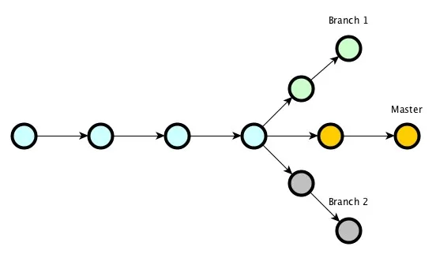
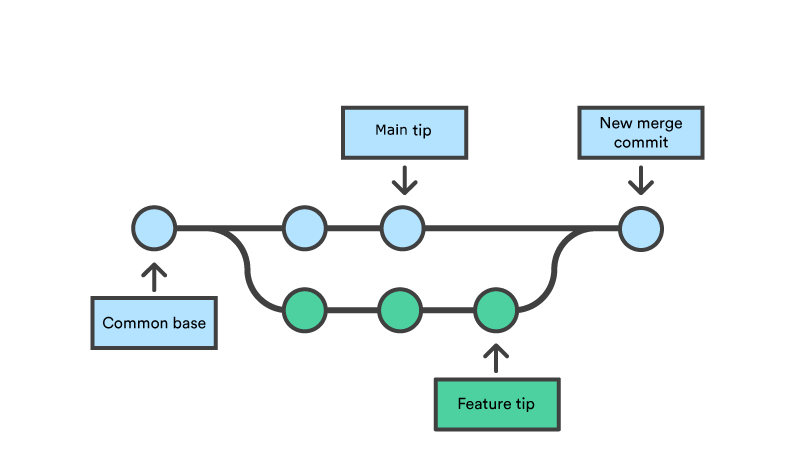
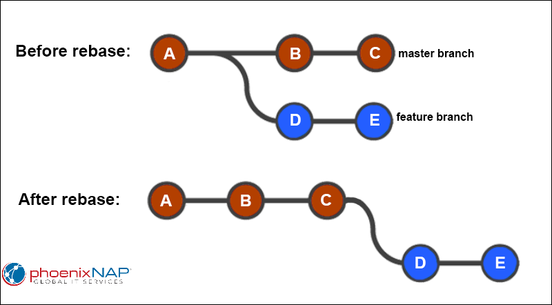
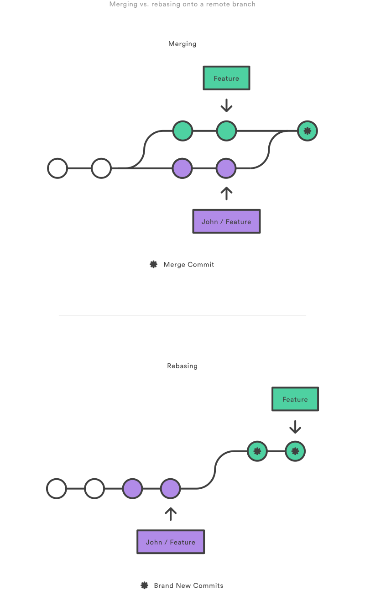
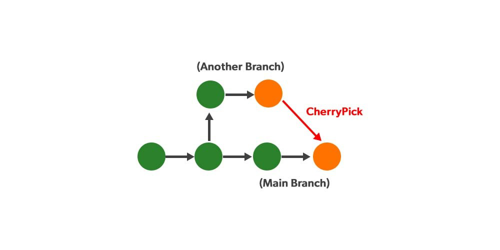

# Лекция 11: Введение в Git. Локальный репозиторий. Базовые команды


## Введение в Git: зачем нужен контроль версий?

Сегодня мы познакомимся с системой контроля версий Git - одной из самых популярных технологий, используемых в разработке программного обеспечения.

Git позволяет сохранять историю изменений проекта, возвращаться к предыдущим версиям, работать с отдельными ветками разработки и безопасно объединять изменения.

### Что такое система контроля версий и зачем она нужна?

Представьте, что вы работаете над дипломной работой, важным отчётом или проектом. В какой-то момент на вашем компьютере появляются файлы с названиями:

- `проект_финал.docx`
- `проект_финал_новая_версия.docx`
- `проект_финал_окончательный_точно.docx`

Знакомая ситуация?

Когда изменений становится слишком много, легко потерять нужную версию или случайно удалить важную информацию.

А теперь представьте, что над одним проектом работают несколько разработчиков. Каждый вносит свои изменения, и без специального инструмента становится сложно понять:

- кто изменил код;
- что именно было изменено;
- когда произошло изменение;
- какая версия проекта является актуальной;
- как вернуть рабочее состояние проекта.

**Система контроля версий (VCS - Version Control System)** позволяет отслеживать изменения файлов и хранить историю развития проекта.

### Почему системы контроля версий важны?

В процессе разработки программного обеспечения возникают типичные задачи:

- **Отслеживание изменений** - кто и когда изменил код?
- **История версий** - возможность посмотреть предыдущие состояния проекта.
- **Возврат изменений** - возможность вернуть рабочую версию, если что-то сломалось.
- **Параллельная разработка** - можно создавать отдельные ветки для новых функций.
- **Совместная работа** - несколько разработчиков могут работать над одним проектом.

> Git работает локально и не требует GitHub для создания коммитов, веток и просмотра истории проекта. С удалёнными репозиториями мы познакомимся отдельно.

---

## История Git: как он появился?

До Git разработчики уже использовали системы контроля версий. Среди известных централизованных систем были:

- **CVS (Concurrent Versions System)** - одна из ранних систем контроля версий.
- **SVN (Subversion)** - более современная централизованная система, поддерживающая версионирование директорий и атомарные коммиты.

Главный принцип централизованных систем заключается в том, что основная история проекта хранится на центральном сервере.

Позже получили распространение распределённые системы контроля версий, в которых каждый разработчик может иметь полноценную локальную копию репозитория вместе с историей изменений.

К таким системам относятся Git и Mercurial.

### Использование BitKeeper в разработке Linux

В 2002 году разработчики ядра Linux начали использовать BitKeeper - распределённую систему контроля версий.

BitKeeper хорошо подходил для крупного проекта Linux, однако являлся коммерческим продуктом.

В 2005 году бесплатное использование BitKeeper для проекта Linux прекратилось. Команде понадобилась новая система контроля версий, которую они могли бы полностью контролировать.

### Создание Git

В апреле 2005 года Линус Торвальдс начал разработку новой системы контроля версий.


Основными целями Git стали:

- высокая скорость работы;
- распределённая архитектура;
- удобная работа с ветками;
- надёжное хранение истории изменений;
- возможность работать с очень большими проектами.

Так появился Git.

### Почему Git?

Линус Торвальдс шутил, что слово `git` в британском английском может использоваться как не слишком приятное обозначение человека.

Также существуют шуточные расшифровки:

- `Global Information Tracker` - если всё работает;
- `Garbage In, Garbage Out` - если что-то пошло не так.

### Развитие Git

Git быстро стал использоваться не только для разработки Linux, но и во множестве других проектов. В 2008 году появилась платформа GitHub, которая значительно упростила хранение Git-репозиториев в интернете и совместную работу разработчиков.

Важно понимать:

**Git и GitHub - не одно и то же.**

- **Git** - система контроля версий.
- **GitHub** - сервис для хранения Git-репозиториев и совместной работы.

В этой лекции мы работаем только с **локальным Git**.

---

## Установка Git

### Windows

Скачайте Git for Windows с официального сайта: [https://git-scm.com/](https://git-scm.com/)

Во время первой установки большинство настроек можно оставить по умолчанию.

Проверить установку:

```bash
git --version
```

### macOS

Если установлен Homebrew:

```bash
brew install git
```

На macOS Git также может быть установлен вместе с Command Line Tools.

Проверка:

```bash
git --version
```

### Linux (Ubuntu/Debian)

```bash
sudo apt update
sudo apt install git
```

Проверка:

```bash
git --version
```

---

## Первоначальная настройка Git

После установки Git необходимо указать имя и email пользователя.

```bash
git config --global user.name "Ваше Имя"
git config --global user.email "your_email@example.com"
```

Эти данные будут сохраняться в созданных вами коммитах.

Проверить настройки:

```bash
git config --list
```

Также удобно сразу установить имя основной ветки:

```bash
git config --global init.defaultBranch main
```

Теперь новые репозитории будут начинаться с ветки `main`.

---

## Что такое репозиторий?

**Репозиторий** - это проект, история изменений которого отслеживается Git. Проще говоря папка с вашим проектом. Можно выделить два типа репозиториев:

- **Локальный** - находится на вашем компьютере.
- **Удалённый** - находится на другом компьютере или сервере, например GitHub, GitLab или Bitbucket.

В этой лекции нас интересует локальный репозиторий.

---

## Создание локального репозитория

Создадим папку проекта:

```bash
mkdir git-practice
cd git-practice
```

Чтобы превратить обычную папку в Git-репозиторий, выполните:

```bash
git init
```

После выполнения команды Git создаст скрытую директорию:

```text
.git/
```

В ней хранится служебная информация Git:

- история коммитов;
- ветки;
- настройки локального репозитория;
- информация о текущем состоянии проекта.

> Если директория `.git` не отображается, включите отображение скрытых файлов.

Удалять или вручную изменять содержимое `.git` без необходимости не нужно.

---

#### Состояния файлов в Git

Каждый файл в репозитории может находиться в одном из четырёх состояний:


- **Untracked (Неотслеживаемый)** - новый файл, о котором Git пока ничего не знает.
- **Modified (Изменённый)** - файл уже отслеживается, но в него внесены изменения.
- **Staged (Подготовленный)** - файл отмечен для следующего коммита.
- **Committed (Зафиксированный)** - версия файла сохранена в истории Git.

Эти состояния можно увидеть с помощью команды:

```bash
git status
```

Обычный цикл работы выглядит так:

```text
Untracked / Modified
        ↓
      git add
        ↓
      Staged
        ↓
    git commit
        ↓
    Committed
```

Команда `git status` будет одной из самых часто используемых команд при работе с Git.

---

## Основные команды Git

### git status

Команда:

```bash
git status
```

показывает текущее состояние репозитория:

- текущую ветку;
- новые файлы;
- изменённые файлы;
- подготовленные к коммиту файлы;
- удалённые файлы.

Если вы не понимаете, что сейчас происходит в Git, первым делом используйте:

```bash
git status
```

---

### git add

Чтобы добавить конкретный файл в staging area:

```bash
git add main.py
```

Добавить несколько файлов:

```bash
git add main.py utils.py
```

Добавить изменения из текущей директории и её вложенных директорий:

```bash
git add .
```

Добавить все изменения рабочего дерева репозитория:

```bash
git add -A
```

После этого файлы переходят в состояние **Staged** и будут включены в следующий коммит.

Проверим:

```bash
git status
```

> `git add` не создаёт коммит. Команда только подготавливает изменения.

---

### git diff

Перед добавлением изменений полезно посмотреть, что именно изменилось:

```bash
git diff
```

Команда показывает изменения рабочего каталога, которые ещё не были добавлены в staging area. Если изменения уже добавлены через `git add`, используйте:

```bash
git diff --staged
```

Это позволяет увидеть, какие изменения попадут в следующий коммит.

---

### git commit

После подготовки файлов создаём коммит:

```bash
git commit -m "Сообщение о коммите"
```

Например:

```bash
git commit -m "Add calculator functions"
```

**Коммит** - это сохранённое состояние изменений проекта в определённый момент времени. Хорошее сообщение коммита должно коротко объяснять, что было сделано.

Например:

```text
Add user registration
Fix calculation error
Update README
Create product model
```

Плохие сообщения:

```text
commit
changes
fix
123
test
```

---

### git log

Посмотреть историю коммитов:

```bash
git log
```

Git покажет:

- хеш коммита;
- автора;
- дату;
- сообщение коммита.

Более компактный вариант:

```bash
git log --oneline
```

Например:

```text
17bc812 Add calculator functions
8d92f44 Create project structure
24ab912 Initial commit
```

Хеш коммита является его идентификатором. Обычно для команд достаточно использовать первые несколько символов хеша:

```text
17bc812
```

---

### Просмотр предыдущего коммита

Иногда нужно посмотреть, как проект выглядел раньше. Можно временно переключиться на конкретный коммит:

```bash
git switch --detach 17bc812
```

В этом случае Git перейдёт в состояние **detached HEAD**.

Чтобы вернуться обратно:

```bash
git switch main
```

Что такое `HEAD`, разберём подробнее позже.

---

## Игнорирование файлов - .gitignore

Не все файлы проекта нужно сохранять в Git.

Например:

- виртуальное окружение;
- временные файлы;
- кеш;
- настройки IDE;
- `.env` с секретными значениями;
- автоматически сгенерированные файлы.

Для этого используется файл:

```text
.gitignore
```

Пример:

```gitignore
# Виртуальное окружение
venv/
.venv/

# Python cache
__pycache__/
*.pyc

# IDE
.vscode/
.idea/

# Переменные окружения
.env

# Временные файлы
*.log
*.tmp
```

После создания `.gitignore` его тоже нужно добавить в Git:

```bash
git add .gitignore
git commit -m "Add gitignore"
```

### Важный момент

`.gitignore` влияет на файлы, которые Git ещё не отслеживает. Если файл уже был добавлен в Git, простого добавления его имени в `.gitignore` недостаточно.

Например, если `.env` уже отслеживается:

```bash
git rm --cached .env
```

После этого файл останется на компьютере, но Git перестанет его отслеживать. Теперь можно добавить `.env` в `.gitignore`.

---

## Что такое ветка?

Git позволяет вести несколько вариантов развития проекта одновременно. **Ветка (branch)** - это отдельная линия разработки.

Например, у нас есть рабочая версия проекта:

```text
main
```

Мы хотим добавить новую функцию, но не хотим менять основную ветку напрямую.

Можно создать:

```text
feature/calculator
```

и работать в ней. После завершения работы изменения можно объединить с `main`.



---

## Зачем нужны ветки?

Ветки позволяют:

- разрабатывать новую функциональность отдельно;
- исправлять ошибки;
- экспериментировать;
- не ломать стабильную версию проекта;
- параллельно работать над несколькими задачами.

Например:

```text
main
  |
  ├── feature/login
  |
  ├── feature/catalog
  |
  └── fix/payment-error
```

---

## Просмотр веток

```bash
git branch
```

Текущая ветка будет отмечена символом `*`.

Например:

```text
* main
  feature/calculator
```

---

## Создание новой ветки

Создать ветку:

```bash
git branch feature/calculator
```

После этой команды ветка создана, но мы остаёмся в текущей ветке.

Переключиться:

```bash
git switch feature/calculator
```

Создать ветку и сразу переключиться на неё:

```bash
git switch -c feature/calculator
```

Проверить:

```bash
git branch
```

---

## git checkout

В старых проектах и учебных материалах вы часто встретите:

```bash
git checkout branch-name
```

или:

```bash
git checkout -b branch-name
```

Эта команда также умеет работать с ветками. В современных версиях Git для переключения между ветками удобнее использовать отдельную команду:

```bash
git switch
```

Поэтому в рамках курса основным вариантом будем использовать `git switch`.

---

## Удаление ветки

Если ветка больше не нужна:

```bash
git branch -d feature/calculator
```

Git не позволит удалить ветку обычным способом, если в ней есть неслитые изменения. Принудительное удаление:

```bash
git branch -D feature/calculator
```

> Используйте `-D` осторожно: можно удалить ветку с полезными коммитами.

---

## Слияние веток - git merge



Представим:

```text
main
A --- B
      \
       C --- D
       feature/calculator
```

Чтобы добавить изменения из `feature/calculator` в `main`, сначала переходим в ветку, **в которую хотим получить изменения**:

```bash
git switch main
```

После этого выполняем:

```bash
git merge feature/calculator
```

То есть:

```text
текущая ветка + указанная ветка
```

Git попытается объединить изменения.

---

### Fast-forward merge

Если после создания новой ветки `main` не изменялась, Git может выполнить **fast-forward**.

Было:

```text
A --- B
      \
       C --- D
```

После слияния:

```text
A --- B --- C --- D
                  ↑
                 main
```

В таком случае отдельный merge-коммит не требуется.

---

### Merge commit

Если обе ветки развивались отдельно:

```text
          C --- D
         /       \
A --- B           M
         \       /
          E --- F
```

Git может создать отдельный **merge commit**, который объединяет две истории.

---

## Конфликты


Git умеет автоматически объединять множество изменений. Но если две ветки изменили один и тот же участок файла по-разному, Git может не понять, какой вариант нужно оставить. Возникает **merge conflict**.

### Когда возникают конфликты?

Например:

- обе ветки изменили одну строку;
- одна ветка изменила файл, а другая удалила его;
- одна ветка переименовала файл, а другая продолжила его изменять.

При конфликте Git остановит слияние.

Проверяем состояние:

```bash
git status
```

Внутри файла можно увидеть примерно следующее:

```text
<<<<<<< HEAD
print("Hello")
=======
print("Hello, Git!")
>>>>>>> feature/calculator
```

Где:

```text
<<<<<<< HEAD
```

начало версии текущей ветки.

```text
=======
```

разделитель между вариантами.

```text
>>>>>>> feature/calculator
```

конец версии другой ветки. Нужно вручную выбрать правильный вариант и удалить служебные маркеры.

Например:

```python
print("Hello, Git!")
```

После разрешения конфликта:

```bash
git add main.py
git commit
```

Если Git уже подготовил сообщение merge-коммита, достаточно сохранить его.

---

## Восстановление изменений - git restore

Ошибки во время разработки случаются постоянно. Например, вы изменили файл и хотите отменить изменения до `git add`.

```bash
git restore main.py
```

Файл вернётся к версии из последнего коммита.

> Незакоммиченные изменения в этом файле будут потеряны.

---

### Убрать файл из staged

Представим:

```bash
git add main.py
```

Но затем вы решили не включать `main.py` в следующий коммит.

Используйте:

```bash
git restore --staged main.py
```

Изменения останутся в файле, но файл перестанет быть staged.

Проверяем:

```bash
git status
```

---

## Что такое HEAD?

`HEAD` - это указатель на то место истории Git, где мы сейчас находимся. Обычно `HEAD` указывает на текущую ветку, а ветка указывает на последний коммит. Например:

```text
A --- B --- C
          ↑
       main
       HEAD
```

После нового коммита:

```text
A --- B --- C --- D
                ↑
             main
             HEAD
```

---

### HEAD и ветки

Если мы переключимся:

```bash
git switch feature
```

`HEAD` начнёт указывать на ветку `feature`. Посмотреть историю вместе с указателями:

```bash
git log --oneline --decorate
```

Например:

```text
2ca8121 (HEAD -> main) Add calculator
af84321 Create main file
```

---

### Detached HEAD

Если переключиться непосредственно на конкретный коммит:

```bash
git switch --detach af84321
```

`HEAD` больше не будет привязан к ветке. Это состояние называется:

```text
detached HEAD
```

Оно полезно, например, чтобы посмотреть старую версию проекта.

Чтобы вернуться:

```bash
git switch main
```

---

### git reset

`git reset` позволяет изменить положение текущей ветки и состояние **staging area**. Это мощная команда, поэтому пользоваться ей нужно осторожно. Общий синтаксис:

```bash
git reset [режим] [commit]
```

Основные режимы:

| Режим  | HEAD / ветка        | Staging Area             | Рабочие файлы |
| ----------- | ------------------------ | ------------------------ | ------------------------- |
| `--soft`  | перемещается | сохраняется   | сохраняются    |
| `--mixed` | перемещается | сбрасывается | сохраняются    |
| `--hard`  | перемещается | сбрасывается | сбрасываются  |

---

#### git reset --soft

Отменить последний коммит, но оставить изменения подготовленными:

```bash
git reset --soft HEAD~1
```

Коммит исчезнет из текущей истории ветки, но изменения останутся в **staging area.** Это удобно, если вы хотите переделать последний коммит.

---

#### git reset --mixed

Режим `--mixed` используется по умолчанию:

```bash
git reset HEAD~1
```

или:

```bash
git reset --mixed HEAD~1
```

Коммит будет отменён, файлы останутся изменёнными, но будут убраны из staging area.

---

#### git reset --hard

```bash
git reset --hard HEAD~1
```

Git переместит ветку назад и приведёт **staging area** и рабочие файлы к состоянию указанного коммита.

> `git reset --hard` может уничтожить незакоммиченные изменения. Используйте эту команду только тогда, когда точно понимаете последствия.

---

## HEAD~1

Запись:

```text
HEAD~1
```

означает:

> один коммит назад от текущего положения.

Например:

```text
A --- B --- C --- D
                ↑
               HEAD
```

`HEAD~1` → `C`

`HEAD~2` → `B`

`HEAD~3` → `A`

---

## git revert

`git reset` изменяет текущую историю ветки. Но если коммит уже стал частью общей истории проекта, переписывать её может быть опасно. Для безопасной отмены коммита существует:

```bash
git revert commit_hash
```

Например:

```bash
git revert 17bc812
```

`git revert` не удаляет старый коммит. Вместо этого Git создаёт **новый коммит**, который отменяет изменения выбранного коммита.

Упрощённо:

```text
reset  → изменяет историю

revert → добавляет новый отменяющий коммит
```

Для локальных экспериментов можно использовать `reset`.  Для уже опубликованных изменений чаще безопаснее использовать `revert`.

---

## Перебазирование - git rebase

`git rebase` позволяет изменить базу ветки и сделать историю более линейной.



Представим:

```text
          C --- D   feature
         /
A --- B --- E --- F   main
```

Находясь в `feature`, можно выполнить:

```bash
git rebase main
```

Git возьмёт коммиты ветки `feature` и применит их поверх актуального состояния `main`.

Получится примерно:

```text
A --- B --- E --- F --- C' --- D'
```



Важно понимать:

- `merge` объединяет истории веток;
- `rebase` переносит коммиты на новую базу;
- после `rebase` коммиты получают новые хеши.

> Не выполняйте rebase общей истории без понимания последствий. Переписывание уже опубликованных коммитов может создать проблемы другим разработчикам.

На этом этапе достаточно понимать общую идею `rebase`. Более сложные сценарии можно изучать позже.

---

## git cherry-pick



Иногда не нужно объединять целую ветку. Представим, что в другой ветке есть один полезный коммит, который мы хотим перенести в текущую.

Для этого используется:

```bash
git cherry-pick commit_hash
```

Например:

```bash
git cherry-pick abc123
```

Git возьмёт изменения из выбранного коммита и создаст **новый коммит в текущей ветке**. У нового коммита будет новый хеш.

Пример:

```text
feature
A --- B --- C
      ↑
  нужен только B


main
D --- E
```

Находясь в `main`:

```bash
git cherry-pick hash_B
```

Получаем:

```text
main
D --- E --- B'
```

---

## Конфликт во время cherry-pick

Если Git не сможет автоматически применить изменения, возникнет конфликт. После ручного исправления:

```bash
git add .
git cherry-pick --continue
```

Отменить операцию:

```bash
git cherry-pick --abort
```

Для первой работы с `cherry-pick` этих команд достаточно.

---

## Практическая работа

Создадим небольшой проект и пройдём основные этапы работы с локальным Git.

## Подготовка проекта

Создайте структуру:

```text
git-practice/
├── main.py
├── utils.py
└── .gitignore
```

В `main.py`:

```python
from utils import add

print(add(10, 5))
```

В `utils.py`:

```python
def add(first_number, second_number):
    return first_number + second_number
```

---

## Задание 1. Создание репозитория

Инициализируйте Git:

```bash
git init
```

Проверьте состояние:

```bash
git status
```

Посмотрите, в каком состоянии находятся новые файлы.

---

## Задание 2. Первый коммит

Добавьте файлы:

```bash
git add .
```

Проверьте:

```bash
git status
```

Создайте первый коммит:

```bash
git commit -m "Create calculator project"
```

Посмотрите историю:

```bash
git log --oneline
```

---

## Задание 3. Изменение проекта

Добавьте в `utils.py`:

```python
def subtract(first_number, second_number):
    return first_number - second_number
```

Посмотрите:

```bash
git status
git diff
```

Добавьте изменение:

```bash
git add utils.py
```

Теперь посмотрите:

```bash
git diff --staged
```

Создайте коммит:

```bash
git commit -m "Add subtract function"
```

---

## Задание 4. Работа с .gitignore

Создайте файл:

```text
.env
```

Например:

```env
SECRET_KEY=test-secret-key
```

Добавьте `.env` в `.gitignore`.

Проверьте:

```bash
git status
```

`.env` не должен предлагаться для добавления в Git.

---

## Задание 5. Создание ветки

Создайте новую ветку:

```bash
git switch -c feature/multiply
```

Добавьте функцию:

```python
def multiply(first_number, second_number):
    return first_number * second_number
```

Создайте коммит:

```bash
git add .
git commit -m "Add multiply function"
```

Посмотрите:

```bash
git log --oneline
git branch
```

---

## Задание 6. Слияние

Вернитесь в основную ветку:

```bash
git switch main
```

Объедините изменения:

```bash
git merge feature/multiply
```

Проверьте:

```bash
git log --oneline
```

После успешного слияния удалите ветку:

```bash
git branch -d feature/multiply
```

---

## Задание 7. Создание конфликта

Создайте ветку:

```bash
git switch -c feature/message
```

В `main.py` измените строку вывода:

```python
print("Calculator started")
```

Создайте коммит.

После этого перейдите в `main`:

```bash
git switch main
```

Измените ту же строку другим способом:

```python
print("Welcome to calculator")
```

Создайте коммит.

Теперь попробуйте:

```bash
git merge feature/message
```

Git должен создать конфликт.

Разрешите его вручную, после чего выполните:

```bash
git add main.py
git commit
```

---

## Задание 8. Отмена изменений

Измените `utils.py`, но не выполняйте `git add`.

Отмените изменение:

```bash
git restore utils.py
```

После этого снова измените файл и выполните:

```bash
git add utils.py
```

Уберите его из staged:

```bash
git restore --staged utils.py
```

Проверьте результат через:

```bash
git status
```

---

## Домашнее задание

1. Создайте новый проект `git-homework` и инициализируйте в нём локальный Git-репозиторий.
2. Создайте файлы:

```text
git-homework/
├── main.py
├── calculator.py
└── .gitignore
```

3. Реализуйте в `calculator.py` функции:

```python
add()
subtract()
multiply()
divide()
```

4. Создайте первый коммит только с функциями `add()` и `subtract()`.
5. Добавьте функции `multiply()` и `divide()` и создайте второй отдельный коммит.
6. Создайте ветку:

```text
feature/power
```

Добавьте функцию возведения числа в степень и создайте отдельный коммит.

7. Вернитесь в `main` и добавьте функцию вычисления остатка от деления. Создайте коммит.
8. Объедините `feature/power` с `main`.
9. Создайте отдельную ветку и намеренно получите merge conflict, изменив одну и ту же строку в двух ветках. Разрешите конфликт.
10. Создайте файл `.env`, добавьте его в `.gitignore` и убедитесь через `git status`, что Git его не отслеживает.
11. Сделайте любое изменение в `main.py`, добавьте его через `git add`, а затем уберите из staged через:

```bash
git restore --staged main.py
```

12. Посмотрите историю проекта:

```bash
git log --oneline --decorate
```

В истории должны быть отдельные осмысленные коммиты для разных этапов работы.

### Дополнительно

Рекомендую пройти интерактивную игру:

[Learn Git Branching](https://learngitbranching.js.org/?locale=ru_RU)

Она помогает визуально понять:

- ветки;
- `HEAD`;
- `merge`;
- `rebase`;
- перемещение по истории коммитов.

> В следующей лекции мы подключим локальный репозиторий к удалённому и начнём работать с GitHub.

---

## Итоги лекции

| Команда           | Назначение                                                                                           |
| ------------------------ | -------------------------------------------------------------------------------------------------------------- |
| `git init`             | Создать локальный Git-репозиторий                                                   |
| `git status`           | Посмотреть состояние репозитория                                                 |
| `git add`              | Добавить изменения в staging area                                                            |
| `git diff`             | Посмотреть незаписанные изменения                                               |
| `git diff --staged`    | Посмотреть подготовленные изменения                                           |
| `git commit`           | Создать коммит                                                                                    |
| `git log`              | Посмотреть историю коммитов                                                           |
| `git branch`           | Просмотреть или создать ветки                                                        |
| `git switch`           | Переключиться между ветками                                                           |
| `git switch -c`        | Создать ветку и переключиться на неё                                            |
| `git merge`            | Объединить ветки                                                                                |
| `git restore`          | Восстановить файл                                                                              |
| `git restore --staged` | Убрать файл из staging area                                                                        |
| `git reset`            | Переместить текущую ветку и изменить состояние репозитория |
| `git revert`           | Отменить коммит новым коммитом                                                      |
| `git rebase`           | Перенести коммиты на другую базу                                                   |
| `git cherry-pick`      | Перенести изменения отдельного коммита                                      |

Основной рабочий цикл Git:

```text
Изменили файлы
      ↓
git status
      ↓
git diff
      ↓
git add
      ↓
git commit
      ↓
git log
```
