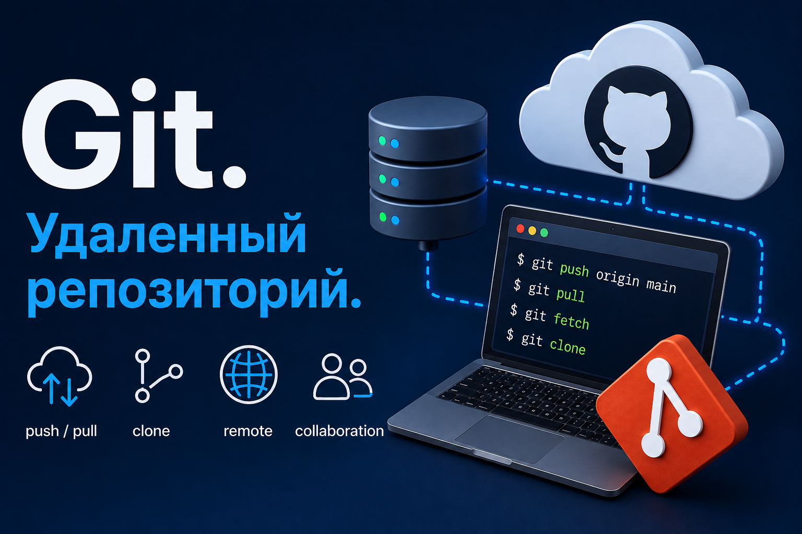
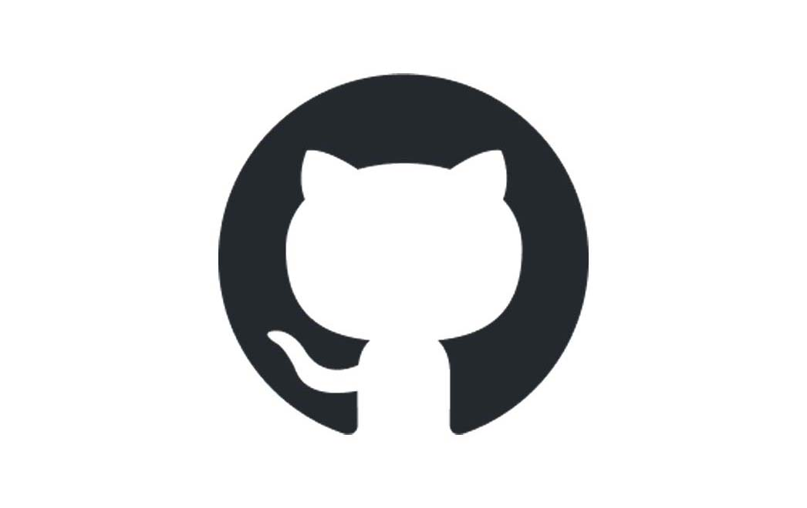
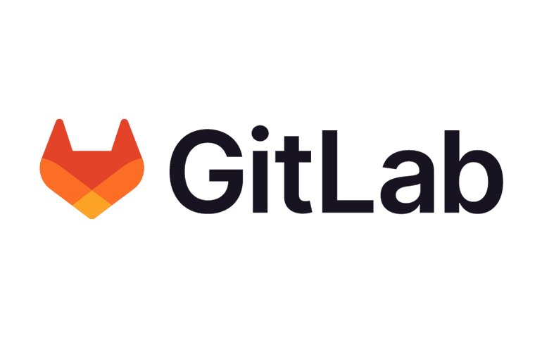
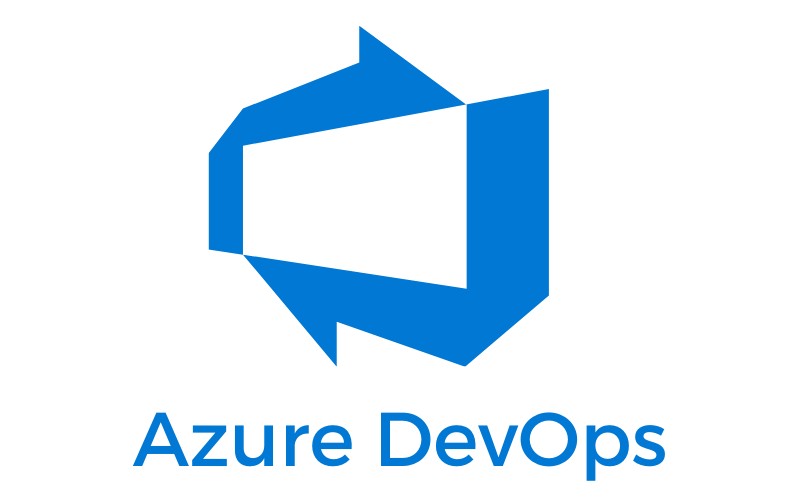
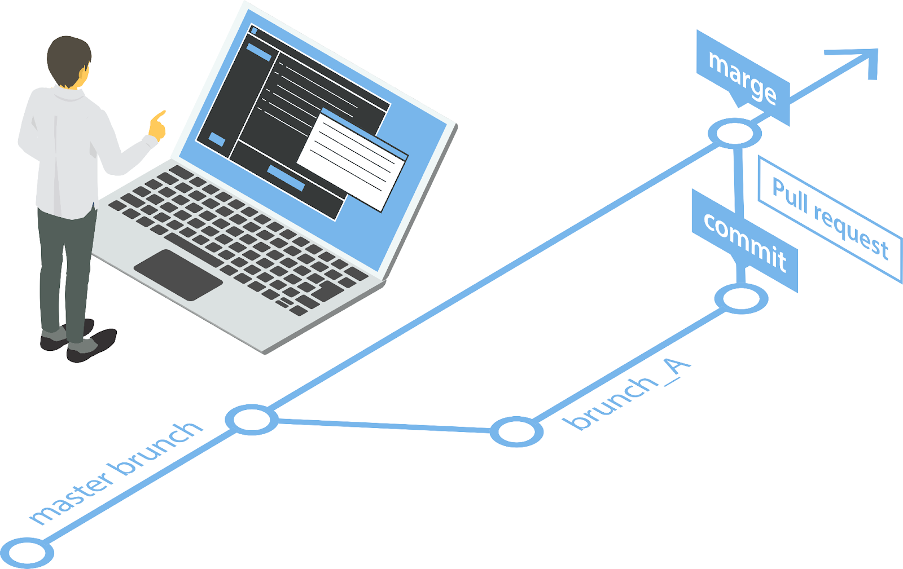

# Лекция 12: Git. Удалённый репозиторий



## Что такое удалённый репозиторий?

Мы уже знаем, что локальный репозиторий - это Git-репозиторий, который находится на нашем компьютере. Локального репозитория достаточно для сохранения истории проекта и работы с ветками, но если над проектом работают несколько разработчиков или нам нужно получить доступ к проекту с другого устройства, удобнее использовать удалённый репозиторий.

**Удалённый репозиторий (remote repository)** - это Git-репозиторий, расположенный на другом компьютере или сервере. Он позволяет разработчикам обмениваться изменениями и синхронизировать работу над одним проектом.

### Зачем нужны удалённые репозитории?

Удалённые репозитории решают несколько важных задач:

- **Доступ с разных устройств** - проект можно получить на другом компьютере.
- **Совместная работа** - несколько разработчиков могут работать над одним проектом.
- **Дополнительное хранение проекта** - копия репозитория находится не только на вашем компьютере.
- **Обмен изменениями** - разработчики могут отправлять свои коммиты и получать изменения других участников.
- **Open-source проекты** - другие разработчики могут изучать проект и предлагать изменения.
- **CI/CD** - удалённый репозиторий может запускать автоматическое тестирование, сборку и развёртывание проекта.

Упрощённо работу можно представить так:

```text
Ваш компьютер
Local Repository
      ↓ ↑
   push / pull
      ↓ ↑
Remote Repository
      ↓ ↑
Компьютеры других разработчиков
```

---

## Популярные платформы для удалённых репозиториев

Удалённый Git-репозиторий можно разместить на собственном сервере, но чаще разработчики используют специальные платформы. Рассмотрим несколько популярных вариантов.

### GitHub



**GitHub** - одна из самых популярных платформ для хранения Git-репозиториев и совместной разработки. GitHub принадлежит Microsoft.

### Основные возможности GitHub

- публичные и приватные репозитории;
- Pull Requests;
- Issues;
- GitHub Actions;
- GitHub Pages;
- управление доступом к проекту;
- Code Review;
- инструменты для командной разработки.

### Когда использовать?

GitHub хорошо подходит для:

- учебных проектов;
- личных проектов;
- портфолио;
- open-source разработки;
- командной работы.

В рамках курса основную работу с удалёнными репозиториями мы будем выполнять через **GitHub**.

---

### GitLab



**GitLab** - платформа для хранения Git-репозиториев и организации процессов разработки.

### Основные возможности GitLab

- публичные и приватные репозитории;
- Merge Requests;
- встроенный CI/CD;
- Issue Tracking;
- управление доступом;
- возможность self-hosted установки.

### Когда использовать?

GitLab часто используют команды, которым нужны встроенные DevOps-инструменты или собственный Git-сервер.

---

### Bitbucket


**Bitbucket** - платформа для хранения Git-репозиториев от Atlassian.

### Основные возможности Bitbucket

- публичные и приватные репозитории;
- Pull Requests;
- Bitbucket Pipelines;
- управление доступом;
- интеграция с Jira и другими продуктами Atlassian.

### Когда использовать?

Bitbucket часто встречается в командах, которые активно используют экосистему Atlassian.

---

### Azure DevOps



**Azure DevOps** - набор сервисов Microsoft для организации разработки программного обеспечения.

В него входят инструменты для:

- хранения репозиториев;
- CI/CD;
- управления задачами;
- тестирования;
- организации командной разработки.

Azure DevOps часто используется в корпоративных проектах и инфраструктуре Microsoft.

---

### Какую платформу выбрать?

| Платформа     | Основные преимущества                                              | Где часто используется                          |
| ---------------------- | -------------------------------------------------------------------------------------- | ------------------------------------------------------------------- |
| **GitHub**       | Простота, open-source, Pull Requests, Actions                                  | Обучение, личные и командные проекты |
| **GitLab**       | CI/CD, DevOps, self-hosted                                                             | Компании и DevOps-команды                           |
| **Bitbucket**    | Интеграция с Atlassian                                                      | Команды, использующие Jira                       |
| **Azure DevOps** | Инструменты Microsoft для полного цикла разработки | Корпоративные проекты                           |

Несмотря на различия между платформами, команды Git практически не меняются.

Например:

```bash
git clone
git fetch
git pull
git push
```

Git работает с удалённым Git-репозиторием независимо от того, на какой платформе он находится.

---

# Публичные и приватные репозитории


При создании репозитория на GitHub можно выбрать его видимость.

Основные варианты:

```text
Public
Private
```

## Публичный репозиторий

**Публичный репозиторий (Public Repository)** - репозиторий, код которого доступен для просмотра другим пользователям.

Публичные репозитории часто используются для:

- open-source проектов;
- учебных проектов;
- библиотек;
- демонстрации проектов в портфолио.

### Преимущества

- код проекта можно показать другим разработчикам;
- удобно использовать проект в портфолио;
- другие разработчики могут изучать проект;
- можно принимать Pull Requests;
- удобно развивать open-source проекты.

### Недостатки

- исходный код виден другим пользователям;
- нельзя хранить конфиденциальную информацию;
- ошибки и потенциальные проблемы проекта тоже могут быть видны.

> Публичность репозитория не означает, что любой человек автоматически получает право свободно использовать ваш код. Условия использования, изменения и распространения проекта определяются его лицензией.

Для open-source проектов обычно используется файл:

```text
LICENSE
```

---

## Приватный репозиторий

**Приватный репозиторий (Private Repository)** - репозиторий, доступ к которому имеют только владелец и пользователи, которым был предоставлен доступ.

Приватные репозитории часто используются для:

- коммерческих проектов;
- закрытой разработки;
- внутренних проектов компаний;
- проектов, исходный код которых не должен быть публичным.

### Преимущества

- код не доступен посторонним пользователям;
- можно управлять доступом участников;
- удобно работать над закрытыми проектами.

### Недостатки

- проект нельзя просто открыть и показать другим людям;
- для подключения нового участника ему необходимо предоставить доступ.

---

## Важно: секретные данные нельзя хранить в Git

Приватный репозиторий **не означает**, что в него можно безопасно добавлять пароли и ключи.

Нельзя сохранять в Git:

```text
пароли
API-ключи
access tokens
SECRET_KEY
ключи от базы данных
private SSH keys
```

Например, файл:

```text
.env
```

обычно добавляется в:

```text
.gitignore
```

```gitignore
.env
```

Это правило действует и для публичных, и для приватных репозиториев.

> Если секрет уже попал в коммит, простого удаления файла недостаточно: значение могло сохраниться в истории Git. Такой секрет необходимо считать скомпрометированным и заменить.

---

# Создание репозитория на GitHub

Для работы с GitHub сначала необходимо создать аккаунт:

[https://github.com/](https://github.com/)

После авторизации можно создать новый репозиторий.

Для этого:

1. Откройте GitHub.
2. Нажмите **New repository**.
3. Выберите владельца репозитория.
4. Укажите название проекта.
5. При необходимости добавьте описание.
6. Выберите:
   - `Public`;
   - `Private`.
7. Создайте репозиторий.

Например:

```text
python-course-project
```

---

## Важный момент при загрузке уже существующего локального проекта

Представим, что проект уже существует на компьютере:

```text
project/
├── main.py
├── utils.py
└── .gitignore
```

И в нём уже есть локальный Git-репозиторий и коммиты. В таком случае на GitHub удобнее создать **пустой репозиторий**:

- без README;
- без `.gitignore`;
- без LICENSE.

После этого мы подключим его к существующему локальному проекту.

Если GitHub-репозиторий и локальный репозиторий независимо получили разные первые коммиты, их истории уже будут отличаться, и новичкам придётся дополнительно разбираться с объединением этих историй.

---

# HTTPS и SSH

Для подключения к удалённому репозиторию GitHub обычно используют:

```text
HTTPS
SSH
```

Оба способа позволяют безопасно работать с репозиторием, но используют разные механизмы аутентификации.

---

## HTTPS

Пример URL:

```text
https://github.com/username/repository.git
```

Клонирование:

```bash
git clone https://github.com/username/repository.git
```

### Важно

GitHub больше не использует обычный пароль аккаунта для Git-операций через HTTPS.

Для аутентификации могут использоваться:

- Personal Access Token;
- Git Credential Manager;
- GitHub CLI.

Personal Access Token используется вместо обычного пароля аккаунта.

### Преимущества HTTPS

- простое начало работы;
- обычно работает в сетях, где SSH может быть ограничен;
- не требует предварительной настройки SSH-ключей.

### Недостатки HTTPS

- необходимо настроить способ аутентификации;
- Personal Access Token нужно правильно хранить;
- без Credential Manager работа может быть менее удобной.

---

# SSH

**SSH (Secure Shell)** позволяет подключаться к удалённым системам через защищённое соединение. Вместо пароля GitHub используется пара ключей:

```text
Private Key
Public Key
```

Приватный ключ хранится только на вашем компьютере. Публичный ключ добавляется в GitHub.

Пример SSH URL:

```text
git@github.com:username/repository.git
```

Клонирование:

```bash
git clone git@github.com:username/repository.git
```

### Преимущества SSH

- удобно для постоянной работы;
- не нужно вводить Personal Access Token при каждом обращении;
- хорошо подходит для регулярной работы с GitHub.

### Недостатки SSH

- требуется первоначальная настройка;
- SSH может быть ограничен в некоторых корпоративных сетях.

В рамках курса мы будем использовать **SSH**.

---

# Настройка SSH для GitHub

## Проверка существующих ключей

Перед созданием нового ключа проверим директорию `.ssh`:

```bash
ls -al ~/.ssh
```

Если SSH-ключи уже создавались раньше, там могут находиться файлы:

```text
id_ed25519
id_ed25519.pub
```

или другие ключи.

Файл:

```text
id_ed25519
```

- приватный ключ.

Файл:

```text
id_ed25519.pub
```

- публичный ключ.

> Приватный ключ нельзя отправлять другим людям и нельзя добавлять в Git.

---

## Создание SSH-ключа

Современный рекомендуемый вариант:

```bash
ssh-keygen -t ed25519 -C "your_email@example.com"
```

Git предложит выбрать место хранения ключа. Обычно достаточно нажать `Enter` и оставить стандартный путь:

```text
~/.ssh/id_ed25519
```

Также можно установить парольную фразу для защиты ключа.

После генерации появятся два файла:

```text
~/.ssh/id_ed25519
~/.ssh/id_ed25519.pub
```

---

## Запуск SSH Agent

В Linux/macOS и Git Bash можно запустить `ssh-agent`:

```bash
eval "$(ssh-agent -s)"
```

Добавить ключ:

```bash
ssh-add ~/.ssh/id_ed25519
```

---

## Получение публичного ключа

Вывести публичный ключ:

```bash
cat ~/.ssh/id_ed25519.pub
```

Получим строку примерно такого вида:

```text
ssh-ed25519 AAAAC3... your_email@example.com
```

Нужно скопировать **всю строку**.

---

## Добавление SSH-ключа в GitHub

На GitHub откройте:

```text
Settings
→ SSH and GPG keys
→ New SSH key
```

Укажите название устройства, например:

```text
My Laptop
```

Вставьте публичный ключ и сохраните его.

---

## Проверка подключения

После настройки SSH проверим соединение:

```bash
ssh -T git@github.com
```

При первом подключении система может спросить, доверяете ли вы серверу GitHub.

После успешной авторизации GitHub сообщит, что аутентификация прошла успешно.

Теперь можно использовать SSH URL:

```text
git@github.com:username/repository.git
```

---

# Команда git clone

Если репозиторий уже существует на GitHub, его можно получить на компьютер с помощью:

```bash
git clone
```

Например:

```bash
git clone git@github.com:username/repository.git
```

`git clone` создаёт **локальную копию существующего Git-репозитория**.

Клонирование получает:

- файлы проекта;
- историю коммитов;
- информацию о ветках;
- настройки связи с исходным удалённым репозиторием.

После клонирования:

```bash
cd repository
```

Проверим:

```bash
git status
```

---

## clone и fork - это не одно и то же

Важно различать два понятия.

### Clone

```text
Remote Repository
       ↓
     clone
       ↓
Ваш компьютер
```

`clone` создаёт локальную копию репозитория на компьютере.

### Fork

```text
Чужой GitHub Repository
          ↓
         fork
          ↓
Repository в вашем GitHub-аккаунте
```

`fork` создаёт отдельный репозиторий на GitHub, связанный с исходным проектом.

После создания fork его обычно ещё клонируют:

```text
Original Repository
        ↓
       fork
        ↓
Your GitHub Repository
        ↓
       clone
        ↓
Your Computer
```

Fork особенно полезен, когда у вас нет права напрямую отправлять изменения в чужой репозиторий.

---

# Работа с удалёнными репозиториями

## Что такое remote?

В Git можно сохранить ссылки на удалённые репозитории. Такая сохранённая ссылка называется:

```text
remote
```

Посмотреть подключённые remote:

```bash
git remote
```

Более подробный вариант:

```bash
git remote -v
```

Например:

```text
origin  git@github.com:username/project.git (fetch)
origin  git@github.com:username/project.git (push)
```

---

# Что такое origin?

`origin` - это **имя удалённого репозитория**. Это не специальный сервер и не отдельная команда Git. Это обычное короткое имя.

При выполнении:

```bash
git clone git@github.com:username/project.git
```

Git обычно автоматически создаёт remote:

```text
origin
```

который указывает на репозиторий, из которого был выполнен `clone`.

Проверить:

```bash
git remote -v
```

---

## Добавление удалённого репозитория вручную

Если проект был создан локально, remote можно добавить самостоятельно:

```bash
git remote add origin git@github.com:username/repository.git
```

Проверяем:

```bash
git remote -v
```

---

## Изменение URL удалённого репозитория

Если URL изменился:

```bash
git remote set-url origin git@github.com:username/new-repository.git
```

---

## Удаление remote

Если связь больше не нужна:

```bash
git remote remove origin
```

> Эта команда не удаляет репозиторий на GitHub. Она только удаляет локальную настройку remote.

---

# Два основных сценария работы

Есть два распространённых способа начать работу с удалённым репозиторием.

---

## Сценарий 1. Проект уже существует на компьютере

Представим, что у нас есть локальный проект:

```text
calculator/
├── main.py
├── calculator.py
└── .gitignore
```

Создадим локальный репозиторий:

```bash
git init
```

Добавим файлы:

```bash
git add .
```

Создадим первый коммит:

```bash
git commit -m "Initial commit"
```

На GitHub создаём **пустой репозиторий**.

После этого связываем его с локальным:

```bash
git remote add origin git@github.com:username/calculator.git
```

Проверяем:

```bash
git remote -v
```

Теперь можно отправить проект на GitHub:

```bash
git push -u origin main
```

---

## Что означает -u?

Команда:

```bash
git push -u origin main
```

не только отправляет ветку `main`, но и задаёт для неё **upstream branch**.

Теперь локальная ветка знает, с какой удалённой веткой она связана.

После этого вместо:

```bash
git push origin main
```

обычно можно писать:

```bash
git push
```

И вместо:

```bash
git pull origin main
```

можно использовать:

```bash
git pull
```

---

## Сценарий 2. Проект уже существует на GitHub

Если проект уже находится на GitHub:

```bash
git clone git@github.com:username/calculator.git
```

Переходим в папку:

```bash
cd calculator
```

После `clone` Git автоматически:

- создаёт локальный репозиторий;
- получает историю проекта;
- создаёт remote `origin`;
- настраивает связь основной локальной ветки с удалённой.

Поэтому повторно выполнять:

```bash
git init
```

или:

```bash
git remote add origin ...
```

не нужно.

---

# git push

**`git push`** отправляет локальные коммиты в удалённый репозиторий.

Первый push новой ветки:

```bash
git push -u origin main
```

После настройки upstream:

```bash
git push
```

Если создадим новую ветку:

```bash
git switch -c feature/calculator
```

и сделаем коммит:

```bash
git add .
git commit -m "Add calculator"
```

первый раз отправим её:

```bash
git push -u origin feature/calculator
```

После этого:

```bash
git push
```

будет достаточно.

---

## Что произойдёт, если удалённая ветка уже изменилась?

Представим:

1. Вы получили проект.
2. Другой разработчик отправил новые коммиты.
3. Вы тоже сделали локальный коммит.
4. Вы пытаетесь выполнить:

```bash
git push
```

Git может отклонить push, потому что в удалённой ветке уже есть изменения, которых нет у вас.

Сначала нужно получить чужие изменения:

```bash
git fetch
```

или:

```bash
git pull
```

После интеграции изменений можно снова выполнить:

```bash
git push
```

---

# git fetch

**`git fetch`** получает новую информацию и коммиты из удалённого репозитория, но не пытается автоматически менять текущую рабочую ветку.

```bash
git fetch origin
```

или просто:

```bash
git fetch
```

Это удобно, если сначала нужно получить изменения и посмотреть, что произошло.

После:

```bash
git fetch
```

ваши рабочие файлы сами по себе не переключаются на новую версию.

---

# Локальная ветка и origin/main

Представим:

```text
main
```

Это наша локальная ветка.

А:

```text
origin/main
```

- локальная remote-tracking ссылка, показывающая состояние удалённой ветки `main`, которое Git получил при последнем обмене с `origin`.

Например:

```text
A --- B --- C
          ↑
         main
```

Другой разработчик отправил новый коммит:

```text
Remote:
A --- B --- C --- D
```

Но наш Git ещё об этом не знает.

После:

```bash
git fetch origin
```

мы можем получить:

```text
A --- B --- C
          ↑   \
         main  D
               ↑
          origin/main
```

Теперь Git знает о новом удалённом коммите, но локальная ветка `main` ещё не обязательно была объединена с ним.

---

# git pull

**`git pull`** получает изменения из удалённого репозитория и интегрирует их в текущую локальную ветку.

```bash
git pull
```

Упрощённо работу команды можно представить так:

```text
git pull
   ↓
git fetch
   ↓
интеграция полученных изменений
```

В стандартном сценарии Git может объединить изменения через merge.

Также `pull` может быть настроен на использование других стратегий, например rebase.

На данном этапе нам достаточно понимать:

```text
git fetch
→ получить изменения

git pull
→ получить и интегрировать изменения
```

---

# git fetch и git pull

| Команда | Получает изменения |    Меняет текущую ветку автоматически |
| -------------- | ----------------------------------: | -------------------------------------------------------------------: |
| `git fetch`  |                                Да |                                                               Нет |
| `git pull`   |                                Да | Да, интегрирует полученные изменения |

Если вы хотите сначала посмотреть изменения:

```bash
git fetch
```

Если хотите сразу синхронизировать текущую ветку:

```bash
git pull
```

---

# Типичный цикл работы с удалённым репозиторием

В начале работы полезно получить последние изменения:

```bash
git pull
```

Создать отдельную ветку:

```bash
git switch -c feature/calculator
```

Внести изменения.

Проверить:

```bash
git status
git diff
```

Добавить изменения:

```bash
git add .
```

Создать коммит:

```bash
git commit -m "Add calculator feature"
```

Отправить новую ветку:

```bash
git push -u origin feature/calculator
```

После этого можно создать Pull Request.

Полный цикл:

```text
git pull
    ↓
git switch -c feature/name
    ↓
изменения
    ↓
git status
    ↓
git add .
    ↓
git commit
    ↓
git push -u origin feature/name
    ↓
Pull Request
    ↓
Code Review
    ↓
Merge
```

---

# Pull Request



**Pull Request (PR)** - это предложение добавить изменения из одной ветки в другую.

Например:

```text
feature/calculator
        ↓
    Pull Request
        ↓
       main
```

Pull Request позволяет:

- посмотреть изменения;
- обсудить код;
- выполнить Code Review;
- запустить автоматические проверки;
- попросить автора исправить код;
- объединить изменения после проверки.

> Именно через Pull Requests мы будем сдавать часть домашних заданий и модулей.

---

# Процесс создания Pull Request

## 1. Получаем проект

Если репозитория ещё нет на компьютере:

```bash
git clone git@github.com:username/repository.git
```

Переходим в папку:

```bash
cd repository
```

---

## 2. Получаем актуальные изменения

```bash
git pull
```

---

## 3. Создаём отдельную ветку

```bash
git switch -c feature/homework
```

---

## 4. Вносим изменения

Проверяем:

```bash
git status
git diff
```

---

## 5. Создаём коммит

```bash
git add .
git commit -m "Complete homework"
```

---

## 6. Отправляем ветку на GitHub

```bash
git push -u origin feature/homework
```

Теперь ветка существует:

```text
локально:
feature/homework

на GitHub:
origin/feature/homework
```

---

## 7. Создаём Pull Request

На GitHub открываем репозиторий. GitHub обычно предлагает создать Pull Request для недавно отправленной ветки.

Нужно выбрать:

```text
base: main
compare: feature/homework
```

То есть:

```text
feature/homework
        ↓
       main
```

Добавляем:

- название Pull Request;
- описание изменений.

После этого создаём Pull Request.

---

## 8. Code Review

Другой разработчик или преподаватель может:

- посмотреть изменения;
- оставить комментарии;
- запросить исправления;
- подтвердить Pull Request.

Если нужно исправить код, **не нужно создавать новый Pull Request**.

Продолжаем работать в той же ветке:

```bash
git add .
git commit -m "Fix review comments"
git push
```

Pull Request автоматически обновится новыми коммитами.

---

## 9. Merge

Когда изменения проверены, Pull Request можно объединить с основной веткой.

После merge изменения попадут в:

```text
main
```

---

# Pull Request из fork

Если у вас есть доступ на запись в репозиторий:

```text
clone
→ branch
→ commit
→ push
→ Pull Request
```

Если доступа на запись нет, часто используется fork:

```text
fork
→ clone своего fork
→ branch
→ commit
→ push
→ Pull Request в исходный repository
```

Это распространённый способ участия в open-source проектах.

---

# Как мы будем взаимодействовать?


Для совместной работы над учебными проектами я должен быть добавлен в ваш репозиторий как collaborator. Это позволит мне получать доступ к репозиторию и работать с Pull Requests.

Мой GitHub username:

```text
fullt1lt
```

## Как добавить collaborator

Откройте нужный репозиторий на GitHub.

Перейдите:

```text
Settings
→ Collaborators
```

В зависимости от интерфейса GitHub раздел управления доступом может находиться внутри блока **Access**.

Нажмите:

```text
Add people
```

Найдите пользователя:

```text
fullt1lt
```

и отправьте приглашение.

После принятия приглашения я получу доступ к репозиторию.

---

# Практическая работа

В этой практике создадим полный цикл работы:

```text
Local Git
→ GitHub
→ SSH
→ Remote
→ Push
→ Branch
→ Pull Request
```

---

## Задание 1. Создание репозитория на GitHub

Создайте новый **пустой** репозиторий:

```text
git-remote-practice
```

Не добавляйте при создании:

```text
README
.gitignore
LICENSE
```

Выберите `Public` или `Private`.

---

## Задание 2. Создание локального проекта

Создайте:

```text
git-remote-practice/
├── main.py
├── calculator.py
└── .gitignore
```

`calculator.py`:

```python
def add(first_number, second_number):
    return first_number + second_number
```

`main.py`:

```python
from calculator import add

print(add(10, 5))
```

`.gitignore`:

```gitignore
__pycache__/
*.pyc
.venv/
venv/
.env
```

---

## Задание 3. Создание локального репозитория

```bash
git init
git status
```

Добавьте файлы:

```bash
git add .
```

Создайте коммит:

```bash
git commit -m "Initial commit"
```

---

## Задание 4. Подключение GitHub

Добавьте remote через SSH:

```bash
git remote add origin git@github.com:USERNAME/git-remote-practice.git
```

Проверьте:

```bash
git remote -v
```

Отправьте `main`:

```bash
git push -u origin main
```

Проверьте проект на GitHub.

---

## Задание 5. Создание feature-ветки

```bash
git switch -c feature/subtract
```

Добавьте:

```python
def subtract(first_number, second_number):
    return first_number - second_number
```

Создайте коммит:

```bash
git add .
git commit -m "Add subtract function"
```

Отправьте ветку:

```bash
git push -u origin feature/subtract
```

---

## Задание 6. Pull Request

На GitHub создайте Pull Request:

```text
feature/subtract
→ main
```

Добавьте описание:

```text
Добавлена функция subtract для вычитания двух чисел.
```

Просмотрите вкладку **Files changed**.

После проверки объедините Pull Request.

---

## Задание 7. Обновление локального main

После merge переключитесь:

```bash
git switch main
```

Сейчас локальная ветка может ещё не содержать изменения, которые были объединены на GitHub.

Выполните:

```bash
git pull
```

Проверьте:

```bash
git log --oneline
```

---

## Задание 8. git fetch

Создайте изменение на GitHub или получите изменение преподавателя.

На компьютере выполните:

```bash
git fetch
```

Посмотрите:

```bash
git log --oneline --all --decorate
```

Сравните:

```text
main
origin/main
```

После этого синхронизируйте локальную ветку:

```bash
git pull
```

---

# Итоги лекции

| Команда / понятие | Назначение                                                                         |
| ------------------------------- | -------------------------------------------------------------------------------------------- |
| Remote Repository               | Удалённый Git-репозиторий                                                |
| `git clone`                   | Создать локальную копию удалённого репозитория     |
| `git remote -v`               | Посмотреть подключённые удалённые репозитории      |
| `git remote add origin URL`   | Добавить удалённый репозиторий                                   |
| `origin`                      | Стандартное имя основного remote                                      |
| `git push`                    | Отправить локальные коммиты                                         |
| `git push -u origin branch`   | Отправить ветку и настроить upstream                                 |
| `git fetch`                   | Получить изменения без автоматической интеграции |
| `git pull`                    | Получить и интегрировать изменения                            |
| `origin/main`                 | Remote-tracking ссылка на удалённую`main`                                 |
| SSH                             | Способ безопасной аутентификации через ключи         |
| HTTPS                           | Способ подключения через HTTPS                                         |
| Fork                            | Копия репозитория в другом GitHub-аккаунте                    |
| Pull Request                    | Предложение объединить изменения                               |
| Code Review                     | Проверка кода перед объединением                                |
| Collaborator                    | Пользователь с доступом к репозиторию                       |

Основной workflow:

```text
git pull
    ↓
git switch -c feature/name
    ↓
изменения
    ↓
git add .
    ↓
git commit
    ↓
git push -u origin feature/name
    ↓
Pull Request
    ↓
Review
    ↓
Merge
```

---

# Домашнее задание

## Основная задача

Создайте на GitHub новый репозиторий:

```text
python-git-homework
```

Добавьте меня как collaborator:

```text
fullt1lt
```

Работу необходимо выполнить через отдельные ветки и Pull Requests.

---

## 1. Подготовьте проект

Создайте структуру:

```text
python-git-homework/
├── main.py
├── products.py
├── README.md
└── .gitignore
```

В `.gitignore` добавьте:

```gitignore
__pycache__/
*.pyc
.venv/
venv/
.env
```

---

## 2. Первый коммит

Инициализируйте Git и создайте первый коммит:

```bash
git init
git add .
git commit -m "Create project structure"
```

Подключите GitHub:

```bash
git remote add origin git@github.com:USERNAME/python-git-homework.git
```

Отправьте `main`:

```bash
git push -u origin main
```

---

## 3. Создайте ветку products

```bash
git switch -c feature/products
```

В `products.py` создайте список из нескольких товаров:

```python
products = [
    {
        "id": 1,
        "title": "Laptop",
        "price": 25000,
    },
    {
        "id": 2,
        "title": "Mouse",
        "price": 800,
    },
]
```

Добавьте несколько собственных товаров.

Создайте функцию:

```python
def get_product_by_id(products, product_id):
    ...
```

Она должна вернуть найденный товар или `None`.

Создайте коммит:

```bash
git add .
git commit -m "Add products and product search"
```

Отправьте ветку:

```bash
git push -u origin feature/products
```

Создайте Pull Request:

```text
feature/products
→ main
```

---

## 4. Создайте ветку statistics

После объединения первого Pull Request обновите `main`:

```bash
git switch main
git pull
```

Создайте новую ветку:

```bash
git switch -c feature/statistics
```

Добавьте функции:

```python
def get_total_price(products):
    ...
```

и:

```python
def get_most_expensive_product(products):
    ...
```

Создайте коммит и отправьте ветку:

```bash
git add .
git commit -m "Add product statistics"
git push -u origin feature/statistics
```

Создайте второй Pull Request:

```text
feature/statistics
→ main
```

---

## 5. README

В `README.md` опишите:

- название проекта;
- что делает программа;
- структуру проекта;
- как запустить программу.

Пример:

````md
# Product Manager

Небольшой учебный проект для работы со списком товаров.

## Запуск

```bash
python main.py
```
````

---

## Требования к сдаче

В репозитории должны быть:

- ветка `main`;
- минимум две feature-ветки в истории работы;
- несколько осмысленных коммитов;
- `.gitignore`;
- `README.md`;
- минимум два Pull Request;
- добавленный collaborator `fullt1lt`.

Не выполняйте всю работу одним коммитом:

```text
final
```

или:

```text
homework
```

Разделяйте изменения на логические коммиты.

Например:

```text
Create project structure
Add products and product search
Add product statistics
Update README
```

---

## Дополнительное задание

Найдите любой публичный open-source репозиторий на GitHub.

Не вносите в него изменения.

Выполните:

```bash
git clone URL
```

После клонирования изучите:

```bash
git remote -v
git branch
git log --oneline
```

Ответьте:

1. Какой remote был создан автоматически?
2. На какой URL он указывает?
3. Какая ветка является основной?
4. Сколько последних коммитов вы видите через `git log --oneline`?
5. Чем `clone` отличается от `fork`?
