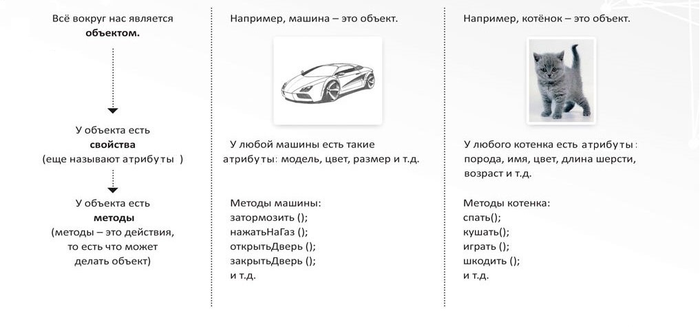
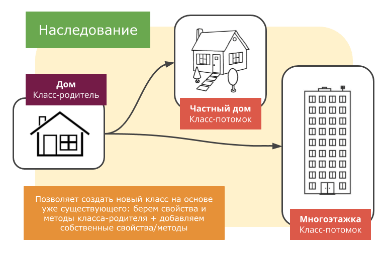
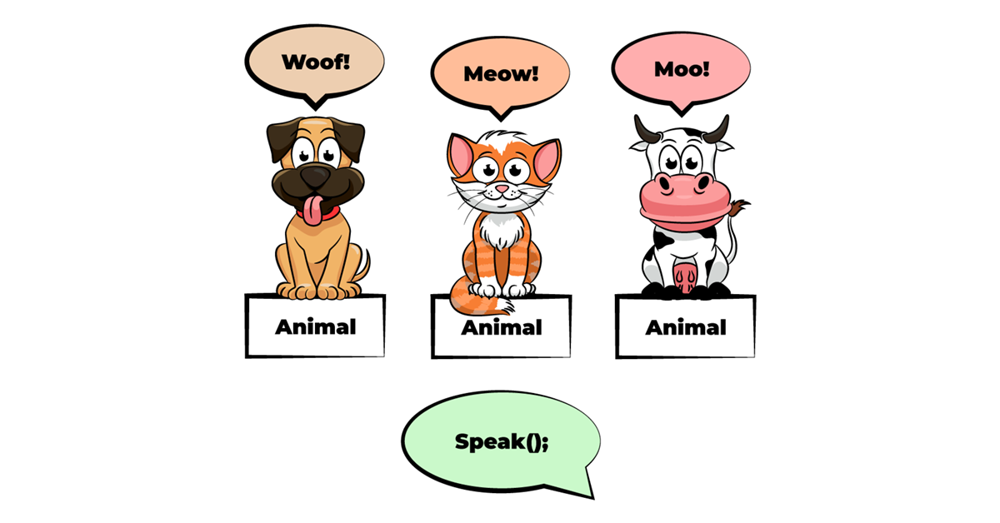
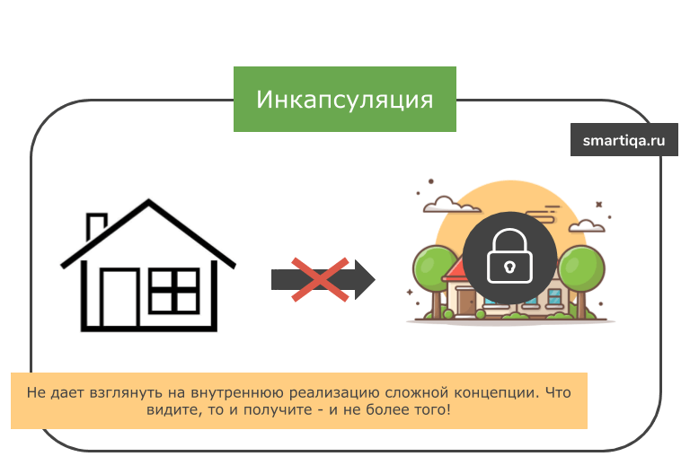
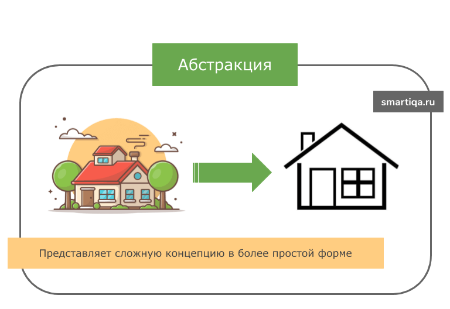

# Лекция 15: Основы ООП


## Введение в ООП

На протяжении первого модуля мы создавали программы с помощью переменных, коллекций, функций и модулей. Например, финансовую операцию можно представить обычным словарём:

```python
transaction = {
    "id": 1,
    "type": "expense",
    "category": "Food",
    "title": "Groceries",
    "amount": 850.50,
}
```

А действия над ней вынести в отдельные функции:

```python
def show_transaction(transaction):
    print(transaction["title"], transaction["amount"])
```

Для небольших программ такой подход работает отлично. Но по мере роста проекта данных и функций становится всё больше:

```text
данные
├── пользователи
├── транзакции
├── категории
└── отчёты

функции
├── add_transaction()
├── delete_transaction()
├── update_transaction()
├── calculate_statistics()
└── save_data()
```

Нам приходится постоянно следить за тем:

- какая функция работает с какими данными;
- какие ключи должны находиться в словаре;
- какие значения разрешено изменять;
- какие функции относятся к одной сущности;
- где находится логика конкретного объекта.

Один из способов организовать такую программу - **объектно-ориентированное программирование**.

---

## Что такое ООП

**Объектно-ориентированное программирование (ООП)** - это парадигма программирования, в которой программа строится вокруг объектов, объединяющих связанные данные и поведение.

Простыми словами:

```text
данные + действия над ними = объект
```

Например, автомобиль можно описать его характеристиками:

```text
марка
цвет
скорость
```

и действиями:

```text
ехать
тормозить
сигналить
```

Вместо того чтобы хранить эти данные и функции отдельно, ООП позволяет объединить их внутри одной сущности - объекта.

```text
Car
├── brand
├── color
├── speed
│
├── drive()
├── stop()
└── honk()
```

### Почему ООП важно

В реальной жизни мы тоже воспринимаем многие вещи как объекты.

Мы не говорим:

> У меня есть переменная `brand`, переменная `color` и функция `drive()`.

Мы говорим:

> У меня есть автомобиль, у которого есть марка, цвет и который умеет ехать.

Такой подход позволяет группировать связанные данные и действия и делает структуру большой программы понятнее.



Главная идея:

```text
Процедурный подход

данные отдельно
+
функции отдельно

ООП
↓
объект
├── данные
└── поведение
```

ООП не заменяет функции, списки, словари или модули. Наоборот, внутри объектов мы продолжим использовать всё, что уже изучили в первом модуле. Мы просто получим новый способ **организации программы**.

---

## Что такое объекты и классы?

Чтобы работать с ООП, сначала нужно разобраться с двумя главными понятиями:

- **класс**;
- **объект**.

### Класс

**Класс** - это описание или шаблон, по которому создаются объекты.

Он определяет:

- какие данные будут храниться в объекте;
- какие действия объект сможет выполнять.

Например, если мы хотим описать автомобиль, у него могут быть:

```text
Car
├── brand
├── model
├── speed
│
├── drive()
└── stop()
```

Сам класс пока не является конкретным автомобилем. Он только описывает, **какими будут автомобили этого типа**.

В Python класс создаётся с помощью ключевого слова `class`:

```python
class Car:
    pass
```

`Car` - название класса. По соглашению названия классов в Python пишутся в стиле `PascalCase`:

```text
Car
User
BankAccount
FinanceManager
```

`pass` означает, что внутри класса пока ничего нет.

---

### Объект

**Объект** - это сущность, экземпляр класса, содержащий свои атрибуты и свои методы, созданный при помощи шаблона (т. е. класса). Объекты могут представлять реальные или абстрактные сущности. Например, объектом может быть автомобиль, пользователь или банковский счет. Объекты обладают состоянием и поведением, что делает их мощным инструментом для моделирования реального мира в программном коде.. Если класс `Car` - это описание автомобиля, то:

```python
car1 = Car()
car2 = Car()
```

создают два разных объекта класса `Car`.

```text
            Car
             │
       ┌─────┴─────┐
       ↓           ↓
     car1         car2
```

Оба объекта созданы по одному шаблону, но в дальнейшем могут хранить разные данные.

Проверим их тип:

```python
class Car:
    pass


car1 = Car()
car2 = Car()

print(type(car1))
print(type(car2))
```

Результат:

```text
<class '__main__.Car'>
<class '__main__.Car'>
```

Оба объекта относятся к классу `Car`. Но это **разные объекты**:

```python
print(car1 is car2)
```

Результат:

```text
False
```

---

### Атрибуты объекта

**Атрибуты** - это данные, которые принадлежат объекту и описывают его состояние.

Например:

```python
class Car:
    pass


car1 = Car()

car1.brand = "Toyota"
car1.model = "Corolla"
car1.speed = 120
```

Теперь объект `car1` хранит свои данные:

```text
car1
├── brand = "Toyota"
├── model = "Corolla"
└── speed = 120
```

Создадим второй автомобиль:

```python
car2 = Car()

car2.brand = "BMW"
car2.model = "M3"
car2.speed = 250
```

Теперь у нас есть два объекта одного класса, но с разным состоянием:

```text
Car

car1
├── brand = "Toyota"
├── model = "Corolla"
└── speed = 120

car2
├── brand = "BMW"
├── model = "M3"
└── speed = 250
```

Получать значения атрибутов можно через точку:

```python
print(car1.brand)
print(car2.brand)
```

Результат:

```text
Toyota
BMW
```

---

### Методы

Кроме данных, объект может иметь собственное поведение **Метод** - это функция, объявленная внутри класса.

Например, автомобиль может сигналить:

```python
class Car:
    def honk(self):
        print("Бип-бип!")
```

Создадим объект и вызовем метод:

```python
car = Car()

car.honk()
```

Результат:

```text
Бип-бип!
```

Таким образом, класс объединяет две вещи:

```text
Класс
├── атрибуты → состояние объекта
└── методы   → поведение объекта
```

Запоминаем:

```text
класс → описание объектов

объект → конкретный экземпляр класса

атрибут → данные объекта

метод → действие объекта
```

Но в примере появился новый параметр:

```python
self
```

Чтобы понять, как методы работают с данными конкретного объекта, разберём `self` подробнее.

---

## `self` в Python

Когда мы создаём метод внутри класса, первым параметром обычно указывают `self`.

```python
class Car:
    def honk(self):
        print("Бип-бип!")
```

`self` - это ссылка на **конкретный объект**, для которого вызывается метод.

Важно:

`self` не является специальным ключевым словом Python.

Технически параметр можно назвать иначе, но по соглашению практически всегда используется именно имя `self`.

---

### Зачем нужен `self`

Представим, что у нас есть два автомобиля:

```python
class Car:
    def show_brand(self):
        print(self.brand)


car1 = Car()
car1.brand = "Toyota"

car2 = Car()
car2.brand = "BMW"
```

Теперь вызовем один и тот же метод у разных объектов:

```python
car1.show_brand()
car2.show_brand()
```

Результат:

```text
Toyota
BMW
```

Метод один и тот же:

```python
show_brand()
```

Но `self` каждый раз ссылается на тот объект, у которого этот метод был вызван.

```text
car1.show_brand()
        ↓
self = car1


car2.show_brand()
        ↓
self = car2
```

Благодаря этому метод может работать с данными конкретного объекта.

---

### Что происходит при вызове метода

Когда мы пишем:

```python
car1.show_brand()
```

Python автоматически передаёт объект `car1` первым аргументом метода. Очень упрощённо этот вызов можно представить так:

```python
Car.show_brand(car1)
```

То есть:

```python
car1.show_brand()
```

и:

```python
Car.show_brand(car1)
```

в данном случае приведут к одинаковому результату.

Проверим:

```python
class Car:
    def show_brand(self):
        print(self.brand)


car1 = Car()
car1.brand = "Toyota"

car1.show_brand()
Car.show_brand(car1)
```

Результат:

```text
Toyota
Toyota
```

Разберём первый вызов:

```text
car1.show_brand()
        ↓
Python находит show_brand() в классе Car
        ↓
передаёт car1 первым аргументом
        ↓
self = car1
        ↓
print(self.brand)
        ↓
print(car1.brand)
```

---

### `self` позволяет работать с атрибутами объекта

Через `self` можно не только получать данные объекта, но и изменять их.

Например:

```python
class Car:
    def accelerate(self):
        self.speed += 10


car = Car()
car.speed = 50

car.accelerate()

print(car.speed)
```

Результат:

```text
60
```

Что произошло:

```text
self = car

self.speed += 10

        ↓

car.speed += 10

        ↓

50 + 10

        ↓

60
```

Метод изменил состояние именно того объекта, для которого был вызван.

---

### Один класс - разные объекты

Посмотрим на более показательный пример:

```python
class Cat:
    name = ""
    energy = 0

    def meow(self):
        print(f"{self.name} говорит: Мяу!")

    def sleep(self):
        self.energy += 20
        print(f"{self.name} поспал. Энергия: {self.energy}")


cat1 = Cat()
cat1.name = "Барсик"
cat1.energy = 50

cat2 = Cat()
cat2.name = "Мурка"
cat2.energy = 80
```

Сейчас `name` и `energy`, записанные непосредственно внутри класса, являются **атрибутами класса**.

Когда мы пишем:

```python
cat1.name = "Барсик"
cat1.energy = 50
```

у объекта `cat1` появляются собственные значения этих атрибутов. То же самое происходит с `cat2`.

Вызываем методы:

```python
cat1.meow()
cat2.meow()

cat1.sleep()
cat2.sleep()
```

Результат:

```text
Барсик говорит: Мяу!
Мурка говорит: Мяу!
Барсик поспал. Энергия: 70
Мурка поспал. Энергия: 100
```

Один класс предоставляет одинаковые методы всем объектам, но через `self` каждый метод работает с состоянием конкретного объекта.

```text
Cat
│
├── cat1
│   ├── name = "Барсик"
│   └── energy = 70
│
└── cat2
    ├── name = "Мурка"
    └── energy = 100
```

Позже мы отдельно разберём разницу между **атрибутами класса** и **атрибутами экземпляра**. А для создания собственных данных каждого объекта обычно используется специальный метод `__init__`.

---

## Метод `__init__`

До этого мы создавали объект, а затем отдельно добавляли ему атрибуты:

```python
class Car:
    pass


car = Car()

car.brand = "Toyota"
car.model = "Corolla"
car.speed = 120
```

Такой способ работает, но при создании большого количества объектов становится неудобным. Для начальной настройки объекта используется метод `__init__`.

```python
class Car:
    def __init__(self, brand, model, speed):
        self.brand = brand
        self.model = model
        self.speed = speed
```

Теперь данные можно передать сразу при создании объекта:

```python
car1 = Car("Toyota", "Corolla", 120)
car2 = Car("BMW", "M3", 250)
```

Каждый объект получает собственное состояние:

```text
car1
├── brand = "Toyota"
├── model = "Corolla"
└── speed = 120

car2
├── brand = "BMW"
├── model = "M3"
└── speed = 250
```

Разберём строку:

```python
self.brand = brand
```

Здесь:

```text
brand
↓
значение, которое передали в метод

self.brand
↓
атрибут конкретного объекта
```

Например:

```python
car1 = Car("Toyota", "Corolla", 120)
```

приведёт к тому, что объект `car1` получит:

```python
car1.brand
car1.model
car1.speed
```

Метод `__init__` вызывается автоматически при создании объекта.

> Пока воспринимаем `__init__` как способ задать начальное состояние объекта. Почему его имя записывается с двойными подчёркиваниями, разберём позже вместе со специальными методами Python.

---

## Атрибуты экземпляра и атрибуты класса

Мы уже видели два способа создавать атрибуты.

Первый - записать их непосредственно внутри класса:

```python
class Cat:
    name = ""
    energy = 0
```

Второй - создать их через `self`:

```python
class Cat:
    def __init__(self, name, energy):
        self.name = name
        self.energy = energy
```

На первый взгляд кажется, что это одно и то же.

Но на самом деле в Python существуют:

```text
атрибуты класса
и
атрибуты экземпляра
```

---

### Атрибут экземпляра

**Атрибут экземпляра** принадлежит конкретному объекту.

Например:

```python
class Cat:
    def __init__(self, name, energy):
        self.name = name
        self.energy = energy


cat1 = Cat("Барсик", 50)
cat2 = Cat("Мурка", 80)
```

Теперь каждый объект хранит собственные значения:

```text
cat1
├── name = "Барсик"
└── energy = 50

cat2
├── name = "Мурка"
└── energy = 80
```

Если изменить данные одного объекта:

```python
cat1.energy = 100
```

второй объект не изменится:

```python
print(cat1.energy)
print(cat2.energy)
```

Результат:

```text
100
80
```

Потому что:

```python
self.energy
```

создаёт атрибут конкретного экземпляра.

---

### Атрибут класса

**Атрибут класса** принадлежит самому классу и обычно содержит значение, общее для всех его объектов.

Например:

```python
class Cat:
    species = "Felis catus"

    def __init__(self, name):
        self.name = name
```

Создадим несколько объектов:

```python
cat1 = Cat("Барсик")
cat2 = Cat("Мурка")
```

У каждого объекта своё имя:

```python
print(cat1.name)
print(cat2.name)
```

Результат:

```text
Барсик
Мурка
```

Но `species` относится ко всему классу:

```python
print(cat1.species)
print(cat2.species)
```

Результат:

```text
Felis catus
Felis catus
```

Можно обратиться к нему напрямую через класс:

```python
print(Cat.species)
```

Результат:

```text
Felis catus
```

Очень упрощённо структура выглядит так:

```text
Cat
└── species = "Felis catus"

    cat1
    └── name = "Барсик"

    cat2
    └── name = "Мурка"
```

---

### Изменение атрибута класса

Если изменить значение через сам класс:

```python
Cat.species = "Domestic cat"
```

то новое значение увидят объекты, которые используют атрибут класса:

```python
print(cat1.species)
print(cat2.species)
```

Результат:

```text
Domestic cat
Domestic cat
```

---

### Что произойдёт при изменении через объект

Посмотрим на важный момент:

```python
class Cat:
    species = "Felis catus"

    def __init__(self, name):
        self.name = name


cat1 = Cat("Барсик")
cat2 = Cat("Мурка")

cat1.species = "Special cat"
```

Теперь:

```python
print(cat1.species)
print(cat2.species)
print(Cat.species)
```

Результат:

```text
Special cat
Felis catus
Felis catus
```

Почему?

Потому что запись:

```python
cat1.species = "Special cat"
```

создала у `cat1` собственный атрибут `species`.

Теперь он перекрывает атрибут класса.

```text
Cat
└── species = "Felis catus"

cat1
├── name = "Барсик"
└── species = "Special cat"

cat2
└── name = "Мурка"
```

---

### Когда использовать атрибуты класса

Атрибут класса подходит для данных, которые действительно являются общими для всех объектов.

Например:

```python
class User:
    platform = "Python Academy"

    def __init__(self, name):
        self.name = name
```

Здесь:

```text
name
```

разный у каждого пользователя.

А:

```text
platform
```

общая характеристика.

Другой пример:

```python
class Product:
    tax_rate = 0.21

    def __init__(self, title, price):
        self.title = title
        self.price = price
```

У каждого товара свои:

```text
title
price
```

Но налоговая ставка может быть общей:

```text
tax_rate
```

---

### Важная ошибка с изменяемыми объектами

Особенно осторожно нужно использовать списки, словари и другие изменяемые объекты как атрибуты класса.

Например:

```python
class User:
    tasks = []

    def __init__(self, name):
        self.name = name
```

Создадим пользователей:

```python
user1 = User("Anna")
user2 = User("Alex")

user1.tasks.append("Изучить ООП")
```

Теперь посмотрим:

```python
print(user1.tasks)
print(user2.tasks)
```

Результат:

```text
['Изучить ООП']
['Изучить ООП']
```

Почему задача появилась у обоих пользователей?

Потому что:

```python
tasks = []
```

создал один список, принадлежащий классу `User`. Оба объекта обращаются к одному и тому же списку.

```text
User
└── tasks → []

      ↑
      │
  ┌───┴───┐
user1   user2
```

Если каждому объекту нужен собственный список, его необходимо создавать как атрибут экземпляра:

```python
class User:
    def __init__(self, name):
        self.name = name
        self.tasks = []
```

Теперь:

```python
user1 = User("Anna")
user2 = User("Alex")

user1.tasks.append("Изучить ООП")

print(user1.tasks)
print(user2.tasks)
```

Результат:

```text
['Изучить ООП']
[]
```

У каждого объекта появился собственный список.

---

### Сравним

| Атрибут       | Где создаётся | Кому принадлежит       |
| -------------------- | ------------------------- | ------------------------------------- |
| `species = "Cat"`  | внутри класса | классу                          |
| `self.name = name` | через`self`        | конкретному объекту |
| `self.tasks = []`  | через`self`        | конкретному объекту |

Главное правило:

```text
данные конкретного объекта
        ↓
self.attribute


общие данные для всех объектов
        ↓
Class.attribute
```

В большинстве случаев состояние объекта мы будем хранить именно через:

```python
self.attribute
```

Теперь, когда мы понимаем классы, объекты, `self` и их атрибуты, можно посмотреть на важную особенность Python:

> числа, строки, списки, функции и даже сами классы тоже являются объектами.

---

## В Python всё является объектом

Мы уже создавали собственные объекты:

```python
class Cat:
    def __init__(self, name):
        self.name = name


cat = Cat("Барсик")
```

Но в Python объектами являются не только экземпляры наших классов. Числа, строки, списки, словари, функции и даже сами классы - тоже объекты.

Проверим это с помощью `type()`:

```python
number = 10
price = 15.5
text = "Python"
numbers = [1, 2, 3]
user = {"name": "Anna"}

print(type(number))
print(type(price))
print(type(text))
print(type(numbers))
print(type(user))
```

Результат:

```text
<class 'int'>
<class 'float'>
<class 'str'>
<class 'list'>
<class 'dict'>
```

Например:

```python
number = 10
```

можно представить так:

```text
10
↓
объект класса int
```

А строку:

```python
text = "Python"
```

как:

```text
"Python"
↓
объект класса str
```

Именно поэтому у строк, списков и других типов есть методы:

```python
text.upper()
numbers.append(4)
```

Мы вызываем методы объектов так же, как теперь вызываем методы собственных классов.

---

### Функции тоже являются объектами

Создадим обычную функцию:

```python
def greet():
    return "Hello!"


print(type(greet))
```

Результат:

```text
<class 'function'>
```

Функция `greet` тоже является объектом. Эта особенность Python позже понадобится нам при изучении **декораторов**.

---

### Классы тоже являются объектами

Посмотрим на наш собственный класс:

```python
class Cat:
    pass


print(type(Cat))
```

Результат:

```text
<class 'type'>
```

Сам класс `Cat` тоже является объектом. А объект, созданный из него:

```python
cat = Cat()

print(type(cat))
```

Результат будет примерно таким:

```text
<class '__main__.Cat'>
```

Получается:

```text
Cat
↓
класс

cat = Cat()
↓
экземпляр класса Cat
```

---

## `type()`

Функция `type()` позволяет узнать точный тип объекта.

```python
print(type(10))
print(type("Python"))
print(type([1, 2, 3]))
```

Результат:

```text
<class 'int'>
<class 'str'>
<class 'list'>
```

Она работает и с нашими классами:

```python
class User:
    pass


user = User()

print(type(user))
```

Результат:

```text
<class '__main__.User'>
```

Иногда тип можно проверить условием:

```python
value = 10

if type(value) == int:
    print("Это целое число")
```

Но при работе с ООП чаще используется `isinstance()`.

---

## `isinstance()`

`isinstance()` проверяет, является ли объект экземпляром определённого класса.

```python
class User:
    pass


user = User()

print(isinstance(user, User))
```

Результат:

```text
True
```

Можно использовать её и со встроенными типами:

```python
print(isinstance(10, int))
print(isinstance("Python", str))
print(isinstance([1, 2], list))
```

Результат:

```text
True
True
True
```

Главное отличие от проверки через `type()` проявится при наследовании.

Например:

```python
class Animal:
    pass


class Cat(Animal):
    pass


cat = Cat()
```

Проверим:

```python
print(type(cat) == Animal)
print(isinstance(cat, Animal))
```

Результат:

```text
False
True
```

Почему?

```text
type(cat)
↓
точный класс объекта
↓
Cat
```

А `isinstance()` учитывает наследование:

```text
Cat
↓
наследуется от
↓
Animal
```

Поэтому объект `Cat` одновременно можно считать объектом:

```text
Cat
и
Animal
```

---

## `issubclass()`

Если `isinstance()` работает с объектами, то `issubclass()` позволяет проверить отношение между классами.

```python
class Animal:
    pass


class Cat(Animal):
    pass
```

Проверим:

```python
print(issubclass(Cat, Animal))
```

Результат:

```text
True
```

То есть:

```text
Cat
↓
является подклассом
↓
Animal
```

Обратная проверка:

```python
print(issubclass(Animal, Cat))
```

Результат:

```text
False
```

---

### Сравним

| Инструмент           | Что проверяет                                                                                 |
| ------------------------------ | --------------------------------------------------------------------------------------------------------- |
| `type(obj)`                  | Точный тип объекта                                                                        |
| `isinstance(obj, Class)`     | Является ли объект экземпляром класса или его наследника |
| `issubclass(ClassA, ClassB)` | Является ли один класс наследником другого                           |

Запоминаем:

```text
type()
↓
какой точный тип у объекта?


isinstance()
↓
относится ли объект к этому классу?


issubclass()
↓
наследуется ли один класс от другого?
```

Понятие наследования здесь появилось не случайно.

Наследование - один из **четырёх основных принципов объектно-ориентированного программирования**, к которым мы теперь и перейдём.

---

## Принципы ООП

В объектно-ориентированном программировании (ООП) традиционно выделяют четыре главных принципа: **инкапсуляция**, **абстракция**, **наследование** и **полиморфизм**. Однако во многих современных классификациях **абстракцию** не рассматривают как отдельный изолированный столп.


Каждый из них решает свою задачу.

| Принцип                     | Главная идея                                                                                                           |
| ---------------------------------- | --------------------------------------------------------------------------------------------------------------------------------- |
| **Инкапсуляция** | Скрываем внутренние детали объекта и управляем доступом к его данным   |
| **Наследование** | Создаём новый класс на основе уже существующего                                          |
| **Полиморфизм**   | Один и тот же интерфейс может работать по-разному для разных объектов   |
| **Абстракция**     | Показываем только необходимое, скрывая сложную внутреннюю реализацию |

> Эти принципы не являются отдельными технологиями `Python`.

Это идеи, которые помогают правильно организовывать классы и взаимодействие между объектами. Мы будем изучать их постепенно.

Начнём с одного из самых понятных принципов - **наследования**.

---

### Наследование



**Наследование** - это принцип ООП, который позволяет создавать новый класс на основе уже существующего и использовать его атрибуты и методы.

Это помогает:

- не дублировать одинаковый код;
- выносить общую логику в родительский класс;
- создавать более понятную иерархию классов.

Класс, от которого наследуются, называют **родительским** или **базовым классом**. Класс, который наследуется от другого класса, называют **дочерним классом** или **классом-наследником**.

```text
        Animal
       /      \
     Dog      Cat
```

В этом примере:

- `Animal` - родительский класс;
- `Dog` и `Cat` - дочерние классы.

---

### Простой пример наследования

Представим, что все животные умеют есть.

При этом:

- собака умеет лаять;
- кот умеет мяукать.

Вместо того чтобы создавать метод `eat()` отдельно в каждом классе, можно вынести его в общий класс `Animal`.

```python
class Animal:
    def eat(self):
        print("Животное ест")


class Dog(Animal):
    def bark(self):
        print("Собака лает")


class Cat(Animal):
    def meow(self):
        print("Кот мяукает")
```

Запись:

```python
class Dog(Animal):
```

означает:

> класс `Dog` наследуется от класса `Animal`.

Теперь создадим объекты:

```python
dog = Dog()
cat = Cat()

dog.eat()
dog.bark()

cat.eat()
cat.meow()
```

Результат:

```text
Животное ест
Собака лает
Животное ест
Кот мяукает
```

Хотя метода `eat()` нет внутри классов `Dog` и `Cat`, они могут его использовать, потому что получили его от класса `Animal`.

```text
Animal
└── eat()
     │
     ├── Dog
     │   └── bark()
     │
     └── Cat
         └── meow()
```

---

### Наследование атрибутов

Наследоваться могут не только методы, но и атрибуты.

```python
class Animal:
    kingdom = "Animals"


class Dog(Animal):
    pass


class Cat(Animal):
    pass


dog = Dog()
cat = Cat()

print(dog.kingdom)
print(cat.kingdom)
```

Результат:

```text
Animals
Animals
```

Атрибут `kingdom` находится в классе `Animal`, но доступен объектам его дочерних классов.

---

### Переопределение методов

Иногда дочернему классу нужно изменить поведение метода родителя. Для этого метод можно **переопределить**.

```python
class Animal:
    def make_sound(self):
        print("Животное издаёт звук")


class Dog(Animal):
    def make_sound(self):
        print("Гав-гав!")


class Cat(Animal):
    def make_sound(self):
        print("Мяу!")
```

Использование:

```python
animal = Animal()
dog = Dog()
cat = Cat()

animal.make_sound()
dog.make_sound()
cat.make_sound()
```

Результат:

```text
Животное издаёт звук
Гав-гав!
Мяу!
```

Когда Python вызывает:

```python
dog.make_sound()
```

он сначала ищет метод `make_sound()` в классе `Dog`. Если метод найден - используется он. Если метода в дочернем классе нет, Python ищет его в родительском классе.

```text
dog.make_sound()
       ↓
ищем в Dog
       ↓
метод найден
       ↓
используем Dog.make_sound()
```

Если метода нет:

```text
dog.eat()
   ↓
ищем в Dog
   ↓
нет
   ↓
ищем в Animal
   ↓
нашли
```

Таким образом, дочерний класс может:

- использовать поведение родителя;
- добавлять собственные методы;
- переопределять существующие методы родителя.

---

### Метод `super()`

Иногда дочернему классу нужно не полностью заменить поведение родителя, а **расширить его**. Для этого используется функция `super()`.

`super()` позволяет обратиться к методам родительского класса из дочернего класса.

Рассмотрим пример:

```python
class Animal:
    def eat(self):
        print("Животное начинает есть")


class Dog(Animal):
    def eat(self):
        super().eat()
        print("Собака ест корм")
```

Создадим объект:

```python
dog = Dog()

dog.eat()
```

Результат:

```text
Животное начинает есть
Собака ест корм
```

Что произошло:

```text
dog.eat()
    ↓
вызывается Dog.eat()
    ↓
super().eat()
    ↓
вызывается Animal.eat()
    ↓
после этого выполняется оставшийся код Dog.eat()
```

То есть `super()` позволяет сохранить поведение родительского класса и добавить к нему новое.

---

Рассмотрим ещё один пример с устройствами. У любого устройства есть общий процесс включения:

```python
class Device:
    def turn_on(self):
        print("Устройство включается...")
```

Но разные устройства после этого выполняют дополнительные действия:

```python
class Smartphone(Device):
    def turn_on(self):
        super().turn_on()
        print("Загружается мобильная операционная система.")


class Laptop(Device):
    def turn_on(self):
        super().turn_on()
        print("Запускается BIOS и загружается операционная система.")
```

Проверим:

```python
phone = Smartphone()
laptop = Laptop()

phone.turn_on()

print()

laptop.turn_on()
```

Результат:

```text
Устройство включается...
Загружается мобильная операционная система.

Устройство включается...
Запускается BIOS и загружается операционная система.
```

Без `super()` нам пришлось бы повторять общий код:

```python
class Smartphone(Device):
    def turn_on(self):
        print("Устройство включается...")
        print("Загружается мобильная операционная система.")
```

Это создаёт дублирование.

С `super()` общая логика остаётся в родительском классе:

```text
Device
└── turn_on()
      │
      ├── Smartphone
      │     └── добавляет свою логику
      │
      └── Laptop
            └── добавляет свою логику
```

---

### `super()` и `__init__`

`super()` можно использовать не только с обычными методами, но и с `__init__`. Например, у всех пользователей есть имя, но у администратора дополнительно есть уровень доступа:

```python
class User:
    def __init__(self, name):
        self.name = name


class Admin(User):
    def __init__(self, name, access_level):
        super().__init__(name)
        self.access_level = access_level
```

Создадим объект:

```python
admin = Admin("Anna", 5)

print(admin.name)
print(admin.access_level)
```

Результат:

```text
Anna
5
```

Разберём:

```python
super().__init__(name)
```

вызывает `__init__` родительского класса `User`.

Он создаёт:

```python
self.name = name
```

После этого `Admin` добавляет собственный атрибут:

```python
self.access_level = access_level
```

В результате:

```text
Admin
├── name          ← логика User
└── access_level  ← логика Admin
```

---

### Когда использовать `super()`

`super()` полезен, когда дочерний класс должен:

```text
сохранить поведение родителя
+
добавить собственное поведение
```

Например:

```python
super().turn_on()
super().eat()
super().__init__(name)
```

Если родительский метод нам полностью не подходит, его можно просто переопределить без `super()`.

```python
class Animal:
    def make_sound(self):
        print("Какой-то звук")


class Cat(Animal):
    def make_sound(self):
        print("Мяу!")
```

Здесь вызывать:

```python
super().make_sound()
```

нет необходимости, потому что мы хотим полностью заменить поведение родителя.

> `super()` особенно важен при более сложном наследовании. Как именно Python выбирает родительский класс и в каком порядке вызывает методы, разберём в следующей лекции при изучении MRO и множественного наследования.

---

### Полиморфизм



**Полиморфизм** - это принцип ООП, при котором разные объекты могут использовать одинаковый интерфейс, но выполнять действие по-разному.

Проще говоря:

```text
одинаковый метод
        ↓
разные объекты
        ↓
разное поведение
```

Представим разные виды транспорта.

У каждого есть метод:

```python
move()
```

Но каждый транспорт движется по-своему:

```python
class Car:
    def move(self):
        return "Автомобиль едет по дороге"


class Airplane:
    def move(self):
        return "Самолёт летит в воздухе"


class Ship:
    def move(self):
        return "Корабль плывёт по воде"
```

Создадим объекты:

```python
car = Car()
airplane = Airplane()
ship = Ship()
```

Теперь вызовем одинаковый метод:

```python
print(car.move())
print(airplane.move())
print(ship.move())
```

Результат:

```text
Автомобиль едет по дороге
Самолёт летит в воздухе
Корабль плывёт по воде
```

Метод называется одинаково:

```python
move()
```

но каждый класс реализует его по-своему.

---

### Полиморфизм на практике

Главное преимущество полиморфизма в том, что мы можем работать с разными объектами одинаковым способом.

Например:

```python
vehicles = [
    Car(),
    Airplane(),
    Ship(),
]

for vehicle in vehicles:
    print(vehicle.move())
```

Результат:

```text
Автомобиль едет по дороге
Самолёт летит в воздухе
Корабль плывёт по воде
```

Циклу не нужно знать, какой именно объект находится в переменной `vehicle`.

Он просто вызывает:

```python
vehicle.move()
```

А конкретный объект сам определяет, что должен делать этот метод.

```text
vehicle.move()
      │
      ├── Car       → едет
      ├── Airplane  → летит
      └── Ship      → плывёт
```

---

### Полиморфизм и наследование

Полиморфизм часто используется вместе с наследованием.

```python
class Animal:
    def make_sound(self):
        return "Какой-то звук"


class Dog(Animal):
    def make_sound(self):
        return "Гав-гав!"


class Cat(Animal):
    def make_sound(self):
        return "Мяу!"
```

Создадим список животных:

```python
animals = [
    Dog(),
    Cat(),
]

for animal in animals:
    print(animal.make_sound())
```

Результат:

```text
Гав-гав!
Мяу!
```

Оба объекта являются наследниками `Animal`, но каждый переопределяет метод `make_sound()`.

Получаем:

```text
Animal
└── make_sound()
       │
       ├── Dog → "Гав-гав!"
       │
       └── Cat → "Мяу!"
```

> Наследование позволяет получить общую структуру, а полиморфизм позволяет разным объектам реализовать одинаковое действие по-разному.

---

### Полиморфизм в Python

В Python полиморфизм встречался нам ещё до изучения ООП. Например, функция `len()` работает с разными объектами:

```python
print(len("Python"))
print(len([1, 2, 3]))
print(len({"name": "Anna", "age": 25}))
```

Результат:

```text
6
3
2
```

Мы используем одну и ту же функцию:

```python
len()
```

но она работает с разными типами объектов.

Главная идея полиморфизма:

```text
не важно, какой именно объект перед нами

важно, что он умеет выполнять нужное действие
```

Поэтому вместо большого количества проверок:

```python
if type(vehicle) == Car:
    ...
elif type(vehicle) == Airplane:
    ...
elif type(vehicle) == Ship:
    ...
```

мы можем использовать общий интерфейс:

```python
vehicle.move()
```

И позволить каждому объекту самому определить своё поведение.

---

### Инкапсуляция



**Инкапсуляция** - это принцип ООП, который позволяет скрывать внутренние детали объекта и управлять доступом к его данным.

Простой пример из жизни - смартфон.

Мы можем:

- включить экран;
- открыть приложение;
- изменить громкость;
- позвонить.

Но нам не нужно знать, как внутри устройства работают процессор, память или операционная система. Мы взаимодействуем только с теми возможностями, которые предоставляет устройство.

Примерно так же работает инкапсуляция в программировании:

```text
Пользователь
     ↓
публичные методы объекта
     ↓
внутренняя логика
     ↓
данные объекта
```

---

### Уровни доступа в Python

В Python принято использовать три варианта записи атрибутов:

- `public`
- `_protected`
- `__private`

Рассмотрим каждый из них.

---

#### Public - публичные атрибуты

Обычный атрибут доступен из любой части программы.

```python
class Phone:
    def __init__(self, model):
        self.model = model


phone = Phone("iPhone")

print(phone.model)

phone.model = "Samsung"

print(phone.model)
```

Результат:

```text
iPhone
Samsung
```

Никаких ограничений на работу с `model` нет.

---

#### Protected - защищённые атрибуты

Если перед именем стоит одно подчёркивание:

```python
_battery_level
```

это означает:

> Атрибут предназначен для внутреннего использования.

Например:

```python
class Phone:
    def __init__(self):
        self._battery_level = 100

    def use_battery(self, value):
        self._battery_level -= value

    def show_battery(self):
        return self._battery_level
```

Использование:

```python
phone = Phone()

phone.use_battery(30)

print(phone.show_battery())
```

Результат:

```text
70
```

Технически мы всё ещё можем написать:

```python
phone._battery_level = 500
```

Python это не запретит. Одно подчёркивание - это **соглашение между разработчиками**, а не настоящая защита.

```text
_battery_level

↓ принято считать

"не изменяй напрямую без необходимости"
```

---

#### Private - приватные атрибуты

Если имя начинается с двух подчёркиваний:

```python
__unlock_code
```

Python изменяет внутреннее имя такого атрибута.

Рассмотрим пример:

```python
class Phone:
    def __init__(self, model, unlock_code):
        self.model = model
        self.__unlock_code = unlock_code

    def unlock(self, code):
        if code == self.__unlock_code:
            return "Телефон разблокирован"

        return "Неверный код"
```

Использование:

```python
phone = Phone("iPhone", "1234")

print(phone.unlock("1111"))
print(phone.unlock("1234"))
```

Результат:

```text
Неверный код
Телефон разблокирован
```

Мы работаем с кодом разблокировки через метод:

```python
unlock()
```

а не напрямую.

---

### Что произойдёт при прямом обращении

Попробуем получить приватный атрибут:

```python
print(phone.__unlock_code)
```

Получим:

```text
AttributeError
```

Но это не означает, что атрибут невозможно получить вообще. Python использует механизм **name mangling** - изменяет его внутреннее имя.

Примерно так:

```text
__unlock_code

        ↓

_Phone__unlock_code
```

Поэтому технически можно написать:

```python
print(phone._Phone__unlock_code)
```

и получить значение. Но делать так в обычном коде не рекомендуется.

> `__attribute` в Python - это не абсолютная защита данных, а механизм, который помогает избежать случайного доступа и конфликтов имён.

---

### Зачем нужна инкапсуляция

Представим банковский счёт:

```python
class BankAccount:
    def __init__(self, balance):
        self.__balance = balance

    def deposit(self, amount):
        if amount > 0:
            self.__balance += amount

    def withdraw(self, amount):
        if 0 < amount <= self.__balance:
            self.__balance -= amount

    def get_balance(self):
        return self.__balance
```

Использование:

```python
account = BankAccount(1000)

account.deposit(500)
account.withdraw(200)

print(account.get_balance())
```

Результат:

```text
1300
```

Вместо прямого изменения:

```python
balance
```

мы предоставляем объекту понятные действия:

```python
deposit()
withdraw()
get_balance()
```

Благодаря этому объект сам контролирует изменение своего состояния.

Например:

```python
account.withdraw(5000)
```

не позволит получить отрицательный баланс.

---

### Главное про инкапсуляцию

Инкапсуляция - это не просто подчёркивания перед именами.

Главная идея:

- не позволять внешнему коду
- напрямую управлять всей внутренней логикой объекта

Вместо этого объект предоставляет понятный интерфейс:

```text
BankAccount
│
├── deposit()
├── withdraw()
└── get_balance()
        ↓
   управляют
        ↓
   __balance
```

В Python:

| Запись | Значение                                              |
| ------------ | ------------------------------------------------------------- |
| `name`     | публичный атрибут                             |
| `_name`    | внутренний атрибут по соглашению |
| `__name`   | используется name mangling                        |

Инкапсуляция помогает объекту **самому контролировать своё состояние и правила работы с ним**.

---

### Абстракция



**Абстракция** - это принцип ООП, который позволяет скрыть сложные детали реализации и оставить только то, что действительно нужно для работы с объектом.

Простой пример - автомобиль.

Когда мы нажимаем педаль газа, нам не нужно знать:

- как работает двигатель;
- как подаётся топливо;
- как переключаются внутренние механизмы;
- как электроника управляет системой.

Для нас существует простой интерфейс:

```text
нажать газ
↓
автомобиль ускоряется
```

Внутренняя реализация скрыта.

---

### Абстракция в коде

Представим банковский счёт:

```python
class BankAccount:
    def __init__(self, balance):
        self.__balance = balance

    def deposit(self, amount):
        if amount > 0:
            self.__balance += amount

    def withdraw(self, amount):
        if 0 < amount <= self.__balance:
            self.__balance -= amount

    def get_balance(self):
        return self.__balance
```

Пользователь класса работает с простыми действиями:

```python
account = BankAccount(1000)

account.deposit(500)
account.withdraw(200)

print(account.get_balance())
```

Результат:

```text
1300
```

Пользователю класса не нужно знать, как именно внутри изменяется баланс.

Он использует готовый интерфейс:

```text
deposit()
withdraw()
get_balance()
```

А внутренняя логика остаётся внутри объекта.

---

### Инкапсуляция и абстракция - не одно и то же

Эти два принципа часто путают.

**Инкапсуляция** отвечает за то, как мы скрываем и контролируем внутреннее состояние объекта.

```text
__balance
↓
нельзя использовать как обычную часть интерфейса
```

**Абстракция** отвечает за то, что пользователь объекта вообще должен видеть.

```text
deposit()
withdraw()
get_balance()
```

То есть:

```text
Инкапсуляция
↓
защищает внутреннюю реализацию


Абстракция
↓
скрывает лишние детали и оставляет понятный интерфейс
```

---

### Ещё один пример

Представим отправку сообщения:

```python
class EmailService:
    def send(self, email, message):
        print(f"Сообщение отправлено на {email}")
```

Использование:

```python
service = EmailService()

service.send("user@mail.com", "Привет!")
```

Результат:

```text
Сообщение отправлено на user@mail.com
```

Пользователю метода `send()` не обязательно знать:

```text
как устанавливается соединение
как формируется запрос
как работает SMTP
как сервер отправляет письмо
```

Для него существует простой интерфейс:

```python
send(email, message)
```

Это и есть идея абстракции.

---

### Главное про абстракцию

Хороший объект не заставляет пользователя разбираться во всей своей внутренней логике. Он предоставляет только необходимые действия:

```text
сложная внутренняя логика
        ↓
      объект
        ↓
простой публичный интерфейс
```

Главная идея:

> Пользователь объекта должен знать **что объект умеет делать**, но ему не обязательно знать **как именно это реализовано внутри**.

Позже мы познакомимся со специальными инструментами Python для построения более строгих абстракций и общих интерфейсов классов.

---

## Оформление классов

Классы, как и обычный Python-код, стоит оформлять по единым правилам. Это делает код понятнее и помогает быстрее разобраться в структуре проекта.

---

### Названия классов

Для названий классов используется стиль `PascalCase`. Каждое слово начинается с заглавной буквы:

```python
class User:
    pass


class BankAccount:
    pass


class FinanceManager:
    pass
```

Неправильно:

```python
class bank_account:
    pass
```

Правильно:

```python
class BankAccount:
    pass
```

---

### Атрибуты и методы

Атрибуты и методы обычно записываются в стиле `snake_case`.

```python
class BankAccount:
    def __init__(self, account_owner, balance):
        self.account_owner = account_owner
        self.balance = balance

    def get_balance(self):
        return self.balance
```

То есть:

```text
BankAccount       → класс

account_owner     → атрибут

get_balance()     → метод
```

---

### Type hints

В классах можно использовать уже знакомые нам аннотации типов.

```python
class Product:
    def __init__(self, title: str, price: float) -> None:
        self.title = title
        self.price = price

    def get_info(self) -> str:
        return f"{self.title}: {self.price}"
```

Аннотации помогают сразу понять:

```text
title → str

price → float

get_info() → str
```

Они не запрещают Python передать значение другого типа, но делают код понятнее для разработчика и IDE.

---

### Docstring

Классы и методы можно документировать с помощью `docstring`.

```python
class Product:
    """Представляет товар в магазине."""

    def __init__(self, title: str, price: float) -> None:
        self.title = title
        self.price = price

    def get_info(self) -> str:
        """Возвращает информацию о товаре."""
        return f"{self.title}: {self.price}"
```

Документацию можно посмотреть через:

```python
print(Product.__doc__)
```

Результат:

```text
Представляет товар в магазине.
```

Также можно использовать:

```python
help(Product)
```

---

### Запоминаем

```text
Классы
↓
PascalCase

Методы и атрибуты
↓
snake_case

Типы данных
↓
type hints

Описание класса и методов
↓
docstring
```

Пример хорошо оформленного небольшого класса:

```python
class Transaction:
    """Представляет финансовую операцию."""

    def __init__(self, title: str, amount: float) -> None:
        self.title = title
        self.amount = amount

    def get_info(self) -> str:
        """Возвращает информацию об операции."""
        return f"{self.title}: {self.amount}"
```

Теперь мы можем применить всё изученное не к отдельному учебному примеру, а к проекту из первого модуля и посмотреть, как обычный словарь с данными превращается в полноценный объект.

---

## От словаря к объекту

В первом модуле финансовую операцию мы хранили в обычном словаре:

```python
transaction_data = {
    "id": 1,
    "type": "expense",
    "category": "Food",
    "title": "Groceries",
    "amount": 850.50,
    "date": "2026-08-14",
}
```

Получать данные можно по ключам:

```python
print(transaction_data["title"])
print(transaction_data["amount"])
```

Результат:

```text
Groceries
850.5
```

Такой подход работает, но данные остаются обычным набором ключей и значений.

При этом функции для работы с транзакцией находятся отдельно:

```python
def get_transaction_info(transaction):
    return f"{transaction['title']}: {transaction['amount']} CZK"
```

Получается:

```text
данные
↓
словарь

поведение
↓
отдельные функции
```

ООП позволяет объединить их внутри одной сущности.

---

### Создадим класс `Transaction`

Опишем структуру финансовой операции через класс:

```python
class Transaction:
    """Представляет финансовую операцию."""

    def __init__(
        self,
        id: int,
        type: str,
        category: str,
        title: str,
        amount: float,
        date: str,
    ) -> None:
        self.id = id
        self.type = type
        self.category = category
        self.title = title
        self.amount = amount
        self.date = date
```

Теперь класс явно показывает, какие данные должна содержать транзакция:

```text
Transaction
├── id
├── type
├── category
├── title
├── amount
└── date
```

---

### Создание объекта через `**`

У нас уже есть словарь:

```python
transaction_data = {
    "id": 1,
    "type": "expense",
    "category": "Food",
    "title": "Groceries",
    "amount": 850.50,
    "date": "2026-08-14",
}
```

Вместо ручной передачи каждого значения:

```python
transaction = Transaction(
    1,
    "expense",
    "Food",
    "Groceries",
    850.50,
    "2026-08-14",
)
```

можно распаковать словарь с помощью `**`:

```python
transaction = Transaction(**transaction_data)
```

Python возьмёт ключи словаря как названия аргументов:

```text
"id": 1
↓
id=1

"type": "expense"
↓
type="expense"

"category": "Food"
↓
category="Food"

"title": "Groceries"
↓
title="Groceries"
```

То есть:

```python
Transaction(**transaction_data)
```

примерно соответствует:

```python
Transaction(
    id=1,
    type="expense",
    category="Food",
    title="Groceries",
    amount=850.50,
    date="2026-08-14",
)
```

Имена ключей словаря должны совпадать с параметрами `__init__`.

---

### Работа с объектом

Теперь вместо ключей словаря:

```python
transaction_data["title"]
transaction_data["amount"]
```

мы используем атрибуты объекта:

```python
print(transaction.title)
print(transaction.amount)
```

Результат:

```text
Groceries
850.5
```

---

### Добавим поведение

Объект может не только хранить данные, но и содержать методы для работы с ними.

```python
class Transaction:
    """Представляет финансовую операцию."""

    def __init__(
        self,
        id: int,
        type: str,
        category: str,
        title: str,
        amount: float,
        date: str,
    ) -> None:
        self.id = id
        self.type = type
        self.category = category
        self.title = title
        self.amount = amount
        self.date = date

    def get_info(self) -> str:
        return f"{self.title}: {self.amount} CZK"
```

Создадим объект:

```python
transaction_data = {
    "id": 1,
    "type": "expense",
    "category": "Food",
    "title": "Groceries",
    "amount": 850.50,
    "date": "2026-08-14",
}

transaction = Transaction(**transaction_data)

print(transaction.get_info())
```

Результат:

```text
Groceries: 850.5 CZK
```

Теперь данные и поведение находятся вместе:

```text
Transaction
├── данные
│   ├── id
│   ├── type
│   ├── category
│   ├── title
│   ├── amount
│   └── date
│
└── поведение
    └── get_info()
```

---

### Несколько словарей → несколько объектов

В первом модуле мы могли хранить транзакции так:

```python
transactions_data = [
    {
        "id": 1,
        "type": "expense",
        "category": "Food",
        "title": "Groceries",
        "amount": 850.50,
        "date": "2026-08-14",
    },
    {
        "id": 2,
        "type": "income",
        "category": "Salary",
        "title": "August salary",
        "amount": 45000,
        "date": "2026-08-10",
    },
]
```

Теперь каждый словарь можно превратить в объект:

```python
transactions = []

for data in transactions_data:
    transactions.append(Transaction(**data))
```

Получаем список объектов:

```text
transactions
├── Transaction(...)
└── Transaction(...)
```

Теперь можно работать с ними одинаковым способом:

```python
for transaction in transactions:
    print(transaction.get_info())
```

Результат:

```text
Groceries: 850.5 CZK
August salary: 45000 CZK
```

---

### Что изменилось

В первом модуле:

```text
dict
+
отдельные функции
```

Теперь:

```text
dict
↓
** распаковка
↓
Transaction
↓
объект
├── данные
└── поведение
```

Мы не перестали использовать словари. Они всё ещё удобны для получения и хранения данных, например из `JSON`. Но внутри программы эти данные теперь можно превращать в объекты:

```python
transaction = Transaction(**transaction_data)
```

Это и будет первым шагом к объектно-ориентированной версии нашего проекта.

---

## Практика

### Система доставки заказов

Разработайте небольшую систему для службы доставки.

Необходимо реализовать базовый класс `Delivery` и два вида доставки:

- `CourierDelivery` - доставка курьером;
- `PickupDelivery` - самовывоз.

### Требования

Каждая доставка должна хранить:

- уникальный `id`;
- адрес или точку получения;
- стоимость;
- статус заказа.

Стоимость должна быть скрыта от прямого изменения. Изменять её можно только через метод класса с проверкой, что значение больше `0`.

Для всех доставок используется одна валюта - `CZK`.

Создайте общий метод `get_info()`, возвращающий информацию о доставке. В дочерних классах его поведение должно отличаться.

При создании дочерних классов используйте наследование и `super()`.

Исходные данные должны приходить в виде словарей:

```python
courier_data = {
    "id": 1,
    "address": "Praha 10",
    "cost": 149,
}

pickup_data = {
    "id": 2,
    "address": "Praha 4",
    "cost": 0,
}
```

Объекты создавайте через распаковку `**`.

Все созданные доставки поместите в один список и выведите информацию о каждой, используя общий метод `get_info()`.

В программе должны быть использованы:

- атрибуты класса и экземпляра;
- `self` и `__init__`;
- инкапсуляция;
- наследование;
- `super()`;
- переопределение методов;
- полиморфизм;
- публичный интерфейс для работы с объектами;
- `type()`, `isinstance()`, `issubclass()`;
- type hints;
- docstring.

### Результат

Программа должна позволять создавать разные виды доставки и работать с ними через общий интерфейс, не привязываясь к конкретному типу объекта.

---

## Практика с AI

Ниже представлен класс с несколькими ошибками:

```python
class transaction:
    currency = "CZK"

    def __init__(title, amount):
        title = title
        amount = amount

    def get_info():
        return f"{title}: {amount} {currency}"
```

Используйте AI как помощника для анализа кода.

### Задание

Попросите AI:

1. Найти все ошибки и неточности в классе.
2. Объяснить причину каждой ошибки.
3. Указать, где нарушены правила оформления классов.
4. Объяснить разницу между:
   - `amount`;
   - `self.amount`;
   - `currency`;
   - `self.currency`.
5. Предложить исправления, но **не писать готовый класс целиком**.

После анализа самостоятельно исправьте код и создайте два объекта `Transaction`.

Проверьте работу метода:

```python
get_info()
```

> Используйте только тот код, который можете самостоятельно объяснить, изменить и проверить.

---

## Домашнее задание

### 1. Пользователь

Создайте класс `User`.

Пользователь должен хранить:

- имя;
- email;
- возраст.

Добавьте метод `get_info()`, который возвращает информацию о пользователе.

Используйте:

- `__init__`;
- `self`;
- type hints;
- docstring.

---

### 2. Банковский счёт

Создайте класс `BankAccount`.

Счёт должен хранить:

- имя владельца;
- номер счёта;
- баланс.

Баланс должен быть скрыт от прямого изменения.

Реализуйте методы:

- пополнение счёта;
- снятие денег;
- получение текущего баланса.

Нельзя:

- пополнять счёт отрицательной суммой;
- снимать сумму больше текущего баланса.

---

### 3. Сотрудники компании

Создайте базовый класс `Employee`.

Он должен хранить:

- имя;
- зарплату.

Создайте классы:

- `Developer`;
- `Manager`.

Оба класса должны наследоваться от `Employee`.

Реализуйте общий метод `get_info()`, который каждый дочерний класс выводит по-своему.

Создайте несколько сотрудников, добавьте их в один список и выведите информацию о каждом через общий метод.

---

### 4. Доставка

Создайте базовый класс `Delivery`.

Создайте два вида доставки:

- `CourierDelivery`;
- `PickupDelivery`.

В базовом классе реализуйте общий метод `get_info()`.

В дочерних классах переопределите его и используйте `super()`, чтобы дополнить результат родительского метода.

---

### 5. Проверка объектов

Используя классы из предыдущего задания, проверьте:

- точный тип объекта через `type()`;
- является ли объект экземпляром `Delivery`;
- является ли `CourierDelivery` наследником `Delivery`.

Используйте:

```python
type()
isinstance()
issubclass()
```

---

### 6. Словарь → объект

Даны данные товара:

```python
product_data = {
    "id": 1,
    "title": "Keyboard",
    "price": 1299.90,
    "quantity": 5,
}
```

Создайте класс `Product`, подходящий под эту структуру.

Создайте объект через распаковку:

```python
Product(**product_data)
```

Добавьте метод, который возвращает полную информацию о товаре.

---

### 7. Система заказов

Разработайте небольшую систему интернет-магазина. Создайте базовый класс `Order`.

Заказ должен хранить:

- `id`;
- имя клиента;
- стоимость;
- статус.

Стоимость должна быть защищена от некорректного изменения.

Создайте два вида заказа:

- `DeliveryOrder` - заказ с доставкой;
- `PickupOrder` - заказ с самовывозом.

Требования:

- используйте наследование;
- используйте `super()`;
- переопределите общий метод `get_info()`;
- продемонстрируйте полиморфизм через список заказов;
- используйте атрибут класса для общей валюты;
- используйте type hints;
- добавьте docstring;
- создайте минимум по два объекта каждого типа;
- часть объектов создайте из словарей через `**`;
- выполните проверки через `type()`, `isinstance()` и `issubclass()`.

Программа должна позволять работать с разными типами заказов через общий интерфейс без отдельных `if` для каждого класса.

---

## Итоги

На этой лекции мы познакомились с основами объектно-ориентированного программирования.

Разобрали:

- что такое класс и объект;
- зачем нужен `self`;
- как работает `__init__`;
- чем отличаются атрибуты класса и экземпляра;
- `type()`, `isinstance()` и `issubclass()`;
- наследование и `super()`;
- полиморфизм;
- инкапсуляцию;
- абстракцию;
- оформление классов, type hints и docstring;
- создание объектов из словарей через `**`.

Главная идея ООП:

```text
объект
├── данные
└── поведение
```

Вместо хранения данных и функций отдельно мы можем объединять связанную логику внутри классов.

Это делает программу более структурированной и подготавливает нас к следующей теме - более сложному наследованию, MRO, mixins и специальным методам Python.