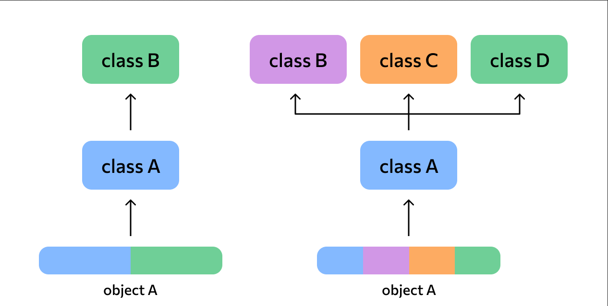
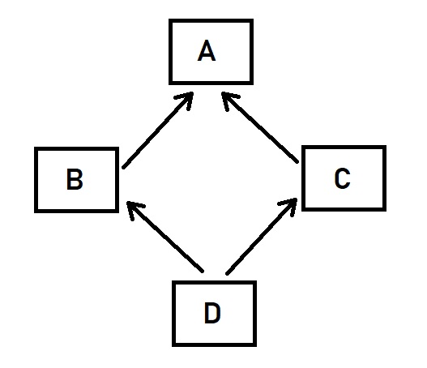
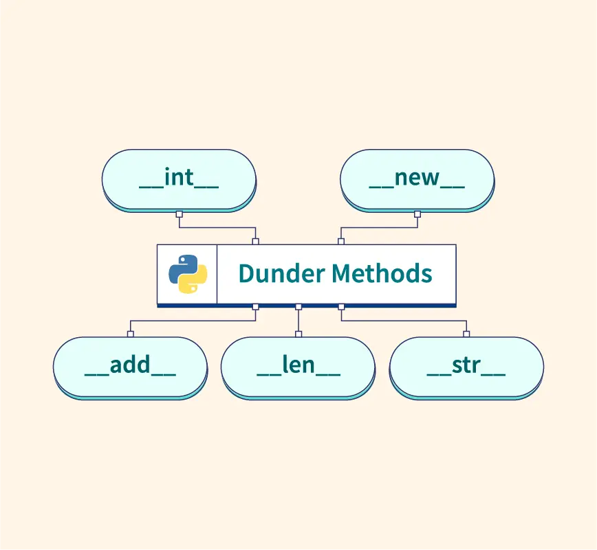

# Лекция 16: Расширенные возможности ООП в Python


## Введение

В прошлой лекции мы познакомились с основами объектно-ориентированного программирования:

- классами и объектами;
- `self` и `__init__`;
- наследованием;
- `super()`;
- полиморфизмом;
- инкапсуляцией;
- абстракцией.

До этого мы в основном использовали обычное наследование:

```python
class Animal:
    pass


class Cat(Animal):
    pass
```

Здесь у класса `Cat` только один родитель - `Animal`. Но Python позволяет строить более сложные отношения между классами. Например, класс может наследоваться сразу от нескольких родителей:

```text
Animal       Flyer
    \         /
     \       /
       Bird
```

В такой ситуации появляются новые вопросы:

- Что произойдёт, если у родителей есть методы с одинаковыми именами?
- В каком порядке Python будет искать нужный метод?
- Как при сложном наследовании работает `super()`?
- Что произойдёт, если несколько классов имеют общего родителя?
- Как использовать возможности множественного наследования, не создавая запутанную архитектуру?

Для ответа на эти вопросы нам понадобятся:

```text
множественное наследование
        ↓
MRO
        ↓
super()
        ↓
mixins
```

Кроме того, в этой лекции мы подробнее познакомимся со **специальными методами Python**. Один из них мы уже использовали:

```python
__init__()
```

Но теперь мы увидим, что создание объекта начинается ещё раньше - со специального метода `__new__()`. Начнём с **множественного наследования**.

---

## Множественное наследование



**Множественное наследование** - это возможность класса иметь сразу несколько родительских классов. В таком случае дочерний класс получает атрибуты и методы от всех своих родителей. Общий синтаксис:

```python
class Child(Parent1, Parent2):
    pass
```

Например, птица является животным, но при этом умеет летать:

```python
class Animal:
    def eat(self):
        print("Я могу есть!")


class Flyer:
    def fly(self):
        print("Я умею летать!")


class Bird(Animal, Flyer):
    def chirp(self):
        print("Чирик-чирик!")
```

Создадим объект:

```python
sparrow = Bird()

sparrow.eat()
sparrow.fly()
sparrow.chirp()
```

Результат:

```text
Я могу есть!
Я умею летать!
Чирик-чирик!
```

Класс `Bird` получил методы сразу от двух родительских классов:

```text
Animal          Flyer
└── eat()       └── fly()
      \           /
       \         /
          Bird
          └── chirp()
```

Получается:

```text
Bird
├── eat()    ← Animal
├── fly()    ← Flyer
└── chirp()  ← Bird
```

Один объект может объединять поведение сразу нескольких классов.

---

### Что происходит при одинаковых методах?

Ситуация становится интереснее, если у нескольких родителей существуют методы с одинаковыми именами.

Например:

```python
class Phone:
    def connect(self):
        print("Подключение через мобильную сеть")


class WiFiDevice:
    def connect(self):
        print("Подключение через Wi-Fi")


class Smartphone(Phone, WiFiDevice):
    pass
```

Оба родительских класса имеют метод:

```python
connect()
```

Создадим объект:

```python
phone = Smartphone()

phone.connect()
```

Результат:

```text
Подключение через мобильную сеть
```

Python выбрал метод из класса `Phone`. Почему? Родители указаны в таком порядке:

```python
class Smartphone(Phone, WiFiDevice):
    pass
```

Но при сложной иерархии одного правила «смотреть слева направо» недостаточно. Python должен построить точный порядок, в котором будут проверяться классы. Этот порядок называется **MRO - Method Resolution Order**. Перед его разбором посмотрим ещё на один вид наследования.

---

## Многоуровневое наследование

**Многоуровневое наследование** - это ситуация, когда класс наследуется от другого класса, который сам уже является наследником. Получается цепочка:

```text
Transport
    ↓
   Car
    ↓
ElectricCar
```

Реализуем её:

```python
class Transport:
    def move(self):
        print("Транспорт движется")


class Car(Transport):
    def honk(self):
        print("Машина сигналит")


class ElectricCar(Car):
    def charge(self):
        print("Электромобиль заряжается")
```

Создадим объект:

```python
tesla = ElectricCar()

tesla.move()
tesla.honk()
tesla.charge()
```

Результат:

```text
Транспорт движется
Машина сигналит
Электромобиль заряжается
```

`ElectricCar` напрямую наследуется только от `Car`. Но `Car` наследуется от `Transport`, поэтому `ElectricCar` получает возможности обоих классов.

```text
Transport
└── move()
      ↓
     Car
     └── honk()
          ↓
      ElectricCar
      └── charge()
```

Объект `tesla` может:

- двигаться - благодаря `Transport`;
- сигналить - благодаря `Car`;
- заряжаться - благодаря `ElectricCar`.

Python должен уметь искать методы не только у непосредственного родителя, но и выше по цепочке наследования. А при множественном наследовании таких цепочек может быть сразу несколько. Именно поэтому Python использует **MRO**.

---

## Порядок разрешения методов (MRO) в Python

**MRO - Method Resolution Order** - это порядок, в котором Python ищет методы и атрибуты в иерархии наследования Когда мы пишем:

```python
obj.some_method()
```

Python должен определить:

> В каком классе находится `some_method()`?

При обычном наследовании ответ достаточно очевиден:

```text
объект
↓
его класс
↓
родитель
↓
родитель родителя
↓
...
```

При множественном наследовании возможных путей становится больше. Поэтому Python заранее строит **одну последовательную цепочку классов** и уже по ней выполняет поиск. При сложном наследовании для построения MRO Python использует алгоритм **C3-линеаризации**. Нам не нужно рассчитывать этот алгоритм вручную. Важно понимать его результат:

```text
сложная иерархия классов
        ↓
Python строит MRO
        ↓
получается одна последовательность
        ↓
по ней ищутся методы
```

---

### Все классы в Python наследуются от `object`

В Python все классы в конечном итоге наследуются от базового класса:

```python
object
```

Даже если мы явно этого не указываем.

Например:

```python
class User:
    pass
```

Упрощённо:

```text
User
 ↓
object
```

Проверим:

```python
print(issubclass(User, object))
print(issubclass(int, object))
print(issubclass(list, object))
print(issubclass(str, object))
```

Результат:

```text
True
True
True
True
```

То же самое можно проверить для объектов:

```python
print(isinstance(10, object))
print(isinstance("Python", object))
print(isinstance([1, 2, 3], object))
```

Результат:

```text
True
True
True
```

Получается:

```text
int
str
list
dict
наши классы
     ↓
   object
```

Поэтому в конце MRO наших классов обычно находится `object`. С объектной моделью Python также связаны специальные методы:

```python
__new__()
__str__()
__repr__()
__eq__()
```

К ним мы вернёмся позже.

---

### Как Python ищет метод?

Когда вызывается:

```python
obj.some_method()
```

Python:

1. смотрит класс объекта;
2. получает его MRO;
3. проверяет классы в указанном порядке;
4. останавливается на первом найденном методе;
5. если метод нигде не найден - возникает `AttributeError`.

Упрощённо:

```text
вызов метода
↓
получить MRO
↓
проверить первый класс
↓
нет метода?
↓
перейти к следующему
↓
...
↓
метод найден
↓
вызвать его
```

---

### Как посмотреть MRO?

Python позволяет посмотреть MRO двумя способами.

Первый:

```python
Class.__mro__
```

Он возвращает **кортеж**.

Второй:

```python
Class.mro()
```

Он возвращает **список**.

---

### MRO при обычной цепочке наследования

Рассмотрим:

```python
class A:
    def show(self):
        print("Метод из A")


class B(A):
    def show(self):
        print("Метод из B")


class C(B):
    def show(self):
        print("Метод из C")
```

Посмотрим MRO:

```python
print(C.mro())
```

Порядок будет таким:

```text
C
↓
B
↓
A
↓
object
```

Создадим объект:

```python
obj = C()

obj.show()
```

Результат:

```text
Метод из C
```

Python начинает поиск с `C` и сразу находит `show()`. Поэтому дальше по MRO уже не идёт.

---

### Что будет, если метода нет?

Уберём метод из `C`:

```python
class A:
    def show(self):
        print("Метод из A")


class B(A):
    def show(self):
        print("Метод из B")


class C(B):
    pass
```

Теперь:

```python
obj = C()

obj.show()
```

Поиск будет выглядеть так:

```text
C
↓
show() нет

B
↓
show() найден
```

Результат:

```text
Метод из B
```

Если убрать метод и из `B`, поиск продолжится до `A`. Python движется по MRO до первого подходящего метода.

---

### MRO при множественном наследовании

Вернёмся к классам с несколькими родителями. Создадим два независимых способа подключения:

```python
class MobileConnection:
    def connect(self):
        print("Подключение через мобильную сеть")


class WiFiConnection:
    def connect(self):
        print("Подключение через Wi-Fi")


class Smartphone(MobileConnection, WiFiConnection):
    pass
```

Посмотрим MRO:

```python
print(Smartphone.mro())
```

Получим примерно:

```text
Smartphone
↓
MobileConnection
↓
WiFiConnection
↓
object
```

Теперь:

```python
phone = Smartphone()

phone.connect()
```

Результат:

```text
Подключение через мобильную сеть
```

Поиск:

```text
Smartphone
↓
connect() нет

MobileConnection
↓
connect() найден
```

Поиск останавливается.

---

### Порядок родителей имеет значение

Поменяем родителей местами:

```python
class Smartphone(WiFiConnection, MobileConnection):
    pass
```

Теперь MRO будет другим:

```text
Smartphone
↓
WiFiConnection
↓
MobileConnection
↓
object
```

И:

```python
phone = Smartphone()

phone.connect()
```

Результат:

```text
Подключение через Wi-Fi
```

То есть:

```python
class Child(Parent1, Parent2):
    pass
```

и:

```python
class Child(Parent2, Parent1):
    pass
```

могут давать разный результат. Но MRO - это не просто правило «проверять родителей слева направо». У самих родителей могут быть свои родители, поэтому Python должен учитывать всю структуру наследования. Для этого и используется C3-линеаризация.

---

### Ромбовидное наследование



**Ромбовидное наследование** - это ситуация, когда два класса имеют общего родителя, а затем ещё один класс наследуется сразу от них обоих.

Схема напоминает ромб:

```text
        A
       / \
      B   C
       \ /
        D
```

Здесь:

- `B` наследуется от `A`;
- `C` наследуется от `A`;
- `D` наследуется сразу от `B` и `C`.

Получается два возможных пути к классу `A`:

```text
D → B → A
D → C → A
```

Сам по себе такой ромб не является ошибкой.

Python умеет построить корректный MRO:

```python
class A:
    pass


class B(A):
    pass


class C(A):
    pass


class D(B, C):
    pass


print(D.mro())
```

Порядок будет примерно таким:

```text
D
↓
B
↓
C
↓
A
↓
object
```

Класс `A` находится в MRO только **один раз**.

---

#### Где возникает проблема?

Проблема появляется, если разработчик начинает вручную вызывать методы конкретных родительских классов. Рассмотрим обработку заказа:

```text
           Order
          /     \
         /       \
OnlineOrder    DeliveryOrder
         \       /
          \     /
        ExpressOrder
```

Создадим классы:

```python
class Order:
    def process(self):
        print("Основная обработка заказа")


class OnlineOrder(Order):
    def process(self):
        print("Обработка онлайн-заказа")
        Order.process(self)


class DeliveryOrder(Order):
    def process(self):
        print("Подготовка доставки")
        Order.process(self)


class ExpressOrder(OnlineOrder, DeliveryOrder):
    def process(self):
        print("Экспресс-заказ")

        OnlineOrder.process(self)
        DeliveryOrder.process(self)
```

Запустим:

```python
order = ExpressOrder()

order.process()
```

Результат:

```text
Экспресс-заказ
Обработка онлайн-заказа
Основная обработка заказа
Подготовка доставки
Основная обработка заказа
```

`Order.process()` выполнился **два раза**.

Причина:

```text
ExpressOrder
│
├── OnlineOrder
│       ↓
│   Order.process()
│
└── DeliveryOrder
        ↓
    Order.process()
```

И `OnlineOrder`, и `DeliveryOrder` вручную вызывают один и тот же родительский метод. Мы сами обошли построенную MRO-цепочку.

---

### `super()` и MRO

В прошлой лекции мы упрощённо воспринимали `super()` как:

```text
вызвать метод родителя
```

При обычном наследовании этого объяснения часто достаточно. Но при множественном наследовании правильнее говорить:

> `super()` позволяет обратиться к следующему классу в соответствии с MRO.

Исправим предыдущий пример:

```python
class Order:
    def process(self):
        print("Основная обработка заказа")


class OnlineOrder(Order):
    def process(self):
        print("Обработка онлайн-заказа")
        super().process()


class DeliveryOrder(Order):
    def process(self):
        print("Подготовка доставки")
        super().process()


class ExpressOrder(OnlineOrder, DeliveryOrder):
    def process(self):
        print("Экспресс-заказ")
        super().process()
```

Посмотрим MRO:

```python
print(ExpressOrder.mro())
```

Получим:

```text
ExpressOrder
↓
OnlineOrder
↓
DeliveryOrder
↓
Order
↓
object
```

Теперь:

```python
order = ExpressOrder()

order.process()
```

Результат:

```text
Экспресс-заказ
Обработка онлайн-заказа
Подготовка доставки
Основная обработка заказа
```

Метод `Order.process()` выполнился только один раз.

---

#### Как работает цепочка?

Первым вызывается:

```python
ExpressOrder.process()
```

Внутри находится:

```python
super().process()
```

Python смотрит на MRO:

```text
ExpressOrder
↓
OnlineOrder
↓
DeliveryOrder
↓
Order
↓
object
```

После `ExpressOrder` следующим идёт `OnlineOrder`. Затем `super()` внутри `OnlineOrder` переходит не напрямую к `Order`, а к следующему классу в MRO - `DeliveryOrder`. И только после него цепочка доходит до `Order`.

```text
ExpressOrder.process()
        ↓
      super()
        ↓
OnlineOrder.process()
        ↓
      super()
        ↓
DeliveryOrder.process()
        ↓
      super()
        ↓
Order.process()
```

Это ключевая идея:

```text
super()
↓
не обязательно "родитель"

super()
↓
следующий класс по MRO
```

---

#### Cooperative inheritance

Такой подход называют **кооперативным наследованием** (`cooperative inheritance`).

Каждый класс:

1. выполняет свою часть работы;
2. вызывает `super()`;
3. передаёт выполнение следующему классу по MRO.

```text
Класс 1
├── своя логика
└── super()
       ↓

Класс 2
├── своя логика
└── super()
       ↓

Класс 3
├── своя логика
└── super()
```

Класс не пытается самостоятельно решить, кто должен выполняться следующим. За это отвечает MRO.

---

#### Важное правило

Если мы строим кооперативную цепочку, классы должны использовать `super()` последовательно.

Плохо:

```python
class OnlineOrder(Order):
    def process(self):
        print("Онлайн-заказ")
        Order.process(self)
```

Лучше:

```python
class OnlineOrder(Order):
    def process(self):
        print("Онлайн-заказ")
        super().process()
```

Если часть классов использует `super()`, а часть напрямую вызывает `Parent.method(self)`, цепочка MRO может работать не так, как ожидается. Тот же принцип относится и к `super().__init__()`. При сложном множественном наследовании параметры инициализации тоже должны корректно передаваться дальше по цепочке. Подробно усложнять `__init__` сейчас не будем.

Главное:

```text
super()
+
MRO
=
кооперативное прохождение иерархии наследования
```

На практике множественное наследование часто используют не для огромных иерархий, а для добавления небольших независимых возможностей классу. Для этого существуют **mixins**.

---

## Миксины

**Mixin (миксин)** - это вспомогательный класс, который добавляет другим классам небольшую дополнительную функциональность.

Важно понимать:

> В Python нет специального ключевого слова `mixin`.

Миксин - это обычный класс. Разница заключается не в синтаксисе, а в **назначении класса**. Обычный класс чаще всего описывает самостоятельную сущность:

```text
User
Product
Order
Transaction
```

А mixin описывает дополнительную возможность:

```text
LoggerMixin
JsonMixin
NotificationMixin
ExportMixin
```

Например:

```text
User
+
LoggerMixin
+
NotificationMixin
        ↓
пользователь умеет
логировать действия
и отправлять уведомления
```

---

### Зачем нужны mixins?

Представим, что в программе есть совершенно разные классы:

```text
User
Order
FileManager
Transaction
```

Но нескольким из них нужна одинаковая возможность - например, логирование. Можно написать метод `log()` отдельно в каждом классе:

```python
class User:
    def log(self, message: str) -> None:
        print(f"[LOG]: {message}")


class Order:
    def log(self, message: str) -> None:
        print(f"[LOG]: {message}")
```

Но тогда появляется дублирование. Вместо этого вынесем функциональность в mixin.

---

### Простой пример mixin

```python
class LoggerMixin:
    def log(self, message: str) -> None:
        print(f"[LOG]: {message}")
```

Подключим его к разным классам:

```python
class User(LoggerMixin):
    def create_user(self, username: str) -> None:
        self.log(f"Создан пользователь: {username}")


class FileManager(LoggerMixin):
    def save_file(self, filename: str) -> None:
        self.log(f"Файл {filename} сохранён")
```

Использование:

```python
user = User()
file_manager = FileManager()

user.create_user("Anna")
file_manager.save_file("data.json")
```

Результат:

```text
[LOG]: Создан пользователь: Anna
[LOG]: Файл data.json сохранён
```

`User` и `FileManager` логически не связаны между собой. Но обоим нужна одна дополнительная возможность - `log()`.

---

### Почему это mixin, а не обычный родитель?

Обычное наследование часто описывает отношение:

```text
Cat
↓
Animal
```

Можно сказать:

> Cat является Animal.

Это отношение **is-a**. Mixin описывает дополнительную возможность:

```text
User
+
LoggerMixin
```

Здесь правильнее сказать:

> User умеет логировать действия.

Это можно условно воспринимать как **can-do**.

---

### Как понять, что перед нами mixin?

Обычно mixin:

- добавляет одну небольшую возможность;
- не описывает самостоятельную сущность;
- используется вместе с другими классами;
- содержит преимущественно методы;
- обычно не предназначен для самостоятельного создания объектов.

Например:

```python
logger = LoggerMixin()
```

технически Python это разрешит, но обычно в этом нет смысла. По соглашению такие классы часто называют с окончанием `Mixin`:

```text
LoggerMixin
JsonMixin
ExportMixin
NotificationMixin
```

Это не требование Python, а удобное соглашение.

---

### Несколько mixins

К одному классу можно подключить сразу несколько mixins:

```python
class LoggerMixin:
    def log(self, message: str) -> None:
        print(f"[LOG]: {message}")


class NotificationMixin:
    def send_notification(self, user: str, message: str) -> None:
        print(f"Уведомление для {user}: {message}")


class User(LoggerMixin, NotificationMixin):
    def create_user(self, username: str) -> None:
        self.log(f"Создан пользователь: {username}")
        self.send_notification(username, "Добро пожаловать!")
```

Использование:

```python
user = User()

user.create_user("Anna")
```

Результат:

```text
[LOG]: Создан пользователь: Anna
Уведомление для Anna: Добро пожаловать!
```

Получаем:

```text
User
├── create_user()
├── log()                ← LoggerMixin
└── send_notification()  ← NotificationMixin
```

---

### Mixins и MRO

Mixins технически являются обычными родительскими классами. Поэтому они тоже участвуют в MRO.

```python
class LoggerMixin:
    def info(self):
        return "LoggerMixin"


class NotificationMixin:
    def info(self):
        return "NotificationMixin"


class User(LoggerMixin, NotificationMixin):
    pass
```

Посмотрим MRO:

```python
print(User.mro())
```

Порядок:

```text
User
↓
LoggerMixin
↓
NotificationMixin
↓
object
```

Поэтому:

```python
user = User()

print(user.info())
```

Результат:

```text
LoggerMixin
```

Если поменять порядок mixins, изменится и MRO.

---

### Практический пример

Представим финансовое приложение. Есть класс транзакции:

```python
class Transaction:
    def __init__(self, title: str, amount: float) -> None:
        self.title = title
        self.amount = amount
```

Добавим возможность логирования:

```python
class LoggerMixin:
    def log(self, message: str) -> None:
        print(f"[LOG]: {message}")
```

Теперь:

```python
class Transaction(LoggerMixin):
    def __init__(self, title: str, amount: float) -> None:
        self.title = title
        self.amount = amount

    def change_amount(self, amount: float) -> None:
        self.amount = amount
        self.log(f"Сумма транзакции изменена на {amount}")
```

Использование:

```python
transaction = Transaction("Groceries", 850)

transaction.change_amount(900)
```

Результат:

```text
[LOG]: Сумма транзакции изменена на 900
```

`Transaction` отвечает за финансовую операцию.

`LoggerMixin` отвечает только за дополнительную возможность - логирование.

---

### Когда mixin использовать не стоит?

Mixin не должен превращаться в огромный класс, который делает всё сразу. Плохая идея:

```text
MegaMixin
├── сохраняет файлы
├── работает с базой данных
├── отправляет email
├── проверяет пользователя
├── считает статистику
└── создаёт отчёты
```

Лучше разделять независимые возможности:

```text
LoggerMixin
NotificationMixin
ExportMixin
```

Также не стоит создавать множество mixins просто ради использования множественного наследования. Чем больше родителей, тем сложнее становятся MRO и зависимости между классами. Mixins полезны тогда, когда действительно делают код проще.

---

### Запоминаем

```text
Mixin
↓
обычный вспомогательный класс
↓
добавляет небольшую возможность
↓
используется через наследование
↓
может комбинироваться с другими mixins
↓
участвует в MRO
```

Главное отличие:

```text
обычный родитель
↓
описывает, ЧЕМ является объект

mixin
↓
описывает, ЧТО объект дополнительно умеет делать
```

Теперь перейдём к другой важной возможности объектной модели Python - **специальным, или магическим, методам**.

---

## Магические методы



До этого мы уже использовали один специальный метод:

```python
__init__()
```

Методы с двойными подчёркиваниями в начале и конце имени называют:

- **специальными методами**;
- **магическими методами**;
- **dunder methods** - от *double underscore*.

Например:

```python
__new__()
__init__()
__str__()
__repr__()
__len__()
__eq__()
__add__()
```

> Эти имена определены самим Python. Не стоит придумывать собственные методы вида `__my_method__`.

Специальные методы позволяют объектам взаимодействовать со стандартным синтаксисом Python.

---

### `__new__()` - создание объекта

В прошлой лекции мы познакомились с `__init__()` и использовали его для начальной настройки объекта. Но важно уточнить:

> `__init__()` не создаёт объект. Объект создаётся раньше - в `__new__()`.

Когда мы пишем:

```python
user = User("Anna")
```

упрощённо происходит следующее:

```text
User("Anna")
      ↓
__new__()
      ↓
создаётся объект
      ↓
__init__()
      ↓
объект получает начальные данные
```

Рассмотрим пример:

```python
class User:
    def __new__(cls, name: str):
        print("__new__: создаём объект")

        instance = super().__new__(cls)
        return instance

    def __init__(self, name: str) -> None:
        print("__init__: настраиваем объект")
        self.name = name
```

Создадим объект:

```python
user = User("Anna")

print(user.name)
```

Результат:

```text
__new__: создаём объект
__init__: настраиваем объект
Anna
```

Сначала выполнился:

```python
__new__()
```

и только потом:

```python
__init__()
```

---

#### Параметр `cls`

У обычных методов первым параметром является:

```python
self
```

Он указывает на уже созданный объект.

У `__new__()` первым параметром является:

```python
cls
```

Он указывает на класс, объект которого нужно создать.

```text
__new__(cls)
↓
работает с классом
↓
создаёт объект

__init__(self)
↓
работает с уже созданным объектом
↓
настраивает его
```

Для создания обычного экземпляра внутри `__new__()` чаще всего используется:

```python
super().__new__(cls)
```

И созданный объект обязательно нужно вернуть:

```text
return instance
```

Если `__new__()` не вернёт экземпляр нужного класса, его `__init__()` не будет вызван как обычно.

---

#### Нужно ли постоянно писать `__new__()`?

В большинстве классов Python достаточно `__init__()`:

```python
class User:
    def __init__(self, name: str) -> None:
        self.name = name
```

Python использует стандартный `__new__()` родительского класса `object` автоматически.

`__new__()` переопределяют значительно реже - когда действительно нужно контролировать **сам процесс создания объекта**.

Например:

- при работе с неизменяемыми типами;
- когда нужно контролировать создание экземпляров;
- в некоторых архитектурных шаблонах.

Сейчас главное запомнить разницу:

| Метод     | Задача                                                  |
| -------------- | ------------------------------------------------------------- |
| `__new__()`  | создаёт и возвращает объект           |
| `__init__()` | настраивает уже созданный объект |

---

### `__str__()` - представление объекта для пользователя

Создадим класс финансовой операции:

```python
class Transaction:
    def __init__(self, title: str, amount: float) -> None:
        self.title = title
        self.amount = amount
```

Создадим объект:

```python
transaction = Transaction("Groceries", 850)

print(transaction)
```

Без собственного `__str__()` результат будет примерно таким:

```text
<__main__.Transaction object at 0x7f8...>
```

Для пользователя такая информация практически бесполезна. Добавим `__str__()`:

```python
class Transaction:
    def __init__(self, title: str, amount: float) -> None:
        self.title = title
        self.amount = amount

    def __str__(self) -> str:
        return f"{self.title}: {self.amount} CZK"
```

Теперь:

```python
transaction = Transaction("Groceries", 850)

print(transaction)
```

Результат:

```text
Groceries: 850 CZK
```

Упрощённо:

```text
print(transaction)
        ↓
str(transaction)
        ↓
transaction.__str__()
```

Обычно магический метод напрямую не вызывают. Мы используем обычный интерфейс Python:

```python
print(transaction)
```

---

### `__repr__()` - представление объекта для разработчика

`__str__()` обычно создаёт понятное представление объекта для пользователя.

`__repr__()` предназначен прежде всего для разработчика.

```python
class Transaction:
    def __init__(self, title: str, amount: float) -> None:
        self.title = title
        self.amount = amount

    def __str__(self) -> str:
        return f"{self.title}: {self.amount} CZK"

    def __repr__(self) -> str:
        return (
            f"Transaction(title='{self.title}', "
            f"amount={self.amount})"
        )
```

Сравним:

```python
transaction = Transaction("Groceries", 850)

print(str(transaction))
print(repr(transaction))
```

Результат:

```text
Groceries: 850 CZK
Transaction(title='Groceries', amount=850)
```

Получается:

```text
__str__()
↓
понятное представление для пользователя

__repr__()
↓
техническое представление для разработчика
```

---

### Почему `__repr__()` особенно заметен в коллекциях?

Создадим список объектов:

```python
transactions = [
    Transaction("Groceries", 850),
    Transaction("Salary", 45000),
]
```

Выведем его:

```python
print(transactions)
```

Результат будет примерно таким:

```text
[Transaction(title='Groceries', amount=850), Transaction(title='Salary', amount=45000)]
```

Объекты внутри коллекции отображаются через их `repr()`. Поэтому хороший `__repr__()` очень помогает при отладке программы.

---

### `__len__()` - работа с `len()`

Метод `__len__()` позволяет определить, что должна означать функция `len()` для нашего объекта. Например, создадим корзину товаров:

```python
class Cart:
    def __init__(self) -> None:
        self.products = []

    def add_product(self, product: str) -> None:
        self.products.append(product)

    def __len__(self) -> int:
        return len(self.products)
```

Использование:

```python
cart = Cart()

cart.add_product("Keyboard")
cart.add_product("Mouse")
cart.add_product("Monitor")

print(len(cart))
```

Результат:

```text
3
```

То есть мы сами определили:

```text
длина Cart
↓
количество товаров внутри него
```

---

### Магические методы сравнения

Python позволяет определить, что должны означать операторы сравнения для объектов нашего класса.

| Оператор | Метод   | Значение                                       |
| ---------------- | ------------ | ------------------------------------------------------ |
| `==`           | `__eq__()` | equal - равно                                     |
| `!=`           | `__ne__()` | not equal - не равно                            |
| `<`            | `__lt__()` | less than - меньше                               |
| `<=`           | `__le__()` | less than or equal - меньше или равно    |
| `>`            | `__gt__()` | greater than - больше                            |
| `>=`           | `__ge__()` | greater than or equal - больше или равно |

Не обязательно реализовывать все методы сразу. Нужно определить только те операции, которые действительно имеют смысл для модели.

---

#### `__eq__()` - сравнение через `==`

По умолчанию два разных объекта не считаются равными только потому, что содержат одинаковые данные.

```python
class Transaction:
    def __init__(self, title: str, amount: float) -> None:
        self.title = title
        self.amount = amount


transaction1 = Transaction("Groceries", 850)
transaction2 = Transaction("Groceries", 850)

print(transaction1 == transaction2)
```

Результат:

```text
False
```

Это два разных объекта. Но мы можем определить собственное правило равенства:

```python
class Transaction:
    def __init__(self, title: str, amount: float) -> None:
        self.title = title
        self.amount = amount

    def __eq__(self, other) -> bool:
        if not isinstance(other, Transaction):
            return NotImplemented

        return (
            self.title == other.title
            and self.amount == other.amount
        )
```

Теперь:

```python
transaction1 = Transaction("Groceries", 850)
transaction2 = Transaction("Groceries", 850)
transaction3 = Transaction("Taxi", 500)

print(transaction1 == transaction2)
print(transaction1 == transaction3)
```

Результат:

```text
True
False
```

Мы определили правило:

```text
две Transaction равны,
если совпадают title и amount
```

---

#### `__lt__()` - сравнение через `<`

Представим, что транзакции нужно сравнивать по сумме.

```python
class Transaction:
    def __init__(self, title: str, amount: float) -> None:
        self.title = title
        self.amount = amount

    def __lt__(self, other) -> bool:
        if not isinstance(other, Transaction):
            return NotImplemented

        return self.amount < other.amount
```

Создадим объекты:

```python
transaction1 = Transaction("Groceries", 850)
transaction2 = Transaction("Salary", 45000)

print(transaction1 < transaction2)
```

Результат:

```text
True
```

Теперь объекты можно сортировать:

```python
transactions = [
    Transaction("Salary", 45000),
    Transaction("Groceries", 850),
    Transaction("Taxi", 500),
]

transactions.sort()

for transaction in transactions:
    print(transaction.title, transaction.amount)
```

Результат:

```text
Taxi 500
Groceries 850
Salary 45000
```

Для сортировки Python использует сравнение `<`, поэтому корректного `__lt__()` уже достаточно для `sort()` и `sorted()`. Другие методы сравнения реализуются по тому же принципу, если они нужны нашей модели.

Например:

```python
def __le__(self, other) -> bool:
    if not isinstance(other, Transaction):
        return NotImplemented

    return self.amount <= other.amount


def __gt__(self, other) -> bool:
    if not isinstance(other, Transaction):
        return NotImplemented

    return self.amount > other.amount


def __ge__(self, other) -> bool:
    if not isinstance(other, Transaction):
        return NotImplemented

    return self.amount >= other.amount
```

---

### `__add__()` - перегрузка оператора `+`

Магические методы позволяют определить поведение операторов `+`,`-`,`/`,`*`. Этот механизм называют **перегрузкой операторов**. Рассмотрим `__add__()`.

Пусть при сложении двух транзакций мы хотим получить их общую сумму:

```python
class Transaction:
    def __init__(self, title: str, amount: float) -> None:
        self.title = title
        self.amount = amount

    def __add__(self, other) -> float:
        if not isinstance(other, Transaction):
            return NotImplemented

        return self.amount + other.amount
```

Создадим объекты:

```python
transaction1 = Transaction("Groceries", 850)
transaction2 = Transaction("Taxi", 500)

print(transaction1 + transaction2)
```

Результат:

```text
1350
```

Запись:

```python
transaction1 + transaction2
```

связана с вызовом:

```python
transaction1.__add__(transaction2)
```

Но напрямую специальный метод обычно не вызывают. Мы используем обычный оператор `+`, а Python сам вызывает нужный метод.

---

### Что такое `NotImplemented`?

В методах сравнения и `__add__()` мы использовали:

```text
return NotImplemented
```

`NotImplemented` - специальное значение Python, которое означает:

> Этот объект не умеет выполнять данную операцию с объектом такого типа.

Например:

```python
transaction + "Python"
```

не имеет понятного смысла для нашей модели. Поэтому вместо случайного результата мы возвращаем:

```python
NotImplemented
```

Важно не путать:

```python
NotImplemented
```

и:

```python
NotImplementedError
```

Это разные вещи.

`NotImplemented` - специальное значение для операций.

`NotImplementedError` - исключение.

---

### Один класс с несколькими магическими методами

Соберём основные идеи в одном классе `Transaction`:

```python
class Transaction:
    def __init__(self, title: str, amount: float) -> None:
        self.title = title
        self.amount = amount

    def __str__(self) -> str:
        return f"{self.title}: {self.amount} CZK"

    def __repr__(self) -> str:
        return (
            f"Transaction(title='{self.title}', "
            f"amount={self.amount})"
        )

    def __eq__(self, other) -> bool:
        if not isinstance(other, Transaction):
            return NotImplemented

        return (
            self.title == other.title
            and self.amount == other.amount
        )

    def __lt__(self, other) -> bool:
        if not isinstance(other, Transaction):
            return NotImplemented

        return self.amount < other.amount

    def __add__(self, other) -> float:
        if not isinstance(other, Transaction):
            return NotImplemented

        return self.amount + other.amount
```

Создадим объекты:

```python
transaction1 = Transaction("Groceries", 850)
transaction2 = Transaction("Taxi", 500)
transaction3 = Transaction("Groceries", 850)
```

Теперь класс естественно работает со стандартным синтаксисом Python:

```python
print(transaction1)
print(repr(transaction1))

print(transaction1 == transaction3)
print(transaction1 < transaction2)
print(transaction1 + transaction2)
```

Результат:

```text
Groceries: 850 CZK
Transaction(title='Groceries', amount=850)
True
False
1350
```

А объекты можно сортировать:

```python
transactions = [transaction1, transaction2]

transactions.sort()

print(transactions)
```

Результат:

```text
[Transaction(title='Taxi', amount=500), Transaction(title='Groceries', amount=850)]
```

Именно благодаря специальным методам собственные классы могут вести себя так же естественно, как встроенные объекты Python.

---

### Запоминаем магические методы

| Метод     | Когда используется        | Задача                                               |
| -------------- | ------------------------------------------ | ---------------------------------------------------------- |
| `__new__()`  | при создании объекта     | создаёт и возвращает объект        |
| `__init__()` | после создания объекта | задаёт начальное состояние         |
| `__str__()`  | `str(obj)`, `print(obj)`               | представление для пользователя |
| `__repr__()` | `repr(obj)`, коллекции          | представление для разработчика |
| `__len__()`  | `len(obj)`                               | определяет длину объекта             |
| `__eq__()`   | `obj1 == obj2`                           | проверка равенства                        |
| `__lt__()`   | `obj1 < obj2`                            | сравнение «меньше»                        |
| `__le__()`   | `obj1 <= obj2`                           | сравнение «меньше или равно»      |
| `__gt__()`   | `obj1 > obj2`                            | сравнение «больше»                        |
| `__ge__()`   | `obj1 >= obj2`                           | сравнение «больше или равно»      |
| `__add__()`  | `obj1 + obj2`                            | определяет поведение`+`               |

Магические методы не нужно запоминать все сразу. Гораздо важнее понимать, **какая стандартная операция должна иметь логичный смысл для объекта**.

---

## Практика

### Система заказов интернет-магазина

Разработайте небольшую объектно-ориентированную систему для работы с заказами интернет-магазина.

### Требования

Создайте базовый класс `Order`.

Заказ должен хранить:

- `id`;
- имя клиента;
- стоимость;
- статус.

Добавьте атрибут класса, который хранит количество созданных заказов. Используйте `__new__()`, чтобы увеличивать этот счётчик при создании нового объекта.

---

Создайте два класса:

- `DeliveryOrder` - заказ с доставкой;
- `PickupOrder` - заказ с самовывозом.

Они должны наследоваться от `Order`. В дочерних классах используйте `super()` для расширения поведения родительских методов.

---

Создайте два mixin-класса:

- `LoggerMixin` - выводит информацию о действиях с заказом;
- `NotificationMixin` - имитирует отправку уведомления клиенту.

Подключите mixins только к тем классам, где их использование имеет смысл.

---

Для заказов реализуйте специальные методы:

- `__str__()` - удобный вывод заказа;
- `__repr__()` - техническое представление объекта;
- `__eq__()` - сравнение заказов;
- `__lt__()` - сравнение заказов по стоимости;
- `__add__()` - получение общей стоимости двух заказов.

Создайте несколько объектов и добавьте их в список.

Программа должна позволять:

- выводить заказы через `print()`;
- сравнивать их через `==`, `<`, `>`;
- сортировать список заказов по стоимости;
- получать общую стоимость двух заказов через `+`;
- выводить количество созданных заказов;
- вызывать методы mixins;
- посмотреть MRO одного из дочерних классов.

Для проверки MRO используйте:

```python
Class.mro()
```

---

## Практика с AI

Ниже представлен код с несколькими проблемами:

```python
class LoggerMixin:
    def log(self, message):
        print(message)


class Order:
    count = 0

    def __new__(cls, *args, **kwargs):
        Order.count += 1

    def __init__(self, id, price):
        self.id = id
        self.price = price

    def __str__(self):
        print(f"Order #{self.id}: {self.price} CZK")

    def __lt__(self, other):
        return self.id < other.id


class DeliveryOrder(Order, LoggerMixin):
    def __init__(self, id, price, address):
        self.address = address

    def complete(self):
        Order.complete(self)
        self.log("Заказ завершён")
```

### Задание

Используйте AI как помощника для анализа кода.

Попросите AI:

1. Найти ошибки и потенциальные проблемы.
2. Объяснить, почему `__new__()` реализован неправильно.
3. Объяснить, почему объект может не создаться.
4. Найти проблему в `__str__()`.
5. Проверить правильность переопределения `__init__()`.
6. Объяснить, правильно ли используется наследование и `LoggerMixin`.
7. Проверить логику `__lt__()`.
8. Объяснить, почему вызов:

```python
Order.complete(self)
```

не сработает.
9. Предложить, где уместно использовать `super()`.
10. Показать MRO класса `DeliveryOrder` и объяснить порядок поиска методов.

AI не должен переписывать весь код целиком.

После анализа самостоятельно исправьте программу и проверьте:

```python
order = DeliveryOrder(
    1,
    1490,
    "Praha 10"
)

print(order)
print(Order.count)
print(DeliveryOrder.mro())
```

> Используйте рекомендации AI только после того, как сможете самостоятельно объяснить каждое исправление.

---

## Домашнее задание

### 1. Система пользователей

Создайте базовый класс `User`. Он должен хранить:

- `id`;
- имя;
- email.

Создайте два дочерних класса:

- `Customer`;
- `Admin`.

Добавьте метод `get_info()` и переопределите его в дочерних классах. Проверьте MRO одного из классов через:

```python
Class.mro()
```

---

### 2. Mixins для уведомлений

Создайте два mixin-класса:

- `EmailNotificationMixin`;
- `SmsNotificationMixin`.

Каждый mixin должен содержать метод отправки соответствующего уведомления. Создайте класс `Manager`, который сможет использовать оба mixin-класса. Проверьте:

- работу обоих методов;
- MRO класса `Manager`.

---

### 3. Сравнение товаров

Создайте класс `Product`. Товар должен хранить:

- название;
- цену;
- количество.

Реализуйте:

```python
__str__()
__repr__()
__eq__()
__lt__()
```

Товары должны сравниваться по цене. Создайте несколько объектов и:

- выведите их через `print()`;
- сравните через `==`, `<`, `>`;
- найдите самый дешёвый товар через `min()`;
- найдите самый дорогой через `max()`;
- отсортируйте список товаров по цене.

---

### 4. Система бронирования

Разработайте небольшую систему бронирования. Создайте базовый класс `Booking`.

Он должен хранить:

- `id`;
- имя клиента;
- стоимость;
- статус.

Создайте:

```text
Booking
├── HotelBooking
└── ApartmentBooking
```

Добавьте `LoggerMixin`, который позволяет выводить информацию об изменении статуса бронирования. Используйте `super()` при расширении поведения родительского класса.

Реализуйте:

- `__str__()` - удобное отображение бронирования;
- `__repr__()` - техническое представление;
- `__eq__()` - сравнение двух бронирований;
- `__lt__()` - сравнение по стоимости;
- `__add__()` - получение общей стоимости двух бронирований.

Создайте несколько объектов и продемонстрируйте:

```python
print(booking)

booking1 == booking2

booking1 < booking2

booking1 + booking2

sorted(bookings)
```

Также выведите MRO одного из дочерних классов.

---

### 5. Дополнительное задание

Добавьте в `Booking` атрибут класса:

```python
count
```

Используйте `__new__()`, чтобы считать количество созданных объектов. После создания нескольких бронирований программа должна вывести общее количество объектов:

```text
Создано бронирований: 5
```

> Используйте множественное наследование и магические методы только там, где они имеют понятный смысл для задачи. Не усложняйте архитектуру просто ради использования новой технологии.

---

## Итоги

На этой лекции мы разобрали расширенные возможности ООП в Python.

Мы изучили:

- множественное и многоуровневое наследование;
- MRO и порядок поиска методов;
- ромбовидное наследование;
- работу `super()` вместе с MRO;
- кооперативное наследование;
- mixins и их отличие от обычного наследования;
- назначение `__new__()` и его отличие от `__init__()`;
- магические методы;
- строковое представление объектов через `__str__()` и `__repr__()`;
- работу `len()` через `__len__()`;
- сравнение собственных объектов;
- перегрузку операторов.

Главная идея:

```text
сложное наследование
↓
MRO определяет порядок
↓
super() позволяет двигаться по этой цепочке
↓
mixins добавляют небольшие возможности
↓
магические методы позволяют объектам
работать со стандартным синтаксисом Python
```

Теперь наши классы могут не только хранить данные и методы, но и естественно взаимодействовать с возможностями самого языка:

```python
print(obj)
len(obj)

obj1 == obj2
obj1 < obj2
obj1 + obj2
```

Следующий шаг - научиться изменять поведение функций и методов без изменения их основного кода с помощью **декораторов**.
