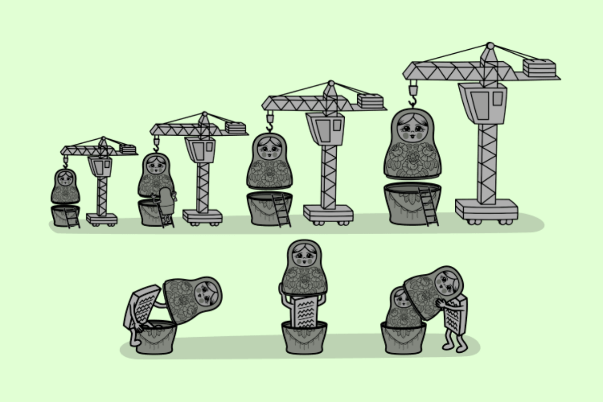

# Лекция 17: Декораторы


## Введение

В прошлой лекции мы продолжили изучать объектно-ориентированное программирование и познакомились с расширенными возможностями классов, MRO, mixins и магическими методами. Теперь вернёмся к функциям. Раньше мы в основном воспринимали функцию как набор инструкций, который можно вызвать:

```python
def greet():
    print("Привет!")


greet()
```

Но в Python функция - это не просто блок кода. **Функции являются объектами**, поэтому их можно:

- хранить в переменных;
- передавать в другие функции;
- возвращать из функций;
- создавать внутри других функций.

Именно эти возможности лежат в основе работы **декораторов**.

---

## Функции как объекты

В Python функции являются объектами. Они могут храниться в переменных, передаваться в качестве аргументов в другие функции и даже возвращаться как результат выполнения другой функции. Это одна из важных особенностей Python, которая позволяет создавать более гибкий код.

### Функции можно присваивать переменным

Когда мы определяем функцию, Python создаёт для неё объект в памяти. Этот объект можно присвоить другой переменной, что позволяет использовать разные имена для одной и той же функции.

Пример присваивания функции переменной:

```python
def greet():
    return "Привет!"


hello = greet

print(hello())
```

Результат:

```text
Привет!
```

В этом примере `hello` не является отдельной функцией, а просто ссылается на тот же объект функции, что и `greet`. Поэтому вызов:

```python
hello()
```

фактически вызывает ту же функцию:

```python
greet()
```

Важно обратить внимание:

```python
hello = greet
```

Здесь мы не используем круглые скобки. Если написать:

```python
hello = greet()
```

то сначала выполнится функция `greet()`, а в переменную `hello` попадёт уже результат её выполнения. Сравним:

```python
hello = greet
```

```text
hello хранит ссылку на функцию
```

а:

```python
hello = greet()
```

```text
hello хранит результат вызова функции
```

---

### Функции можно передавать в аргументы других функций

Так как функции являются объектами, их можно передавать в качестве аргументов другим функциям. Это полезно, например, при написании универсальных функций, которые могут выполнять разные действия в зависимости от переданной функции.

Пример передачи функции как аргумента:

```python
def apply_function(func):
    func()


def say_hello():
    print("Я функция, которую передали!")


apply_function(say_hello)
```

Результат:

```text
Я функция, которую передали!
```

Здесь:

```python
apply_function(say_hello)
```

мы передали функцию `say_hello` как обычный аргумент. Обратите внимание, снова без круглых скобок:

```python
say_hello
```

Внутри `apply_function()` параметр:

```python
func
```

теперь ссылается на функцию `say_hello`.

Поэтому:

```python
func()
```

вызывает переданную функцию. Таким образом, можно динамически передавать функции для выполнения, не зная заранее, какую именно функцию потребуется вызвать.

---

### Функции можно возвращать из других функций

Python позволяет не только передавать функции как аргументы, но и возвращать их как результат выполнения других функций.

Например:

```python
def outer():
    def inner():
        return "Я внутренняя функция!"

    return inner


new_function = outer()

print(new_function())
```

Результат:

```text
Я внутренняя функция!
```

В этом примере `outer()` возвращает **саму функцию**:

```python
return inner
```

а не результат её выполнения:

```python
return inner()
```

Поэтому после:

```python
new_function = outer()
```

переменная `new_function` содержит ссылку на функцию `inner`. И мы можем вызвать её позднее:

```python
new_function()
```

---

### Вложенные функции

Функция в Python может быть объявлена внутри другой функции. Такие функции называются **вложенными функциями**. Они часто используются, когда внутренняя логика нужна только внутри определённой функции и не должна использоваться напрямую в других частях программы.

Например:

```python
def calculator(a, b):
    def add():
        return a + b

    def subtract():
        return a - b

    return add(), subtract()


print(calculator(10, 5))
```

Результат:

```text
(15, 5)
```

В этом примере функции:

```python
add()
subtract()
```

определены внутри:

```python
calculator()
```

и напрямую доступны только внутри неё. Например, такой вызов вне `calculator()`:

```python
add()
```

приведёт к ошибке:

```text
NameError
```

потому что имя `add` существует только в локальной области видимости функции `calculator`.

---

### Замыкания (Closures)

**Замыкание** - это особый случай вложенной функции, при котором внутренняя функция запоминает значения из внешней области видимости даже после завершения внешней функции. Это особенно полезно, если требуется создать настроенную функцию, которая должна помнить определённые данные.

Рассмотрим пример:

```python
def outer(name):
    def inner():
        return f"Привет, {name}!"

    return inner


hello = outer("Алиса")

print(hello())
```

Результат:

```text
Привет, Алиса!
```

Хотя функция:

```python
outer()
```

уже завершила свою работу, внутренняя функция:

```python
inner()
```

по-прежнему помнит значение:

```python
name
```

которое существовало во время вызова `outer()`.

Упрощённо:

```text
outer("Алиса")
      ↓
name = "Алиса"
      ↓
создаётся inner()
      ↓
outer() завершает работу
      ↓
inner() продолжает помнить name
```

---

### Замыкание для создания множителей

Рассмотрим ещё один пример. Создадим функцию, которая будет создавать другие функции с заранее заданным множителем:

```python
def multiplier(factor):
    def multiply_by_factor(number):
        return number * factor

    return multiply_by_factor


double = multiplier(2)
triple = multiplier(3)

print(double(10))
print(triple(10))
```

Результат:

```text
20
30
```

Когда выполняется:

```python
double = multiplier(2)
```

создаётся функция, которая запоминает:

```text
factor = 2
```

А:

```python
triple = multiplier(3)
```

создаёт другую функцию, которая запоминает:

```text
factor = 3
```

Получается:

```text
multiplier(2)
↓
double()
↓
помнит factor = 2


multiplier(3)
↓
triple()
↓
помнит factor = 3
```

В этом коде создаются разные функции-множители, каждая из которых **запоминает своё значение `factor`**. Замыкания важны для понимания декораторов, потому что декораторы очень часто используют именно такую структуру:

```text
внешняя функция
↓
получает другую функцию
↓
создаёт внутреннюю функцию
↓
внутренняя функция запоминает исходную
↓
возвращается наружу
```

Именно к этому механизму мы сейчас и перейдём.

---

## Декораторы (Функции-декораторы `@decorator`)



**Декоратор** - это функция, которая изменяет или расширяет поведение другой функции, не изменяя её исходный код. Простыми словами, декораторы позволяют добавлять дополнительную функциональность к уже существующим функциям.

Например, с помощью декоратора можно:

- логировать вызов функции;
- измерять время её выполнения;
- проверять данные перед запуском;
- проверять права доступа;
- кэшировать результаты;
- выполнять дополнительный код до или после основной функции.

---

### Как работает декоратор?

**Декоратор** - это функция, которая принимает другую функцию в качестве аргумента и возвращает новую функцию. Обычно внутри декоратора создаётся вложенная функция-обёртка:

```text
исходная функция
      ↓
передаётся в декоратор
      ↓
создаётся wrapper()
      ↓
wrapper() вызывает исходную функцию
      ↓
декоратор возвращает wrapper()
```

Главное преимущество декораторов - они позволяют добавлять новую функциональность к уже существующим функциям без изменения их кода. Мы можем представить декоратор как **обёртку** вокруг функции, которая выполняет дополнительные действия до и после её вызова.


Пока всё это может выглядеть немного запутанно, поэтому давайте перейдём к написанию нашего первого декоратора.

---

### Первый декоратор

Создадим обычную функцию:

```python
def say_hello():
    print("Привет, мир!")
```

Теперь создадим функцию-декоратор:

```python
def my_decorator(func):
    def wrapper():
        print("До вызова функции")

        func()

        print("После вызова функции")

    return wrapper
```

Обратите внимание на структуру:

```text
my_decorator()
│
├── получает func
│
├── создаёт wrapper()
│      ↓
│   wrapper() вызывает func()
│
└── возвращает wrapper
```

Теперь применим декоратор вручную:

```python
def my_decorator(func):
    def wrapper():
        print("До вызова функции")
        func()
        print("После вызова функции")

    return wrapper


def say_hello():
    print("Привет, мир!")


decorated_hello = my_decorator(say_hello)

decorated_hello()
```

Результат:

```text
До вызова функции
Привет, мир!
После вызова функции
```

Разберём происходящее по шагам. Сначала у нас существует обычная функция:

```python
say_hello
```

Мы передаём её в:

```python
my_decorator(say_hello)
```

То есть параметр:

```python
func
```

внутри `my_decorator()` теперь ссылается на функцию `say_hello`. После этого декоратор создаёт вложенную функцию:

```python
wrapper()
```

Она выполняет:

```python
print("До вызова функции")
```

затем вызывает оригинальную функцию:

```python
func()
```

и после этого выполняет:

```python
print("После вызова функции")
```

В конце декоратор возвращает:

```python
return wrapper
```

Обратите внимание:

```python
return wrapper
```

а не:

```python
return wrapper()
```

Мы возвращаем **саму функцию**, а не результат её выполнения. Это тот же принцип, который мы только что разбирали при работе с функциями как объектами.

---

### Что теперь находится в `decorated_hello`?

После строки:

```python
decorated_hello = my_decorator(say_hello)
```

переменная:

```python
decorated_hello
```

ссылается уже на:

```python
wrapper
```

Но внутри `wrapper()` сохранилась ссылка на исходную функцию:

```python
say_hello
```

Получается:

```text
say_hello
    ↓
передаём в my_decorator()
    ↓
func запоминает say_hello
    ↓
создаётся wrapper()
    ↓
wrapper запоминает func
    ↓
возвращается wrapper
    ↓
decorated_hello
```

Здесь как раз используется механизм **замыкания**, который мы рассмотрели ранее. Внутренняя функция:

```python
wrapper()
```

продолжает помнить:

```python
func
```

даже после того, как `my_decorator()` завершила свою работу.

---

### Декоратор как обёртка

Можно представить работу декоратора так:

```text
        wrapper()
        ┌───────────────┐
        │               │
        │ код ДО        │
        │      ↓        │
        │    func()     │
        │      ↓        │
        │ код ПОСЛЕ     │
        │               │
        └───────────────┘
```

Оригинальная функция остаётся внутри обёртки:

```python
func()
```

а декоратор добавляет вокруг неё дополнительное поведение. Именно поэтому этот механизм часто называют:

```text
оборачиванием функции
```

или:

```text
wrapping
```

Пока мы применили декоратор вручную:

```python
decorated_hello = my_decorator(say_hello)
```

Но постоянно создавать новые переменные для декорированных функций неудобно. Python предоставляет специальный и гораздо более красивый синтаксис:

```python
@my_decorator
```

Его и разберём дальше.

---

### Декораторы с "синтаксическим сахаром" (`@decorator`)

Python позволяет автоматически применять декоратор к функции с помощью символа `@` перед её объявлением.

Вместо ручной записи:

```python
def say_hello():
    print("Привет, мир!")


say_hello = my_decorator(say_hello)
```

можно написать:

```python
@my_decorator
def say_hello():
    print("Привет, мир!")
```

Эти две записи означают практически одно и то же:

```text
@my_decorator
def say_hello():
    ...
```

эквивалентно:

```python
say_hello = my_decorator(say_hello)
```

Используем декоратор:

```python
def my_decorator(func):
    def wrapper():
        print("До вызова функции")
        func()
        print("После вызова функции")

    return wrapper


@my_decorator
def say_hello():
    print("Привет, мир!")


say_hello()
```

Результат:

```text
До вызова функции
Привет, мир!
После вызова функции
```

Теперь функция:

```python
say_hello()
```

автоматически проходит через `wrapper()`.

Упрощённо:

```text
@my_decorator
       ↓
say_hello = my_decorator(say_hello)
       ↓
my_decorator получает say_hello
       ↓
возвращает wrapper
       ↓
имя say_hello теперь ссылается на wrapper
```

При этом внутри `wrapper()` остаётся доступ к оригинальной функции благодаря замыканию.

---

### Декоратор для функций с аргументами

Пока наш декоратор умеет работать только с функцией без аргументов:

```python
def say_hello():
    ...
```

Но что произойдёт, если декорируемая функция принимает параметры? Например:

```python
def add(a, b):
    return a + b
```

Попробуем использовать предыдущий декоратор:

```python
def my_decorator(func):
    def wrapper():
        print("До вызова функции")
        result = func()
        print("После вызова функции")

        return result

    return wrapper


@my_decorator
def add(a, b):
    return a + b


print(add(5, 10))
```

Такой код работать не будет. Функция:

```python
add(a, b)
```

ожидает два аргумента, но `wrapper()` не принимает их и не передаёт дальше. Нам нужно сделать так, чтобы обёртка могла принимать аргументы декорируемой функции. Для этого удобно использовать уже знакомые:

```python
*args
**kwargs
```

Исправим декоратор:

```python
def my_decorator(func):
    def wrapper(*args, **kwargs):
        print("До вызова функции")

        result = func(*args, **kwargs)

        print("После вызова функции")

        return result

    return wrapper
```

Теперь:

```python
@my_decorator
def add(a, b):
    return a + b


print(add(5, 10))
```

Результат:

```text
До вызова функции
После вызова функции
15
```

Разберём, что происходит. Когда вызывается:

```python
add(5, 10)
```

на самом деле запускается:

```python
wrapper(5, 10)
```

Параметры попадают в:

```python
*args
```

А затем передаются оригинальной функции:

```python
func(*args, **kwargs)
```

Получается:

```text
add(5, 10)
↓
wrapper(5, 10)
↓
args = (5, 10)
↓
func(*args)
↓
оригинальный add(5, 10)
↓
15
```

Использование:

```python
*args
**kwargs
```

позволяет написать декоратор, который сможет работать с функциями с разным количеством аргументов.

Например:

```python
def logger(func):
    def wrapper(*args, **kwargs):
        print(f"Вызов функции: {func.__name__}")

        return func(*args, **kwargs)

    return wrapper


@logger
def greet(name):
    print(f"Привет, {name}!")


@logger
def multiply(a, b, c):
    return a * b * c


greet("Анна")
print(multiply(2, 3, 4))
```

Результат:

```text
Вызов функции: greet
Привет, Анна!
Вызов функции: multiply
24
```

Один и тот же декоратор смог обработать разные функции.

---

### Важно возвращать результат функции

Очень частая ошибка при написании декораторов - забыть вернуть результат оригинальной функции. Например:

```python
def my_decorator(func):
    def wrapper(*args, **kwargs):
        func(*args, **kwargs)

    return wrapper
```

Используем:

```python
@my_decorator
def add(a, b):
    return a + b


result = add(5, 10)

print(result)
```

Результат:

```text
None
```

Почему? Оригинальная функция:

```python
add()
```

вернула:

```text
15
```

но `wrapper()` этот результат потерял.

Правильно:

```python
def my_decorator(func):
    def wrapper(*args, **kwargs):
        result = func(*args, **kwargs)

        return result

    return wrapper
```

Или короче:

```python
def my_decorator(func):
    def wrapper(*args, **kwargs):
        return func(*args, **kwargs)

    return wrapper
```

Поэтому универсальная основа простого декоратора часто выглядит так:

```python
def decorator(func):
    def wrapper(*args, **kwargs):
        result = func(*args, **kwargs)

        return result

    return wrapper
```

Но у такой реализации есть одна небольшая проблема. После декорирования Python может потерять часть информации об оригинальной функции - например, её имя и документацию. Для решения этой проблемы используется:

```python
functools.wraps
```

Его мы рассмотрим дальше.

---

### `functools.wraps` - сохраняем информацию об оригинальной функции

У декораторов есть ещё одна важная особенность. Рассмотрим обычный декоратор:

```python
def logger(func):
    def wrapper(*args, **kwargs):
        print(f"Вызов функции: {func.__name__}")

        return func(*args, **kwargs)

    return wrapper


@logger
def greet(name):
    """Функция приветствия пользователя."""
    return f"Привет, {name}!"
```

Проверим имя функции:

```python
print(greet.__name__)
```

Можно ожидать:

```text
greet
```

Но результат будет:

```text
wrapper
```

Почему? Вспомним, что запись:

```python
@logger
def greet(name):
    ...
```

эквивалентна:

```python
greet = logger(greet)
```

А `logger()` возвращает:

```python
wrapper
```

Получается:

```text
оригинальный greet
        ↓
передаётся в logger()
        ↓
logger() возвращает wrapper
        ↓
имя greet теперь ссылается на wrapper
```

Поэтому информация о функции начинает относиться к `wrapper()`.

---

### Что именно может потеряться?

Например:

```python
print(greet.__name__)
print(greet.__doc__)
```

Без дополнительной обработки мы можем получить:

```text
wrapper
None
```

Хотя исходная функция называлась:

```text
greet
```

и имела документацию:

```text
Функция приветствия пользователя.
```

Это может мешать:

- отладке;
- логированию;
- работе с документацией;
- инструментам, которые анализируют функции.

Чтобы сохранить информацию об оригинальной функции, в Python используется:

```python
functools.wraps
```

---

### Использование `@wraps`

Импортируем `wraps`:

```python
from functools import wraps
```

Теперь добавим его к функции `wrapper()`:

```python
from functools import wraps


def logger(func):
    @wraps(func)
    def wrapper(*args, **kwargs):
        print(f"Вызов функции: {func.__name__}")

        return func(*args, **kwargs)

    return wrapper
```

Использование:

```python
@logger
def greet(name):
    """Функция приветствия пользователя."""
    return f"Привет, {name}!"


print(greet("Анна"))
print(greet.__name__)
print(greet.__doc__)
```

Результат:

```text
Вызов функции: greet
Привет, Анна!
greet
Функция приветствия пользователя.
```

Теперь декорированная функция сохранила информацию об оригинальной функции.

---

### Что делает `@wraps(func)`?

Запись:

```python
@wraps(func)
def wrapper(*args, **kwargs):
    ...
```

помогает перенести основную информацию из:

```python
func
```

в:

```python
wrapper
```

Например:

```text
__name__
__doc__
```

Упрощённо:

```text
без @wraps

greet
↓
декоратор
↓
wrapper
↓
greet.__name__ == "wrapper"


с @wraps

greet
↓
декоратор
↓
wrapper сохраняет информацию greet
↓
greet.__name__ == "greet"
```

---

### Как теперь будет выглядеть обычный декоратор?

На практике хороший универсальный декоратор часто начинается примерно так:

```python
from functools import wraps


def my_decorator(func):
    @wraps(func)
    def wrapper(*args, **kwargs):
        result = func(*args, **kwargs)

        return result

    return wrapper
```

Получается несколько важных правил:

```text
wrapper принимает *args и **kwargs
↓
передаёт их оригинальной функции
↓
возвращает результат функции
↓
@wraps сохраняет информацию об оригинальной функции
```

Это хорошая основа для большинства простых функциональных декораторов. Но пока наш декоратор принимает только один аргумент:

```python
func
```

Иногда нам хочется передавать настройки **самому декоратору**. Например:

```python
@log("DEBUG")
```

или:

```python
@log("ERROR")
```

Для этого используются **декораторы с параметрами**.

---

### Декораторы с параметрами

Иногда нам нужно передавать аргументы не в декорируемую функцию, а **в сам декоратор**. Например, представим, что у нас есть декоратор логирования, который должен работать на разных уровнях:

```text
INFO
DEBUG
ERROR
```

Мы хотим использовать его так:

```python
@log("DEBUG")
def say_hello():
    ...
```

Здесь строка:

```python
"DEBUG"
```

передаётся не в `say_hello()`, а в сам декоратор:

```python
log()
```

Для этого появляется ещё один уровень вложенности.

---

#### Структура декоратора с параметрами

Обычный декоратор выглядит так:

```python
def decorator(func):
    def wrapper(*args, **kwargs):
        return func(*args, **kwargs)

    return wrapper
```

А если сам декоратор должен принимать параметры:

```python
def decorator(parameter):
    def inner_decorator(func):
        def wrapper(*args, **kwargs):
            return func(*args, **kwargs)

        return wrapper

    return inner_decorator
```

Получается три уровня:

```text
decorator(parameter)
        ↓
inner_decorator(func)
        ↓
wrapper(*args, **kwargs)
```

Где:

```text
parameter
↓
параметры самого декоратора


func
↓
декорируемая функция


*args, **kwargs
↓
аргументы декорируемой функции
```

---

### Пример: декоратор логирования

Создадим декоратор, которому можно передать уровень логирования:

```python
from functools import wraps


def log(level):
    def decorator(func):
        @wraps(func)
        def wrapper(*args, **kwargs):
            print(f"[{level}] Вызов функции {func.__name__}")

            return func(*args, **kwargs)

        return wrapper

    return decorator
```

Теперь используем его:

```python
@log("DEBUG")
def say_hello():
    print("Привет, мир!")


say_hello()
```

Результат:

```text
[DEBUG] Вызов функции say_hello
Привет, мир!
```

Декоратор теперь принимает аргумент:

```python
level
```

и использует его внутри `wrapper()`.

---

### Как это работает?

Разберём запись:

```python
@log("DEBUG")
def say_hello():
    print("Привет, мир!")
```

Сначала выполняется:

```python
log("DEBUG")
```

Функция `log()` получает:

```text
level = "DEBUG"
```

и возвращает:

```python
decorator
```

После этого Python передаёт функцию `say_hello` в полученный декоратор. Упрощённо запись:

```python
@log("DEBUG")
def say_hello():
    ...
```

эквивалентна:

```python
say_hello = log("DEBUG")(say_hello)
```

Разберём по шагам:

```text
log("DEBUG")
↓
level = "DEBUG"
↓
возвращается decorator
↓
decorator(say_hello)
↓
func = say_hello
↓
создаётся wrapper
↓
возвращается wrapper
```

В итоге имя:

```python
say_hello
```

ссылается на `wrapper()`.

---

### Почему здесь три функции?

Посмотрим ещё раз:

```python
def log(level):
    def decorator(func):
        def wrapper(*args, **kwargs):
            return func(*args, **kwargs)

        return wrapper

    return decorator
```

Каждая функция отвечает за свой уровень данных.

```text
log(level)
│
│ получает настройки декоратора
│
└── decorator(func)
    │
    │ получает исходную функцию
    │
    └── wrapper(*args, **kwargs)
        │
        └── получает аргументы
            при вызове функции
```

Это важно не пытаться запомнить как набор вложенных функций. Лучше понимать последовательность:

```text
сначала создаём настроенный декоратор
↓
потом передаём ему функцию
↓
потом вызываем получившуюся обёртку
```

---

### Несколько вариантов одного декоратора

Теперь один и тот же декоратор можно использовать с разными настройками:

```python
@log("INFO")
def create_user(name):
    print(f"Пользователь {name} создан")


@log("ERROR")
def delete_user(name):
    print(f"Пользователь {name} удалён")


create_user("Anna")
delete_user("Alex")
```

Результат:

```text
[INFO] Вызов функции create_user
Пользователь Anna создан

[ERROR] Вызов функции delete_user
Пользователь Alex удалён
```

Таким образом, один декоратор:

```python
log()
```

может создавать несколько настроенных вариантов своего поведения.

---

### Главное отличие

Важно не путать два похожих случая. Аргументы декорируемой функции

```python
@logger
def add(a, b):
    return a + b
```

Здесь:

```python
a
b
```

попадают в:

```python
wrapper(*args, **kwargs)
```

---

#### Параметры самого декоратора

```python
@log("DEBUG")
def add(a, b):
    return a + b
```

Здесь:

```python
"DEBUG"
```

попадает в:

```python
log(level)
```

а:

```python
a
b
```

по-прежнему попадают в:

```python
wrapper(*args, **kwargs)
```

Можно запомнить так:

```text
@log("DEBUG")
     ↑
параметр декоратора


add(5, 10)
    ↑
аргументы функции
```

---

### Настройка декоратора через глобальную константу

Параметр декоратора необязательно прописывать вручную для каждой функции. Например, уровень логирования можно определить через глобальную константу:

```python
DEBUG_MODE = True
```

Если программа запущена в режиме разработки, будем использовать:

```python
@log("DEBUG")
```

а в обычном режиме:

```python
@log("INFO")
```

Для этого можно заранее определить уровень:

```python
DEBUG_MODE = True

LOG_LEVEL = "DEBUG" if DEBUG_MODE else "INFO"
```

Теперь используем его в декораторе:

```python
from functools import wraps


DEBUG_MODE = True

LOG_LEVEL = "DEBUG" if DEBUG_MODE else "INFO"


def log(level):
    def decorator(func):
        @wraps(func)
        def wrapper(*args, **kwargs):
            print(f"[{level}] Вызов функции {func.__name__}")

            return func(*args, **kwargs)

        return wrapper

    return decorator


@log(LOG_LEVEL)
def create_user(name):
    print(f"Пользователь {name} создан")


create_user("Anna")
```

При:

```python
DEBUG_MODE = True
```

получим:

```text
[DEBUG] Вызов функции create_user
Пользователь Anna создан
```

Если изменить:

```python
DEBUG_MODE = False
```

то:

```python
LOG_LEVEL = "INFO"
```

и декоратор фактически будет работать как:

```python
@log("INFO")
```

Результат:

```text
[INFO] Вызов функции create_user
Пользователь Anna создан
```

Получается:

```text
DEBUG_MODE = True
↓
LOG_LEVEL = "DEBUG"
↓
@log("DEBUG")
```

или:

```text
DEBUG_MODE = False
↓
LOG_LEVEL = "INFO"
↓
@log("INFO")
```

Так настройки приложения могут влиять на поведение декораторов без изменения самих функций.

> Важно: декоратор применяется в момент объявления функции. Если позже просто изменить `LOG_LEVEL`, уже созданная декорированная функция автоматически не изменится.

---

### Каскадное декорирование в Python

Обычно мы используем один декоратор для одной функции, но Python позволяет применять **несколько декораторов одновременно**. Это называется **каскадным** или **многоуровневым декорированием**.

Например:

```python
@decorator1
@decorator2
def my_function():
    ...
```

Несколько декораторов позволяют комбинировать разное поведение.

Например:

- один декоратор может логировать вызов функции;
- другой - измерять время выполнения;
- ещё один - проверять данные;
- другой - изменять результат функции.

Таким образом, мы можем добавлять к одной функции несколько независимых возможностей.

---

#### Как работает каскадное декорирование?

Рассмотрим простой пример. Создадим два декоратора:

```python
from functools import wraps


def uppercase_decorator(func):
    @wraps(func)
    def wrapper(*args, **kwargs):
        result = func(*args, **kwargs)

        return result.upper()

    return wrapper


def exclamation_decorator(func):
    @wraps(func)
    def wrapper(*args, **kwargs):
        result = func(*args, **kwargs)

        return result + "!!!"

    return wrapper
```

Теперь применим оба декоратора к одной функции:

```python
@uppercase_decorator
@exclamation_decorator
def greet():
    return "Привет, мир"


print(greet())
```

Результат:

```text
ПРИВЕТ, МИР!!!
```

На первый взгляд может показаться, что первым применяется:

```python
@uppercase_decorator
```

потому что он находится сверху. Но декораторы применяются **снизу вверх**.

Запись:

```python
@uppercase_decorator
@exclamation_decorator
def greet():
    return "Привет, мир"
```

эквивалентна:

```python
greet = uppercase_decorator(
    exclamation_decorator(greet)
)
```

Получается:

```text
greet
↓
exclamation_decorator
↓
uppercase_decorator
```

Сначала оригинальная функция передаётся в:

```python
exclamation_decorator
```

а получившаяся функция затем передаётся в:

```python
uppercase_decorator
```

---

#### Как выполняется функция?

Важно отличать:

```text
порядок применения декораторов
```

от:

```text
порядка выполнения wrapper()
```

После декорирования структура выглядит примерно так:

```text
uppercase.wrapper
        ↓
exclamation.wrapper
        ↓
greet
```

Когда мы вызываем:

```python
greet()
```

первым начинает работать **внешний декоратор**:

```text
uppercase.wrapper()
        ↓
exclamation.wrapper()
        ↓
оригинальный greet()
```

Оригинальная функция возвращает:

```text
Привет, мир
```

После этого результат начинает возвращаться обратно. Сначала `exclamation_decorator` добавляет:

```text
!!!
```

Получаем:

```text
Привет, мир!!!
```

Затем `uppercase_decorator` выполняет:

```python
result.upper()
```

И получаем:

```text
ПРИВЕТ, МИР!!!
```

Полная схема:

```text
Вызов greet()
      ↓
uppercase.wrapper()
      ↓
exclamation.wrapper()
      ↓
оригинальный greet()
      ↓
"Привет, мир"
      ↑
добавляем !!!
      ↑
"Привет, мир!!!"
      ↑
upper()
      ↑
"ПРИВЕТ, МИР!!!"
```

---

### Порядок декораторов имеет значение

Поменяем декораторы местами:

```python
@exclamation_decorator
@uppercase_decorator
def greet():
    return "Привет, мир"


print(greet())
```

Теперь запись эквивалентна:

```python
greet = exclamation_decorator(
    uppercase_decorator(greet)
)
```

Сначала результат оригинальной функции будет преобразован в верхний регистр, а затем к нему добавятся восклицательные знаки. В этом конкретном примере результат останется похожим:

```text
ПРИВЕТ, МИР!!!
```

Но если декораторы выполняют разные операции, порядок может существенно менять поведение программы. Поэтому важно помнить:

```text
@decorator1
@decorator2
@decorator3
def func():
    ...
```

при применении превращается примерно в:

```python
func = decorator1(
    decorator2(
        decorator3(func)
    )
)
```

То есть:

```text
применение декораторов
↓
снизу вверх
```

а при вызове первым начинает выполняться внешний декоратор:

```text
decorator1
↓
decorator2
↓
decorator3
↓
func
```

---

### Пример: логирование + измерение времени

Рассмотрим более практический пример. Допустим, у нас есть функция, которая выполняет какую-то операцию.

Мы хотим:

- логировать её вызов;
- измерять время выполнения.

Для этого создадим два независимых декоратора:

```text
@logger
↓
логирует вызов функции


@timer
↓
измеряет время выполнения
```

Создадим их:

```python
import time

from functools import wraps


def logger(func):
    @wraps(func)
    def wrapper(*args, **kwargs):
        print(
            f"[LOG]: Вызов функции {func.__name__} "
            f"с аргументами {args}, {kwargs}"
        )

        return func(*args, **kwargs)

    return wrapper


def timer(func):
    @wraps(func)
    def wrapper(*args, **kwargs):
        start_time = time.perf_counter()

        result = func(*args, **kwargs)

        end_time = time.perf_counter()

        print(
            f"[TIMER]: Функция {func.__name__} выполнялась "
            f"{end_time - start_time:.5f} секунд"
        )

        return result

    return wrapper
```

Теперь применим оба декоратора:

```python
@logger
@timer
def slow_function():
    time.sleep(2)

    print("Функция завершила работу!")


slow_function()
```

Результат будет примерно таким:

```text
[LOG]: Вызов функции slow_function с аргументами (), {}
Функция завершила работу!
[TIMER]: Функция slow_function выполнялась 2.00012 секунд
```

---

#### Подробная последовательность выполнения

Сначала Python видит:

```python
@logger
@timer
def slow_function():
    ...
```

Эта запись эквивалентна:

```python
slow_function = logger(
    timer(slow_function)
)
```

Получается:

```text
оригинальная slow_function
        ↓
      @timer
        ↓
   timer.wrapper
        ↓
      @logger
        ↓
  logger.wrapper
```

Теперь вызываем:

```python
slow_function()
```

На самом деле первым запускается:

```python
logger.wrapper()
```

Он:

1. выводит информацию о вызове функции;
2. вызывает функцию, которую хранит внутри.

Но внутри `logger` находится уже не оригинальная `slow_function`, а:

```text
timer.wrapper
```

Поэтому следующим запускается `timer.wrapper()`.

Он:

1. запоминает время начала выполнения;
2. вызывает оригинальную функцию;
3. получает её результат;
4. измеряет время окончания;
5. выводит длительность выполнения;
6. возвращает результат дальше.

Получается:

```text
slow_function()
↓
logger.wrapper()
│
├── выводит [LOG]
│
└── вызывает timer.wrapper()
        │
        ├── start_time
        │
        ├── вызывает slow_function()
        │       ↓
        │   основная логика
        │
        ├── end_time
        │
        └── выводит [TIMER]
```

Главное правило каскадного декорирования:

```text
декораторы применяются
снизу вверх

но при вызове
первым запускается
внешний декоратор
```

Несколько декораторов позволяют разделять дополнительную функциональность на небольшие независимые части и комбинировать их между собой.

---

### Декоратор для кэширования результатов

Иногда функция выполняет достаточно тяжёлые вычисления, и нам не хочется каждый раз пересчитывать один и тот же результат.

В таких случаях можно использовать **кэширование**.

Идея простая:

```text
первый вызов
↓
вычисляем результат
↓
сохраняем его

повторный вызов
↓
проверяем кэш
↓
если результат уже есть
↓
возвращаем его без повторного вычисления
```

Создадим собственный декоратор `@cache`.

```python
from functools import wraps


def cache(func):
    stored_results = {}

    @wraps(func)
    def wrapper(n):
        if n in stored_results:
            print("Берём из кэша:", n)

            return stored_results[n]

        print("Вычисляем значение:", n)

        result = func(n)

        stored_results[n] = result

        return result

    return wrapper
```

Теперь применим его к функции вычисления факториала:

```python
@cache
def factorial(n):
    if n == 0:
        return 1

    return n * factorial(n - 1)
```

Проверим:

```python
print(factorial(5))
```

Результат:

```text
Вычисляем значение: 5
Вычисляем значение: 4
Вычисляем значение: 3
Вычисляем значение: 2
Вычисляем значение: 1
Вычисляем значение: 0
120
```

Теперь вызовем ту же функцию ещё раз:

```python
print(factorial(5))
```

Результат:

```text
Берём из кэша: 5
120
```

На втором вызове Python уже не выполняет все вычисления заново.

Результат:

```text
factorial(5) = 120
```

уже находится в:

```python
stored_results
```

---

#### Что хранится в кэше?

После первого выполнения словарь может выглядеть примерно так:

```python
{
    0: 1,
    1: 1,
    2: 2,
    3: 6,
    4: 24,
    5: 120,
}
```

Когда мы снова вызываем:

```python
factorial(5)
```

декоратор сначала проверяет:

```python
if n in stored_results:
```

и сразу возвращает:

```python
stored_results[n]
```

без повторного запуска оригинальной функции.

---

#### Почему `stored_results` не исчезает?

Обратите внимание:

```python
stored_results = {}
```

создаётся внутри:

```python
cache()
```

Но используется во вложенной функции:

```python
wrapper()
```

После завершения `cache()` словарь не исчезает.

Почему?

Потому что `wrapper()` продолжает ссылаться на него.

Это снова пример уже знакомого нам механизма:

**замыкания**.

```text
cache()
↓
создаёт stored_results
↓
создаёт wrapper()
↓
wrapper использует stored_results
↓
cache() завершает работу
↓
wrapper продолжает помнить stored_results
```

Именно благодаря этому кэш сохраняется между вызовами функции.

---

#### Что происходит при вызове?

Рассмотрим:

```python
factorial(5)
```

Так как `factorial` декорирован:

```python
@cache
```

на самом деле вызывается:

```python
wrapper(5)
```

Он проверяет:

```python
if 5 in stored_results:
```

Если значения нет:

```text
5 отсутствует в кэше
↓
вызываем оригинальный factorial(5)
↓
получаем результат
↓
сохраняем stored_results[5] = 120
↓
возвращаем 120
```

При следующем вызове:

```text
5 уже есть в stored_results
↓
factorial() повторно не вызывается
↓
возвращается сохранённое значение
```

---

### Зачем вообще нужен кэш?

Кэширование особенно полезно для функций, которые:

- выполняют тяжёлые вычисления;
- часто вызываются с одинаковыми аргументами;
- получают одинаковый результат для одинаковых данных;
- работают достаточно долго.

Например:

```text
сложные математические вычисления
работа с большими наборами данных
повторяющиеся преобразования
получение данных, которые редко меняются
```

Но кэширование подходит не для любой функции.

Если результат функции зависит не только от её аргументов, но и от внешнего состояния программы, сохранённый результат может стать устаревшим.

---

### Готовый кэш в Python

В реальных проектах далеко не всегда нужно писать такой декоратор самостоятельно. В стандартной библиотеке Python уже существует:

```python
functools.cache
```

Например:

```python
from functools import cache


@cache
def factorial(n):
    if n == 0:
        return 1

    return n * factorial(n - 1)


print(factorial(5))
print(factorial(5))
```

`@cache` автоматически сохраняет результаты функции для уже использованных наборов аргументов.

Наш собственный декоратор:

```python
@cache
```

мы написали прежде всего для того, чтобы понять сам принцип:

```text
декоратор
+
замыкание
+
словарь
=
простой кэш
```

В реальном коде, если подходит стандартный инструмент Python, чаще лучше использовать готовую реализацию из `functools`.

---

Теперь мы уже умеем декорировать обычные функции. Но методы класса тоже являются функциями. Поэтому следующий вопрос:

> Можно ли использовать наши декораторы для методов объектов?

Да.Главное - не забывать, что при вызове обычного метода Python автоматически передаёт в него `self`.Именно это разберём дальше.

---

## Декораторы для методов класса

Мы уже знаем, что декоратор - это функция, которая принимает другую функцию и возвращает новую. То же самое можно делать и с **методами классов**.

Важно помнить:

> У обычного метода первым аргументом передаётся `self` - ссылка на объект класса.

Поэтому декоратор должен корректно передавать этот аргумент дальше. Рассмотрим пример.

```python
from functools import wraps


def log_method(func):
    @wraps(func)
    def wrapper(self, *args, **kwargs):
        print(f"Вызов метода: {func.__name__}")

        result = func(self, *args, **kwargs)

        print(f"Метод {func.__name__} завершил работу")

        return result

    return wrapper
```

Теперь применим декоратор к методу класса:

```python
class Animal:
    def __init__(self, name):
        self.name = name

    @log_method
    def speak(self):
        print(f"{self.name} говорит: мяу!")
```

Создадим объект:

```python
cat = Animal("Барсик")

cat.speak()
```

Результат:

```text
Вызов метода: speak
Барсик говорит: мяу!
Метод speak завершил работу
```

---

### Как это работает?

Когда мы написали:

```python
@log_method
def speak(self):
    ...
```

Python фактически выполняет:

```python
speak = log_method(speak)
```

То есть оригинальный метод `speak()` передаётся в функцию:

```python
log_method()
```

а вместо него возвращается:

```python
wrapper()
```

Получается:

```text
speak()
↓
передаётся в log_method()
↓
создаётся wrapper()
↓
wrapper сохраняет ссылку на speak()
↓
имя speak теперь ссылается на wrapper()
```

---

### Что происходит при вызове метода?

Когда мы пишем:

```python
cat.speak()
```

Python автоматически передаёт объект:

```python
cat
```

в качестве первого аргумента метода.

Упрощённо:

```python
cat.speak()
```

можно представить как:

```python
Animal.speak(cat)
```

Но после декорирования вместо оригинального `speak()` вызывается:

```python
wrapper()
```

Поэтому:

```python
cat.speak()
```

приводит примерно к:

```python
wrapper(cat)
```

И параметр:

```python
self
```

внутри `wrapper()` получает объект:

```python
cat
```

После этого декоратор передаёт его оригинальному методу:

```python
func(self, *args, **kwargs)
```

Полная схема:

```text
cat.speak()
↓
wrapper(cat)
↓
self = cat
↓
выводим информацию о вызове
↓
func(self)
↓
оригинальный speak(cat)
↓
выводим информацию о завершении
```

---

### Методы с дополнительными аргументами

Если метод принимает другие параметры, декоратор продолжит работать благодаря:

```python
*args
**kwargs
```

Например:

```python
from functools import wraps


def log_method(func):
    @wraps(func)
    def wrapper(self, *args, **kwargs):
        print(f"Вызов метода: {func.__name__}")

        result = func(self, *args, **kwargs)

        print(f"Метод {func.__name__} завершил работу")

        return result

    return wrapper
```

Используем его:

```python
class BankAccount:
    def __init__(self, owner, balance):
        self.owner = owner
        self.balance = balance

    @log_method
    def deposit(self, amount):
        self.balance += amount

        print(f"Пополнение на {amount} CZK")

        return self.balance
```

Создадим объект:

```python
account = BankAccount("Anna", 1000)

balance = account.deposit(500)

print(balance)
```

Результат:

```text
Вызов метода: deposit
Пополнение на 500 CZK
Метод deposit завершил работу
1500
```

Здесь:

```python
self
```

получает объект `account`, а:

```python
amount
```

попадает в:

```python
*args
```

и передаётся дальше:

```python
func(self, *args, **kwargs)
```

---

### Нужно ли всегда писать `self` отдельно?

Можно написать декоратор и так:

```python
def log_method(func):
    @wraps(func)
    def wrapper(*args, **kwargs):
        return func(*args, **kwargs)

    return wrapper
```

Он тоже будет работать с обычными методами, потому что объект `self` просто попадёт первым элементом в `args`.

Например:

```text
args
↓
(account, 500)
```

Но запись:

```python
def wrapper(self, *args, **kwargs):
```

может быть полезна, если внутри декоратора нам нужен доступ именно к объекту.

Например:

```python
def log_method(func):
    @wraps(func)
    def wrapper(self, *args, **kwargs):
        print(f"Объект: {self}")
        print(f"Метод: {func.__name__}")

        return func(self, *args, **kwargs)

    return wrapper
```

---

### Где это может использоваться?

Декораторы методов удобно использовать для:

- логирования действий объекта;
- проверки прав доступа;
- проверки состояния объекта;
- измерения времени выполнения метода;
- валидации данных;
- подсчёта количества вызовов методов.

Например:

```text
@log_method
↓
логировать действия


@timer
↓
измерять время


@check_access
↓
проверять права пользователя
```

То есть принцип остаётся тем же, что и с обычными функциями:

```text
метод
↓
передаётся декоратору
↓
декоратор создаёт wrapper
↓
wrapper добавляет дополнительное поведение
↓
вызывает оригинальный метод
```

Разница заключается только в том, что у обычного метода есть объект:

```python
self
```

который также необходимо передать дальше.

---

## Декорирование классом (class-based decorator)

Мы уже видели, что декоратор может быть функцией. Но в Python есть ещё один подход: декоратор можно написать в виде класса. Для этого используются уже знакомые нам методы:

```python
__init__()
__call__()
```

- в `__init__()` попадает исходная функция, которую мы хотим обернуть;
- в `__call__()` описывается то, что должно выполняться при вызове этой функции.

То есть объект класса начинает вести себя как функция, потому что у него есть метод `__call__()`.

### Пример: класс-декоратор

```python
class Log:
    def __init__(self, func):
        self.func = func

    def __call__(self, *args, **kwargs):
        print(f"До: {self.func.__name__}")

        result = self.func(*args, **kwargs)

        print(f"После: {self.func.__name__}")

        return result


@Log
def hello(name):
    print(f"Привет, {name}!")


hello("Алиса")
```

Результат:

```text
До: hello
Привет, Алиса!
После: hello
```

### Как это работает?

Когда мы пишем:

```python
@Log
def hello(name):
    ...
```

Python фактически выполняет:

```python
hello = Log(hello)
```

То есть переменная `hello` теперь хранит объект класса `Log`. При создании объекта срабатывает:

```python
__init__()
```

и оригинальная функция сохраняется:

```python
self.func = func
```

Когда мы вызываем:

```python
hello("Алиса")
```

Python использует:

```python
__call__()
```

а внутри него вызывается оригинальная функция:

```python
self.func(*args, **kwargs)
```

Получается:

```text
@Log
↓
hello = Log(hello)
↓
__init__() сохраняет функцию
↓
hello(...)
↓
__call__()
↓
оригинальная функция
```

Класс-декоратор работает по тому же принципу, что и функция-декоратор, но такой подход особенно удобен, если декоратору нужно хранить состояние.

Главное правило:

> Чтобы объект класса можно было вызвать как функцию, в классе должен быть реализован `__call__()`.

---

До этого мы создавали собственные декораторы. Но в Python есть встроенные декораторы, которые часто используются при работе с методами класса:

```python
@staticmethod
@classmethod
@property
```

---

## Встроенные декораторы для методов класса

Мы уже разобрались с тем, как работают функциональные декораторы, которые изменяют поведение обычных функций. Теперь настало время познакомиться со встроенными декораторами, которые часто используются при работе с методами классов.

В Python есть три важных декоратора:

- `@staticmethod` - создаёт статический метод, которому автоматически не передаётся ни `self`, ни `cls`;
- `@classmethod` - создаёт метод класса, который получает сам класс через `cls`;
- `@property` - позволяет обращаться к методу как к обычному атрибуту.

Начнём с `@staticmethod`.

---

### Декоратор `@staticmethod` - статические методы

Обычные методы класса принимают в качестве первого аргумента:

```python
self
```

Это ссылка на конкретный объект класса.

Например:

```python
class User:
    def get_name(self):
        return self.name
```

Но иногда метод логически относится к классу, при этом ему не нужны данные конкретного объекта. В таких случаях можно использовать:

```python
@staticmethod
```

`@staticmethod` говорит Python, что при вызове этого метода не нужно автоматически передавать:

```python
self
```

или:

```python
cls
```

---

### Использование `@staticmethod`

Рассмотрим простой пример:

```python
class MathUtils:
    @staticmethod
    def add(x, y):
        return x + y
```

Теперь метод можно вызвать прямо через класс:

```python
print(MathUtils.add(5, 10))
```

Результат:

```text
15
```

Метод:

```python
add()
```

не использует данные конкретного объекта. Ему нужны только переданные значения:

```python
x
y
```

Поэтому создавать объект класса здесь нет необходимости:

```python
MathUtils.add(5, 10)
```

---

### Когда использовать `@staticmethod`?

Используйте `@staticmethod`, когда функция:

- логически относится к классу;
- не использует `self`;
- не использует `cls`;
- выполняет вспомогательную операцию.

Например:

```text
проверка данных
преобразование значений
математические операции
валидация
```

---

### Пример: проверка числа на чётность

Создадим класс с небольшими вспомогательными методами:

```python
class NumberUtils:
    @staticmethod
    def is_even(n):
        return n % 2 == 0
```

Использование:

```python
print(NumberUtils.is_even(10))
print(NumberUtils.is_even(7))
```

Результат:

```text
True
False
```

Здесь метод:

```python
is_even()
```

не работает с объектом `NumberUtils`. Он просто получает число и возвращает результат проверки. Поэтому `@staticmethod` здесь подходит хорошо.

---

### Пример в реальном классе

Статические методы необязательно хранить только в классах вида:

```text
MathUtils
NumberUtils
```

Они могут быть частью обычного класса. Например, нам нужно проверять корректность цены товара:

```python
class Product:
    def __init__(self, name, price):
        self.name = name
        self.price = price

    @staticmethod
    def is_valid_price(price):
        return price >= 0
```

Теперь проверку можно использовать даже без создания объекта:

```python
print(Product.is_valid_price(100))
print(Product.is_valid_price(-50))
```

Результат:

```text
True
False
```

Метод относится к логике `Product`, но ему не нужен конкретный объект. Получается:

```text
обычный метод
↓
получает self
↓
работает с конкретным объектом


@staticmethod
↓
не получает self или cls автоматически
↓
работает только с переданными аргументами
```

Главное:

> `@staticmethod` полезен, когда метод логически относится к классу, но не должен работать с состоянием конкретного объекта или самого класса.

Следующий встроенный декоратор позволяет сделать обратное - получить доступ именно к **самому классу** через `cls`.

Для этого используется:

```python
@classmethod
```

---

### Декоратор `@classmethod` - методы класса

Иногда нам нужно, чтобы метод работал не с конкретным объектом, а с **самим классом**.

Обычный метод получает:

```python
self
```

а метод, помеченный:

```python
@classmethod
```

получает:

```python
cls
```

`cls` - это ссылка на сам класс.

---

### Использование `@classmethod`

Рассмотрим пример:

```python
class Product:
    tax_rate = 0.2

    @classmethod
    def set_tax_rate(cls, new_rate):
        cls.tax_rate = new_rate
```

Теперь можно вызвать:

```python
Product.set_tax_rate(0.25)

print(Product.tax_rate)
```

Результат:

```text
0.25
```

Метод:

```python
set_tax_rate()
```

работает не с конкретным объектом `Product`, а с самим классом.

Поэтому вместо:

```python
self
```

он получает:

```python
cls
```

---

### Что здесь происходит?

Когда мы пишем:

```python
@classmethod
def set_tax_rate(cls, new_rate):
    cls.tax_rate = new_rate
```

Python автоматически передаёт в `cls` класс:

```python
Product
```

Упрощённо:

```text
Product.set_tax_rate(0.25)
↓
cls = Product
↓
cls.tax_rate = 0.25
```

Получается:

```python
cls.tax_rate
```

работает с атрибутом класса.

---

### `self` и `cls`

Важно не путать:

```text
self
↓
ссылка на конкретный объект


cls
↓
ссылка на сам класс
```

Например:

```python
class User:
    role = "user"

    def show_name(self):
        print(self)

    @classmethod
    def show_class(cls):
        print(cls)
```

Создадим объект:

```python
user = User()

user.show_name()
User.show_class()
```

Здесь:

```text
self
↓
конкретный объект user


cls
↓
класс User
```

---

### Когда использовать `@classmethod`?

`@classmethod` удобно использовать, когда метод должен:

- работать с атрибутами класса;
- изменять общие настройки класса;
- создавать объекты альтернативным способом;
- использовать сам класс внутри метода.

Особенно часто `@classmethod` используется для создания **альтернативных конструкторов**.

---

### Создание объекта с `@classmethod`

Представим, что у нас есть класс:

```python
class User:
    def __init__(self, name, age):
        self.name = name
        self.age = age
```

Обычно объект создаётся так:

```python
user = User("Alice", 30)
```

Но иногда данные приходят в другом формате.

Например:

```text
Alice, 30
```

Мы хотим создать объект прямо из такой строки. Для этого можно использовать `@classmethod`.

```python
class User:
    def __init__(self, name, age):
        self.name = name
        self.age = age

    @classmethod
    def from_string(cls, user_string):
        name, age = user_string.split(", ")

        return cls(name, int(age))
```

Теперь объект можно создать так:

```python
user = User.from_string("Alice, 30")
```

Проверим:

```python
print(user.name)
print(user.age)
```

Результат:

```text
Alice
30
```

Теперь у нас есть два способа создания объекта:

```python
User("Alice", 30)
```

или:

```python
User.from_string("Alice, 30")
```

---

### Почему используется `cls`, а не имя класса?

Можно было бы написать:

```python
return User(name, int(age))
```

Но правильнее использовать:

```python
return cls(name, int(age))
```

Почему? Потому что тогда метод не привязан жёстко к имени конкретного класса. Например, если позже появится наследник:

```python
class Admin(User):
    pass
```

и мы вызовем:

```python
admin = Admin.from_string("Alex, 35")
```

то внутри:

```python
cls
```

будет:

```python
Admin
```

и создастся объект именно `Admin`. Получается:

```text
User.from_string(...)
↓
cls = User


Admin.from_string(...)
↓
cls = Admin
```

Это делает `@classmethod` более гибким при наследовании.

---

### `@staticmethod` и `@classmethod`

Сравним:

```text
@staticmethod
↓
не получает self
не получает cls
↓
работает только с переданными аргументами


@classmethod
↓
получает cls
↓
работает с самим классом
```

Пример:

```python
class Product:
    tax_rate = 0.2

    @staticmethod
    def is_valid_price(price):
        return price >= 0

    @classmethod
    def set_tax_rate(cls, new_rate):
        cls.tax_rate = new_rate
```

Здесь:

```python
Product.is_valid_price(100)
```

просто выполняет проверку.

А:

```python
Product.set_tax_rate(0.25)
```

изменяет состояние самого класса. Главное:

> `@classmethod` используется тогда, когда методу нужен доступ к самому классу через `cls`.

Следующий встроенный декоратор работает немного иначе. Он позволяет превратить метод в свойство и обращаться к нему без круглых скобок. Для этого используется:

```python
@property
```

---

### Декоратор `@property` - создаём свойства

Обычно, чтобы получить или изменить атрибут объекта, мы обращаемся к нему напрямую:

```python
obj.attribute
```

Но иногда нам нужно добавить дополнительную логику при получении или изменении значения.

Например:

- вычислить значение;
- проверить данные;
- запретить неправильное изменение;
- скрыть внутреннюю реализацию.

В таких случаях удобно использовать:

```python
@property
```

`@property` позволяет обращаться к методу так, будто это обычный атрибут.

---

### Обычный метод

Представим класс `Person`:

```python
class Person:
    def __init__(self, name, surname):
        self.name = name
        self.surname = surname

    def get_full_name(self):
        return f"{self.name} {self.surname}"
```

Использование:

```python
person = Person("Иван", "Петров")

print(person.get_full_name())
```

Результат:

```text
Иван Петров
```

Здесь всё работает, но для получения полного имени приходится вызывать метод:

```python
get_full_name()
```

---

### Делаем красивее с `@property`

Теперь перепишем этот метод:

```python
class Person:
    def __init__(self, name, surname):
        self.name = name
        self.surname = surname

    @property
    def full_name(self):
        return f"{self.name} {self.surname}"
```

Использование:

```python
person = Person("Иван", "Петров")

print(person.full_name)
```

Результат:

```text
Иван Петров
```

Обратите внимание:

```python
person.full_name
```

вызывается **без круглых скобок**. Хотя внутри класса:

```python
full_name
```

остаётся методом.

| col1 | col2 | col3 |
| ---- | ---- | ---- |
|      |      |      |
|      |      |      |

Получается:

```text
метод
↓
@property
↓
выглядит как обычный атрибут
```

---

### Что происходит при обращении к `property`?

Когда мы пишем:

```python
person.full_name
```

Python вызывает метод:

```python
full_name()
```

который помечен:

```python
@property
```

Упрощённо:

```text
person.full_name
↓
@property
↓
full_name(self)
↓
возвращается результат
```

Это позволяет оставить удобный интерфейс:

```python
person.full_name
```

но при этом выполнять внутри любую необходимую логику.

---

### А если нужно изменить `full_name`?

Если сейчас написать:

```python
person.full_name = "Андрей Смирнов"
```

мы получим ошибку. По умолчанию свойство, созданное только через:

```python
@property
```

доступно только для чтения.  Чтобы разрешить изменение значения, используется:

```python
@<property>.setter
```

В нашем случае:

```python
@full_name.setter
```

---

### `@property` + `@setter`

Добавим setter:

```python
class Person:
    def __init__(self, name, surname):
        self.name = name
        self.surname = surname

    @property
    def full_name(self):
        return f"{self.name} {self.surname}"

    @full_name.setter
    def full_name(self, value):
        name, surname = value.split()

        self.name = name
        self.surname = surname
```

Теперь:

```python
person = Person("Иван", "Петров")

print(person.full_name)

person.full_name = "Андрей Смирнов"

print(person.name)
print(person.surname)
print(person.full_name)
```

Результат:

```text
Иван Петров
Андрей
Смирнов
Андрей Смирнов
```

Мы изменили:

```python
person.full_name
```

как будто это обычный атрибут. Но внутри сработал метод:

```python
@full_name.setter
```

который самостоятельно изменил:

```python
self.name
self.surname
```

---

### `@property` для валидации

Одно из самых полезных применений `@property` - контроль изменения данных. Например, цена товара не должна быть отрицательной.

```python
class Product:
    def __init__(self, price):
        self._price = price

    @property
    def price(self):
        return self._price

    @price.setter
    def price(self, value):
        if value < 0:
            raise ValueError("Цена не может быть отрицательной")

        self._price = value
```

Создадим объект:

```python
product = Product(100)

print(product.price)
```

Результат:

```text
100
```

Теперь изменим цену:

```python
product.price = 150

print(product.price)
```

Результат:

```text
150
```

Но если попробовать:

```python
product.price = -10
```

получим:

```text
ValueError: Цена не может быть отрицательной
```

Хотя снаружи мы пишем обычное присваивание:

```python
product.price = 150
```

на самом деле Python вызывает setter:

```python
@price.setter
```

Упрощённо:

```text
product.price = 150
↓
price.setter
↓
проверка значения
↓
self._price = 150
```

---

### Зачем использовать `@property`?

`@property` полезен, когда нужно сохранить простой интерфейс:

```python
obj.attribute
```

но при этом добавить внутреннюю логику.

Например:

- вычисление значения;
- валидацию;
- контроль изменения данных;
- инкапсуляцию внутреннего состояния.

Сравним:

```text
обычный метод

person.get_full_name()
```

и:

```text
@property

person.full_name
```

А при изменении:

```text
обычный setter-метод

product.set_price(150)
```

можно заменить на:

```text
@property + setter

product.price = 150
```

При этом проверка и внутренняя логика остаются внутри класса.

---

### `@staticmethod`, `@classmethod` и `@property`

Теперь мы знаем три встроенных декоратора для методов класса:

| Декоратор | Что получает                              | Для чего используется                |
| ------------------ | ---------------------------------------------------- | ------------------------------------------------------- |
| `@staticmethod`  | только переданные аргументы | вспомогательная логика             |
| `@classmethod`   | `cls`                                              | работа с самим классом               |
| `@property`      | `self`                                             | доступ к методу как к свойству |

Можно запомнить:

```text
@staticmethod
↓
не нужен объект и класс


@classmethod
↓
нужен сам класс


@property
↓
работаем с объектом,
но обращаемся как к атрибуту
```

Эти декораторы позволяют точнее описывать назначение методов и делать интерфейс класса более удобным.

---

## Практика

### Система товаров интернет-магазина

Разработайте небольшую систему для работы с товарами интернет-магазина. Создайте класс:

```python
Product
```

Товар должен хранить:

- название;
- цену;
- количество на складе.

---

### Работа с ценой

Цена товара не должна быть отрицательной. Используйте:

```python
@property
```

и:

```python
@price.setter
```

для получения и изменения цены. При попытке установить отрицательную цену программа должна сообщать об ошибке.

Пример:

```python
product.price = 1500
```

должен изменить цену. Отрицательную цену установить нельзя.

---

### `@staticmethod`

Добавьте статический метод:

```python
is_valid_quantity()
```

который проверяет количество товара. Количество должно быть:

```text
целым числом
и
не меньше 0
```

Метод должен работать без создания объекта:

```python
Product.is_valid_quantity(10)
```

---

### `@classmethod`

Добавьте альтернативный способ создания товара из строки.

Например:

```python
Product.from_string("Keyboard, 1500, 10")
```

должен создать объект:

```text
Название: Keyboard
Цена: 1500
Количество: 10
```

Используйте:

```python
@classmethod
```

и создавайте объект через:

```python
cls(...)
```

---

### Декоратор логирования

Создайте декоратор с параметром:

```python
@log("INFO")
```

Декоратор должен выводить:

- уровень логирования;
- имя вызываемого метода.

Например:

```text
[INFO] Вызов метода sell
```

Используйте:

```python
functools.wraps
```

чтобы сохранить информацию об оригинальной функции.

---

### Метод продажи товара

Добавьте в `Product` метод:

```python
sell(quantity)
```

Он должен:

- проверять количество;
- уменьшать остаток товара;
- запрещать продавать больше товара, чем находится на складе;
- возвращать количество оставшегося товара.

Добавьте к нему декоратор:

```python
@log("INFO")
```

Пример:

```python
product.sell(2)
```

---

### Декоратор измерения времени

Создайте декоратор:

```python
@timer
```

который измеряет время выполнения функции.

Используйте:

```python
time.perf_counter()
```

Создайте отдельную функцию:

```python
process_products(products)
```

которая получает список товаров и выводит информацию о каждом из них.

Примените к ней сразу два декоратора:

```python
@log("DEBUG")
@timer
def process_products(products):
    ...
```

Проверьте порядок их выполнения.

---

### Проверка программы

Создайте несколько товаров разными способами:

```python
product1 = Product("Mouse", 700, 15)

product2 = Product.from_string(
    "Keyboard, 1500, 10"
)
```

Проверьте:

```python
print(product1.price)

product1.price = 900

print(Product.is_valid_quantity(10))

product1.sell(3)

process_products([product1, product2])
```

Также выведите:

```python
product1.sell.__name__
```

и убедитесь, что благодаря:

```python
@wraps
```

Python сохранил настоящее имя метода.

---

### Дополнительно

Создайте собственный класс-декоратор:

```python
CountCalls
```

который считает количество вызовов функции.

Примените его к небольшой функции и проверьте:

```text
первый вызов  → 1
второй вызов  → 2
третий вызов  → 3
```

После выполнения практики вы должны уметь объяснить:

```text
чем @staticmethod отличается от @classmethod
зачем нужен cls
как работает @property
для чего нужен setter
как функция попадает внутрь декоратора
зачем используются *args и **kwargs
что делает @wraps
как работает декоратор с параметрами
в каком порядке работают несколько декораторов
как объект становится декоратором через __call__()
```

---

## Практика с AI

Ниже представлен код с несколькими ошибками и спорными решениями:

```python
from functools import wraps


DEBUG_MODE = True
LOG_LEVEL = "DEBUG" if DEBUG_MODE else "INFO"


def log(level):
    def decorator(func):
        def wrapper(*args, **kwargs):
            print(f"[{level}] Вызов функции")

            func(*args, **kwargs)

        return wrapper

    return decorator


class Product:
    tax_rate = 0.2

    def __init__(self, name, price, quantity):
        self.name = name
        self.price = price
        self.quantity = quantity

    @staticmethod
    def is_valid_quantity(self, quantity):
        return quantity >= 0

    @classmethod
    def from_string(self, product_string):
        name, price, quantity = product_string.split(", ")

        return Product(
            name,
            price,
            quantity
        )

    @property
    def price(self):
        return self.price

    @price.setter
    def price(self, value):
        if value < 0:
            print("Некорректная цена")

        self.price = value

    @log(LOG_LEVEL)
    def sell(self, quantity):
        if quantity > self.quantity:
            return "Недостаточно товара"

        self.quantity -= quantity

        return self.quantity
```

### Задание

Используйте AI как помощника для анализа программы.

Попросите AI:

1. Найти ошибки в реализации декоратора `log()`.
2. Объяснить, зачем здесь нужен `@wraps(func)`.
3. Проверить, возвращает ли `wrapper()` результат оригинальной функции.
4. Объяснить ошибку в `@staticmethod`.
5. Проверить правильность использования `@classmethod`.
6. Объяснить, почему первым параметром `@classmethod` должен быть `cls`.
7. Найти проблему в:

```python
return Product(...)
```

и объяснить, почему лучше использовать:

```python
return cls(...)
```

8. Найти ошибку в реализации `@property`.
9. Объяснить, почему:

```python
return self.price
```

приводит к проблеме.
10. Найти проблему в setter:

```python
self.price = value
```

11. Объяснить, где лучше хранить реальное значение цены.
12. Проверить метод `sell()` и предложить возможные проверки входных данных.
13. Объяснить, когда определяется значение:

```python
LOG_LEVEL
```

в записи:

```python
@log(LOG_LEVEL)
```

---

AI не должен полностью переписывать программу.

Сначала попросите его:

```text
найти проблему
↓
объяснить причину
↓
предложить направление исправления
```

После этого самостоятельно исправьте код.

---

### После исправления проверьте программу

```python
product = Product(
    "Keyboard",
    1500,
    10
)

print(product.price)

product.price = 1700

print(product.price)

print(
    Product.is_valid_quantity(5)
)

product2 = Product.from_string(
    "Mouse, 700, 15"
)

print(product2.name)
print(product2.price)
print(product2.quantity)

print(product.sell(3))

print(product.sell.__name__)
```

Программа должна:

- корректно создавать товары;
- проверять количество;
- защищать цену через `@property`;
- создавать объект через `@classmethod`;
- логировать вызов `sell()`;
- возвращать результат оригинального метода;
- сохранять имя `sell` благодаря `@wraps`.

> Не копируйте исправленный код AI целиком. Вы должны понимать, почему появилась каждая ошибка и зачем требуется каждое исправление.

---

## Домашнее задание

### 1. Декоратор приветствия

Создайте декоратор:

```python
@welcome
```

который перед вызовом функции выводит:

```text
Добро пожаловать!
```

а после выполнения:

```text
Работа функции завершена
```

Примените его к нескольким функциям.

Декоратор должен:

- работать с `*args` и `**kwargs`;
- возвращать результат оригинальной функции;
- использовать `@wraps`.

---

### 2. Декоратор с параметром

Создайте декоратор:

```python
@log("INFO")
```

который выводит уровень логирования и имя вызываемой функции. Например:

```python
@log("DEBUG")
def calculate(a, b):
    return a + b
```

При вызове:

```python
calculate(5, 10)
```

должно выводиться примерно:

```text
[DEBUG] Вызов функции calculate
```

Создайте минимум две функции с разными уровнями:

```python
@log("INFO")
@log("DEBUG")
```

---

### 3. Измерение времени выполнения

Создайте декоратор:

```python
@timer
```

который измеряет время выполнения функции. Используйте:

```python
time.perf_counter()
```

Примените его к функции, которая выполняет некоторую длительную операцию. Например:

```python
time.sleep(1)
```

или работает с большим циклом. Декоратор должен вывести время выполнения функции и вернуть её результат.

---

### 4. Несколько декораторов

Создайте два декоратора:

```python
@logger
@timer
```

Примените их одновременно к одной функции. Например:

```python
@logger
@timer
def process_data():
    ...
```

После этого поменяйте порядок:

```python
@timer
@logger
def process_data():
    ...
```

Сравните результат. Вы должны уметь объяснить:

```text
в каком порядке применяются декораторы
и
в каком порядке выполняются wrapper()
```

---

### 5. Класс `User`

Создайте класс:

```python
User
```

Он должен хранить:

- имя;
- email;
- возраст.

Добавьте статический метод:

```python
is_valid_age()
```

который проверяет, что возраст:

- является целым числом;
- больше 0.

Используйте:

```python
@staticmethod
```

---

Добавьте альтернативный конструктор:

```python
from_string()
```

который создаёт пользователя из строки:

```text
Anna, anna@gmail.com, 25
```

Используйте:

```python
@classmethod
```

Пример:

```python
user = User.from_string(
    "Anna, anna@gmail.com, 25"
)
```

---

### 6. `@property` и валидация

Добавьте в класс `User` свойство:

```python
age
```

Храните настоящее значение возраста во внутреннем атрибуте:

```python
_age
```

Используйте:

```python
@property
```

и:

```python
@age.setter
```

Возраст нельзя установить:

```text
меньше или равным 0
```

Например:

```python
user.age = 30
```

должно работать.

А:

```python
user.age = -5
```

должно приводить к ошибке.

---

### 7. Класс-декоратор

Создайте класс-декоратор:

```python
CountCalls
```

который считает количество вызовов функции. Использование:

```python
@CountCalls
def send_message(message):
    print(message)
```

Проверьте:

```python
send_message("Hello")
send_message("Python")
send_message("Decorators")
```

Результат должен показывать:

```text
Вызов №1
Вызов №2
Вызов №3
```

Для возможности вызывать объект как функцию используйте:

```python
__call__()
```

---

### 8. Система банковского счёта

Разработайте класс:

```python
BankAccount
```

Он должен хранить:

- имя владельца;
- баланс;
- валюту.

Баланс храните во внутреннем атрибуте:

```python
_balance
```

и управляйте им через:

```python
@property
```

Добавьте методы:

```python
deposit(amount)
withdraw(amount)
```

Нельзя:

- пополнять счёт отрицательной суммой;
- снимать отрицательную сумму;
- снимать больше денег, чем находится на балансе.

---

Создайте декоратор:

```python
@log_operation("INFO")
```

и примените его к:

```python
deposit()
withdraw()
```

Пример:

```text
[INFO] Вызов deposit
[INFO] Вызов withdraw
```

Используйте:

```python
@wraps
```

---

Добавьте:

```python
@staticmethod
def is_valid_amount(amount):
    ...
```

для проверки денежных сумм. И альтернативный способ создания счёта:

```python
@classmethod
def empty_account(cls, owner, currency):
    ...
```

который создаёт новый счёт с балансом:

```text
0
```

Пример:

```python
account = BankAccount.empty_account(
    "Anna",
    "CZK"
)
```

---

### Дополнительно

Создайте декоратор:

```python
@repeat(3)
```

который выполняет функцию указанное количество раз. Например:

```python
@repeat(3)
def say_hello():
    print("Hello!")
```

Результат:

```text
Hello!
Hello!
Hello!
```

Декоратор должен работать и с функциями, принимающими аргументы.

---

После выполнения домашней работы вы должны уметь объяснить:

```text
почему функции можно передавать в декораторы
что такое wrapper
как замыкание используется в декораторах
зачем нужны *args и **kwargs
почему нужно возвращать result
зачем используется @wraps
чем параметры функции отличаются от параметров декоратора
как работают несколько декораторов
чем @staticmethod отличается от @classmethod
зачем нужен cls
как работает @property
зачем нужен setter
как класс может стать декоратором через __call__()
```

> Главное правило: не используйте декоратор или встроенный механизм только ради выполнения задания. Вы должны понимать, какую проблему он решает и почему выбран именно этот инструмент.

---

## Итоги

На этой лекции мы разобрали декораторы и связанные с ними возможности Python.

Мы изучили:

- функции как объекты;
- передачу функций в другие функции;
- возврат функций;
- вложенные функции;
- замыкания;
- создание собственных декораторов;
- синтаксис `@decorator`;
- работу декораторов с `*args` и `**kwargs`;
- декораторы с параметрами;
- `functools.wraps`;
- использование нескольких декораторов;
- кэширование результатов;
- декорирование методов класса;
- декораторы в виде классов;
- `@staticmethod`;
- `@classmethod`;
- `@property` и setters.

Главная идея декоратора:

```text
функция
↓
передаётся декоратору
↓
создаётся wrapper()
↓
wrapper добавляет дополнительное поведение
↓
вызывает оригинальную функцию
↓
возвращает результат
```

Декораторы позволяют добавлять новую функциональность, не изменяя исходный код функции.

Например:

```python
@logger
@timer
def process_data():
    ...
```

Одна функция может получить сразу несколько дополнительных возможностей:

```text
логирование
+
измерение времени
+
основная логика
```

Также мы увидели, что декораторы тесно связаны с уже знакомыми механизмами Python:

```text
функции как объекты
↓
вложенные функции
↓
замыкания
↓
декораторы
```

А классы позволяют использовать встроенные декораторы:

| Декоратор | Назначение |
| --- | --- |
| `@staticmethod` | метод не получает автоматически `self` или `cls` |
| `@classmethod` | метод получает сам класс через `cls` |
| `@property` | позволяет обращаться к методу как к свойству |

После этой лекции важно понимать не только синтаксис:

```python
@decorator
```

но и то, что происходит внутри:

```python
func = decorator(func)
```

Именно понимание этого механизма позволяет самостоятельно создавать декораторы и использовать их осознанно.

---

Следующий шаг - продолжить работу с архитектурой классов и разобраться, когда лучше использовать **наследование**, а когда **композицию и абстракцию**.